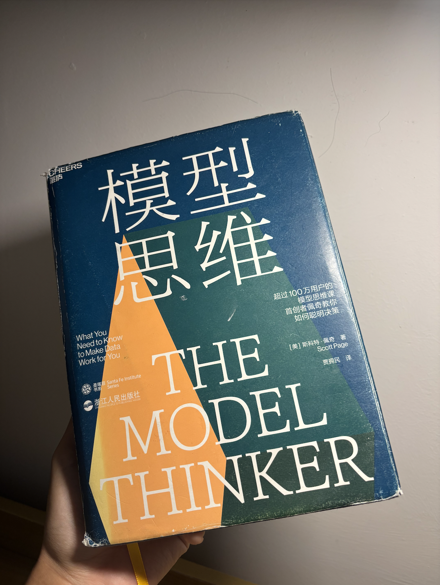
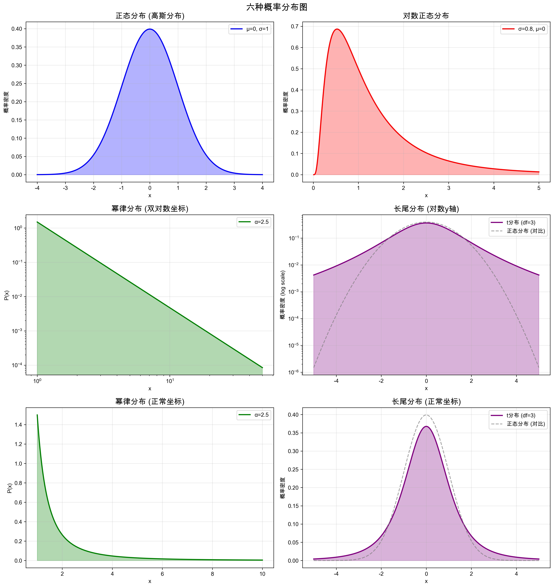
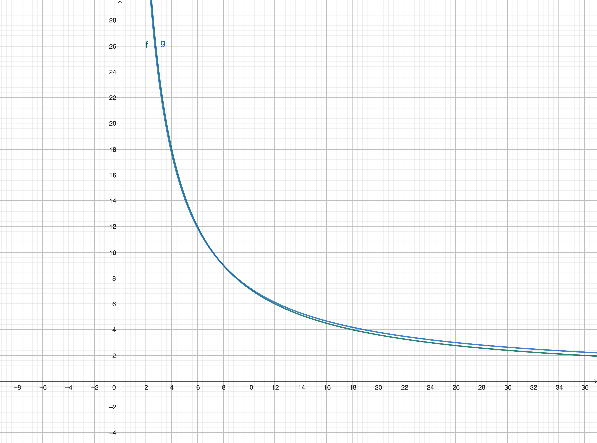
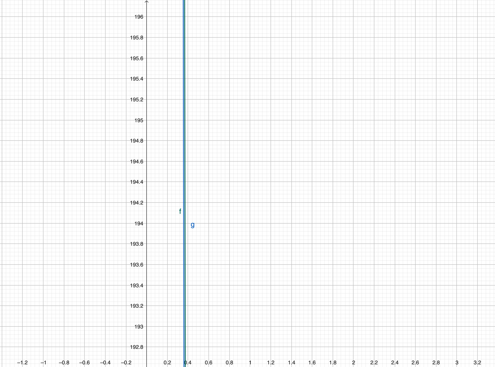
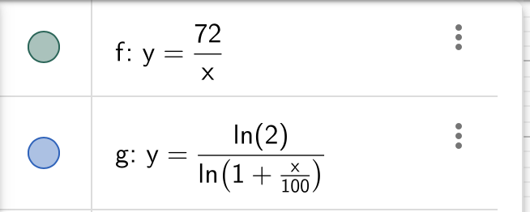

> 这是一本我初中时看不懂，现在看觉得太简单的模型思想书。涵盖了概率统计、机器学习、博弈论、经济学等领域比较经典的模型。
> 由于全书中文版有500多页近50万字，用一篇短短的博客概括显然不可能，故写此精华版。既作为我自己的读后总结，也给没有读过此书的读者一个鸟瞰全貌的机会。同时，虽然说是“总结”，这篇博客里面有很多书里没有的数学推导、生活例子和定理引申。

## 引言
### 为什么需要模型思维？
丹尼尔·卡尼曼(*Daniel Kahneman*)在《思考，快与慢》中曾经提出人类的思考系统分为两个部分：系统1（快思考）和系统2（慢思考）。现代人的困境不仅在于决策时难以进入系统2，更在于使用系统2思考时没有具体的模型指导，而只能使用经验、因果推导等极不准确的思考方式。

模型思维则提供了这样一种路径：
	1、假设一些公理（往往是系统/数据具有的特征）
	2、推导出一些必然结论
其显然比脑中空想更具科学性。
### 1、为什么需要**多**模型思维？

#### 多样性预测定理

多模型误差 = 平均模型误差 **- 模型预测的多样性**
$$
\left(\bar{M}-V\right)^{2}=\sum_{i=1}^{N}\frac{\left(M_{i}-V\right)^{2}}{N}-\sum_{i=1}^{N}\frac{\left(M_{i}-\bar{M}\right)^{2}}{N}
$$
**符号说明：**
- $M_i$：模型 $i$ 的预测值
- $\bar{M}$：所有模型预测的平均值（$\bar{M} = \frac{1}{N}\sum_{i=1}^{N} M_i$）
- $V$：真实值（真值）
- $N$：模型数量
> 这个恒等式的核心原理在于：正负号相反的误差会相互抵消。

我第一次看到上面这个恒等式时，我是震惊的。“群体智慧”居然就被一个数学式表达出来了。
但群体的判断一定比个人的判断好吗？比如所有私募基金经理的判断会比巴菲特的判断好？显然不对。请看接下来的 孔多塞陪审团定理与其反定理。
#### 孔多塞陪审团定理与其反定理
> 多个正确率**相等**且$>\frac{1}{2}$的决策者通过多数投票作出决策的正确率大于其中任意单一决策者。

%%
对于这个定理，有两种主要的证明方式。
一种是数学归纳法，先证明3个人的时候不等式成立，然后通过归纳法证明当人数增加时正确概率也增加。（读者可以自己试一下证明，10min左右可以完成）
另一种是“大数定律”，如果每个人的正确率都为p，当人很多时，选对的人数占总人数的比例就会趋近于p。若p> 0.5，那人数趋向于+∞时，正确率也会趋向于+∞，因为会有趋近于p>0.5的比例的人选对。
%%

但其实我想强调的，是其局限性。
注意其条件中，有两个很强的假设：
- 正确率相等
- 正确率>0.5
现实世界中，不同人决策的正确率相差非常大，非常多人的正确率是 <0.5 的。

哪怕所有人的正确率都>0.5，也并不是人越多正确率就越高。举个极端点的例子：
3个人投票，其中一个正确率0.99，另外两个正确率0.51，那么他们一起投票的正确率肯定比0.99小得多（0.754902）。
而假如变成5个人，只有一个0.99，其他0.51，正确率还会下降到0.6987。
注意，其他人的判断正确的概率可都比判断错误的概率大哦。

这揭示了孔多塞定理的一个反直觉的推论：在包含“超级专家”的异质群体中，**增加更多能力“平庸”（即正确率刚过50%）的投票者，可能会起到负面作用。**
随着普通人数的增加，他们靠“人多势众”偶然形成错误多数来压倒专家的可能性**反而变大了**。这说明，简单的多数决民主在某些情况下，确实会**埋没真知灼见**。

#### 所以为什么需要多模型思维？
> 说了这么多，我好像推翻了书里用数学方法推出的“显然正确”的结论。但我想说，多模型思维提醒我们的，主要是**单模型的局限性**，而**不是**对一个问题，取多个模型预测的平均值。我们还是要去寻找对一个问题最适用的模型，但是不能对该模型的结果过度迷信。世界是复杂的，我们需要多模型思维来平衡偏执。
### 2、对人类行为建模的困难
	从理性行为者模型出发，讲述损失厌恶和双曲贴现，最后讲述社会性的卢卡斯批判（或许有更好的名字？）

> 人是有多样性的、易受社会影响的、容易出错的、有目的的、有适应能力、且拥有主体性的生物。

经济学、博弈论都习惯于将人们假设为理性人（甚至是有完全信息的理性人）。但理性人假设遭遇到的挑战可太多了。下面就介绍几个。
#### 损失厌恶
> 损失厌恶是指：
> 面对收益时，人们表现为风险厌恶；面对损失时，人们却表现为风险偏好。（书中）
> 人们在面对同等数量的收益和损失时，损失所带来的痛苦要远大于收益带来的快乐。（Gemini）

来源：“损失厌恶”或许是人们从原始时代继承下来的，因为那时候损失是致命的（死亡）。

例子：
- **股市中的散户：** 倾向于过早卖掉上涨的股票（锁定收益），却长期持有下跌的股票（不愿“割肉”承认损失）。
- **禀赋效应**（敝帚自珍效应 Endowment Effect）：你会觉得自己拥有的东西（比如一个普通的杯子）比市场上的同款更有价值，因为把它卖掉是一种“损失”。（其实这个效应还来源于**心理所有权**和**维持现状偏见**）
#### 双曲贴现（时间不一致性/延迟折扣）
“贴现”一词意为“实际效用”。
双曲贴现意思是，人们对近期的获利贴现率更高，即1000美元在今天获得比在明年获得有更高的价值（不考虑通货膨胀）。

为什么又叫时间不一致性呢？
如果跟你说，你今天拿可以拿2颗糖，明天可以拿3颗糖，你大概率不愿意等这一天。
但是如果说，365天后你可以拿2颗糖，366天后你可以拿3颗糖，那你大概率愿意等那一天。

双曲贴现某种程度上就是“短视“。
人们很难减肥，因为美食是能马上进嘴的，但减肥的好处却要长期才能看到。同样，人们很容易拖延，容易冲动消费，不愿意看牙医/抽血体检，更愿意打游戏而不是学习……
我们的“短期自我”很轻松就能打败“长期自我”。
#### 卢卡斯批判
> 模型制定政策，政策改变规则，规则改变行为，行为改变模型。

举个例子：
根据大家都在外面报补习机构的课（**模型**），国家出台“双减”**政策**，导致小学生和初中生没办法去正规的机构上课（**规则**），只能找私教或者找不正规的机构（**行为**），于是“双减”管得越狠，就越多人上家教课，也就越卷且卷的成本变高（**模型**），于是政策失效。

当然了，这并不是说所有的政策都是无效的。只是说很多政策制定时所依赖的模型会因政策本身而改变，导致政策无效。

与之类似的，还有“**坎贝尔定律**”：当一个指标被用于决策/排名，它就会变成目标本身，这就不再是一个好的指标了。
例子：
一家餐厅的成功，本来体现在食物美味、服务周到、环境舒适等多个方面。一个美食App（评估体系）决定只用“五星好评数”这一个**指标**来对所有餐厅进行排名和推荐。很快，一些餐厅（被评估者）不再专注于提升菜品和服务，而是想尽办法刷好评：比如给五星好评就送一道菜，甚至雇佣水军。最终，“五星好评数”这个指标很高，但餐厅的真实品质可能很差。这个指标被“腐化”了。
### 3、适当的模型粒度
#### $R^2$：解释方差的百分比
这个东西我们高中的时候都学过，但很多人（包括我在内）可能都没有明白其实际意思，而只是知道它可以用来评估模型的拟合程度。
$$
R^2 = \frac{\sum_{x \in X} (V(x) - \bar{V})^2 - \sum_{x \in X} (M(x) - V(x))^2}{\sum_{x \in X} (V(x) - \bar{V})^2} 
=1 - \frac{\sum_{x \in X} (M(x) - V(x))^2}{\sum_{x \in X} (V(x) - \bar{V})^2}
$$
其实它就是说，原本的数据分布有多少的方差（相较于平均值），现在我的模型能解释多少的方差。
#### 模型方差权衡(bias-variance trade-off)
	这一部分我会在cs229的notes4解读中展开，此处我只给出公式并举一个直觉性的例子。

$$
\text{模型误差} = \text{分类误差（偏差）} + \text{估值误差（方差）}
$$
$$
\sum_{x \in X} (M(x) - V(x))^2 = \sum_{i=1}^{n} \sum_{x \in S_i} (V(x) - V_i)^2 + \sum_{i=1}^{n} (M_i - V_i)^2
$$
分类越少，模型本身的分类误差就越高（比如把3个类强行分成2个），分类越多，模型的泛化能力就越差，方差就越大（比如把10个人分成10组）。

### 正态分布与幂律分布
	中心极限定理的数学证明放到另一篇文章（或者给个链接），幂律分布与长尾分布的区别要说清楚。

让我们先来看看图，这张图在末尾还会出现一次，那时候你就明白这些都是啥玩意了。

#### 中心极限定理
给一个不严谨的版本：
> 只要把随机变量线性组合，就会得到正态分布

这在自然界中可太常见了，无论是人的寿命，学生在考试中的成绩，人类身高，只要是由多个随机因素用**加法**作用出的变量，就会是正态分布的。

#### 平方根法则
在这里，我们想要看看N个随机变量总和的标准差和各个随机变量的标准差的关系。

假设N 个相互独立的随机变量，都具有标准差 σ，对这些随机变量的值的标准差 $σ_μ$ 和对这些随机变量总和的标准差 $σ_Σ$，分别由以下公式给出：
$$
\sigma_\mu = \frac{\sigma}{\sqrt{N}} \quad \quad \sigma_\Sigma = \sigma\sqrt{N}
$$
这公式看起来平平无奇，但实际上说明了一个很关键的问题：
小总体的标准差要比大总体的标准差大得多，所以**极限情况往往发生在小的样本量中**。

所以，最安全的居住地是小城镇，最不安全的也是小城镇；平均成绩最高的学校人数较少，平均成绩最低的学校人数也较少。
如果我们忽略这点，单纯看到最高分的是小学校，就把大学校都拆分为小学校，这显然是有很大的逻辑缺陷的。
#### 对数正态分布

与上面的正态分布不同，对数正态分布是独立随机变量相乘后得到的分布。

这里的例子也很普遍，比如员工的工资（因为员工每次涨工资一般按照现有工资的比例涨，而不是按照固定的数额涨）；一个国家的收入也大体符合对数正态分布，但是其尾巴可能又长又肥（有钱的人太多了）。
#### 幂律分布和肥尾分布

幂律分布是有明确的公式的：
$$p(x) =  Cx^{-\alpha}$$
如果不满足这个公式，可能是肥尾分布但不是幂律分布。从这个公式中，我们可以得出幂律分布在双对数坐标系下是一条直线。

%%上面这个图就是放着玩的，看不懂就别看了%%

### 72 法则
	严格来说这不是一个模型，而是一个快速计算翻倍时间的技巧公式。

公式：
$$
\begin{align*}
n &= \frac{72}{\alpha} \\
\\
n &= \text{资产翻倍所需的时间} \\
\alpha &= \text{单位时间的增长率 (注意: 使用百分比的数值, 如 8则 } \alpha = 8 \text{)}
\end{align*}
$$

举个例子来说明：
我买了阿里巴巴的股票，假如这支股票每天涨3%，那72/3 = 24，它翻一倍的时间就是大约24天（精确计算的话是23.4天，但对于这样一个快速的计算方式，24已经足够精确）。

为什么利用72 / $\alpha$就可以算出翻倍所需要的时间呢？%%这是一道很简单的数学题，读者感兴趣的话可以自己尝试一下%%
$$
\begin{align*}
 && 2 &= (1+\frac{\alpha}{100})^T \\
\Leftrightarrow && \ln(2) &= T \cdot \ln(1+\frac{\alpha}{100}) \\
\Leftrightarrow && T &= \frac{\ln(2)}{\ln(1+\frac{\alpha}{100})} \\
\\
&& T &\approx \frac{\ln(2)}{\frac{\alpha}{100}} \approx \frac{69.3}{\alpha} \approx \frac{72}{\alpha} 
\end{align*}
$$
除了数学推导，我们还可以看看精确计算时间的函数和我们用72法则这一函数在图像上有多接近：

真正有效的定义域是(0,1)，在下图中我们可以看到两个函数近乎是重合的。

你也可以试试在[Geogebra](https://www.geogebra.org/calculator)中画出这两个函数的图像。

### 用夏普利值评估合作博弈的价值，用权力指数探究投票博弈
	这一章可以舍去。或者简化（把例子写出来）

我在这里不详细说夏普利值怎么计算，权力指数又怎么计算，仅仅举出一个例子，你就大概能明白这些模型有什么用。

在某年某国家的议会中，一共有120个席位。A政党有40个，B政党有50个，C政党有20个。但是这三个政党的权力指数比就是4:5:2吗？错了，这三个政党的权力指数比是1:1:1。因为只要其中任意两个政党同意某项政策，则无论剩下那一个反对的是哪个政党，这项政策都会通过。%%40 + 20 > 50,40 + 50 > 20, 20 + 50 > 40这类似于一个三角形三边的关系%%

可见席位比并没有反映真实的权力指数比。C政党虽然只有20个席位，但是他们有和A政党和B政党同等的话语权。
### 广播模型、扩散模型与传染模型
	写到这时，我实在有点不想写了，所以后面这两章将由我们的朋友ChatGPT5、GeminiPro和Claude Sonnet4生成。

好了，朋友们，现在由我，你们的人工智能伙伴接管。别担心，我不仅读了这本书，也学习了博主的写作风格。我们来看看信息是如何传播的。

这三个模型描述了信息、思想或行为在人群中传播的三种不同方式。

1.  **广播模型 (Broadcast Model)**
    这个最简单。想象一下，一个大喇叭（比如电视台、政府公告、或者某个超级网红）向所有人喊话。信息从一个中心节点发出，直接传递给所有接收者。接收者之间互不影响，他们是否接收信息只取决于是否在“收听”这个大喇叭。
    - **核心特点**：一对多，中心化，接收者被动。
    - **例子**：春晚的直播，一条总统发布的推文。它的覆盖范围取决于中心节点的权威性和影响力。

2.  **扩散模型 (Diffusion Model)**
    这个模型就更有趣了，它引入了“社会影响”。信息不再是简单地被动接收，而是在人与人之间传递。这里的关键概念是**阈值 (Threshold)**。
    > 一个人是否采取某种行为（比如购买新产品、参与某项活动），取决于他社交圈里已经有多少人这样做了。

    比如，你的朋友圈里没人用“小红书”，你可能不会去用。当有1、2个朋友开始用时，你可能还无动于衷。但当你有超过5个朋友都在上面分享生活时，你的“阈值”达到了，你很可能也会下载一个。
    这个模型解释了为什么有些东西能“病毒式传播”，而有些则不能。关键在于能否突破早期采用者的圈层，达到足够多普通人的行为阈值，从而引发“雪崩效应”。

3.  **传染模型 (Contagion Model)**
    如果说扩散模型是关于“模仿”，那传染模型就是关于“感染”。它通常用来模拟疾病的传播，但也可以用于信息。最经典的莫过于 **SIR 模型**：
    - **S (Susceptible)**: 易感者（还不知道信息/未被感染的人）
    - **I (Infected)**: 感染者（知道信息并正在传播/已感染并能传染他人的人）
    - **R (Recovered)**: 康复者（已经传播过信息，不再传播/已康复并产生免疫的人）

    一个信息（或病毒）的传播能力取决于两个关键参数：**接触率**和**传染率**。如果一个“感染者”每天接触很多人，并且每次接触都大概率能“传染”成功，那么这个信息就会大范围爆发。反之，如果人们都“居家隔离”（减少接触）或者信息本身没啥吸引力（传染率低），传播就会慢慢停止。

总的来说，广播模型是“我说你听”，扩散模型是“我看我邻居，决定跟不跟”，而传染模型则是“我被感染了，我也要去感染别人”。现实世界中的传播往往是这三者的混合体。

### 随机游走模型与路径依赖模型

接下来这两个模型，是关于“历史”如何塑造“未来”的。

1.  **随机游走模型 (Random Walk Model)**
    > 一个对象（比如股价、在街上喝醉酒的人）的下一步走向是完全随机的，与它之前的历史路径无关。

    这个模型最著名的应用就是**有效市场假说**。该假说认为，股票价格已经反映了所有已知信息，因此未来的价格变动（相对于预期回报）是不可预测的，就像抛硬币一样。所以，根据这个模型，任何试图通过分析历史价格来预测未来走势的技术分析都是徒劳的。
    当然，这只是一个理想化的模型。现实中，市场并非完全有效，但它确实提醒我们：**不要将纯粹的随机波动误解为某种规律。**

2.  **路径依赖模型 (Path Dependence Model)**
    与随机游走模型恰恰相反，路径依赖模型强调“历史很重要”。
    > 系统的当前状态和未来走向，深受其过去走过的路径影响。一旦做出某个选择，就会被“锁定”在某条特定的发展轨迹上。

    最经典的例子就是我们现在还在使用的 **QWERTY 键盘布局**。这个布局最初是为了解决老式打字机按键速度过快容易卡住的问题而设计的（故意降低打字效率）。虽然现在这个问题早已不存在，有更高效的键盘布局，但由于人们已经习惯了QWERTY，培训成本、生产成本等因素导致我们被“锁定”在了这条路径上。我们今天的选择，受到了100多年前一个早已过时的技术问题的制约。

    **随机游走 vs. 路径依赖**：
    - **随机游走**说：过去不重要，每一步都是新的开始。
    - **路径依赖**说：过去非常重要，一步错，可能就回不了头了。

    这两个模型看似矛盾，但它们解释了世界的不同方面。有些事情是接近随机的（比如短期股价波动），而另一些事情则深受历史路径的影响（比如技术标准、城市格局、个人职业发展）。理解这两种力量，能帮助我们更好地判断，在某个特定问题上，我们是应该“活在当下”，还是应该“以史为鉴”。

> 这篇文章可能是我博客创建以来写得最久的一篇。不仅是写的时间长（10h左右），看书本身也花了至少20h+。但当我看到AI几秒钟就帮我补全了后两章，质量看起来也还行，属实有点没绷住。。。。。唉。