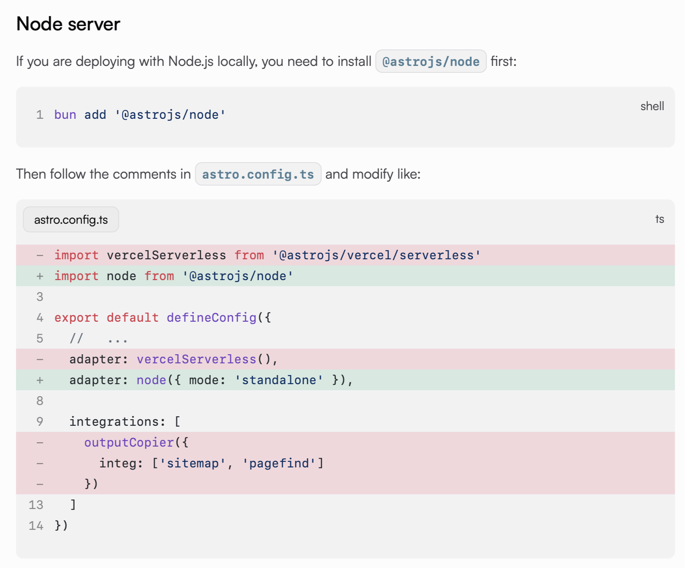

	搭建一个Blog很简单，部署一个合法的Blog很难。
## 前言
现在这个时代，一个计算机类专业的学生没有一个Blog似乎总有些不得劲。但是很多同学并不是专注于前端/后端的，他们可能是做算法的，玩Ai的，做数据库的……并不想花太多时间在网站基础设施的建设上，而想用更多的时间去分享内容。

本文提供了不基于博客园、知乎专栏等现有博客平台，搭建并部署自己的网站和博客的技术方案。方案简洁且成本低，从搭建到部署（若不要求在国内能合法访问）只需要6小时左右，适合想搭建博客的新手阅读。
## 网站搭建（利用现有开源模板）
    若你是前端大佬，或想要通过搭建个人博客来磨练自己的前端技术/美术设计，可以选择自行从零搭建（使用Flask、Astro、Next.js等现有框架），无需阅读本段，搭建完成后阅读后面的部署部分即可。
因为我对前端一窍不通（只稍微会一点JavaScript,Typescript和Flask），也并不志于这一方向，所以我选择直接使用现有的开源网站模板。
我选的是[CWorld](https://cworld0.com)大佬做的 [Astro Theme Pure](https://github.com/cworld1/astro-theme-pure) ，原因是以下三点：
- 我想做博客的起因是学CSAPP时看到北大Arthals同学的博客：[Arthals' Ink](https://arthals.ink/)，而他用的就是这个模板。
- 博客**简约**而优雅
- 对Markdown的支持优秀（苯人平时用Markdown记笔记，每次只需要上传Markdown文件即可）
- 文档详尽，部署简单。

以下是这个模板的相关资源：
- [Source Code(Github)](https://github.com/cworld1/astro-theme-pure)
- [官方网站示例](https://astro-pure.js.org)
- [文档](https://astro-pure.js.org/docs)
## 部署方案一：Vercel一键部署 + CloudflareDNS解析
	优点：
	1、全自动化部署。每次更新网站内容，只需要git push到github，Vercel就会全自动部署。
	2、国内也可以较顺畅地访问（实验过）。
	3、近乎零成本。（Vercel的基础版和CloudflareDNS解析都是免费的。只有购买域名要花钱（jaison.ink这个域名第一年费用18r）
	4、无需备案（也无法备案成功）
	5、简单无脑。
	6、速度极快，1h左右就可以搞定，弄完后只需要等待DNS解析生效即可。
	缺点：
	1、不合法。如果访问量过大可能会被ban。
	2、无法备案。（备案要求源站部署在国内的服务器上）
	3、Vercel的基础版服务器带宽较小，图片等资源加载较慢。

如果你选择了上面这个Astro Theme Pure，可以直接使用它文档中的[部署教程](https://astro-pure.js.org/docs/setup/deployment)。

注意，Vercel会给你一个以vercel.app结尾的域名，如果你想要用自己的域名（如本站域名为[Jaison.ink](Jaison.ink)），或者想要在国内网络访问，就需要购买一个域名。

具体的部署流程如下（以下内容由Gemini生成后修改）。
### **准备工作**
在开始之前，请确保您已经准备好：
1.  一个已经可以正常运行的博客项目（比如我们之前讨论的 Astro 项目）。
2.  项目代码已托管到 **GitHub**, **GitLab** 或 **Gitee** 的仓库中。
3.  一个您自己注册的**域名**（如果没有在墙内访问的需求，就不需要这个，然后也不需要看后面的Cloudflare部分）。

---
### **操作步骤**

#### **第一部分：在 Vercel 上部署您的项目**

1.  **登录 Vercel**：建议直接使用您的 GitHub 账号授权登录，这样后续关联仓库会非常方便。

2.  **导入项目**：
    * 在 Vercel 的控制台 (Dashboard) 上，点击 **“Add New... -> Project”**。
    * Vercel 会自动列出您 GitHub 仓库中的项目。找到您的博客仓库，点击旁边的 **“Import”** 按钮。
    * 如果您是第一次使用，可能需要授权 Vercel 访问您的 GitHub 仓库。

3.  **配置项目**：
    * Vercel 的智能化程度非常高，对于 Astro 项目，它通常能自动识别出所有配置（例如构建命令 `astro build` 或 `npm run build`，输出目录 `dist`）。
    * 您基本**无需修改任何默认设置**，直接点击 **“Deploy”** 按钮即可。

4.  **完成部署并获取 Vercel 域名**：
    * 稍等片刻，Vercel 就会完成构建和部署。成功后，Vercel 会为您生成一个默认的域名（例如 `jaisonblog.vercel.app`）。
    * 此时，通过这个 Vercel 域名，您应该已经能访问到您的网站了。

5.  **在 Vercel 中添加您的自定义域名**：
    * 进入刚刚部署好的项目，点击 **“Settings -> Domains”**。
    * 在输入框中填入您自己的域名（例如 `jaison.ink`），然后点击 **“Add”**。
    * Vercel 此时会提示您，需要您去配置 DNS 解析。它通常会建议您添加一条 `A` 记录或 `CNAME` 记录。**先不要在这里操作**，记下它建议的记录值（比如 `cname.vercel-dns.com`），我们下一步去 Cloudflare 进行配置。

#### **第二部分：使用 Cloudflare 解析和加速域名**

1.  **登录 Cloudflare 并添加站点**：
    * 在 Cloudflare 控制台首页，点击 **“+ Add a site”**。
    * 输入您的根域名（例如 `jaison.ink`），然后点击 **“Add site”**。
    * 选择底部的 **Free (免费)** 套餐，点击 **“Continue”**。

2.  **更新域名的名称服务器 (Nameservers) - 关键步骤！**
    * Cloudflare 会自动扫描您现有的 DNS 记录，然后会给您提供**两个 Cloudflare 的名称服务器地址**（例如 `rick.ns.cloudflare.com` 和 `daisy.ns.cloudflare.com`）。
    * > **重要提示**：您需要登录到您**购买域名的地方**（您的域名注册商，比如阿里云、GoDaddy、Namecheap 等），找到域名管理中的 DNS 或名称服务器设置。将您域名原来的名称服务器地址，**替换**成 Cloudflare 提供给您的这两个地址。
    * 这一步是在告诉全世界：“这个域名的所有解析工作，以后都全权交给 Cloudflare 来负责了！”
    * 修改完成后，回到 Cloudflare 点击 **“Done, check nameservers”**。DNS 全球生效需要几分钟到几小时不等，您可以稍后再回来检查。

3.  **在 Cloudflare 中配置 DNS 解析**：
    * 当 Cloudflare 确认接管您的域名后，进入该站点的 **“DNS”** 页面。
    * 删除这里可能存在的与您域名相关的旧 `A` 或 `CNAME` 记录。
    * **添加两条新记录**来指向 Vercel：（这样无论前面有没有www，都可以访问你的网站
        * **记录一（根域名）**：
            * **类型 (Type)**: `CNAME`
            * **名称 (Name)**: `@` (代表您的根域名 `jaison.ink`)
            * **目标 (Target)**: `cname.vercel-dns.com` (Vercel 在上一步让您配置的地址)
            * **代理状态 (Proxy status)**: 确保是**橙色云朵** (Proxied)
        * **记录二（www 子域名）**：
            * **类型 (Type)**: `CNAME`
            * **名称 (Name)**: `www`
            * **目标 (Target)**: `cname.vercel-dns.com`
            * **代理状态 (Proxy status)**: 确保是**橙色云朵** (Proxied)
    * > **Cloudflare 小技巧**：Cloudflare 的 "CNAME Flattening" 技术允许您在根域名上使用 CNAME，这非常方便。橙色云朵图标是关键，它代表所有流量都会经过 Cloudflare 的 CDN 网络进行加速和保护。

4.  **配置 SSL/TLS 加密模式**：
    * 进入站点的 **“SSL/TLS”** 标签页。
    * 在加密模式 (Encryption mode) 中，选择 **“Full (Strict)”**（完全-严格）。这是最安全的模式，能确保从用户浏览器 -> Cloudflare -> Vercel 的全程数据加密。

#### **大功告成**
现在，等待几分钟让 DNS 解析生效。之后，在浏览器中访问您自己的域名 `https://jaison.ink`，您看到的将是一个通过 Cloudflare 全球网络加速的、由 Vercel 托管的安全网站！

从此以后，您只需 `git push` 您的代码到 GitHub，Vercel 就会自动帮您更新网站，而 Cloudflare 会负责将最新的内容以最快的速度分发给全球用户。
## 部署方案二：腾讯云服务器 + 管局&公安备案 + Github-Gitee自动化部署
	优点：
	1、合法合规。
	2、国内访问延时较小，带宽较大，图片等资源加载较快。
	3、成本较低，我购买的是学生优惠的轻量应用服务器，首年费用仅78r。
	4、Gitee的镜像有延时，如果不主动点击的话，每24h才会从Github pull一遍。
	缺点：
	1、管局&公安备案非常麻烦。要填写一大堆资料，还有非常难通过的人脸识别。尽管腾讯云的备案服务已经尽量简化流程（会帮你检查），但我还是来来回回修改了三次，然后又等了十几天才通过管局备案。
	2、需要会一点Unix的操作指令。
	3、费脑。部署起来会遇到一大堆奇奇怪怪的问题。

以下是详细部署流程（由Gemini生成后修改，大部分是和我的部署流程一致的，有些部分会有所优化）
#### **准备工作**
1.  一台**云服务器**：建议选择带有公网 IP 的标准实例，操作系统选择 **Ubuntu Server**。[腾讯云学生优惠](https://cloud.tencent.com/act/campus)[华为云学生优惠](https://www.huaweicloud.com/special/ecs-xsfwq.html)[阿里云学生优惠](https://university.aliyun.com)
2.  一个您自己注册的**域名**。
3.  项目代码已托管到 **GitHub** 或 **Gitee**。
4.  足够的**耐心**，特别是为接下来的备案流程。
---
### **操作步骤**

我们将整个过程分为四个主要阶段：服务器初始化、手动部署、域名备案、自动化部署。

#### **第一阶段：服务器环境初始化**

这是为您“建房”打地基的阶段。

1.  **连接服务器**：通过 SSH 工具连接到您的云服务器。

2.  **更新系统**：
    ```bash
    sudo apt update
    sudo apt upgrade
    ```

3.  **安装核心软件**：
    ```bash
    # 安装 Git
    sudo apt install git
    # 安装 Nginx Web 服务器
    sudo apt install nginx
    ```

4.  **安装 NVM 和 Node.js**（我们采用 Gitee 镜像以加速下载）：
    ```bash
    # 从 Gitee 镜像安装 nvm
    export NVM_SOURCE=[https://gitee.com/mirrors/nvm.git](https://gitee.com/mirrors/nvm.git) && curl -o- [https://raw.githubusercontent.com/nvm-sh/nvm/v0.39.7/install.sh](https://raw.githubusercontent.com/nvm-sh/nvm/v0.39.7/install.sh) | bash
    # 加载 nvm 配置使其生效
    source ~/.bashrc
    # 使用 nvm 安装 Node.js 长期支持版 (LTS)
    nvm install --lts
    ```

5.  **安装 PM2 进程管理器**：
    ```bash
    npm install -g pm2
    ```

6.  **配置防火墙**：
    ```bash
    # 允许 SSH (关键！否则会失联)
    sudo ufw allow ssh
    # 允许 Nginx 的 HTTP 和 HTTPS 流量
    sudo ufw allow 'Nginx Full'
    # 启用防火墙
    sudo ufw enable
    ```
    > **重要提示**：别忘了去**腾讯云控制台**的**安全组**添加入站规则，至少放行 `22`(SSH), `80`(HTTP), `443`(HTTPS) 这三个端口。

#### **第二阶段：手动部署项目（打通全流程）**

这个阶段，我们将之前所有排错后的正确步骤串起来，完成一次成功的手动部署，确保网站能通过 IP 地址访问。

1.  **克隆代码**：（笔者不屈不挠地花了4h试图让腾讯云服务器能以正常速度git clone （Github），最终告负。建议读者不要轻易尝试，还是用Gitee吧。在云服务器上使用代理容易被请去喝茶，修改hosts文件防止DNS污染最多就是把20kb/s的下载速度提升到60kb/s，于事无补）
    ```bash
    # 进入 root 主目录
    cd ~
    # 使用 SSH 方式克隆 (推荐)（这一步之前要在Gitee上导入项目（如果原项目在Github上也可以直接导入））
    git clone git@gitee.com:您的用户名/您的项目.git
    ```

2.  **项目配置Node**： 确保本地的 `astro.config.mjs` 正确配置了 `@astrojs/node`适配器。（详见[文档](https://astro-pure.js.org/docs/setup/deployment)的Node Server部分）

    如果服务器上的代码不是最新的，请进入目录 `cd JaisonBlog` 然后运行 `git pull`。

3.  **安装、构建、并用 PM2 启动**：
    ```bash
    # 进入项目目录
    cd JaisonBlog
    # 安装依赖
    npm install
    # 构建项目
    npm run build
    # 使用 PM2 启动 Node.js 服务
    pm2 start dist/server/entry.mjs --name jaisonblog
    ```
    运行 `pm2 list` 确认进程是 `online` 状态。

4.  **配置 Nginx 反向代理**： 编辑 Nginx 配置文件：
    ```bash
    sudo nano /etc/nginx/sites-available/default
    ```
    用以下内容**完全替换**文件里的原有内容，将请求转发给后台的 Node.js 程序。
    ```nginx
    server {
        listen 80 default_server;
        listen [::]:80 default_server;

        # 这里先写服务器的公网 IP 地址
        server_name <您的服务器公网IP>;

        location / {
            proxy_pass http://localhost:4321; # 转发给 PM2 运行的 Astro 程序
            proxy_http_version 1.1;
            proxy_set_header Upgrade $http_upgrade;
            proxy_set_header Connection 'upgrade';
            proxy_set_header Host $host;
            proxy_cache_bypass $http_upgrade;
        }
    }
    ```
    保存后，测试并重启 Nginx：
    ```bash
    sudo nginx -t && sudo systemctl restart nginx
    ```

5.  **验证**：此时，在浏览器中直接访问 `http://<您的服务器公网IP>`，应该就能看到您的博客了。

#### **第三阶段：域名解析与备案**

这是在中国大陆地区部署网站**必须完成**的法律流程。

1.  **域名解析**：到您购买域名的地方，添加一条 `A` 记录，将您的域名（例如 `jaison.ink`）指向您服务器的公网 IP 地址。
2.  **ICP 备案**：
    * 登录**腾讯云备案控制台**。
    * 按照[指引](https://cloud.tencent.com/document/product/243/45097)提交您的身份信息、网站信息等进行审核。
    * > **特别提醒**：备案审核期间，管局要求网站是**无法访问**的状态。您可能需要暂时关闭 Nginx 服务 (`sudo systemctl stop nginx`)。整个过程可能持续 **5 到 20 个工作日**，请务必耐心等待。
3.  **公安备案**：
    * 在您的 ICP 备案审核通过后，您需要在 **30 天内**登录全国公安机关互联网站安全管理服务平台，完成公安备案。此过程按照网站指引操作即可，通常比 ICP 备案快。

#### **第四阶段：实现自动化部署**

在备案完成后，我们可以用之前讨论过的 Webhook 方案，将“手动部署”变为“自动化”。

1.  **同步 GitHub 到 Gitee (可选，但推荐)**：
    很多开发者习惯使用 GitHub，但从国内服务器访问 Gitee 速度更快、更稳定。
    您可以在 Gitee 创建一个新仓库，使用“从 URL 导入”功能，填入您 GitHub 仓库的地址。Gitee 还支持设置“自动同步”，可以定期从 GitHub 拉取最新代码。

2.  **创建部署脚本 (`deploy.sh`)**
    在项目根目录 (`/root/<博客文件夹>) 下，创建一个部署脚本文件，它包含了自动部署需要执行的所有命令。
    ```bash
    nano deploy.sh
    ```
    将以下内容粘贴到文件中：
    ```bash
    #!/bin/bash
    
    # 输出当前时间，方便在日志中查看
    echo "================================================="
    echo "Deployment started at $(date)"
    echo "================================================="
    
    # 定义项目路径
    PROJECT_DIR="/root/JaisonBlog"

    # 进入项目目录
    cd $PROJECT_DIR || exit
    
    # 从 Gitee 拉取最新的代码
    echo "Step 1: Pulling latest code from Gitee..."
    git pull
    echo "Git pull completed."
    
    # 重新安装依赖，以防 package.json 有变动
    echo "Step 2: Installing npm dependencies..."
    npm install
    echo "NPM install completed."
    
    # 重新构建项目
    echo "Step 3: Building the project..."
    npm run build
    echo "Build completed."
    
    # 重启 PM2 管理的应用
    echo "Step 4: Restarting PM2 application..."
    pm2 restart jaisonblog
    echo "PM2 restart completed."
    
    echo "================================================="
    echo "Deployment finished successfully at $(date)"
    echo "================================================="
    ```
    保存文件后，**必须赋予它可执行权限**：
    ```bash
    chmod +x deploy.sh
    ```

3.  **创建并运行 Webhook 监听服务**
    这个服务是一个小型的 Node.js 程序，用来接收 Gitee 的通知。

    * 首先，安装 `express` 框架：
        ```bash
        # 确保在 /root/JaisonBlog 目录下
        npm install express
        ```
    * 然后，创建监听服务文件 `webhook-server.cjs`：
        ```bash
        nano webhook-server.cjs
        ```
    * 将以下代码粘贴进去。**请务必修改 `WEBHOOK_SECRET`为你自己的密码！**
        ```javascript
        // 使用 CommonJS 语法
        const express = require('express');
        const { exec } = require('child_process');

        const app = express();
        const PORT = 8080; // 监听的端口，可以自定义
        const WEBHOOK_SECRET = 'your_very_secret_password'; // 必须修改成一个复杂的密码
        const DEPLOY_SCRIPT_PATH = './deploy.sh';

        app.use(express.json());

        // 定义 /webhook 路由，只接受 POST 请求
        app.post('/webhook', (req, res) => {
            // 从 Gitee 请求头中获取密码
            const giteeToken = req.headers['x-gitee-token'];

            // 验证密码是否匹配
            if (giteeToken !== WEBHOOK_SECRET) {
                console.warn('Unauthorized webhook attempt detected!');
                return res.status(401).send('Invalid secret token.');
            }

            console.log(`Webhook received successfully at ${new Date().toISOString()}, starting deployment...`);

            // 执行部署脚本
            const deployProcess = exec(`sh ${DEPLOY_SCRIPT_PATH}`);

            // 实时打印部署脚本的输出
            deployProcess.stdout.on('data', (data) => {
                console.log(data);
            });

            deployProcess.stderr.on('data', (data) => {
                console.error(data);
            });

            deployProcess.on('close', (code) => {
                console.log(`Deployment script exited with code ${code}`);
            });

            res.status(200).send('Deployment process started.');
        });

        app.listen(PORT, () => {
            console.log(`Webhook listener started on port ${PORT}`);
        });
        ```
    * **用 PM2 在后台运行这个监听服务**：
        ```bash
        pm2 start webhook-server.cjs --name webhook-listener
        ```
        运行 `pm2 list` 确认 `webhook-listener` 进程已 `online`。

4.  **配置防火墙和安全组**
    为您的 Webhook 服务开放端口（例如 `8080`）。
    * **腾讯云安全组**：添加入站规则，允许来源 `0.0.0.0/0` 访问 `TCP:8080`。
    * **服务器 UFW 防火墙**：运行 `sudo ufw allow 8080/tcp`。

5.  **在 Gitee 上配置 Webhook**
    * 登录 Gitee，进入您的项目仓库，点击 **管理 -> WebHooks**。
    * 点击 **添加 Webhook**。
    * **URL**: 填写 `http://<您的服务器公网IP>:8080/webhook`。
    * **WebHook 密码**: 填写您在 `webhook-server.cjs` 中设置的那个 `WEBHOOK_SECRET`。
    * **触发事件**: 只勾选 **Push** 事件。
    * 点击“添加”，然后使用“测试”按钮验证是否能收到“响应码 200”的成功提示。

6.  **最终配置**
    * 别忘了将 Nginx 配置文件 (`/etc/nginx/sites-available/default`) 中的 `server_name` 从 IP 地址改为您的域名。
    * 最后，为您的域名配置 HTTPS (`sudo certbot --nginx -d your_domain.com`)。

至此，您便拥有了一个部署在自己服务器上、流程完整、安全可靠且能自动化更新的个人博客。虽然过程漫长（何其漫长！），但您收获的知识和经验将是无价的（也许吧）。
