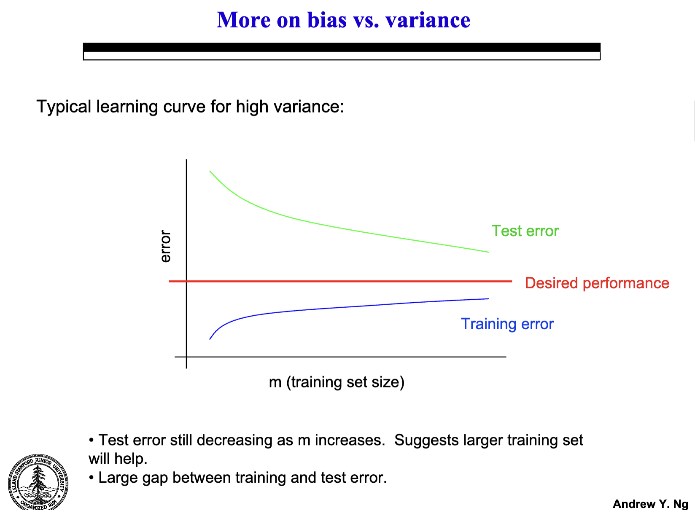
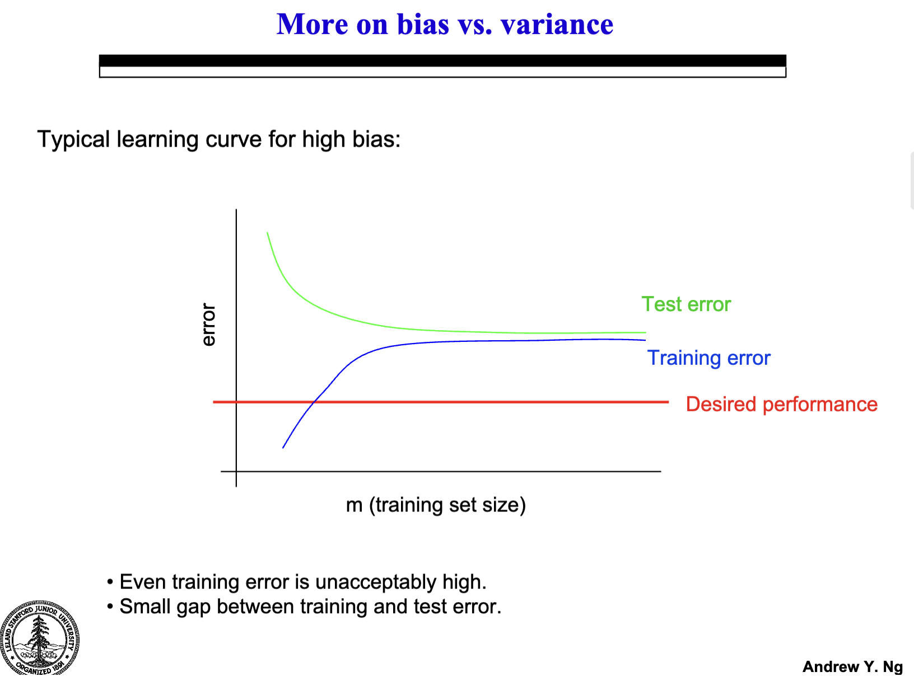
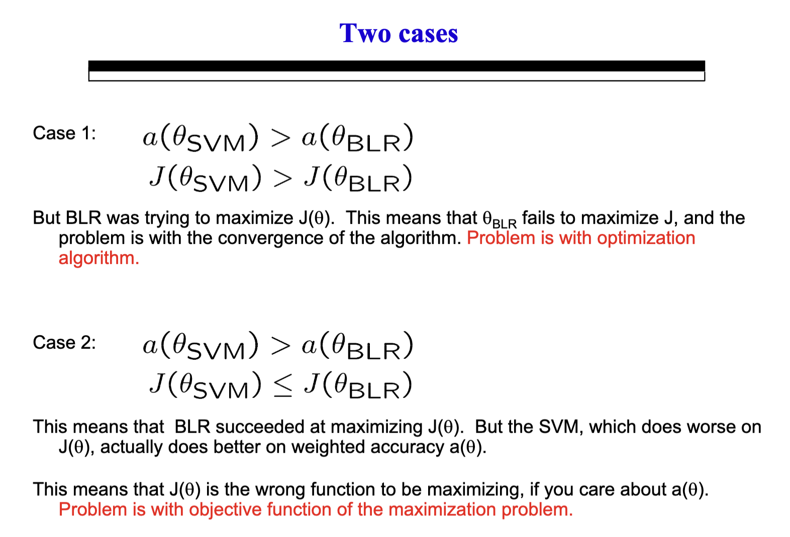
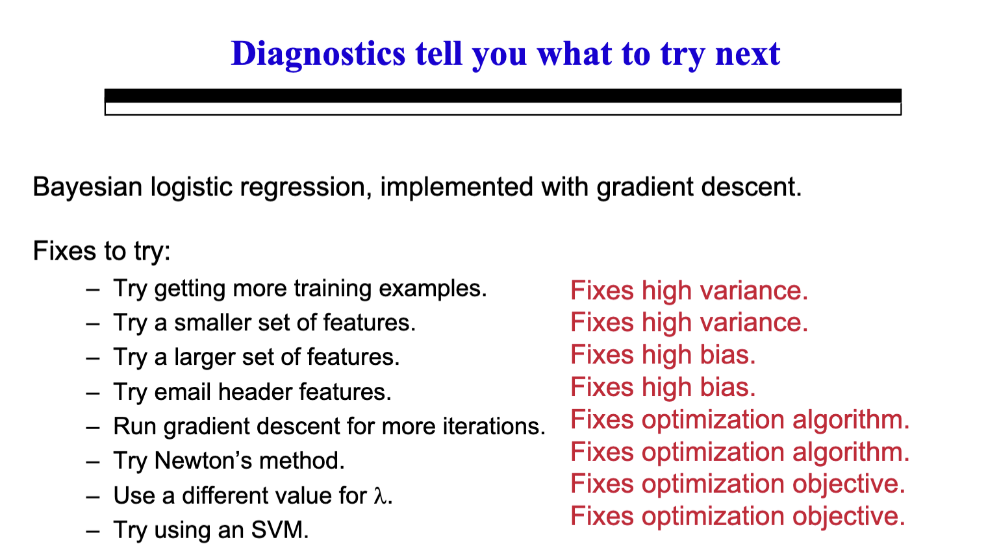
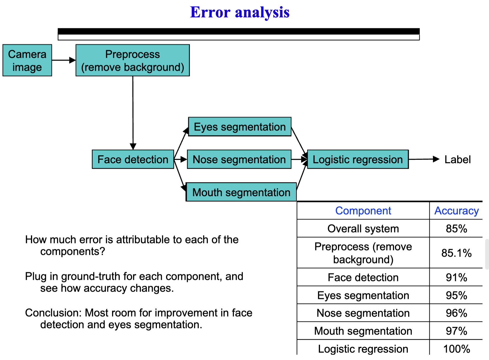
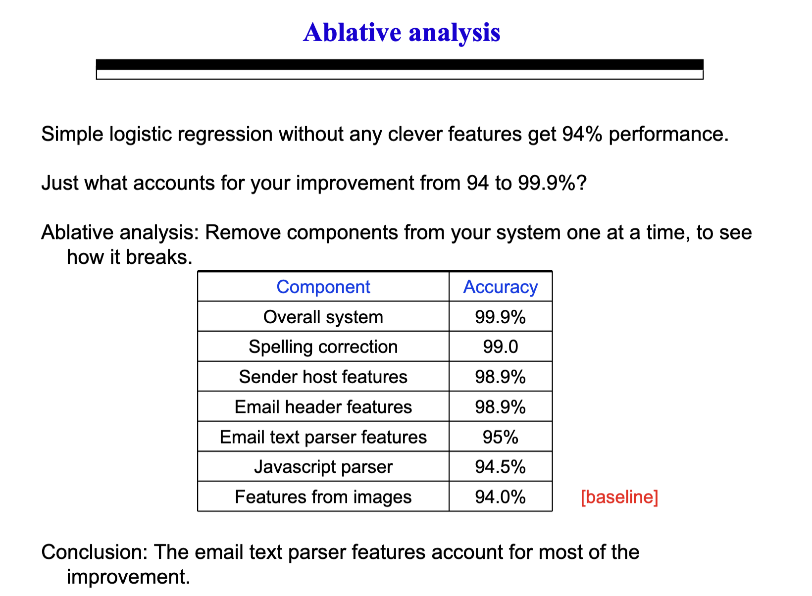
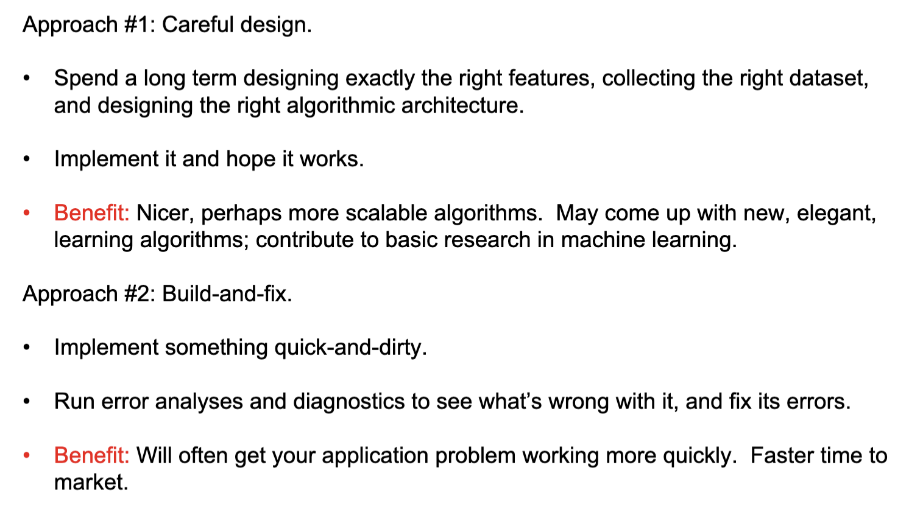
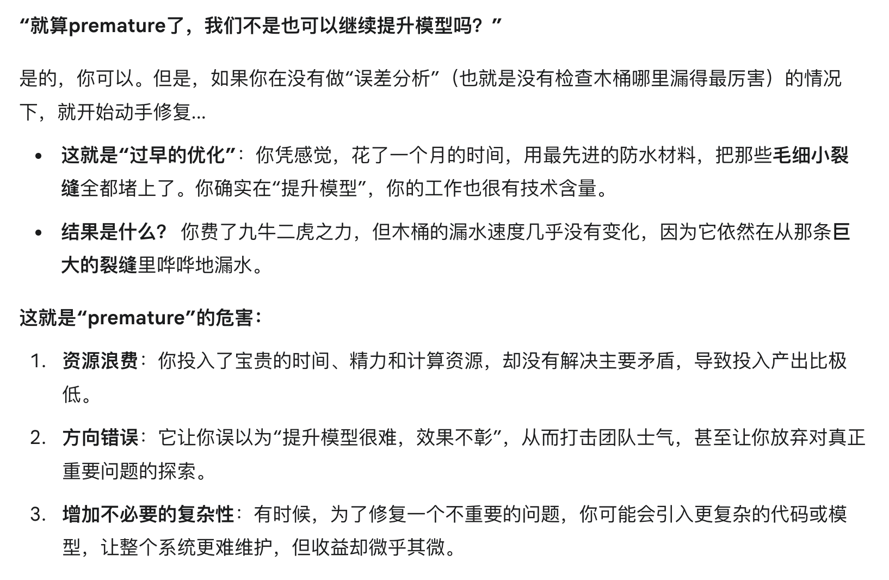
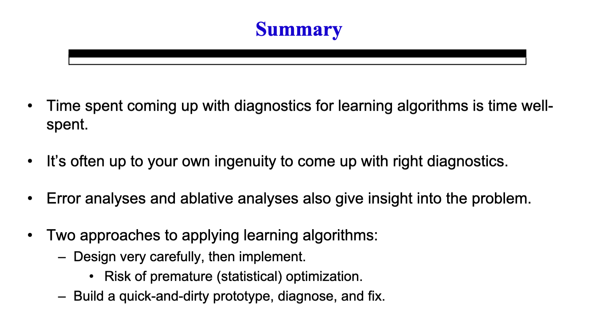

## Advice on Applying Machine Learning
> 这可能是整个课程当中，最高屋建瓴，也是最具有实践意义的一章。Andrew N.G.在这一章中，从自己的建构机器学习的经验出发，教大家如何选择合适的策略进行机器学习实践。

[原ppt](https://cs229.stanford.edu/materials/ML-advice.pdf)
 ### 找到问题
#### 是Bias太大了还是Bias太小了导致Variance太大了？
	比较training error和test error。
如果是前者，training error 和test error都会很大；
但如果会后者，training error可能很小，但是test error远大于training error。

非常经典的两张图。

#### 是成本函数$J(\theta)$本身脱离了我们的目标，还是在Optimization的过程中我们没有成功最小化$J$？
我们用同一个成本函数$J$来评估两种算法，很容易就知道是上面两种情况中的哪种。

#### 面对以上情况 我们的应对措施s

> 找问题的过程本质上是一种控制变量法，所以哪怕问题不是上面两种，我们也往往能够通过实验和控制变量diagnose出问题。
### 对于多步骤/多模块的算法，我们要找到“瓶颈”
#### Ceiling Analysis天花板分析：假如我把这一部分正确率提高到100%（通过人工），整体正确率能提高多少？

像上面这张图中，提高最多准确率的显然是face detection(这说明原本的face detection可能很不准确，而这部分又很重要)，于是我们就应该想办法提高face detection的准确率。

#### Ablative Analysis消融分析：假如我去掉某一部分，整体的正确率会下降多少？

### Getting Started Quick and Dirty
有两种可能的开始路径，第一种是刚开始就小心设计，但这容易造成premature，另一种则是先快速开始，然后diagnose出瓶颈部分，提升瓶颈部分，再diagnose。

> Start Quick and Dirty!

### Summary
