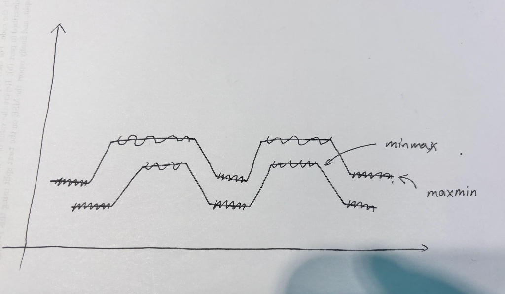
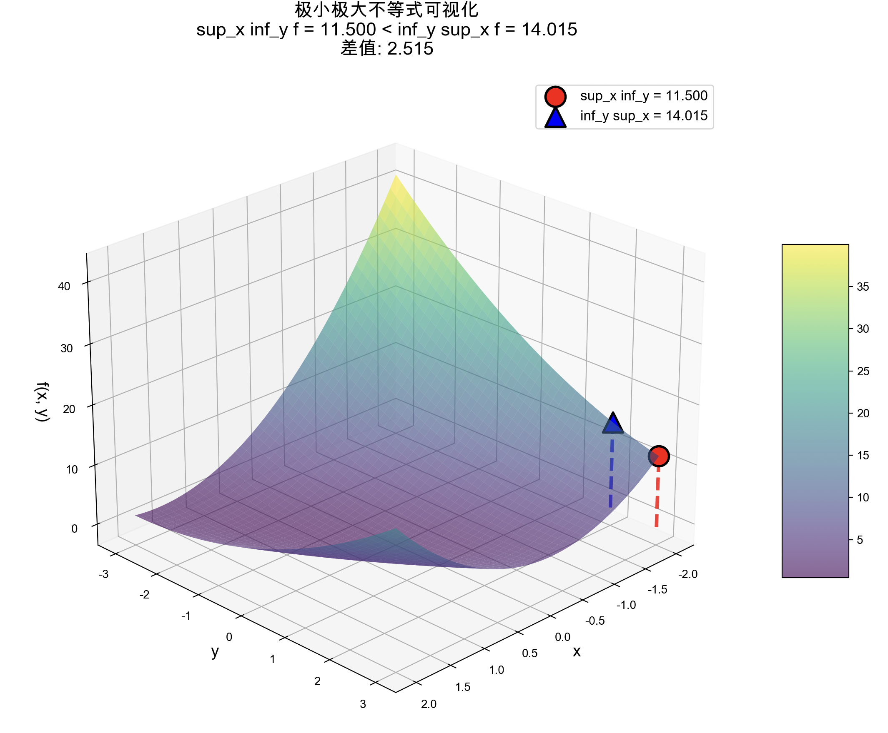
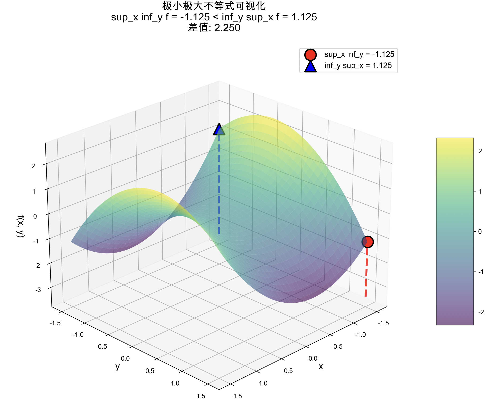

## Support Vector Machines
>这一章的note有个特点，每一条公式每一个步骤你都看得懂，但是连起来就不知道他到底在干嘛了。（缺少Whole Picture和形象化解释）
>尤其是在4、6两个Optimal margin classifiers中间插一个Lagrange duality，很容易让人不明所以。
### 函数富余和几何富余
	将funtaional margins翻译成函数边界这个翻译真是不好，很容易让人误解。还不如叫函数分数或者叫函数距离，或者我们才采取margin的另一个中文翻译“富余”，叫做函数富余好了？
	
$$
\hat\gamma^{(i)}=y^{(i)}(w^Tx+b)
$$
在这个公式当中，如果 $y^{(i)} = 1$（即这是个正样本，另一种可能是-1而不是0），如果$w^T x + b$ 是一个很大的正数，则函数边界很大，就能说明我们的分类器效果很显著（分类点离分类的界限很远）

“函数边界”的概念其实是——一个未标准化的“原始分数”，表示的是点到分类超平面的原始距离，由于系数膨胀分类超平面本身位置不变（也就意味着同一个分类标准系数可能很大可能很小，导致函数边界完全不可信。

“几何边界”则是点到分类超平面的真正距离


### Q.最优边界分类器到底在讲啥？（Gemini）
	这一部分由GeminiPro生成，它非常通俗易懂地讲解了从非凸约束转化为非凸目标函数再转化为凸优化问题的过程。

我将带你一步一步地“破案”，让你彻底明白这个“魔术”是怎么变的，以及为什么最后变出来的东西（最终的优化问题）就是我们想要的、并且是“凸”的。
#### 旅程起点：我们的“理想”但“不切实际”的目标

我们最开始的目标非常纯粹，用大白话说就是：

**“找到一条线，让它离两边数据点的‘真实距离’(几何边界)尽可能远。”**

写成数学语言就是你给出的第一个优化问题：

$$
\begin{aligned}
\max_{\gamma,w,b} \quad& \gamma \\
\text{s.t.} \quad &y^{(i)}(w^Tx^{(i)}+b) \geq \gamma, \quad i=1,...,m\\
&||w|| =1 \\
\end{aligned}
$$

* 目标 `max γ`: 最大化几何边界 $\gamma$。
* 约束1 `y(wx+b) ≥ γ`: 要求所有点的几何边界都至少是 $\gamma$。
* 约束2 `||w||=1`: 这是为了让函数边界等于几何边界（因为 $\gamma = \hat{\gamma} / ||w||$）。

症结所在：`||w||=1` 这个约束条件是“非凸”的，它让问题变得非常棘手。

**为什么是非凸的？**
一个集合是凸的，意味着集合里任意两点之间的连线，也必须完全在这个集合里。`||w||=1` 在二维空间里表示一个**圆环**，在三维空间里表示一个**球面**。你随便在球面上找两个点，它们之间的直线会穿过球的内部，而不会留在球面上。所以它不是一个凸集。在非凸集合上找最优解，非常容易陷入局部最优，计算极其困难。

#### 第二站：为了“干掉”非凸约束，我们换条路走

既然 `||w||=1` 这么讨厌，我们的首要目标就是把它去掉。怎么办呢？

我们回到几何边界的原始定义：$\gamma = \hat{\gamma} / ||w||$。
我们干脆直接把这个定义代入到目标里去，不再强制要求 `||w||=1`。这样就得到了第二个优化问题：

$$
\begin{aligned}
\max_{w,b} \quad& \frac{\hat \gamma}{||w||} \\
\text{s.t.} \quad &y^{(i)}(w^Tx^{(i)}+b) \geq \hat\gamma, \quad i=1,...,m\\
\end{aligned}
$$

这里我们最大化的目标直接就是几何边界本身。

**你问：为什么要转化成这样？**
**答案**：为了**摆脱 `||w||=1` 这个非凸的约束条件**。我们成功地把 $w$ 的范数从“约束”挪到了“目标函数”里。

**新的症结**：虽然干掉了非凸约束，但我们得到一个**非凸的目标函数** $\hat{\gamma} / ||w||$。最大化一个非凸函数同样非常困难。感觉像是刚出狼穴，又入虎口。

但别灰心，这一步是关键的铺垫，它为我们施展下一个“魔法”创造了条件。

#### 终点站：天才的“缩放”魔法，让问题变得“凸”

现在我们面临的问题是：目标函数 $\hat{\gamma} / ||w||$ 很复杂。但我们有一个被遗忘的“超能力”：**函数边界的值是可以随意缩放的**。

还记得吗？将 $(w, b)$ 变成 $(2w, 2b)$，决策边界（那条线）不变，但函数边界 $\hat{\gamma}$ 会翻倍。

这个“超能力”告诉我们：**函数边界 $\hat{\gamma}$ 的具体数值是多少，根本不重要，因为它只是一个相对的“自信度分数”。**

既然如此，我们就可以利用这个自由度，给它**固定一个方便计算的值**！

**【魔法咒语】：“我们来调整 $w, b$ 的大小，使得离决策线最近的那个点（支持向量）的函数边界 $\hat{\gamma}$ 恰好等于1。”**

这个操作是允许的，因为：

1.  我们总能找到一个缩放因子，让 $\hat{\gamma}$ 变成1。
2.  这个缩放操作不改变最终的决策边界（不改变那条线的位置）。
3.  它只是为我们选择了一个“基准单位”，就像我们把1米定义为“光在真空中传播xxxx分之一秒的距离”一样，我们在这里把“函数边界为1”定义为我们的“基准间隔单位”。

一旦我们施加了这个 “$\hat{\gamma}=1$” 的约束，奇迹发生了：

#### 目标函数的变化：
原来的目标是 $\max(\hat{\gamma} / ||w||)$。在 $\hat{\gamma}=1$ 的新标准下，它变成了 $\max(1 / ||w||)$。
最大化 $1 / ||w||$，就等价于**最小化 $||w||$**。
而最小化 $||w||$，又等价于**最小化 $\frac{1}{2}||w||^2$**。（加上平方和1/2是为了后面求导计算方便，并不会改变最优解 $w$ 在哪里）。
所以，我们的目标函数华丽变身为：

$$
\min_{w,b} \quad \frac{1}{2}||w||^2
$$

#### 约束条件的变化：
原来的约束是 $y(wx+b) \geq \hat{\gamma}$。
因为我们规定了**最小**的函数边界是1，所以对于**所有**数据点，它们的函数边界都必须大于等于1。
所以，我们的约束条件变成了：

$$
y^{(i)}(w^Tx^{(i)}+b) \geq 1, \quad \text{for all } i
$$

把它们合在一起，就得到了最终的、漂亮的优化问题：

$$
\begin{aligned}
\min_{w,b} \quad& \frac{1}{2}||w||^2 \\
\text{s.t.} \quad &y^{(i)}(w^Tx^{(i)}+b) \geq 1, \quad i=1,...,m\\
\end{aligned}
$$

#### 为什么最终形态是“凸”的？

现在我们来回答你最核心的问题。一个优化问题是凸的，需要满足两个条件：
**目标函数是凸函数，约束条件定义的可行域是凸集。**

1.  **目标函数 $\frac{1}{2}||w||^2$**
    这是一个二次函数。你可以想象一下一维函数 $f(x) = \frac{1}{2}x^2$，它的图像是一个完美的U型抛物线。在多维空间中，$\frac{1}{2}||w||^2$ 的图像就是一个完美的“碗”状。这种“碗”状或“U”状的函数就是典型的**凸函数**。它只有一个全局最低点，没有任何局部极小值的干扰。

2.  **约束 $y(wx+b) \geq 1$**
    对于每一个数据点 $i$，这个约束 $y^{(i)}(w^T x^{(i)} + b) - 1 \geq 0$ 都是关于变量 $w$ 和 $b$ 的**线性不等式**。一个线性不等式在空间中定义的是一个“半空间”（一条线/一个平面的一侧所有区域）。
    一个“半空间”是**凸集**。而我们这里有很多个这样的约束，相当于要求解 $(w, b)$ 必须同时满足所有这些半空间。**多个凸集的交集，仍然是一个凸集**。

#### 结论：
我们最终的目标是在一个**凸的可行域**（由一堆线性不等式围成的一个多面体区域）里，找到一个让**凸的目标函数**（一个大碗）达到最小值的点。
这就是一个标准的**凸二次规划 (Convex Quadratic Programming, QP)** 问题。这类问题是“良性”问题，有非常成熟和高效的算法可以保证找到全局最优解。

总的来说，整个转化的精髓在于：利用**函数边界可以自由缩放**的特性，巧妙地将一个复杂的、**非凸**的优化目标，等价地转换成了一个简单的、**凸**的优化目标，从而让问题变得可以高效求解。

### Q.Max-Min Inequality如何证明？
>在这里我不想讲具体的数学证明（这个不等式我在数分课上学过（当时用的sup和inf），证明很容易但其实并不直观，无法在脑中扎根）。
>我想从博弈的角度讲这个问题，这个不等式本质上是：
>内层算子具有博弈后手优势，计算先手优势。

$$
d^\ast = \max_{\alpha,\beta:\alpha_i\geq 0}\min_w L(w,\alpha,\beta) \leq \min_w \max_{\alpha,\beta:\alpha_i\geq 0}L(w,\alpha,\beta)  =p^\ast
$$
我们先把上式中的符号简化一下，变成
$$ \max_{x} \min_{y} f(x, y) \le \min_{y} \max_{x} f(x, y) $$
现在问题就是，为什么先最小化再最大化会比先最大化后最小化来得小？（极限情况会等于）即为什么maxmin<=minmax？

我们来考虑一个博弈效用矩阵，

|      | 宝箱A | 宝箱B |
| ---- | :-: | :-: |
| 钥匙 A | 10  |  2  |
| 钥匙 B |  1  |  8  |
你和我在玩一个开宝箱游戏。钥匙选择权在你，宝箱选择权在我，你希望我获得的钱尽量少，这样剩下的全是你的。（即你是min，我是max）

如果我先选，那我就要考虑我选完之后你会怎么选。（即博弈论中的“信念”或“推测”）
如果我选择了宝箱A那你就会选择钥匙B，这样我获得了1块钱；如果我选择宝箱B，那你就会选择钥匙A，这样我获得2块钱。2 > 1， 我显然应该选择宝箱B。最终我获得2块钱。

但如果是你先选呢？你也会预测我的行为，倒推回来你就会选择钥匙B，我会选择宝箱B。最终我能拿到8块钱。

8 > 2，显然后选的人有优势（min后选那就会比较小，max后选那就会比较大）。

上面那个Max-Min Inequality本质上就在执行这个过程，但是聪明的你一定会问，计算当中不是内层算子先算吗，那内层算子就是先手？那这个不等式应该反过来才对啊？（即maxmin应该更大）

但我要告诉你，其实内层算子虽然是先计算，但其实先计算的才是后手，所以**内层算子拥有后手优势**。
为什么呢？
回到刚刚那个矩阵，我们来考虑maxmin的情形，我们先计算min，也就是计算每一行的最小值，得到【2，1】两种选择，这时候再计算外层的max，它就只能在【2，1】两种里面选。所以maxmin其实是min赢了。

> “地板”的最高点永远不可能高过“天花板”的最低点
> 马里亚纳海沟的沟顶不可能比珠穆朗玛峰的山谷高。

常见错误理解：
现在有两个函数，究竟是“两个函数最小值之间的较大值”比较大，还是“两个函数最大值之间的较小值”比较大呢？

这图乍一看没问题，但你会发现如果真是这样，maxmin是有可能比minmax大的。（只要下面这条函数再整体下降一些）
关键就是这其实不能看成两条函数，x和y都只是参数，所以只能看成一条函数。

%%为了生成下面这两张可视化图，我指挥了GPT5、Claude sonnet4一个小时，Ai真的是太蠢了，要是我自己比AI聪明该多好啊！%%




### 区分凸集和凸函数的概念，谈谈凸优化和非凸优化
凸集重点在于**封闭**，凸函数重点在于**只有一个极值点**。

判断一个集合是否为凸集，只需要判断集合中任意两个元素的中点是否在集合内。比如一个实心球是凸集，但是一个空心球或者一个甜甜圈都不是。

用Hessian矩阵是否半正定，判断的是一个可微函数是否为凸函数。（不可微函数也有可能是凸的）

**什么是凸优化？**
凸优化要求**约束集是凸集**，**目标函数是凸函数**。

**凸优化为什么简单？非凸优化为什么复杂？**
用一个盲人下山的例子来做比喻。计算机就像是盲人，它可以知道当前位置的一切信息（比如当前点的梯度），但是不知道其它位置。

如果是凸优化问题，盲人只要坚持“永远走下坡路”的策略，任何下坡路最终都必然会通向同一个碗底。
但如果是非凸优化：在目标函数非凸的情况下，我们可能遇见极值点而不是最值点（比如半山腰上的坑）；在约束集非凸的情况下，我们可能无法往梯度最大的方向走（会脱离约束），这就像是碗上面有很多破洞。
### 梳理一遍支持向量机的推导过程
%%（我希望读者自己已经至少看过一遍notes，否则可能会云里雾里的）%%
我将浅浅地梳理一遍整个过程。%%这对我和Ai都是一个很大的挑战（笑）%%
```
梳理顺序：（即原notes顺序，可能会比原notes丝滑一点）
最优边界分类器(optimal margin classifier) 
拉格朗日对偶性(Lagrange duality) 
最优边界分类器(Optimal margin classifiers)
核(Kernels)
```

理解了geometric margins（几何富余）之后，我们希望能够训练出我们的最优边界分类器(optimal margin classifier) ，让几何富余最大。
这个优化问题用公式写出来是这样的：
$$
\begin{aligned}
max_{\gamma,w,b} \quad& \gamma \\
s.t. \quad &y^{(i)}(w^Tx^{(i)}+b) \geq \gamma,\quad i=1,...,m\\
&\parallel w\parallel =1 \\
\end{aligned}
$$
我们在下面两条限定条件下，尝试通过调整$\omega,b$这两个超平面的参数，使得几何富余$\gamma$能取到最大值。
$y^{(i)}(w^Tx^{(i)}+b) \geq \gamma, i=1,...,m$保证每一个训练样本的函数富余都至少为 $\gamma$。$\parallel w\parallel  = 1$ 这个约束条件保证函数边界与几何边界相等。

我们下面的所有内容，都围绕着以上这个原始优化问题展开。如果这个优化问题能直接解出来，一切就搞定了。可惜$\parallel w\parallel  = 1$ 这个约束集明显是非凸的（相当于一个球面）。

我们对这个问题进行转化，变成：
$$
\begin{aligned}
max_{\hat\gamma,w,b} \quad& \frac{\hat \gamma}{\parallel w\parallel } \\
s.t. \quad &y^{(i)}(w^Tx^{(i)}+b) \geq \gamma,\quad i=1,...,m\\
\end{aligned}
$$
这时候约束集是凸的，目标函数是非凸的。

再次进行转化，这次我们利用缩放$w$ 和 $b$ ，分类超平面不变，但是函数富余$\hat\gamma$会随之改变，几何富余$\frac{\hat \gamma}{\parallel w\parallel }$不变这个性质，可以将$\hat\gamma$归一化。
此时$\gamma =1$，$\hat \gamma/\parallel w\parallel  = 1/\parallel w\parallel$我们希望将这个几何边界最大化，就相当于要将$\parallel w\parallel ^2$ 最小化。

问题转变成
$$
\begin{aligned}
min_{\gamma,w,b} \quad& \frac{1}{2}\parallel w\parallel ^2 \\
s.t. \quad &y^{(i)}(w^Tx^{(i)}+b) \geq 1,\quad i=1,...,m\\
\end{aligned}
$$
我们得到了经受线性约束的凸优化问题。对这个问题进行求解，我们就能得到**最优边界分类器(optimal margin classifier)。** 这个问题就可以通过通用的商业二次规划(commercial quadratic programming ，缩写QP)代码求解。

%%这一段原note是真的让人摸不着头脑，所有的数学证明都看得懂，但就是不知道在干嘛。Gemini给了我很大帮助，以下内容也借鉴了Gemini的想法%%
这就完了吗？并没有。原文又将这个约束优化问题，通过**拉格朗日对偶性**，将其简化为求解其对偶问题。

将约束优化问题拟人化，就是在裁判允许的范围内，做到最好。
$$
\begin{aligned}
min_w \quad & f(w)& \\
s.t. \quad & g_i(w) \le 0,\quad i=1,...,k\\
& h_i(w) =0,\quad i=1,...,l\\
\end{aligned}
$$
在上面这个简化了的约束优化问题中，不等式和等式都是裁判%%（注意这里指的是有一些不等式和等式的约束条件，用$g_i$和$h_i$将其概括）%%，而我们的目标就是让$f(\omega)$最小化。

首先我们扮演裁判的角色，定义一个惩罚函数，这个函数叫做广义拉格朗日函数。这个函数值越大，裁判就认为表现越差。
$$
L(w,\alpha,\beta)=f(w)+\sum^k_{i=1}\alpha_ig_i(w)+\sum^l_{i=1}\beta_ih_i(w)
$$
我们很容易发现，如果不满足$g_i(w) \le 0$这一约束条件，裁判只需要把$\alpha_i$调整到无限大，惩罚函数的值就会变得无限大。即：
$$
\theta_{P}(w)=\max_{\alpha,\beta:\alpha_i \geq 0}L(w,\alpha,\beta)=+\infty
$$
不满足$h_i(w) =0$这一条件时同理。

所以，如果裁判没有狠狠地惩罚你（让惩罚函数分数无穷大），说明你满足了约束条件。此时，裁判为了最大化惩罚函数，就会让所有$\alpha = 0$。而且当你满足约束条件时，所有的$h_i(\omega)=0$，所以此时$\theta_P(w)=f(w)$。即：
$$
\theta_P(w)= \begin{cases} f(w) & \text {if w satisfies primal constraints} \\
\infty & \text{otherwise} \end{cases}
$$
我们发现，如果你守规则，裁判最大化惩罚函数，最后也就是得到的值和我们想要最小化的值$f(\omega)$是一样的。也就是说，我们想要求解的最优值 $p^*$，是 θ_P(w) 这个函数**的**最小值。（要注意，裁判通过调整$\alpha$和$\beta$使得惩罚函数最大化，我们则是希望调整$\omega$使得惩罚函数的最大化后的值最小化）

我们可以将裁判的最大化过程写成：
$$
\max_{\alpha,\beta:\alpha_i\geq 0} \theta_D(\alpha,\beta)  = \max_{\alpha,\beta:\alpha_i\geq 0} \min_w L(w,\alpha,\beta)
$$
把我们要做的最小化过程写成：
$$\min_w \max_{\alpha,\beta:\alpha_i\geq 0}L(w,\alpha,\beta)  =p^\ast$$
结合我们上面的Max-Min Inequality，就有：
$$
d^\ast = \max_{\alpha,\beta:\alpha_i\geq 0}\min_w L(w,\alpha,\beta) \leq \min_w \max_{\alpha,\beta:\alpha_i\geq 0}L(w,\alpha,\beta)  =p^\ast
$$
通过求解$d^\ast$，我们至少能得到$p^\ast$的一个下界，但数学家们证明了，在满足一些条件的情况下，不等式中的等号可以取到（具有强对偶性）。此时求解$d^\ast$，就是求解$p^\ast$（即两者相等）。

他们还证明了，当等号可以取到，那个最优解会满足KKT条件：
$$
\begin{aligned}
\frac{\partial}{\partial w_i}L(w^\ast,\alpha^\ast,\beta^\ast) &= 0,\quad i=1,...,n & \text{(3)}\\
\frac{\partial}{\partial \beta_i}L(w^\ast,\alpha^\ast,\beta^\ast)&= 0 ,\quad i=1,...,l &  \text{(4)}\\
\alpha_i^\ast g_i(w^\ast)&= 0,\quad i=1,...,k & \text{(5)}\\
g_i(w^\ast)&\leq 0,\quad i=1,...,k & \text{(6)}\\
\alpha_i^\ast &\geq 0,\quad i=1,...,k &\text{(7)}\\
\end{aligned}
$$
%%（3）（4）说明无论是裁判还是盲人，都已经无路可走；（7）说明惩罚函数中的参数（拉格朗日乘子）是合理的，不会犯了错还奖励你；（6）说明盲人走到的最低点符合问题中的所有不等式约束；（4）还可以推导出$hᵢ(w\ast) = 0$，说明盲人走到的最低点符合所有等式约束。%%

最重要的其实是（5），它说明了，对所有的支持向量$\omega_i$（满足$g_i(\omega_i) = 0$)，$\alpha_i$才有可能不等与0。其余情况$\alpha_i$一定等于0。
这说明了什么呢？这说明我们只需要记录少数支持向量的权重，而无需记录所有向量的权重。

用图来表示，

就是说这个图中只有压在虚线上的数据点，其权重不等于0，其余权重都=0，这几个点就叫做**支持向量(support vectors)**。

```
插入小结：Q.为什么要变成求解其对偶问题呢？
主要原因是以下几点：
- 对偶问题可以用Kernel Trick（核技巧），解锁SVM强大的非线性能力。
- 原问题复杂度主要取决于特征维度，对偶问题复杂度取决于样本数量。当特征维度远大与样本数量时，对偶问题更好解。
- 对偶问题可以识别出支持向量，高效存储和运用模型。（只用计算含有支持向量的点积）
```

这时候我们回到我们要解的问题：
$$
\begin{aligned}
min_{\gamma,w,b} \quad& \frac{1}{2}\parallel w\parallel ^2 \\
s.t. \quad &y^{(i)}(w^Tx^{(i)}+b) \geq 1,\quad i=1,...,m\\
\end{aligned}
$$

我们可以构建其拉格朗日函数（惩罚函数）
$$
L(w,b,\alpha )=\frac{1}{2}\parallel w\parallel ^2 - \sum^m_{i=1}\alpha_i [y^{(i)}(w^Tx^{(i)}+b)-1]  \qquad\text{(8)}
$$

注意这里的拉格朗日乘数中只有“$\alpha_i$” 而没有 “$\beta_i$”，因为这时候问题还只有不等式约束条件。

接下来咱们找一下这个问题的对偶性形式。另上面的函数关于 $w$ 和 $b$ 的导数为零，我们得到：
$$
\begin{gather*}
\nabla_w L(w,b,\alpha) = w - \sum_{i=1}^{m}\alpha_i y^{(i)}x^{(i)} = 0 \\

w = \sum_{i=1}^{m}\alpha_i y^{(i)}x^{(i)} \qquad\text{(9)} \\

\frac{\partial}{\partial b}L(w,b,\alpha) = \sum_{i=1}^{m}\alpha_i y^{(i)} = 0 \qquad\text{(10)}
\end{gather*}
$$

代入（8）得到
$$
L(w,b,\alpha)=\sum^m_{i=1}\alpha_i-\frac12 \sum^m_{i,j=1} y^{(i)}y^{(j)}\alpha_i\alpha_j(x^{(i)})^Tx^{(j)}
$$
我们得到以下对偶优化问题：
$$
\begin{aligned}
max_\alpha \quad & W(\alpha) =\sum^m_{i=1}\alpha_i-\frac12\sum^m_{i,j=1}y^{(i)}y^{(j)}\alpha_i\alpha_j\langle	x^{(i)} x^{(j)}	\rangle\\
s.t. \quad &  \alpha_i \geq 0,\quad i=1,...,m\\
& \sum^m_{i=1} \alpha_iy^{(i)}=0
\end{aligned}
$$
可以证明其满足 $p^\ast = d^\ast$ 和 KKT 条件。这样我们通过解这个对偶问题来解决掉原来的主优化问题。

假设我们已经解出了这个问题，就能找到$b$的最优值
$$
\begin{aligned}
b^\ast =- \frac{  \max_{i:y^{(i)}=-1}w^{\ast T}x^{(i)}+\min_{i:y^{(i)}=-1}w^{\ast T}x^{(i)}               }{2} &     \text{          (11)}\\
\end{aligned}
$$
而$\omega$的最优值在（9）中已经给出。于是：当我们要做新的预测，我们计算：
$$
\begin{aligned}
w^Tx+b&= (\sum^m_{i=1}\alpha_i y^{(i)}x^{(i)})^Tx+b & \text{(12)}\\
&= \sum^m_{i=1}\alpha_i y^{(i)}\langle x^{(i)},x \rangle+b & \text{(13)}\\
\end{aligned}
$$
这时你会发现，原来的线性计算，现在变成了点积运算。谁和谁的点积呢？输入特征$x$和支持向量$x^{(i)}$的点积。这为后面的Kernel Trick埋下了伏笔。

### Kernel Trick 核技巧
%%这里原notes写得非常好，我在此处不加赘笔%%
> 简单来说，就是可以将特征映射之后高维的运算，在特征映射之前通过核运算提前算完。有这样一个核的前提条件是**默瑟定理(Mercer’s theorem)。

**默瑟定理(Mercer’s theorem)：** 设给定的 $K: R^n \times  R^n \rightarrow   R$。然后要使 $K$ 为一个有效的默瑟核(valid Mercer kernel)，其充分必要条件为：对任意的 $\{x^{(1)},...,x^{(m)}\, (m < \infty)$，都有对应的核矩阵(kernel matrix)为对称半正定矩阵(symmetric positive semi-definite)。
### Input Attributes VS Input Features 
这其实在讲特征工程的一个过程——特征映射。
“输入属性”是原始的输入数据，我们可以对其进行处理（比如套一个函数$\phi()$变成“输入特征”，再输入到模型中进行训练/预测。
通过这种映射，我们可以将非线性的边界变成线性的边界，将低维的边界变成高维的边界。

```
Attribute → (通过特征工程) → Feature
```

### L1正则化 VS L2正则化
```python
pass
```
我应该会在后面补充或者在其他notes中讲述这一内容。

### 使用正则化降低对异常值的敏感度，并将模型泛化至不可区分的情况
%%正则化 Regularization%%

在上面推导了这么一大坨以后，我们得到了支持向量机的二维简化图像表示。我当时想到的第一个问题就是，刚好在线上的支持向量会不会太少了？然后就是，异常值咋办？


%%由图中可以看到，一个异常值就导致我们的分类边界大大偏移，这显然是不好的%%

这一部分notes解决了这一问题。我们可以通过给越界数据提供惩罚系数，从而降低对异常值的敏感度，并将模型泛化至不可区分的情况。

看看下面这个重构后的目标函数，C就是所谓的惩罚系数，这个目标函数也有其对偶优化问题。
$$
\begin{aligned}
min_{\gamma,w,b}& \frac 12 \parallel w\parallel ^2+C\sum^m_{}\xi_i \\
s.t.& y^{(i)}(w^Tx^{(i)}+b) \geq1-\xi_i,i=1,...,m\\
& \xi_i \geq 0 ,i=1,...,m
\end{aligned}
$$
### SMO优化算法（Sequential Minimal Optimization）
>这里推荐大家去看论文。

简单来说，就是我们在得到了对偶优化问题之后，我们如何去求解这个对偶优化问题呢？

答案是使用坐标上升算法：
$$
\begin{aligned}
&循环直至收敛：\{  \\
&\qquad For\quad i=1,...,m, \{ \\
&\qquad\qquad\alpha_i:= \arg \max_{\hat \alpha_i}W(\alpha_1,...,\alpha_{i-1},\hat\alpha_i,\alpha_{i+1},...,\alpha_m) \\
&\qquad\} \\
&\}
\end{aligned}
$$

在算法内层的循环中，我们逐个对变量进行优化。
由于我们每次只选择一个变量进行优化，所以每次移动的方向都是平行于坐标轴的。

但注意，我们的SVM中，有一个约束条件：
$$
\sum^m_{i=1}\alpha_iy^{(i)}=0
$$
在该条件限制下，我们无法每次只优化一个$\alpha_i$而保持其他$\alpha$不变。SMO提供的解决方案是，每次更改两个向量。

具体怎么更改呢？
```python
pass
```
%%好累啊，过两天再补充吧，这篇blog写了差不多有6h以上了。。。%%