> 缺少SQL、Scheme及以后的部分。
# 使用函数构建抽象
## Higher-Order Functions

### Decorator

<b>理解：</b>
顾名思义，decorator可以为现有函数添加功能，而不必更改现有函数内部的代码
怎么做到这一点呢？
通过一个wrapped的外层函数，将需要添加的功能包裹在里面，并将一个函数作为参数（用来传入现有函数）形成一个高阶函数
再用一个装饰器使现有函数可以被直接调用（但已经增加了功能）

案例：

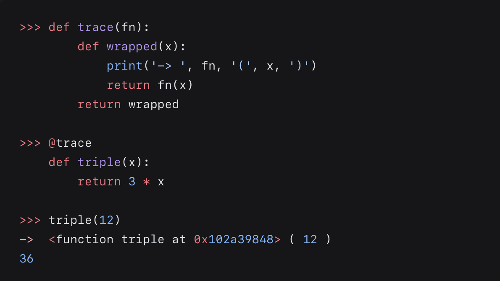

以上代码等价于

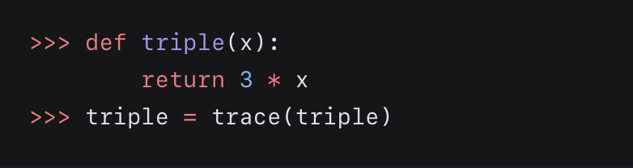

decorator的用途：
1、用来作日志追踪函数的使用
2、一个decorator 可以decorate多个函数（减少重复代码）

## Recursion
### 所有可以用iteration（循环）解决的问题，都可以用recursion解决

此处展示一个双层函数的案例（案例1

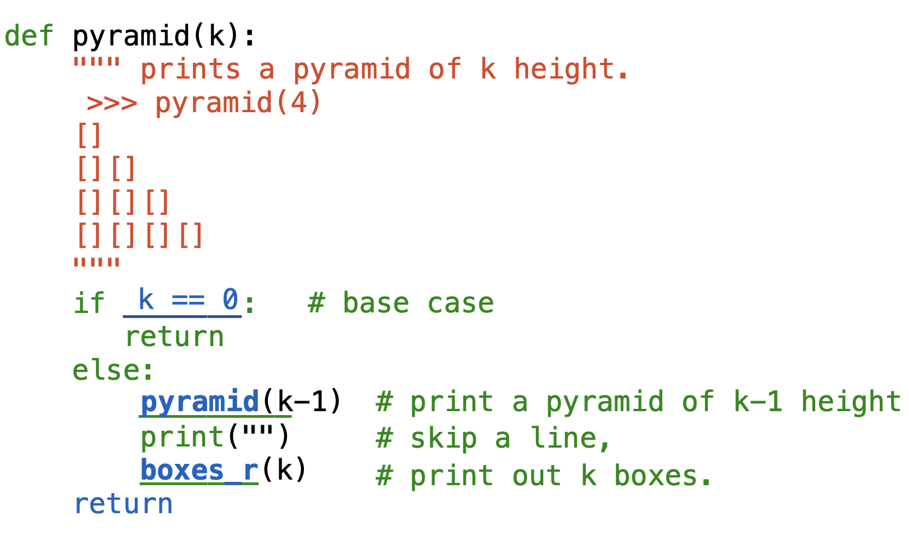

尽管看起来是从k循环到1的，但是第一行输出的却是一个box，想想为什么。
如果要先输出多个括号，最后再输出一个括号呢？

调用自己和执行自己的功能这两行代码的顺序是非常重要的。

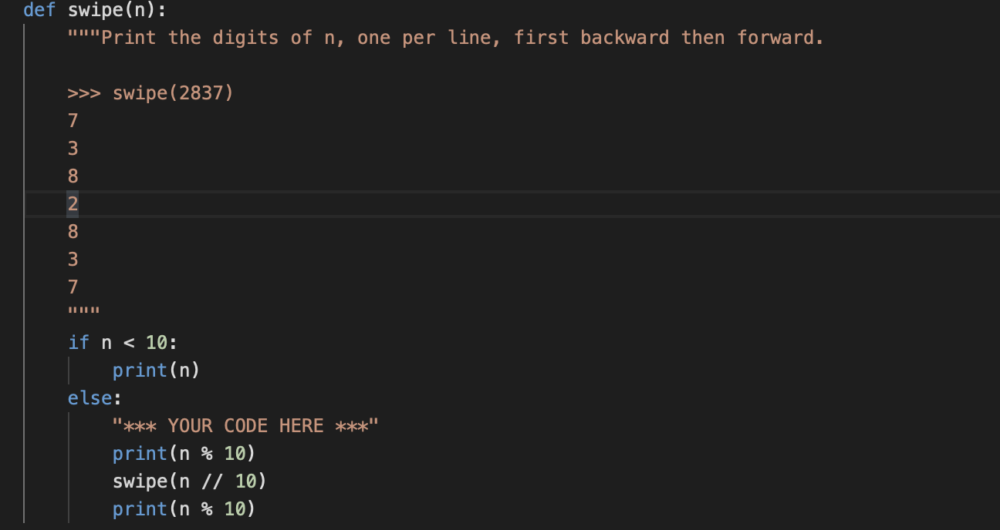

放在调用前面的是先输出剩余情况然后再输出当下，放在调用后面的是输出完剩余情况后就输出当下

### 书里面用一个非常简单的例子说明了递归的本质(Gorgeous

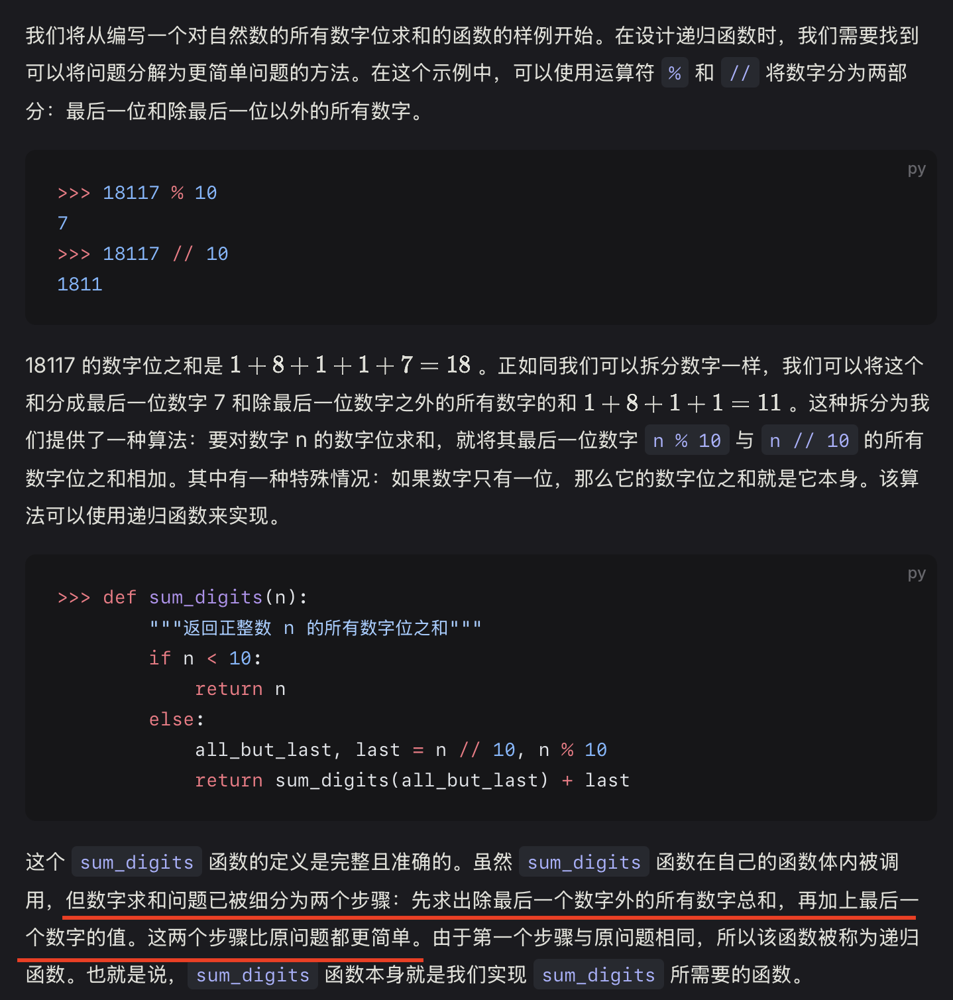

递归的本质就是把问题拆分成当前这步和剩下的步，从而不用同时考虑所有的步骤，从而专注于当下这一步（化简问题）（当然了，要知道最后一步在哪，即basecase）

### **base case**

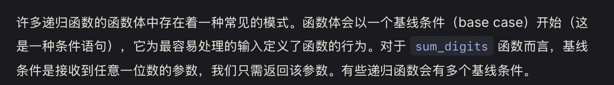

### **归纳法——递归的信仰之跃**

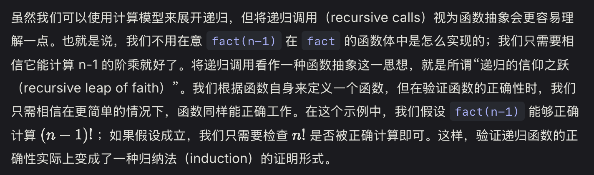

<u>不要在意剩余部分是如何实现的，我们只需做好现在这一步就行。</u>

### **互递归**

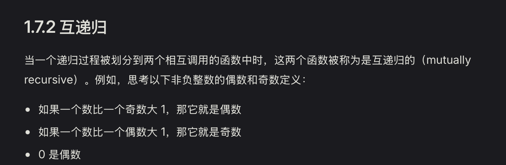

### 可以通过print得知递归过程中到底发生了什么

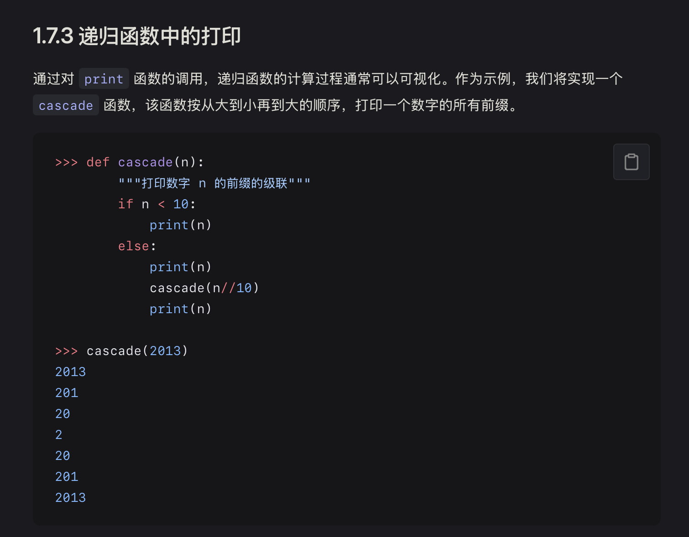

### **树递归(tree recursion**
在一次递归中调用多次本身

数递归经典案例（分割数）：

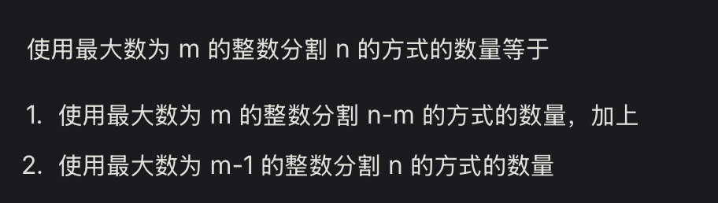

这一步并不显然，用到了类似组合数学的思想

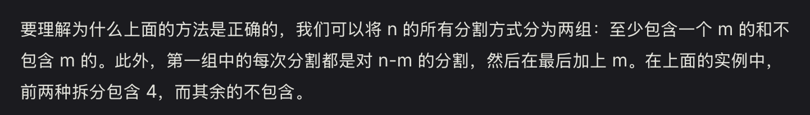

基线处考虑负数之后使得处理过程变得非常简单（不用担心减完之后是负数）

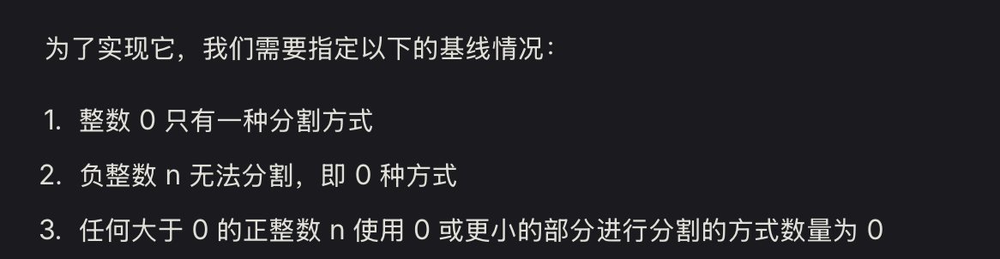

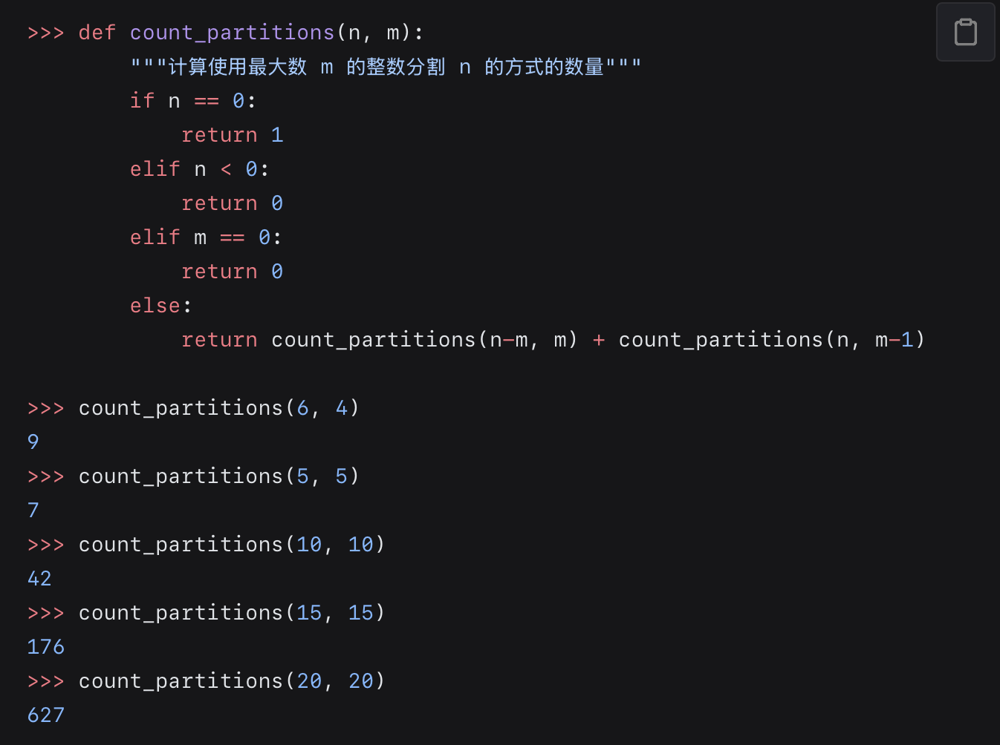

tree recursion 中非常好的例子：

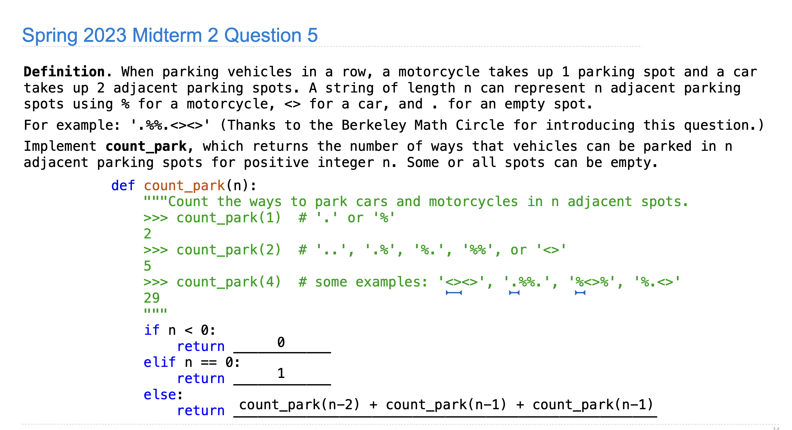

### 递归中的次数统计
递归中的次数统计不需要另开一个变量来记录次数，只需要每次return 其余情况+1，并在basecase处return 1就行了

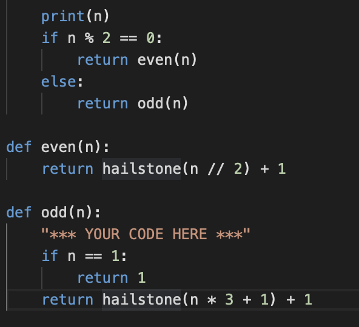

题外话：这个hailstone在奇数时*3 + 1不会出什么问题（循环） （吗）
如果改为 * 3 -1
则可能出现7 20 10 5 14 7 这样不断循环到不了1 的情况

这就是数学上著名的“冰雹猜想”

### 递归编写中的注意事项

tip1:要注意终止情况是否涵盖所有情况，并注意最后一项是否加上（最后在脑中构思特殊值情况）

tip2:递归时的两情况分界一定程度上决定了终止条件的数量，尽量**让分界条件简单，终止条件数量会变少**
以此题为例

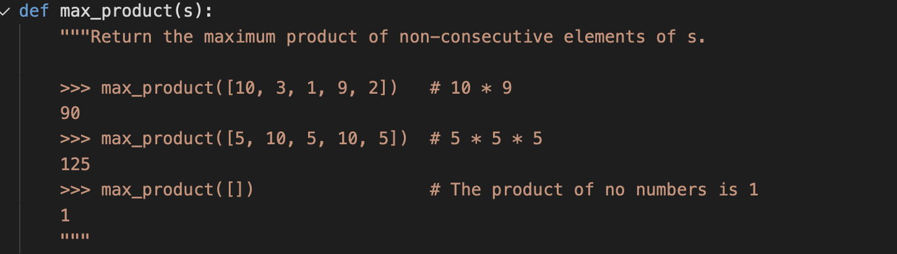

如果分界条件是：第1项*第3项及以后的max组合/第2项*第4项及以后的max组合，
会有4个终止条件（考虑len(s) == 3的情况)

但如果分界条件简化为：第1项*第3项及以后的max组合/不包含第一项的数的max组合（第2项及以后的max组合）
终止情况就不需要考虑len(s) == 3 的情况。

### 利用lambda（匿名函数实现递归）
例子：
用递归求阶乘

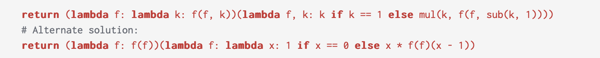

第一种解决方案的解释：

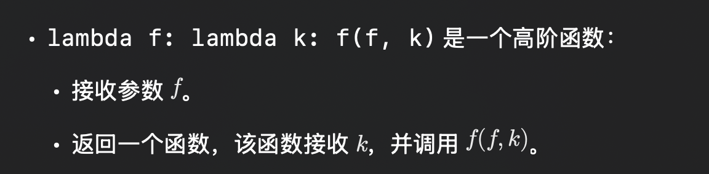

第一个括号当中相当于是吧递归的框架搭起来了
第二个括号中则是写了核心逻辑
括号的语法待补充

递归小细节

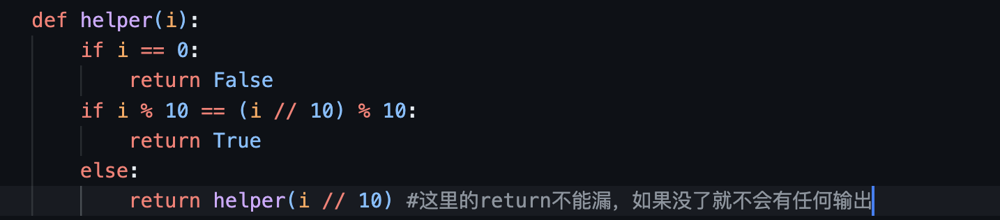

# 使用数据构建抽象
## Objected-Oriented-Programming（面向对象编程OOP）
### getattr和hasattr

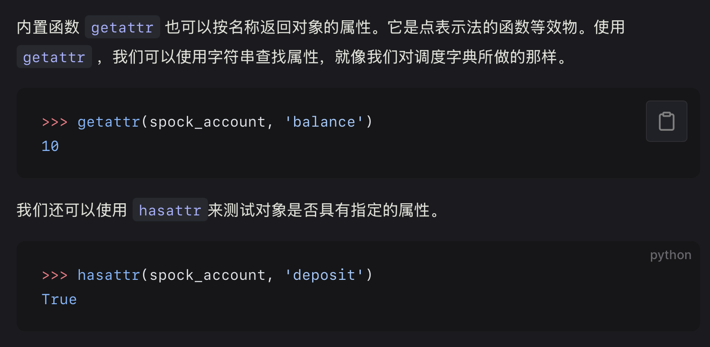

### 使用类名调用实例的方法也是可以的（但是要在第一个参数指定是哪个实例（是哪个self

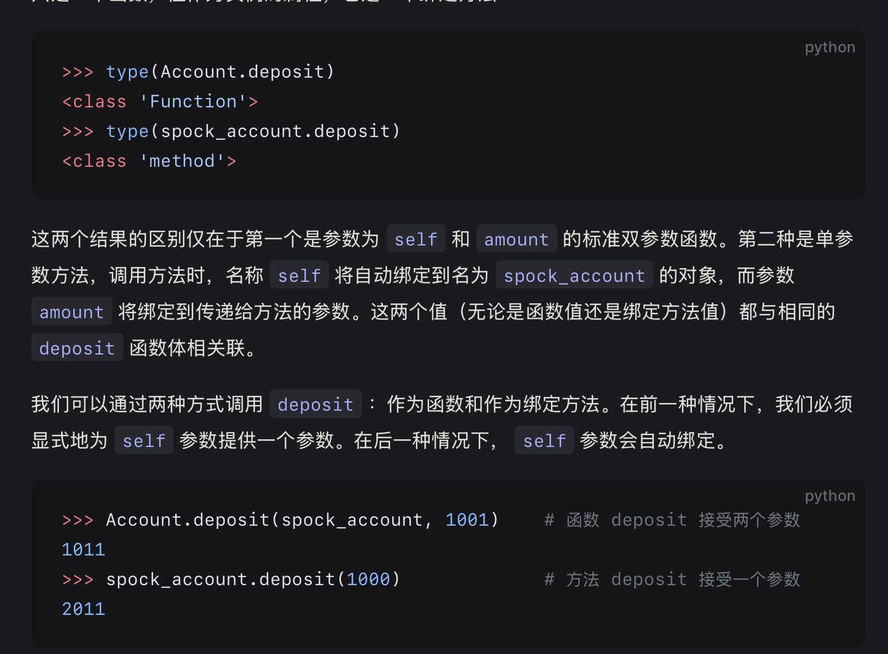

### Python 的约定规定，如果属性名称以下划线开头，则只能在类本身的方法中访问它，而不是用户访问。
### **类属性**
类属性和实例属性不是同一种东西 它是每个实例所共有的

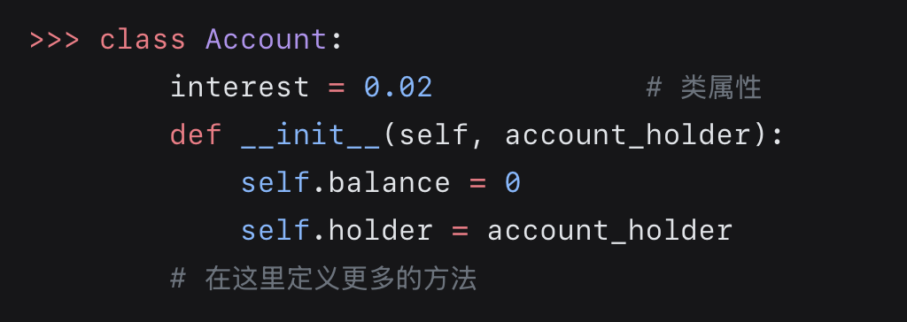

### 多重继承及其继承排序问题

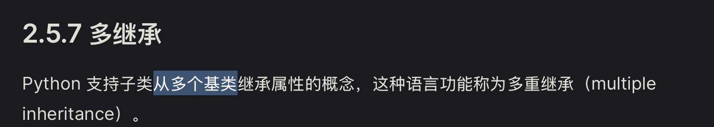

从左到右，再从下到上

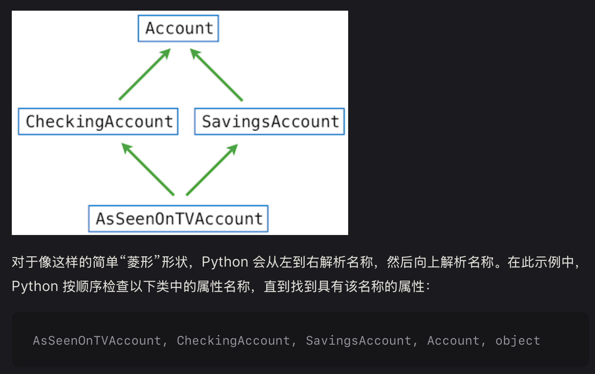

### 面向对象编程的好处和坏处
面向对象编程非常适合用于模拟由独立但相互作用部分构成的系统。例如，不同用户在社交网络中进行交互，不同角色在游戏中进行交互，不同形状在物理模拟中进行交互。在表示这样的系统时，程序中的对象通常可以自然地映射到被建模系统中的对象，而类则代表它们的类型和关系。

另一方面，类可能不是实现某些抽象的最佳机制。函数式抽象提供了一个更自然的隐喻来表示输入和输出之间的关系。我们不应该觉得必须将程序中的每一点逻辑都塞进一个类中，尤其是在定义独立函数来操作数据更自然的情况下。函数还可以强制实现关注点的分离。换句话说，函数式编程提供了另一种有效地组织程序逻辑的方法，使得程序员能够更好地处理和维护程序。在某些情况下，使用函数式编程方法可能比使用面向对象编程更自然和有效。
### OOP的设计思想记录

1、类属性中并不是只能放一些全部实例都一样的变量 也可以放一些部分实例一样的变量（这些实例应有一个子类 在子类中可以修改此类属性。

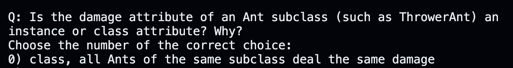

2、哪怕重写了某个函数 仍可以在重写函数中用super()调用基类函数中的该函数实现（这样，就可以减少重复的代码

3、一些不属于某个类/对象的方法（比如整局游戏输了） 应当放在全局 而不是某个类中

### 访问实例属性需要用self.属性
## Sequence（序列）
### 访问列表的一种不寻常的方式（多重赋值方法）

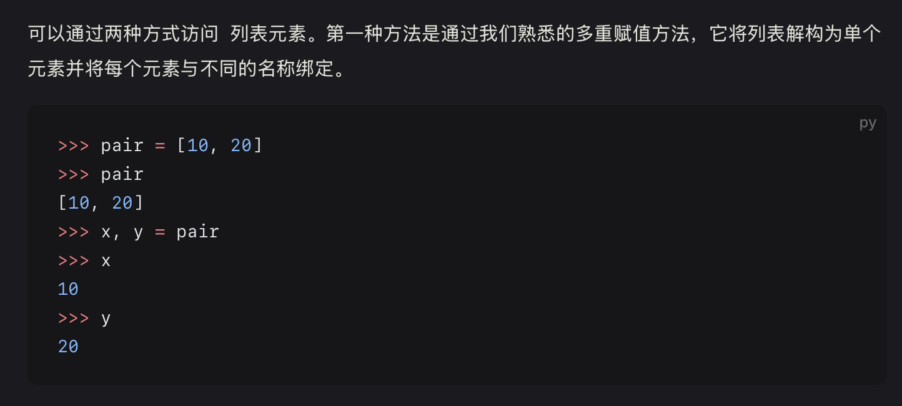

### 列表推导式

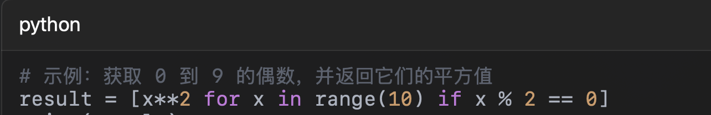

非常强大。
其通式一般是下面这样的：

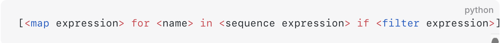

这里的"map"意思是“映射”，即后面for得出来的值经过什么映射然后输出。

### 选择列表中元素的等效函数（operator中的getitem

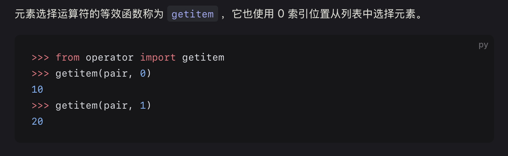

### 抽象屏障

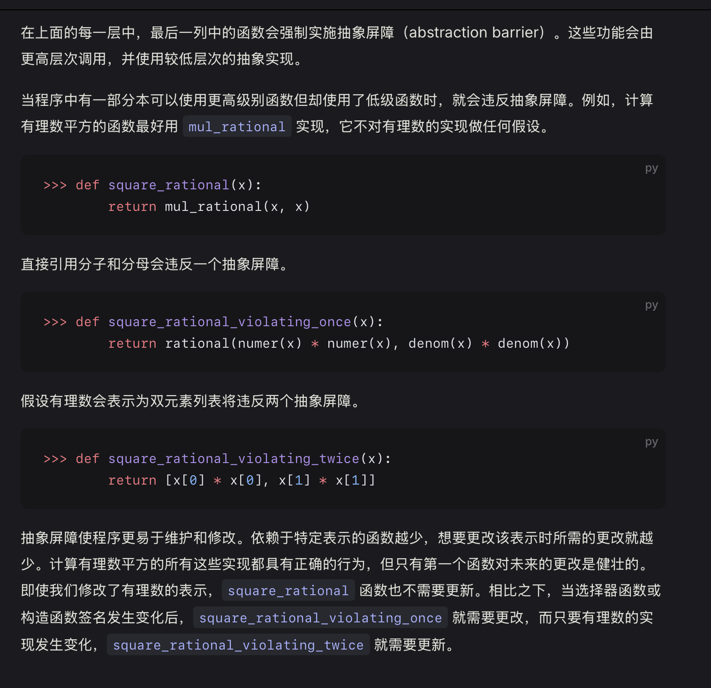

非常喜欢用“数据屏障”这个概念来提高一个程序后期更改时的健壮度

如果数据屏障的分层做得好，在更改数据结构时，就只需要修改最底层的实现数据结构的方式（比如加减乘除）就可以，平方就不需要更改。

### 序列解包（Sequence Unpacking)
有时候序列的每一项有多个数，提取时若只赋给一个变量，那这个变量本身可能还是一个序列。

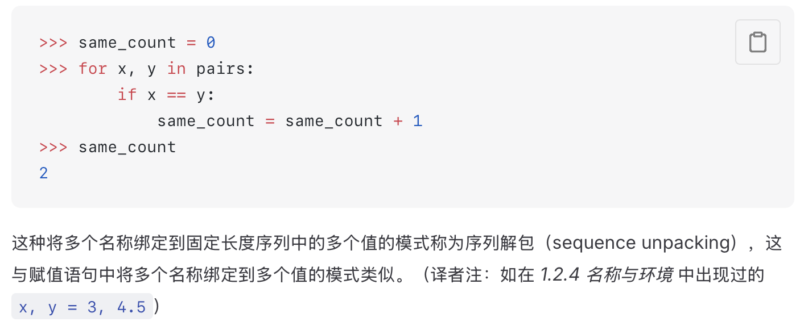

用赋值给多个变量的方式，就可以把每个值提取出来。

## Iterators（迭代器）
迭代器是什么？
首先它是一个容器（类似于数据结构
它让你可以按顺序访问容器中的元素

### 迭代器有且只有两大机制
1、访问下一个元素（next

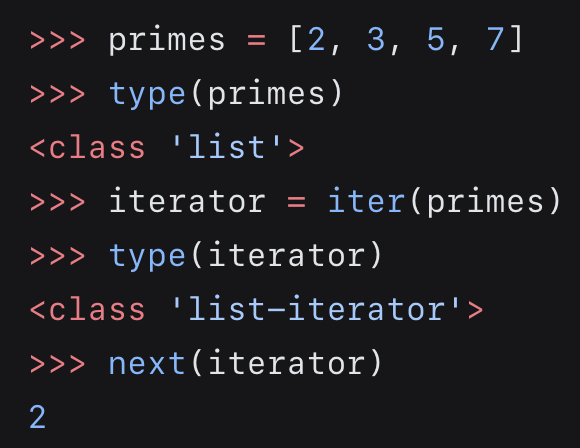

2、知道到达了容器的末尾（StopIteration

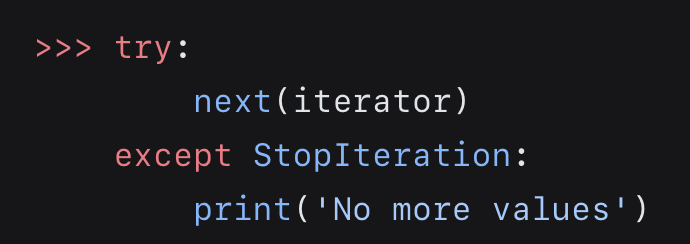

### 迭代器为什么有用？（惰性
其提供了逐个访问数据的机制（而不是一定要将数据全部存于内存之中 才能进行访问

### 内置迭代器（接收可迭代的数据作为参数 返回迭代器

有哪些？

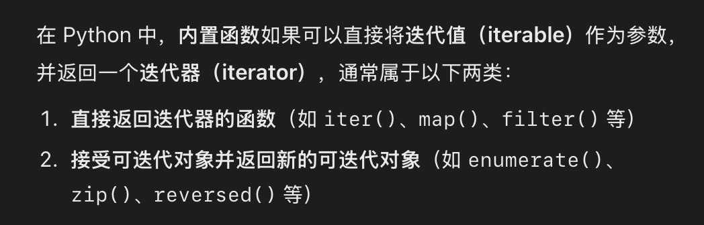

使用：

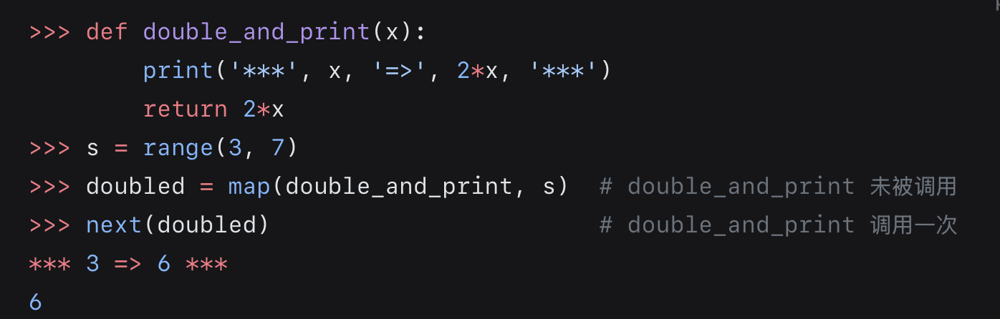

### 生成器函数（generater）和yield
生成器是迭代器的一种，通过 yield 关键字自动实现迭代器协议（相当于是python官方给你抽象出来的一种迭代器方法

<b>生成器（</b>**Generator**<b>）</b> 的字面意思是“值的生产者”
它通过 yield 关键字<b>逐步生成值</b>，而不是一次性返回完整结果。

### yield往往配合着while循环使用（以便下一次调用generator时重新执行代码） 

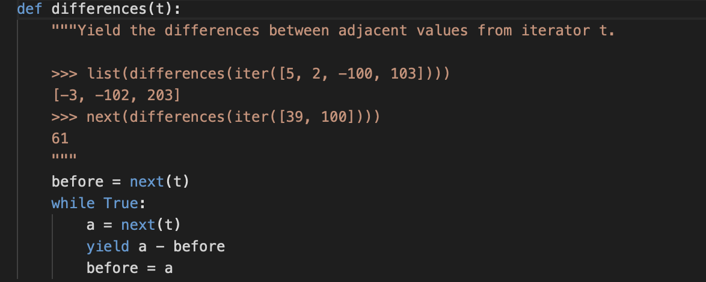

### 而且 在用yield时最好用elif（而不是多个if

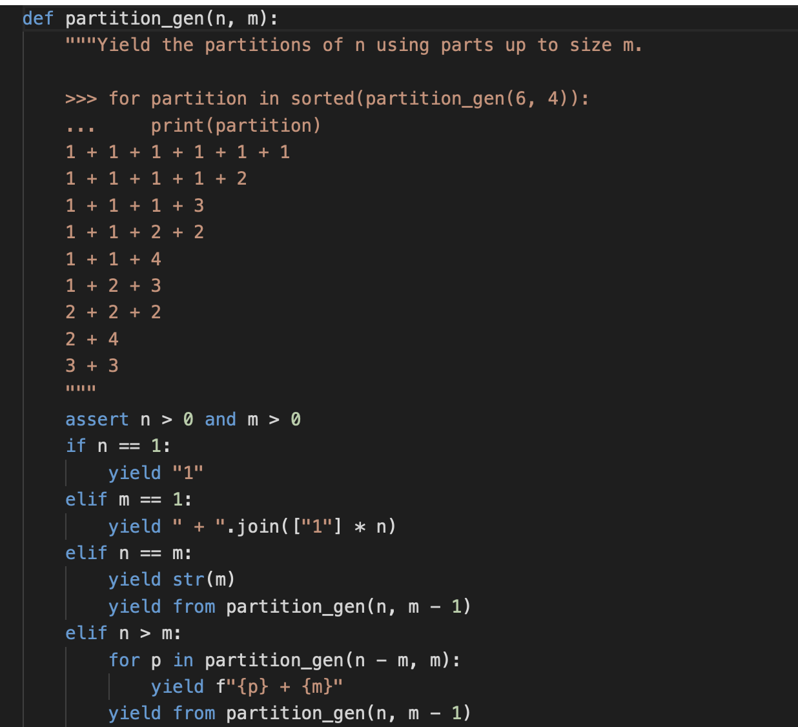

### yield from
yield from 的作用是让子生成器的结果直接透传给外部，而非改变递归的起点逻辑。

而且yield from “返回”的值 其实是yield from 后面函数中return的值（而不是yield的值， yield的值直接就传出去了

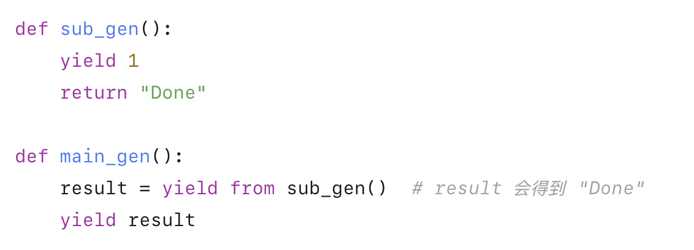

### 可以用iter(可迭代元素)或者 可迭代元素.__iter__()创建迭代器

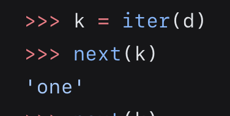

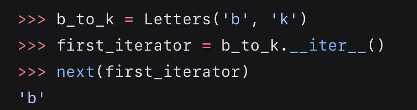

### map filter zip

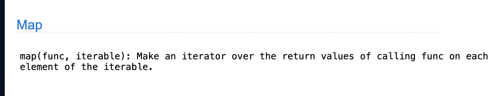

前面是function映射 后面是一个可迭代元素 生成一个迭代器（生成时还没有计算 next时才计算

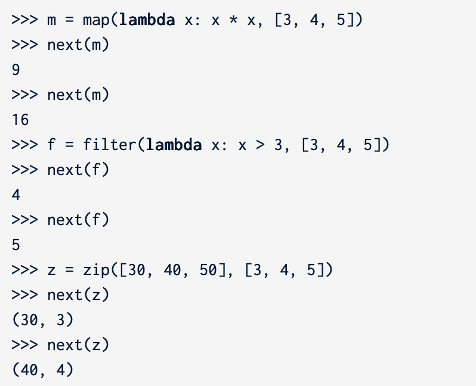

注意 zip得到的迭代元素是元组

### all
检查迭代器中是否所有元素都为真值

一道颇有意思的题：

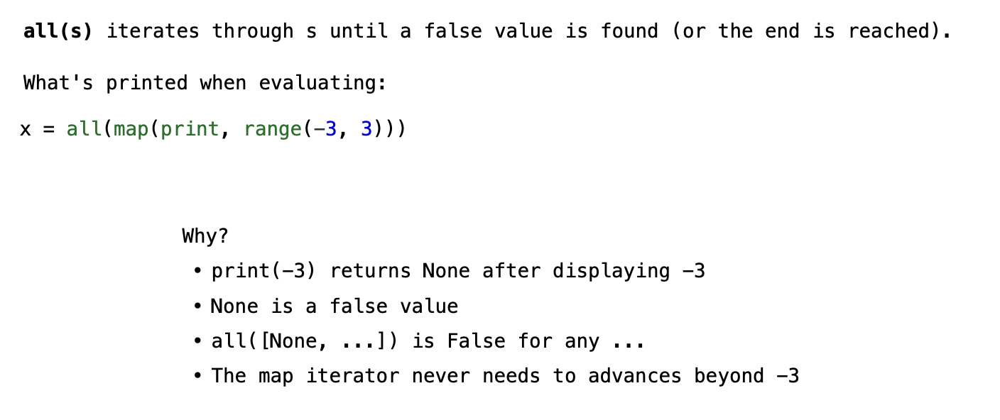

### python中列表的一些常见操作

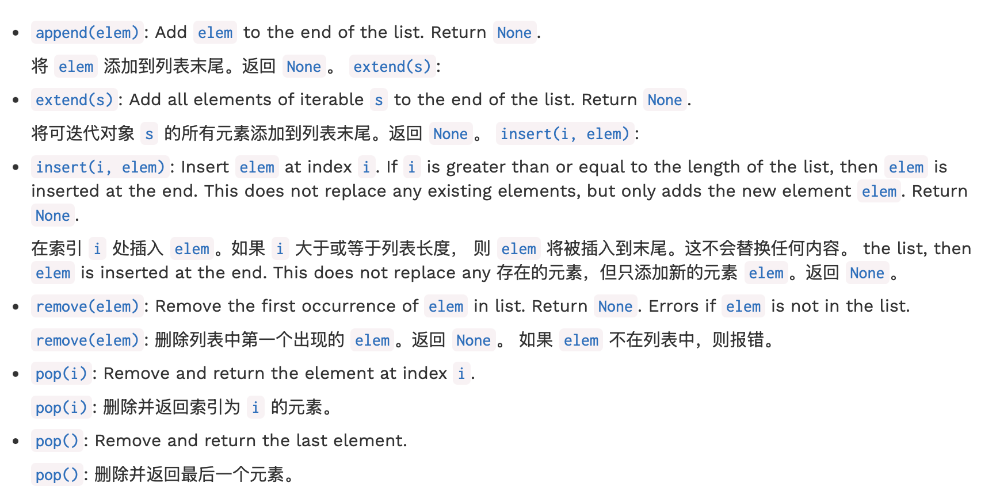

注意remove和pop的不同
remove没有返回值 而且remove的参数是元素本身 pop的可选参数是下标

注意extend

注意append返回的是None 而不是新的列表

注意 如果直接列表赋值，并没有创建副本 指向的是同一个列表（可变元素都是这样的mutable

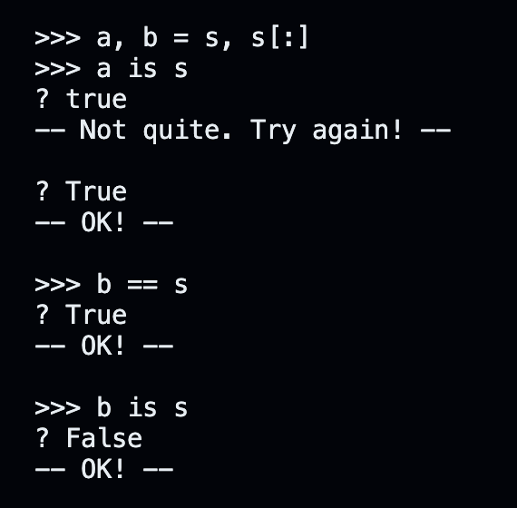

### 记住不要在遍历列表的过程中修改列表
可以新建一个列表
有时候可以反向遍历

错误示范：
len(s)只会在一开始调用一次

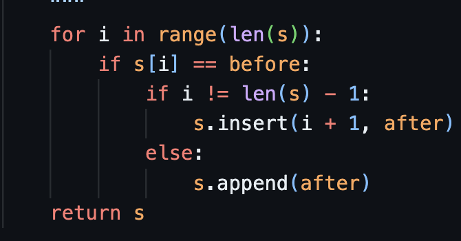

### 一定要注意 到底修改的是原列表还是只是修改了函数内的列表名指向

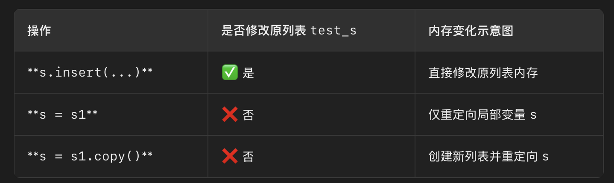

### list(迭代器）  会生成迭代器还未使用部分的列表
### yield型递归

如果没有while循环 一般就需要用yield from重新建一个迭代器
案例：

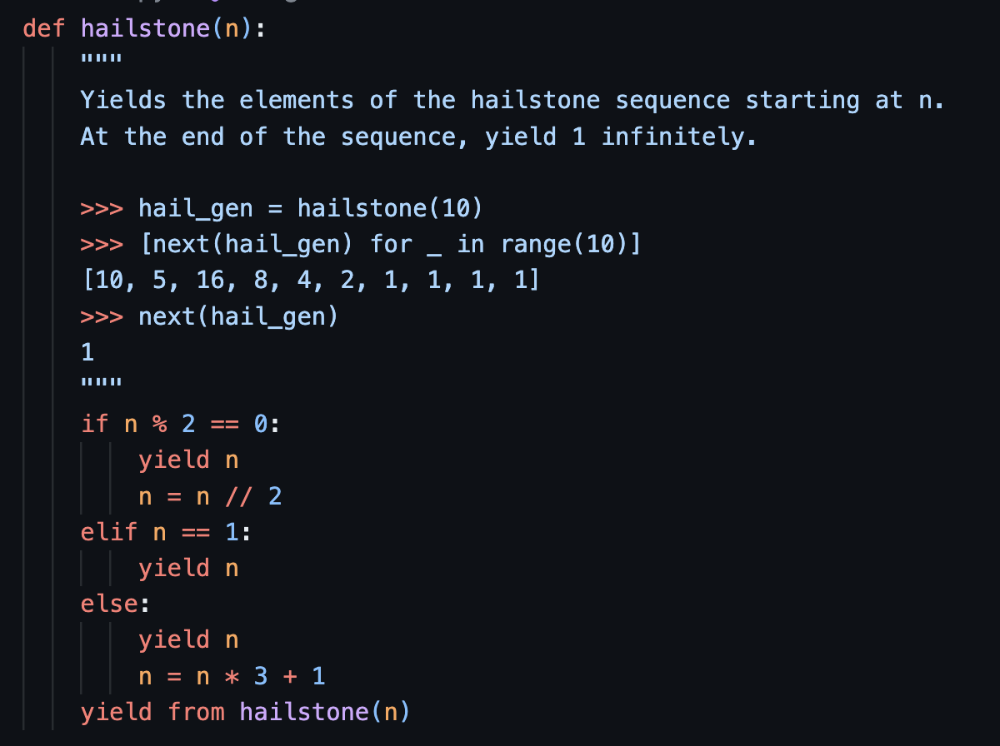

### 一定要注意yield from的穿透性质 以及记住generator传入参数时是新建了一个的
	yield from 本质上是一种委托，把迭代任务交给其他迭代器
	
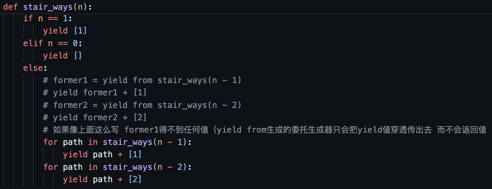

## 实现类和对象
### 作为类属性的函数是“方法”
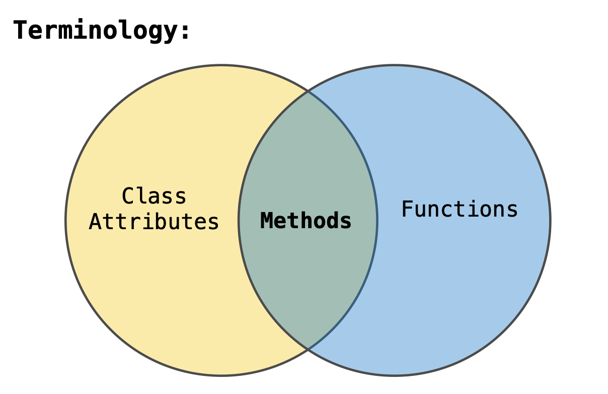

### 类属性和对象属性（实例属性）是有天壤之别的
类属性只有一个 实例属性可以有很多个
实例属性记得要写在__init__里并加self.


### 在需要作为属性被外部访问的函数前面 应当加上@property 以便其像实例属性一样被访问
注意到下面这里访问real，并没有在后面加括号。


# 计算机程序的解释
>https://composingprograms.netlify.app/3/1
>要复习Scheme可以看这个。

第一章和第二章中描述了编程的两个基本要素：函数和数据之间的密切联系。我们知道了如何使用高阶函数将函数作为数据进行操作，如何使用消息传递和对象系统为数据定义行为。我们还研究了组织大型程序的技术，如函数抽象、数据抽象、类继承和泛型函数，这些核心概念为我们编写模块化、可维护和可扩展的程序打下了坚实的基础。

本章重点讨论编程的第三个基本要素：程序本身。Python 程序只是文本的集合，只有通过解释过程，我们才可以基于该文本执行有意义的计算。像 Python 这样的编程语言之所以很实用，是因为我们可以定义一个解释器，一个用于求解和执行 Python 程序的程序。毫不夸张地说，这就是编程中最基本的思想：**解释器决定了编程语言中表达式的含义，但它只是另一个程序**。

要理解这一点，就必须转变我们作为程序员的固有形象。**我们要把自己视为语言的设计者，而不仅仅是别人设计的语言的使用者。**

## 3.1 编程语言

各种程序设计语言在其语法结构、功能和应用领域方面有很大的不同。在通用编程语言中，函数定义和函数应用的结构是普遍存在的。但是，也有一些强大的语言不包括对象系统、高阶函数、赋值，甚至不包括控制结构，如 `while` 和 `for` 语句。我们将介绍 [Scheme 编程语言](<https://en.wikipedia.org/wiki/Scheme_(programming_language) >)，它是一门具有最小功能集的强大语言。本文介绍的 Scheme 子集不允许出现可变值。

在本章中，我们将研究解释器的设计以及它们在执行程序时产生的计算过程。为通用编程语言设计一个解释器可能令人望而生畏，毕竟，解释器是可以根据它们的输入执行任何可能的计算的程序。然而，**许多解释器都有一个优雅的结构，即两个互递归函数：第一个函数求解环境中的表达式，第二个函数将函数应用于参数。**

这些函数是递归的，因为它们是相互定义的：调用一个函数需要求解其函数体中的表达式，而求解一个表达式可能涉及调用一个或多个函数。

## 3.2 函数式编程
这个点很有意思。
居然可以可以做非数字性的抽象（不过这样能做什么？）


这个有意思，还可以用if来选择运算符（就类似于在python中选择函数一样）


所有不需要知道名字的高阶函数都应当用lambda定义

值本身可以迭代，函数本身也是可以迭代的。


用模的特性写scheme

