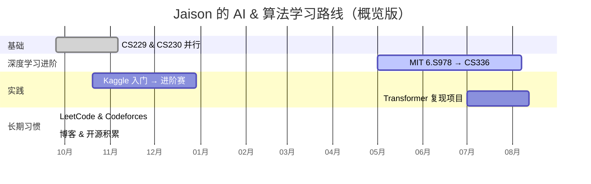
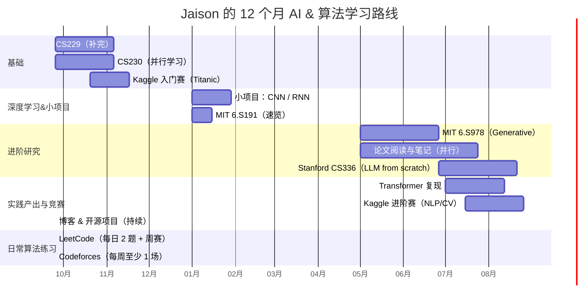

# 学习路线总览（12 个月）

%%中间的留空时间ChatGPT美其名曰为“计划谬误”留出的缓冲空间“%%
# 我的学习路线图：未来 12 个月的 AI & 算法之路

> 这篇文章是在我的输入下，由 ChatGPT 帮我整理的学习路线图。我会把它挂在这里，作为未来一年自我监督的时间表。希望到时候能回顾成长的轨迹，也欢迎大家和我交流。

---

## 为什么写这份路线图？
我大二，计算机 + 数学双专业，在 AI 方向上一直徘徊。目标是成为一名算法工程师 / AI 研究员，而不是单纯的码农。之前学过 **CS50、CS61A**，正在啃 **CS229**。每天刷两道 LeetCode、每周打一场 LeetCode 周赛和一场 Codeforces，这些都是算法基本功。  
但是，如果没有明确的路线，学习很容易分散。所以我决定和 ChatGPT 一起做了一份「未来 12 个月时间轴」，涵盖课程 → 论文 → 项目 → Kaggle → 刷题，把一切串起来。

---

## 学习路线时间轴

### ⌛ 阶段一：打基础（0 ~ 3 个月）
- **CS229**（6 周，补完）  
- **数学基础**（线性代数 / 概率论 / 优化，持续复习）  
- **算法竞赛**：继续 LeetCode & Codeforces 日常  
- **Kaggle 入门赛**：Titanic / Digit Recognizer（4 周，熟悉 Notebook & baseline）  

### 🤖 阶段二：深度学习核心（3 ~ 6 个月）
- **CS230（6 周）**：深度学习系统学习  
- **MIT 6.S191（2 周）**：快速扫一遍  
- **小项目（4 周）**：  
  - CNN 图像分类  
  - RNN 文本生成  
- **Kaggle 入门赛复盘**（写博客，总结前 5 个 baseline）  

### 🔬 阶段三：进阶与研究（6 ~ 12 个月）
- **MIT 6.S978 / CS336**（二选一为主线，8 周）  
- **论文阅读（1~2 周 / 篇）**：  
  - Transformer (2017)  
  - BERT (2018)  
  - GPT 系列 (2018-2020)  
  - Diffusion Models (2020)  
- **项目产出（6 周）**：  
  - Transformer 复现  
  - LLM 微调实验（LoRA / PEFT）  
- **Kaggle 进阶赛（6 周）**：NLP / CV 方向 Top 30%  

### 📈 阶段四：算法与竞赛同步（长期并行）
- **LeetCode**：每日 2 题（30min ~ 1h），周赛（1.5h）  
- **Codeforces**：每周至少 1 场 Div.2（2h），专项训练（2h / 周）  
- **Kaggle**：持续参加比赛，积累 kernel / 方案复盘  

### 🎯 阶段五：产出与应用（12 个月后）
- **博客（jaison.ink）**：每月 1~2 篇学习笔记 / 论文解读 / 项目复盘  
- **开源项目**：GitHub/Gitee 同步，积累 portfolio  
- **申请 / 求职**：拿课程证书 + Kaggle 成绩 + GitHub 项目，准备简历  

---

## 粗略时间安排
- 0 ~ 3 个月：ML 基础 + Kaggle 入门  
- 3 ~ 6 个月：深度学习课程 + 小项目  
- 6 ~ 12 个月：研究进阶 + 论文 + Kaggle 排名  
- 12 个月后：科研 / 求职产出  

---

## 写在最后
这份路线图不是一成不变的，而是一个「滚动优化」的时间表。我会在学习的过程中不断调整。能不能走到「算法工程师 / AI 研究员」的目标，还有很多不确定，但至少我知道了接下来该做什么。  

如果未来一年我能坚持下来，那么无论是 Kaggle 排名、论文复现，还是 GitHub 项目，我都能积累一份拿得出手的作品集。  

— Jaison

# 学习路线详细版甘特图

# 与ChatGPT的深夜探讨
[深夜探讨分享](https://chatgpt.com/share/68d34b7b-f0ac-8007-b20d-ebd34c6bf99b)

# 参考资料
[CSDIY深度生成模型学习路线](https://csdiy.wiki/深度生成模型/roadmap/)