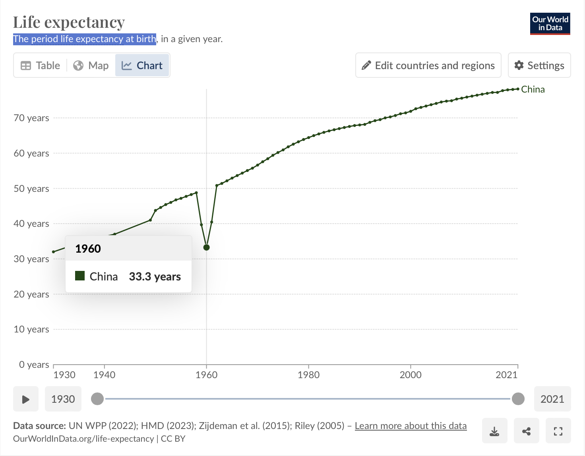
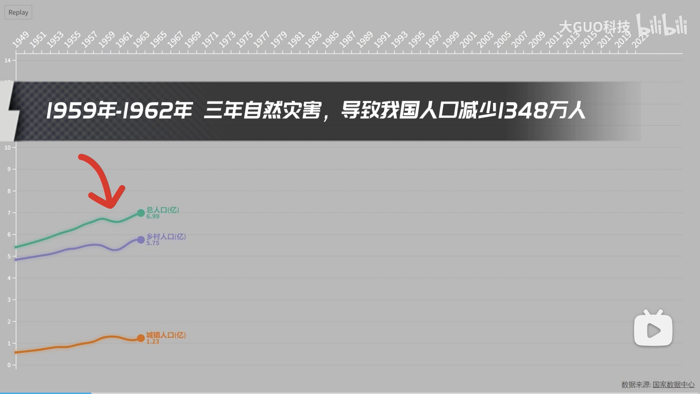
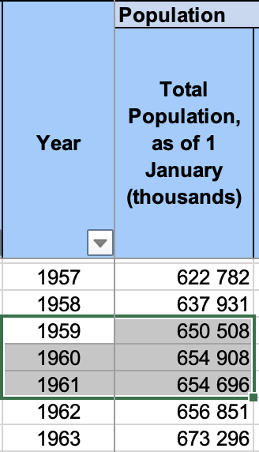
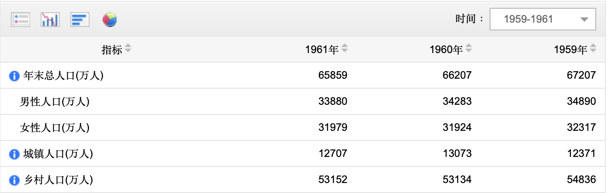
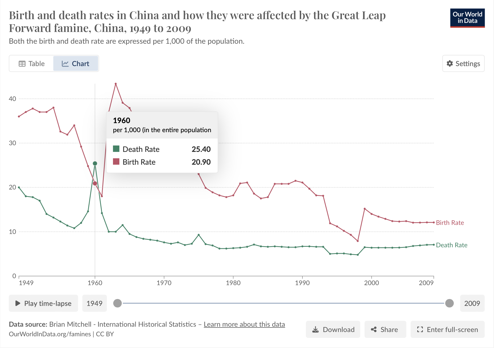
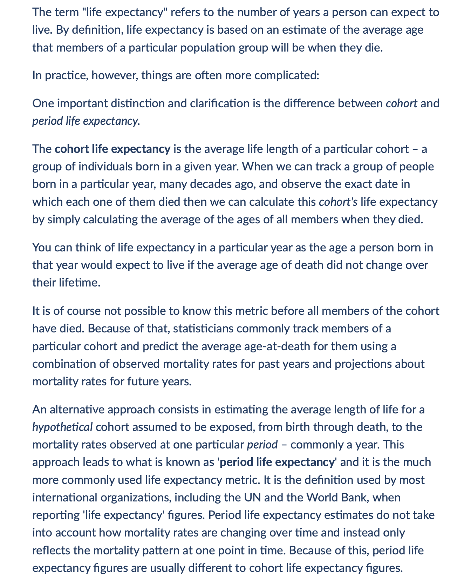
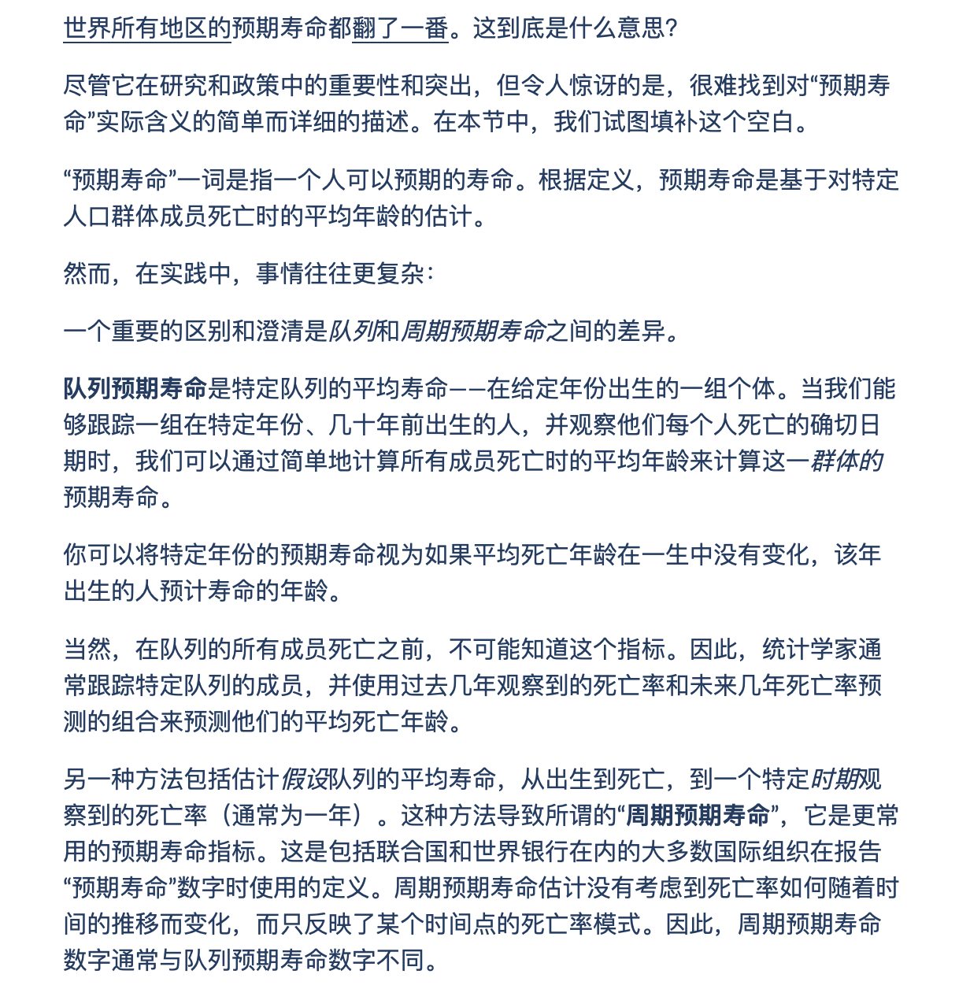
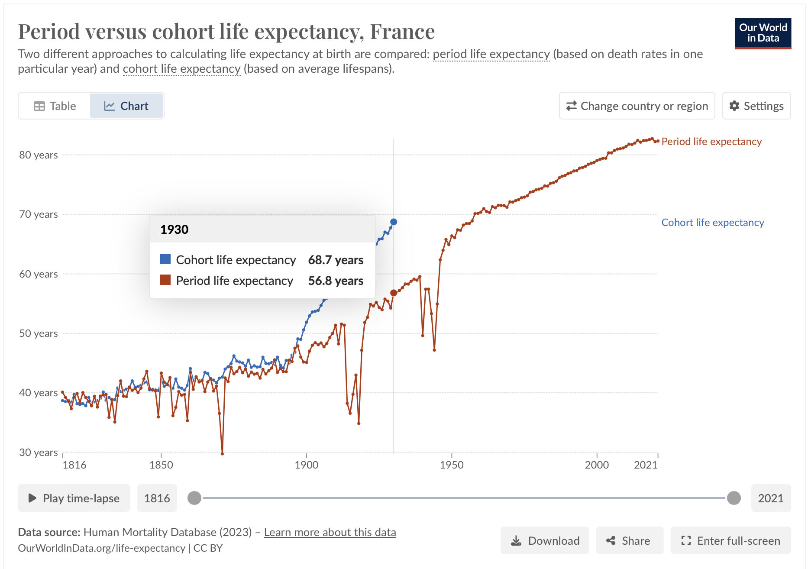

我今天在翻阅[ourworldindata.org](http://ourworldindata.org)关于中国1950-2021年预期寿命的数据图时，发现了一个让我百思不得其解的拐点：1960年中国人的预期寿命显著下降，下降幅度相比于1958年达到15岁有多（见p1（该数据的主要来源是联合国的数据库[WPP2024_GEN_F01_DEMOGRAPHIC_INDICATORS_FULL.xlsx](https://population.un.org/wpp/Download/Files/1_Indicator%20(Standard)/EXCEL_FILES/1_General/WPP2024_GEN_F01_DEMOGRAPHIC_INDICATORS_FULL.xlsx)）

经过一番网络查询，我发现有关于此的资料寥寥，唯一的一个可能相关的信息是b站上一个up主制作的视频显示：1959-1962年三年困难时期中国的人口显现出相似的变化趋势。（见p2）

但是在对该视频的数据来源进行查证的过程中，我发现“国家数据中心”并不存在，而根据联合国的数据，该视频中显示的凹陷点也不存在（见p3）。难道是无良媒体伪造数据？我仔细一想，如果是无良媒体，伪造数据这活还是蛮累人的，所以该数据一定有来源。

于是我查询了（中国）国家统计局的数据（见p4，注意该数据是从右往左看的），发现其与视频基本相符，暂且将它当作置信度较高的数据吧（所以联合国和国家统计局数据这么大的差距是从哪里来的，有没有人去探究下？😂）。但问题并没有解决，某年死亡率高并不能直接导致该年出生儿童的预期寿命出现显著低谷，而更应该作用于所有经历过那几年的人的预期寿命数据。难道是因为饥荒对于一岁以下婴儿死亡率的影响显著高于其他年龄的群体？这是我做出的第一个猜想，但很快被我否定了，因为折线图中的低谷实在是太明显了，而饥荒对于婴儿和儿童的选择性差别不应该有这么大。

我的探索至此进入了一个死胡同，秉持着研究一个未知事物必然会遇到很多次失败的精神，我对与预期寿命有关的其他数据进行了探索，终于，我看到了一条“优美的”曲线（见p5，绿色线是死亡率），这条曲线和p1中的预期寿命曲线在上下翻折后可谓是高度相符，这时我终于回过神来，开始怀疑预期寿命（Life Expectancy）的算法在捣鬼。

在我找到一篇名为*"Life Expectancy" – What does this actually mean?的文章（*p6p7分别为英文原版和机翻版节选）后，真相终于逐渐浮出水面。按照正常的理解，预期寿命（The Life Expectancy at Birth）就应该是预测那一年出生的人平均能活多久的数据。而一个预测数据如果合理，就应该在某些年份高于最终的真实数据，某些年份低于最终的真实数据。但预期寿命的相关数据完全不符合以上这个特征。

事实上，大多数官方机构所给出的预期寿命都有很大概率远低于最终实际值。造成这个现象的原因如下：（如果看得懂p6/p7的可以直接看原文解释）所谓的“预期寿命”（life expectancy）其实有两种计算方式，一种我称之为真实预期寿命（“队列预期寿命”cohurt life expectancy），另一种为“周期预期寿命”（period life expectancy）。前者（真实预期寿命）的计算方式是在积累了足够的数据以后（比如1900年出生的人现在已经基本死光了），将1900年出生并在各个年龄段去世的人取加权平均数，这也是我们常人认知中的“预期寿命”的内涵。但其实大多数国际组织给出的“预期寿命”都是后者（即周期预期寿命），而后者的计算方式是将简单的将<b>那一年</b>的分年龄段死亡率乘以那一年各个年龄段人口所占的比例。

也就是说，假如我们用这种方法计算1960年出生的中国人的预期寿命，它就会假定1960年以后几十年中国人的死亡率都等于1960年这一年的死亡率，而1960年左右的死亡率由于三年困难时期而暴升，这也就导致了文章一开始描述的预期寿命显著低谷。

%% 英文版%%

%% 机翻版%%

明晰了“预期寿命”这一数据的巨大局限性后，我再往下探索了另一个我感兴趣的问题：我预期能活多久？众所周知，由于现代医疗技术的快速发展，以及中国经济的快速进步，中国人的死亡率是不断降低的，这就会导致我们最终的真实预期寿命会远高于官方给出的数据。为了印证这一观点，我找到了法国的数据（见p9，由于法国记录相关数据较早，上面蓝色那条是真实预期寿命，下面红色那条是周期预期寿命），可以看到，1900-1930年，两条曲线的差距越拉越大，到1930年，差距已经到了令人乍舌的11.9年。也就是说，一个1930年生的人，在1930年的时候可以认为自己这批人平均能活68.7年，等到他这辈人全都死去时，他在“天堂”会惊讶地发现自己这批人平均多活了11.9年。
然后我查询了我出生那年（2005年）中国城镇男性预期寿命，为74岁左右，由于没有更为相关的数据支撑，我很难推断最终的真实预期寿命会是多少。但鉴于中国经济的快速发展以及法国的数据，我相信真实预期寿命与周期预期寿命的差距不会少于10年，那就姑且加个10年吧，也就是说我可以用活到84岁来估量自己的生命。（顺便一提，1960年出生的中国人周期预期寿命为56.6岁，1980年为64岁，1990年为68岁，2000年为71.9岁，2010年为75.6岁，大家可以在这个基础上加10-20岁来预估自己的真实预期寿命，女性预期寿命比男性长5年左右）

知道自己更为真实的预期寿命有什么意义呢？假如我自己真实预期寿命为70岁，那让我延迟退休到65岁我肯定是打死都不干的，假如我真实预期寿命是100岁，那倒是还可以考虑考虑。预期寿命这一数据不仅能帮助我们畅想、规划我们的人生，还能帮助国家制定相关退休政策，但现在网上关于预期寿命的新闻报道通常缺少对其计算方式的解释以及对其误差的说明，就可能导致错误的决策。

这次探索本身只花费了笔者约3-4小时的时间，但是由于中间去看了Olympics篮球赛导致中断以及要将其整理出来，最后累计用时估计在10h左右。
探索的起因其实是笔者对预期寿命数据异常波谷的好奇和对网上用死亡率来解释预期寿命的显然逻辑不充分的不满，后续动力则是对探索以及攻坚克难找到真理本身的热忱。在探索过程中也发现了很多令笔者乍舌的数据，如我们比一百年前的人寿命多了一倍有余，如三年困难时期中国非正常死亡的人数是1500万到3000万（各家众说纷纭，基本在这个区间内），要知道南京大屠杀的死亡人数是三十余万人，三十万和1500万都不仅仅是一个数字，而是三十万和1500万个一个有血有肉有思想的个体。

就以鲍勃迪伦的一段歌词结尾吧：（翻译摘自豆瓣用户Chuck）
How many times must a man look up 
一个人得遥望多少次
Before he can see the sky 
才能望的见天空
How many ears must one man have 
一个人得有多少耳朵
Before he can hear people cry 
才能听见人们的哭泣 
How many deaths will it take 
还要有多少人死 
'Till he knows that too many people have died 
他才知道已有太多人死去
The answer, my friend, is blowing in the wind 
答案，我的朋友，在风里飘着呢
The answer is blowing in the wind 
答案就在风里飘着呢