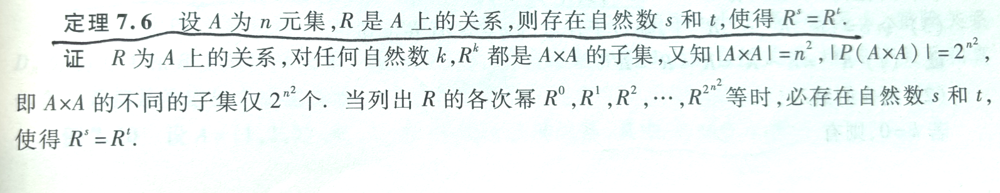
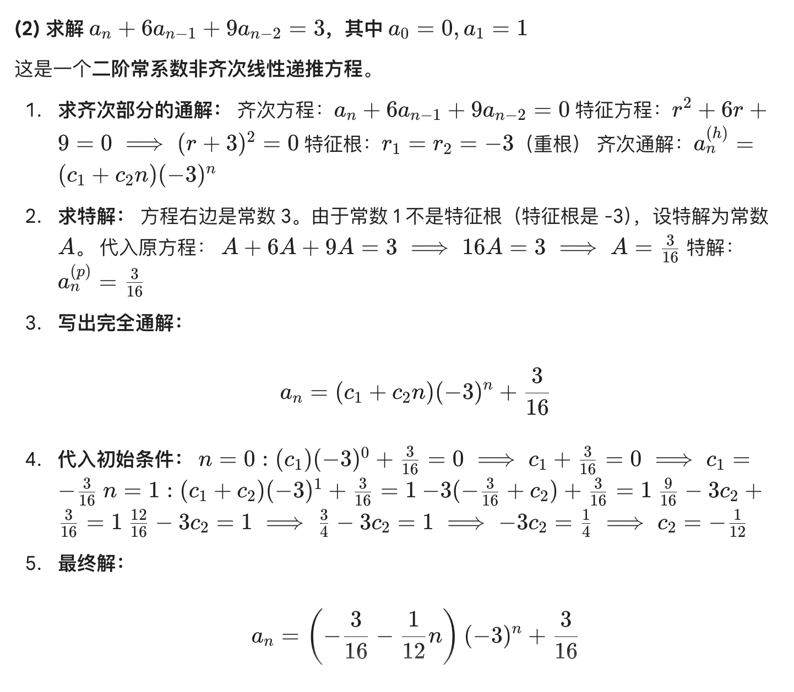
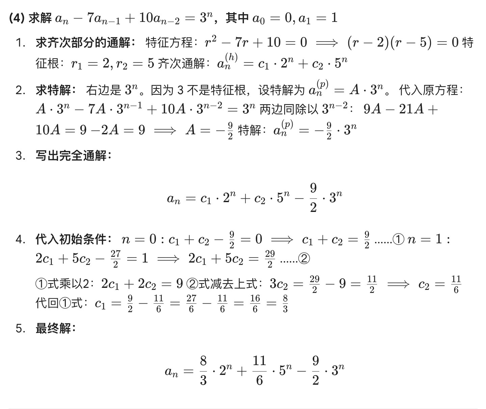
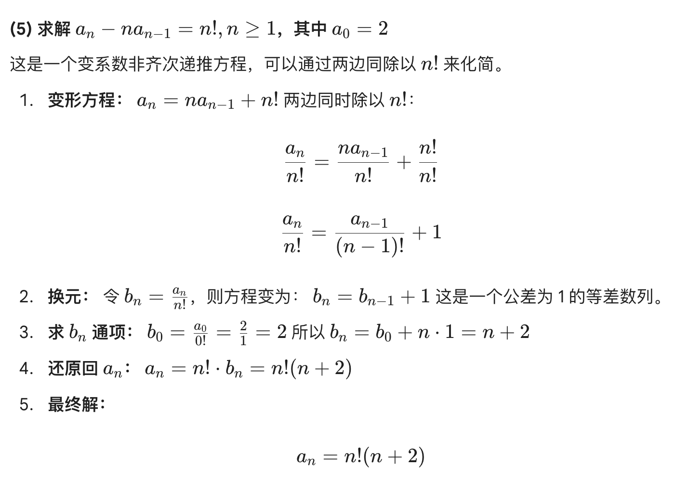

## 数理逻辑

### 基本概念
- 命题
	非真即假的陈述句。
	悖论不是命题，祈使句不是命题。
- 联结词
	- 析取联结词 $\lor$
	- 合取联结词 $\land$
	- 否定联结词 $\lnot$
	- 蕴涵联结词 $\to$
		- 前件
		- 后件
	- 与非联结词 $\uparrow$
	- 或非联结词 $\downarrow$
- 命题常项 命题变项
- 真值
	真值可能为真或假。（真值并非“真”）
- 合式公式（公式）
	命题变项用联结词组合成的符号串。
- 公式层次
	命题变项是0层公式，然后逐层递加，选取最大的。
	例如 $(\lnot p \land q) \to r$ 是3层公式。（从p开始算最大）
- 赋值
	对每一个命题变项指定一个真值。
	- 成真赋值
	- 成假赋值
	
	- 重言式
		所有赋值结果均为真
	- 矛盾式
		所有赋值结果均为假
	- 可满足式
		存在赋值结果为真
- 哑元

### 等值演算
- 等值
	A B等值即$A\leftrightarrow B$为重言式。
	
- 等值式模式
	- 双重否定律
	- 幂等率
	- 交换律
	- 结合律（同符号可结合）
		$(A \land B) \land C \iff A \land (B \land C)$
		$(A \lor B) \lor C \iff A \lor (B \lor C)$
	- 分配律（不同符号可分配，括号内外符号交换）
		$A \land (B \lor C) \iff (A \land B) \lor (A \land C)$
		$A \lor (B \land C) \iff (A \lor B) \land (A \lor C)$
	- 德摩根律（否定，符号反）
		$\lnot (A \land B) \iff \lnot A \lor \lnot B$
		$\lnot (A \lor B) \iff \lnot A \land \lnot B$
	- 吸收律
	- 零律
	- 同一律
	- 排中律
	- 矛盾律
	- 蕴涵等值式（蕴涵的定义）
		$A \to B \iff \lnot A \lor B$
	- 等价等值式
	- 假言易位（原式的逆反命题）
		$A \to B \iff \lnot B \to \lnot A$
	- 等价否定等值式（双重逆反命题）
		$A\leftrightarrow B \iff \lnot A \leftrightarrow \lnot B$
	- 归谬论（若后件又为真又为假，则前件一定为假）
		$(A \to B) \land (A \to \lnot B) \iff \lnot A$
	
- 范式
	- 简单析取式
	- 简单合取式
	- 析取范式
		由有限个简单**合取式的析取**组成（看括号外符号）
	- 合取范式
		由有限个简单**析取式的合取**组成
	例子：
		$(p \land q) \lor (r \land s)$是合取范式
		$(p \lor q) \land (r \lor s)$是析取范式
	定理：（显然）
		合取范式是重言式当且仅当每个简单析取式都是重言式
		析取范式是矛盾式当且仅当每个简单合取式都是矛盾式
	范式存在定理：
		任一公式都存在其析取范式和合取范式。
	
	- 极小项
		按字典序排序且各命题变项唯一的简单合取式
	- 极大项
		按字典序排序且各命题变项唯一的简单析取式
	- 主析取范式
		各个简单合取式都为极小项
	- 主合取范式
		各个简单析取式都为极大项
	为了其唯一性也是拼了老命了。
	
- n元真值函数
	$$\{0, 1\}^n \to \{0, 1\}$$
	每一张真值表都对应了一个真值函数。
	例如，二元真值函数有 $2^{2^2} = 16$个，三元真值函数有 $2^{2 ^ 3} = 256$个。
	- 联结词完备集
		通过一个集合内的联结词能够**表示任意一个n元真值函数**，则这个集合是一个联结词完备集。
		若这些联结词能表示所有析取范式/合取范式
		（只需要证明$\lnot$和（$\land$或$\lor$）可以被集合内的联结词表示即可。）
		联结词完备集典例：
		$\{\lnot, \land\}$
		$\{\lnot, \lor\}$
		$\{\lnot, \to\}$
		$\{\lnot, \to\}$
		$\{\uparrow\}$
		$\{\downarrow\}$
		不是联结词完备集典例（其任何子集也不是）：
		$\{\land, \lor, \to, \leftrightarrow\}$
- 可满足性问题和消解法
	在解决可满足性问题时（可满足性是什么？可以往回翻一翻），消解法和真值表法都是$O(n^2)$的，但是消解法在通常情况下更快。（尤其当问题已经是一个合取范式时，可以轻易地消解，归谬）
	SAT(Boolean Satisfiability Problem)问题是一个典型的NP-Complete问题（同时是NP问题和NP-Hard问题），甚至是”元NP-Hard“问题，作为证明一个问题是NP-Hard的规约最初起点。该问题的证明称之为库克-列文定理 (Cook-Levin Theorem)。
	%%第一个被证明为NP-Hard问题的问题1970年才被证明，人类居然想快速证明$NP \neq P$？？实在是有点荒谬了。%%

### 推理
- 推理定律
	- 附加律
		$A \implies (A \lor B)$
	- 化简律
		$(A \land B) \implies A$
	- 假言推理
		$(A \to B) \land A \implies B$
	- 拒取式
		$(A \to B) \land \lnot B \implies \lnot A$
	- 析取三段论
	- 假言三段论
	- 等价三段论
	- 构造性二难
	- 破坏性二难

### 一阶逻辑
	所谓的用一阶逻辑表达，就是用个体词、谓词和量词组成的一阶语言表达。
- 个体词
	- 个体常项 r s t
	- 个体变项 x y z
		- 个体域 （一般用谓词书写）
- 谓词 F G H
	- 谓词常项
	- 谓词变项
	- n元谓词
	- 0元谓词
- 量词 
	- 全称量词 $\forall$
	- 存在量词 $\exists$
- 一阶语言
	$$\forall xA$$
	- 指导变元 （x）
	- 辖域 （A）
	- 约束出现 （辖域中的x）
	- 自由出现 （辖域中的非x）
	例子：
	$\forall x(F(x,y) \to G(x, z))$
	x是指导变元，$(F(x,y) \to G(x, z))$是辖域，辖域中有两次约束出现x，两次自由出现（y和z）
	
	- 闭式（封闭的公式）
		公式中不含自由出现的命题变项
	
	- 解释
	- 赋值
	
	- 永真式
	- 矛盾式
	- 可满足式
	
	    - 代换实例
	
	- 等值式
		- 量词否定等值式
			$$
			\begin{aligned}
			\lnot \forall xA(x) \iff \exists x \lnot A(x) \\ 
			\lnot \exists xA(x) \iff \forall x \lnot A(x)
			\end{aligned}
			$$
		- 量词辖域收缩与扩张等值式
			就是说量词可以直接限定这个量词对应的谓词（而无需限定整个式子）
			比如：$\forall x(A(x) \lor B)\iff \forall xA(x)\lor B$
		- 置换规则（就是说里面套一层肯定还一样）
			$A \iff B$，则 $\Phi(A) \iff \Phi(B)$
		- 换名规则（符号统一换一换值不变）
			比如：$\forall xF(x) \to G(x) \iff \forall yF(y) \to G(y)$
			Tip：有量词的符号才可以换名，没有量词的符号是自由变元，需要保持不变。
	- 前束范式
		若A中不含量词（辖域中不含量词）

## 集合论
### 集合的运算
- 并集
- 交集
- 相对补集
- 绝对补集
- 对称差集
- 广义交集
- 幂集

- 容斥原理（即包含排斥原理）
- 欧拉函数
	$\phi(n) = 0到n-1中与n互素的个数$

### 二元关系
	一个二元关系的本质是一个集合。其满足以下两条件之一：
	非空，所有元素均为有序对
	空集
- 定义域domR(R代表一个二元关系)
	所有有序对的第一个元素所组成的集合
- 值域ranR
	所有有序对的第一个元素所组成的集合
- 域fldR
	定义域和值域的并集

- 全域关系
	就是把这个集合中每个元素之间可能发生的关系都列出来。
- 恒等关系
	就是这个集合中每个都和自己有关系。
- 逆关系
	就是把关系倒过来。
- 右复合
	简单来说就是把两个关系中能接上的接上，不能接上的全部扔掉。
	$R∘S = \{(a,c) ∈ A×C | ∃b ∈ B, 使得 (a,b) ∈ R 且 (b,c) ∈ S\}$
- 限制
	$f\restriction_A$指的是二元关系f在集合A上的限制（即取有序对的第一个元素在集合A内的部分）
	$R \restriction A' = \{(a,b) \in R \mid a \in A'\}$
- 像
	$R[A]$其实就是A通过R能够映射到的值域。
	$R[A'] = \{b \in B \mid \exists a \in A', (a,b) \in R\}$
	$R[A'] = \mathrm{ran}(R \restriction A')$

- $(F^{-1})^{-1} = F$
- $domF^{-1} = ranF, ranF^{-1} = domF$

- $(F∘G)∘H = F∘(G∘H)$（结合律）
- $(F∘G)^{-1} = G^{-1}∘F^{-1}$

- 关系的n次幂
	$$
	关系 (R \subseteq A \times A) 的 (n) 次幂 (R^n) 定义为：
	[
	\begin{aligned}
	R^0 &= I_A = \{(a,a) \mid a \in A\} \\
	R^{n+1} &= R^n \circ R \quad \text{对于 } n \geq 0
	\end{aligned}
	]
	$$
	有穷集上只有有穷个不同的二元关系。
	（证明的核心在于，A的任意次幂都是AxA的子集，所以总数量不可能超过AxA的幂集大小）
	

- 自反
- 反自反
- 对称
- 反对称
- 传递性
	注意，传递性是定义在右复合上的（而不是等价关系上的）

- 闭包
	就是增加一些有序对，使得某个性质成立
	- 自反闭包
	- 对称闭包
	- 传递闭包

- 最小元
- 最大元
- 极小元
- 极大元
	最大/最小要求和整个偏序集内的元素都可比，
	极大/极小不要求都可比。

- 上界
- 下界
- 上确界
- 下确界

- 函数
	函数是特殊的二元关系
	- 满射
		$ranf = B$
	- 单射
		$\forall y \in ranf$ 存在唯一的 $x \in A$ 使得 $f(x)=y$
		就是说能找到唯一的原像（这样说其实不太严谨）
	- 双射
	
	- 常函数
	- 恒等函数
	- 单调函数
	- 特征函数
		即在集合内的映射得 1
		在补集内的得 0
	- 自然映射
		从原集到商集
		比如 $A \to A/R$

## 组合数学
### 关系计数
Q. n元集上的自反关系/对称关系/反对称关系/函数/双射函数有几个？

> 方法基本都一样的，用一个关系矩阵，然后看里面有多少自由度。

函数稍微不同一点，但是大差不差。

### 二项式定理与组合恒等式
### 求解递推方程
#### 1. 第一步：求齐次通解 ($a_n^{(h)}$)

首先令等式右边为 0，写出**特征方程**：$r^2 + c_1 r + c_2 = 0$，求出特征根 $r_1, r_2$

| **特征根的情况**                    | **通解形式 (an(h)​)**       |
| ----------------------------- | ----------------------- |
| **两个不相等的实根** ($r_1 \neq r_2$) | $c_1 r_1^n + c_2 r_2^n$ |
| **两个相等的实根** ($r_1 = r_2 = r$) | $(c_1 + c_2 n) r^n$     |
#### 2. 第二步：求特解 ($a_n^{(p)}$) —— 待定系数法

**核心口诀：看右边是谁，就设谁；如果重了（撞车），就乘 $n$。**

设特解形式为 $n^s \cdot (\text{猜测形式})$，其中 $s$ 是**重数**（修正系数）。

| **右边项 f(n) 的形式**             | **正常设法 (无重根)**            | **撞车处理 (修正系数 s)**                                                                                                      |
| ---------------------------- | ------------------------- | ---------------------------------------------------------------------------------------------------------------------- |
| **常数** $C$ (即 $C \cdot 1^n$) | 设特解为 $A$                  | 若特征根里有 1：  • 有一个 1，设 $A \cdot n$  • 有两个 1，设 $A \cdot n^2$                                                  |
| **多项式** (如 $n^2+1$)          | 设同次多项式  $An^2+Bn+C$ | 若特征根里有 1：  乘以 $n$ 或 $n^2$                                                                                        |
| **指数函数** $\beta^n$           | 设 $A \cdot \beta^n$       | 若底数 $\beta$ 也是特征根：  • $\beta$ 是单根，设 $A \cdot n \cdot \beta^n$  • $\beta$ 是重根，设 $A \cdot n^2 \cdot \beta^n$ |
#### 3. 第三步：定系数

- 将猜测的特解代入原方程，解出待定系数 $A, B$ 等。

#### 案例：

最后这个案例说明，并不是全部都是特征方程，有些看看能不能转化成等比/等差数列。

### 生成函数
#### 几个公式
负指数情况下的二项式系数公式
$$(1-x)^{-n} = \frac{1}{(1-x)^n} = \sum_{k=0}^{\infty} \binom{n+k-1}{k} x^k$$
$$\frac{1}{(1-x)^n} = 1 + \binom{n}{1}x + \binom{n+1}{2}x^2 + \dots + \binom{n+k-1}{k}x^k + \dots$$
可以这样记忆：
我们知道$\frac{1}{1-x} = 1 + x + x^2 + x^3 + \dots$
那么对于$x^k$的系数，就是n个盒子取k个球，且每个盒子可以重复取（每个盒子可以取0也可以取1/2/3……）。再转化一下，就是把k个球分成n份（隔板法）

#### 几种常见变换
处理指数项 $c^n$：将公式中的 $x$ 替换为 $cx$。
示例：已知 $1 \leftrightarrow \frac{1}{1-x}$，则 $2^n \leftrightarrow \frac{1}{1-2x}$。

处理系数 $n$：对生成函数求导，然后乘以 $x$（为了补回降下去的次幂）。
**示例**： 求 $n \cdot 2^n$ 的生成函数？ 先写出 $2^n \rightarrow \frac{1}{1-2x}$，求导得 $\frac{2}{(1-2x)^2}$，再乘 $x$ 得 $\frac{2x}{(1-2x)^2}$

处理下标变化（比如从 $a_1$ 开始算，或者中间缺了几项）：
- **右移（前面补0）**：乘以 $x^k$。
- **左移（去掉前k项）**：减去前 $k$ 项，然后除以 $x^k$。

#### 标准流程
拿到一道题（比如 $a_n = n \cdot 3^n + 5$），按以下步骤执行：
**Step 1: 拆分 (Decompose)**
利用**线性性质**，把复杂的通项拆成几个简单部分。
> 例：$a_n = n \cdot 3^n + 5$ 拆分为 **Part A** ($n \cdot 3^n$) 和 **Part B** ($5$)。

**Step 2: 匹配 (Match)**
对每一个部分，找到它对应的“基础积木”。
> Part A 原型是 $n$ (自然数)，对应积木 $\frac{x}{(1-x)^2}$。
> Part B 原型是 $1$ (常数)，对应积木 $\frac{1}{1-x}$。

**Step 3: 变换 (Transform)**
对积木应用“换底”或“求导”操作。
> **Part A**：
> 1. 先看 $n$：对应 $\sum n x^n = \frac{x}{(1-x)^2}$
> 2. 再看 $3^n$：把 $x$ 换成 $3x$。
>     $\implies \frac{3x}{(1-3x)^2}$
> **Part B**
> 3. 常数是 5：即 $5 \times 1$。
> 4. $\implies 5 \cdot \frac{1}{1-x} = \frac{5}{1-x}$

Step 4: 组合 (Combine)
把所有部分加起来，通分化简（如果需要）。
> $G(x) = \frac{3x}{(1-3x)^2} + \frac{5}{1-x}$

#### 只要偶数/只要奇数？
- 只要偶数项 $(1, 0, 1, 0, \dots)$：

    利用 $e^x$ 和 $e^{-x}$ 对消奇数项。    
    $$\frac{e^x + e^{-x}}{2} =  1 + \frac{x^2}{2!} + \frac{x^4}{4!} + \dots$$
- 只要奇数项 $(0, 1, 0, 1, \dots)$：
    利用相减消掉偶数项。
    $$\frac{e^x - e^{-x}}{2} =  x + \frac{x^3}{3!} + \frac{x^5}{5!} + \dots$$
### Catalan数
### Stirling数

## 图论
### 基本概念
- 无序积 VS 笛卡尔积（有序）
	无序积的元素用`()`，笛卡尔积的元素用`<>`
- 最大度$\Delta(G)$ VS 最小度$\delta(G)$
- 生成子图 VS 导出子图
	生成子图要选边和选点。
	导出子图只选边，自动导出点。
- 补图
	取**边**补集，点全部保留。（本质上是以边为核心的概念）
- 点割集、割点，边割集、割边
	一个图的割集可以不止一个。
	割集的真子集不能是割集。
- 点连通度、边连通度
- 极大路径
	不是距离最长，而是两端无法再延伸
- 基图
	将所有有向边变为无向边
- 弱连通图 $\supset$ 单向连通图 $\supset$ 强连通图
	都是有向图中的概念。
	这三个的连通强度是**递增**的。
		弱连通图：基图连通。
		单向连通图：任意两个点之间至少单向可达（$v\to u$或者$u\to v$）
		强连通图：任意两个点双向可达（$u \leftrightarrow v$）
- 关联矩阵 VS 邻接矩阵 VS 可达矩阵
	关联矩阵：纵轴是点，横轴是边
	邻接矩阵：横纵都是点。邻接矩阵相乘可计算
	可达矩阵：横纵都是点
	