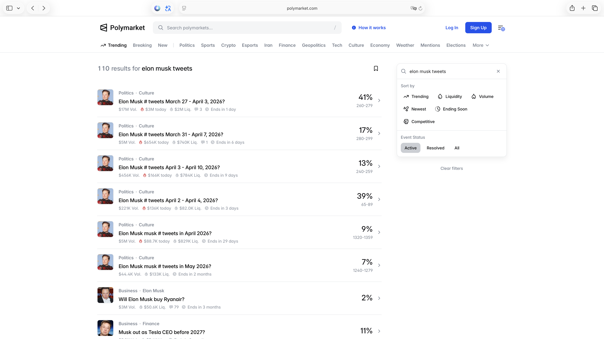
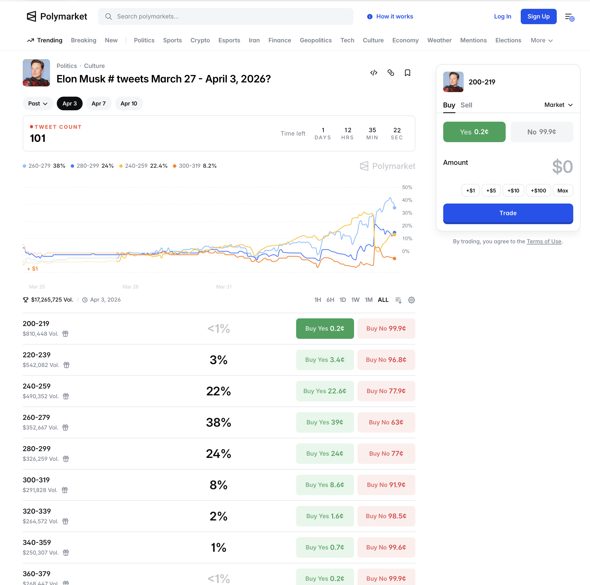
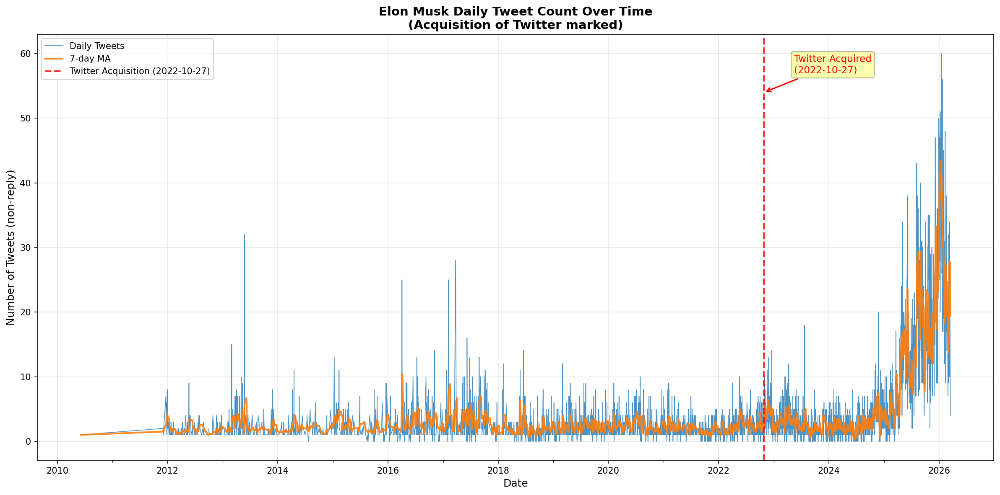
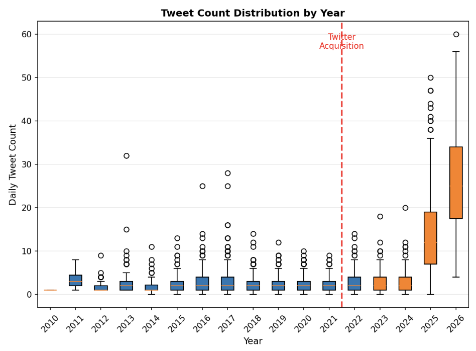
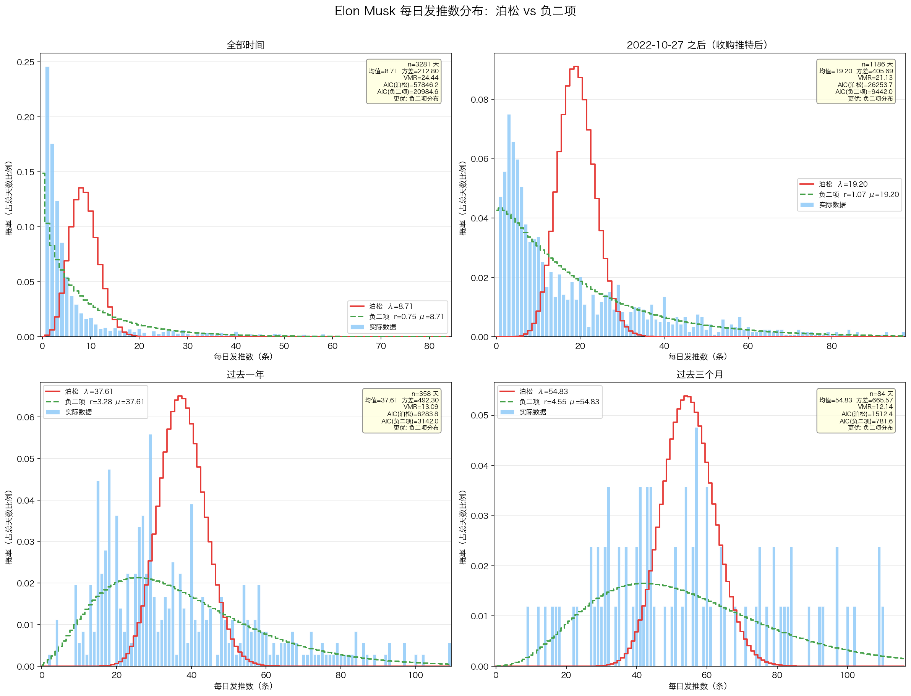
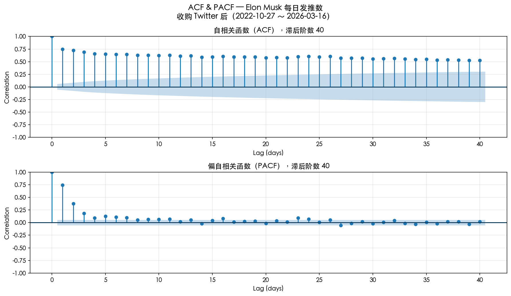
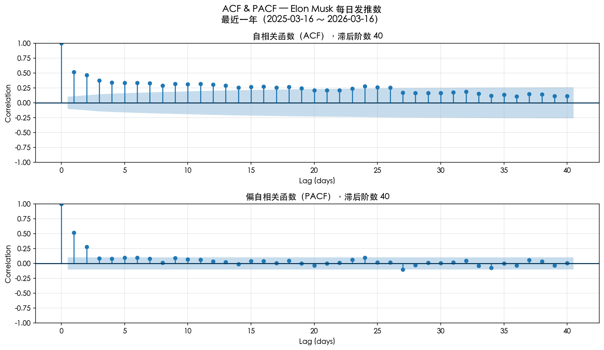
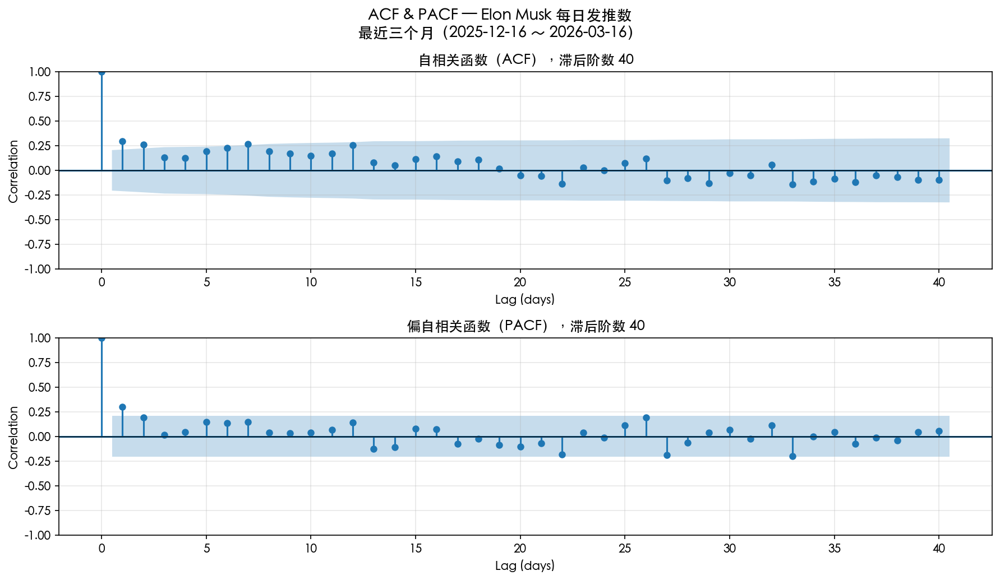
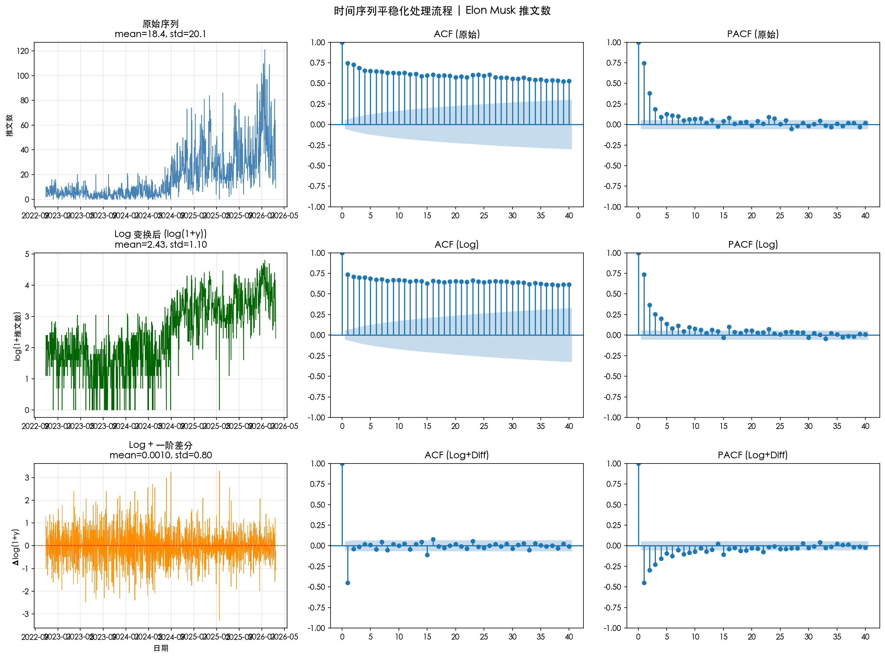

## 问题介绍
我们对该问题的研究兴趣起源于 Polymarket。

Polymarket 是一个没有传统庄家的对赌平台，赌注往往围绕着社会事件展开（比如“耶稣2026年会不会显灵？” / “Trump 今天会说多少次 CHINA？” / “今天湖人队会赢还是勇士队会赢？“）。对赌双方针对 事件发生的 YES / NO 进行下注，根据双方下注的资金量比例确定赔率。

在各种各样的事件中，有这样一类事件，我们认为可以用数学建模+量化的方法，从中赚钱。
我们的第一个尝试，便是预测 Elon Musk 的发推条数：

可以看到，同一时间内，同时有 6 个 Elon Musk Tweets 的相关事件在进行，事件周期以 月/ 3天 / 8天 等为单位。

每个周期有多个投注区间，每个区间都有 YES / NO，可以中期投注/卖出，每个事件的总投注资金量在1000万美刀左右。

## 问题定性分析
1、这是一个肥尾事件吗？这个市场是否具有肥尾风险？
如果是肥尾的，大数定律等统计工具都会失效。
Elon Musk Tweets 的波动很大，但人的精力是有限的，不可能发过于多条 tweets （除非有个团队帮他运营）。另外，由于市场机制类似于二元期权，亏损有限（盈利也有限），显然并非肥尾。

2、市场决断机制是否合理？
Polymarket 判断事件结果，大部份采用自动判断，比如使用 xtracker 持续跟踪 elon musk 的发推条数，在出现异议时采取投票机制，没有出现过事件决断不合理的情况。

3、什么样的算是 Tweets？
根据结算规则，出现在主页的quote/Tweet/retweet算是tweets，评论不算。

## 计划
建模过程主要为以下几步：
1、爬取数据
2、数学建模预测条数（预测的最终结果为各个区间的概率）
3、回测看预测本身准确性
4、根据各区间赔率以及多区间凯利公式进行各区间配比
5、回测看长期收益率

## 1、爬取数据
这一步花了我们一周多的时间。主要的阻碍是 X 严苛的反爬虫机制，以及“搜索黑洞”现象。

我们从 Kaggle 上获取了2010-06-04 至 2025-04-13 的数据，（有文本和每日条数）
从 xtracker 获取了 2025-11-03 至 2026-03-16 的数据，（仅有每日条数）
用 twscrape 获取了 2025-4-1 至2026-3-16的数据，这部分数据采取了 searchAPI + 3h时间窗口 + 分类型爬取 + LatestTab/TopTab 等方法爬取再哈希去重的方式，但与 xtracker 比对仍少爬了 30 %，多番尝试无法解决。

于是我们将这部分数据按照当天条数进行修正，用 xtracker作为权威基准，在重叠期计算缩放因子，不同类型事件分别按照比例进行修正。

```python
ratio = xtracker_total / twscrape_total
new_total = round(raw_count × scale_factor)

# 各类型按照比例分配
tweet_count_new   = round(tweet_count_old / raw_count × new_total)
quote_count_new   = round(quote_count_old / raw_count × new_total)
retweet_count_new = new_total - tweet_count_new - quote_count_new
```

## 2、数据分析

可以看到，收购 Twitter 之后，Elon Musk 的发推条数显著上升，在 2025 年到 2026 年更是节节攀升。（这里说明收购Twitter之后和2024年以后数据可能发生了显著的断层，所以后续处理时这是一个重要的选项（使用哪个周期的数据？or使用滚动数据？））


从分布的角度来说，Elon Musk 的 tweets 条数更符合**负二项分布**（一开始以为会更符合泊松分布一些，但是泊松分布要求方差 = 均值，这里过离散性显著存在。）


| 时间段                  | 天数   | 均值    | 方差     | VMR   | λ(泊松) | AIC(泊松) | r(负二项) | μ(负二项) | AIC(负二项) | LR χ²    | p值      | 更优模型      |
| -------------------- | ---- | ----- | ------ | ----- | ----- | ------- | ------ | ------ | -------- | -------- | ------- | --------- |
| 全部时间                 | 3281 | 8.71  | 212.80 | 24.44 | 8.71  | 57846.2 | 0.754  | 8.71   | 20984.6  | 36863.57 | < 0.001 | **负二项分布** |
| 2022-10-27 之后（收购推特后） | 1186 | 19.20 | 405.69 | 21.13 | 19.20 | 26253.7 | 1.075  | 19.20  | 9442.0   | 16813.73 | < 0.001 | **负二项分布** |
| 过去一年                 | 358  | 37.61 | 492.30 | 13.09 | 37.61 | 6283.8  | 3.277  | 37.61  | 3142.0   | 3143.83  | < 0.001 | **负二项分布** |
| 过去三个月                | 84   | 54.83 | 665.57 | 12.14 | 54.83 | 1512.4  | 4.552  | 54.83  | 781.6    | 732.79   | < 0.001 | **负二项分布** |

从**时序相关性**的角度
我们计算 ACF 和 PACF （ACF包含了中间滞后项的影响，PACF则消去了这些影响，仅考虑滞后 k 天与当前天的独立关系）
ACF：
$$\hat{\rho}_k = \frac{\hat{\gamma}_k}{\hat{\gamma}_0} = \frac{\sum_{t=k+1}^N (y_t - \bar{y})(y_{t-k} - \bar{y})}{\sum_{t=1}^N (y_t - \bar{y})^2}$$
PACF：
把 $y_t$ 对其过去 $k$ 个值做多元线性回归：
$$y_t = \phi_{k1} y_{t-1} + \phi_{k2} y_{t-2} + \dots + \phi_{kk} y_{t-k} + \epsilon_t$$
在这个回归方程中，最后一个系数 **$\phi_{kk}$** 就是滞后 $k$ 阶的偏自相关系数。因为它是在控制了前 $k-1$ 个滞后项的影响后，$y_{t-k}$ 对 $y_t$ 的边际效应。（实际运算中不需要跑回归，只需要通过ACF迭代求解即可）


我们分别考察 过去 3 个月，过去 1 年，收购 twitter 后这三个时间的 ACF 和 PACF，蓝色阴影以外是 95% 置信度区间。



可以看到有一定的时序相关性。

不过考虑到，Elon Musk 发tweets数有一个整体向上的趋势，其实直接使用 ACF 和 PACF 是不严谨的（因为滞后项会起到告诉现在处于哪个时段的作用，这并不能算一种相关性）。
于是做 Log变换+一阶差分+ADF检验

只有 log + 差分通过了 ADF 检验。

可能后续取 log+差分 后做 MA(1) 或者 取 log 后做 ARIMA(0, 1, 1) 比较好
（ARMA(6, 1)?)
## 3、具体建模

问题一：用什么来评估建模效果
这里不能直接拿最终市场的回测来评估，否则会出现 test set 和 validation set 混杂的问题。
由于我们预测的也是一个分布，使用 CRPS（Continuous Ranked Probability Score）进行评估。
$$CRPS(F, y) = \int_{-\infty}^{\infty} (F(x) - \mathbb{1}_{\{x \ge y\}})^2 dx$$

问题二：有不同周期的事件，怎么办？
这里有两种办法：1、蒙特卡洛 2、直接对齐周期
由于蒙特卡洛似乎会带来一些奇奇怪怪的数学问题（会导致低估方差之类的？），我们直接采用第二种方法。
但是第二种方法又会带来数据不足的问题（如果每30天取一个数据点，一年就只有12个数据点了）我们考虑重叠样本（每一天开始的周期算一个样本）
重叠样本所带来的破坏独立同分布等问题，使用 **Newey-West 修正 (HAC)** 进行解决。 

构造**特征向量**：
对任意日期 $d$，构造特征向量 $\mathbf{x}_d \in \mathbb{R}^{10}$：
$$
\mathbf{x}_d = \left[1, \underbrace{\mathbb{1}_{\text{dow}=0}, \ldots, \mathbb{1}_{\text{dow}=5}}_{\text{星期OHE}}, \sin\frac{2\pi m}{12}, \cos\frac{2\pi m}{12}, \mathbb{1}_{\text{weekend}}, \log(\text{EWMA}) \right]^\top
$$
除了星期，月份，是否为周末等经典日历性特征外，时序特征选择了 ARIMA(0, 1, 1)
```python
# ARIMA(0,1,1) 等价于 EWMA，α=0.3 对应约7天半衰期
_EWMA_ALPHA = 0.3

# log(y+1) 避免 log(0)，然后做指数平滑
df["log_y"] = np.log(df["y"] + 1)
df["log_ewma"] = df["log_y"].ewm(alpha=_EWMA_ALPHA, adjust=False).mean()
```
因为前面的时序相关性分析 ACF 衰减缓慢（差分非平稳），PACF 在滞后1阶后截断，符合 **I(1) 过程 + MA(1)** 特征。ARIMA(0,1,1) 等价于 EWMA。

**周期聚合**
对预测周期 $h$（天数），构造重叠滚动窗口目标：
$$
Y_i^{(h)} = \sum_{k=0}^{h-1} y_{t_i+k}
$$
相邻观测共享 $h-1$ 天数据（h是事件周期），产生 MA($h-1$) 序列相关（后续用 Newey-West 修正此处导致的破坏独立同分布的问题）。

**负二项回归设定**
$$
\begin{aligned}

Y^{(h)} &\sim \text{NegBinomial}(\mu, r) \\

\log \mu &= \mathbf{x}^\top \boldsymbol{\beta}

\end{aligned}
$$
这里我们使用 $log\mu$ ，是因为结果 $\mu$ 必须是个正值（实际预测时为$\mu = \exp(\mathbf{x}^\top \boldsymbol{\beta})$）

**PMF**（成功率参数化 $p = \frac{r}{r+\mu}$）：（这里就是将负二项分布的原始公式改写成带均值的形式）
$$
p(y \mid \mu, r) = \frac{\Gamma(r + y)}{\Gamma(r)\,\Gamma(y+1)} \left(\frac{r}{r+\mu}\right)^r \left(\frac{\mu}{r+\mu}\right)^y
$$

**EWMA相关细节：**
对周期 $h$，从固定窗口 `[2024-01-01, market_start-1]` 构造重叠样本：
```python
for i in range(n - h + 1):
# h 天聚合目标
Y_i = sum(y[t_i : t_i + h])
# 特征取窗口起始日的值（用已知预测未知）
X_i = features[t_i] # 包含 log EWMA
```

计算 EWMA 特征
```python
# 对每日数据计算 log(y+1) 的 EWMA
df["log_y"] = np.log(df["y"] + 1)
df["log_ewma"] = df["log_y"].ewm(alpha=0.3, adjust=False).mean()

# 训练时：取窗口起始日的 EWMA 值作为特征
X_i["log_ewma"] = df["log_ewma"][t_i]
```

然后我们取 PMF 的负对数
$$

\ell(y_i; \mu_i, r) = \log\Gamma(r+y_i) - \log\Gamma(r) - \log\Gamma(y_i+1) + r\log\frac{r}{r+\mu_i} + y_i\log\frac{\mu_i}{r+\mu_i}

$$
其中 $\mu_i = \exp(\mathbf{x}_i^\top \boldsymbol{\beta})$，$r = \exp(\rho)$（确保正值）。

然后最小化负对数并加上 L2 正则化
$$

\mathcal{L}(\boldsymbol{\beta}, \rho) = -\sum_{i=1}^{n} \ell(y_i; \mu_i, r) + \lambda \sum_{j=1}^{p} \beta_j^2

$$
- $\lambda = 10^{-3}$：L2 正则强度
- 求和不包含截距项 $\beta_0$
- 优化器：L-BFGS-B，max_iter=2000，$\beta_0$ 初始化为 $\log(\bar{y})$，$\rho$ 初始化为 $\log(2)$  

得到分布之后，我们将结果注入多区间凯利公式，算出各个区间的下注比例：

多结果 Kelly 的目标函数：
$$

G(\mathbf{f}) = \sum_{i \in \mathcal{E}} p_i \log\left(1 - \sum_{j \in \mathcal{E}} f_j + \frac{f_i}{C_i}\right) + \left(1 - \sum_{i \in \mathcal{E}} p_i\right) \log\left(1 - \sum_{j \in \mathcal{E}} f_j\right)

$$

| 符号    | 含义           | 来源            |
| ----- | ------------ | ------------- |
| $p_i$ | 区间 $i$ 的真实概率 | NB 模型预测       |
| $C_i$ | 区间 $i$ 的成本   | 市场价格 × (1+滑点) |
| $b_i$ | 赔率           | $1/C_i$       |
| $f_i$ | 资金分配比例       | Kelly 优化求解    |

**其中**：
- $\mathcal{E} = \{i : p_i / C_i > 1\}$：正期望值筛选（仅对模型认为被低估的区间下注）
- $1 - \sum f_j$：未下注资金的安全边际
- $f_i / C_i$：若区间 $i$ 胜出，返还的本金+利润
- 约束条件：$0 \leq f_i \leq 1, \quad \sum_{i} f_i \leq 0.5 \text{ (硬上限)}$

计算出全kelly $f_i^{\text{full}}$之后，由于 kelly 往往过于乐观，我们采用十分之一凯利。
$$
f_i = 0.1 \times f_i^{\text{full}}
$$
另外，由于真实市场中我们不一定能以市价买入，我们假设有 3% 的滑点（即买入价格比市价高 3%）

**总结**
其实上面这么一大堆，我们本质上就是在做广义线性模型的经典范式：
- 先进行点估计预测均值 $\hat{\mu} = \exp(\mathbf{x}^\top \hat{\boldsymbol{\beta}})$
- 然后套上负二项分布，来预测各个区间的概率。
	离散参数 $r$ 由全局数据（24年以后）静态算出，均值 $\mu$ 由上面的广义线性模型动态算出。
- 然后我们拿着各个区间的概率，去和市场给出的赔率作对比，然后送入多区间 Kelly 公式，计算正 EV 部分的下注比例。

## 4、回测评估
回测评估主要看几个指标：
1、sharpe值
2、NAV - Net Asset Value（净资产价值）（初始值设置为1）
3、Edge，模型对最终正确区间概率的预测与事件开始时市场对正确区间概率预测（原始价格）的差值。

我们对比了不同特征配置在固定窗口（2024-01-01+）下的表现：

| 分支           | 特征配置               | NAV       | Sharpe(NW) | 2d NAV   | 3d NAV   | 8d NAV   |
| ------------ | ------------------ | --------- | ---------- | -------- | -------- | -------- |
| baseline     | 仅日历特征              | 0.076     | -0.56      | **1.02** | **2.05** | 0.04     |
| t-norm       | + 时间趋势             | 0.020     | -0.61      | 0.84     | 0.33     | 0.09     |
| **log-ewma** | **+ ARIMA(0,1,1)** | **0.569** | **-0.19**  | 0.69     | **0.72** | **1.37** |
| arma-6-1     | ARMA(6,1) 替代       | 0.576     | -0.19      | 0.62     | 0.74     | **1.50** |
可以看到，如果仅依赖日历特征，模型在 2day 和 3day 窗口的表现比较好，如果加上时序特征，在8d 窗口表现较好。（但其实对于量化模型来说都不算太好）由于 8d 窗口事件占了绝大多数，所以特征选取上还是应该引入时序特征。

另外滑动窗口训练我们也有尝试过，效果很烂。

从Edge的角度来说：

| 指标                    | 含义                                     |
| --------------------- | -------------------------------------- |
| **正 Edge 比例** (21.5%) | 模型比市场更准的事件占比                           |
| **平均 Edge** (-11.9%)  | 整体上市场对正确区间的概率分配比模型更准                   |
| **按周期分解**             | 2d: -35% (极差) / 3d: -8.6% / 8d: -10.3% |
之所以模型还能赢钱，是因为 Kelly 选择性下注使得资金集中于"模型确信且市场低估"的非对称机会。

最优配置（log-ewma 分支）详细结果

| duration | h_model | N      | NAV       | WinRate | Sharpe(NW) | Mean Edge |
| -------- | ------- | ------ | --------- | ------- | ---------- | --------- |
| 2d       | 2d      | 14     | 0.694     | 0%      | -9.48      | -33.5%    |
| **3d**   | **3d**  | **30** | **0.717** | **30%** | **-1.48**  | **-4.5%** |
| 8d       | 8d      | 128    | **1.375** | 21%     | +0.11      | -11.9%    |
（这sharpe也太小了）

另外，或许值得一提的是，我们曾经错误地将 h = 7d 的建模成果，用于预测 h = 10d 的市场，在这组细分事件中获得了 0.84 的 sharpe。

## 5、可能的问题

Elon Musk 发推的热情可能是事件驱动的，比如和 Tesla, Grok, spaceX相关的事件可能会促进其发推。当前建模未引入相关特征。这是因为实际处理起来，该部分数据较难实时获取（本来是想爬 Google Trend的，但是它实时封禁高频访问的 ip，且对爬取极为敏感，实际操作起来较为困难，而体验api又一直申请不下来）。

该市场有充斥着量化大牛的可能，因为该市场满足高频、数据丰富等特征。