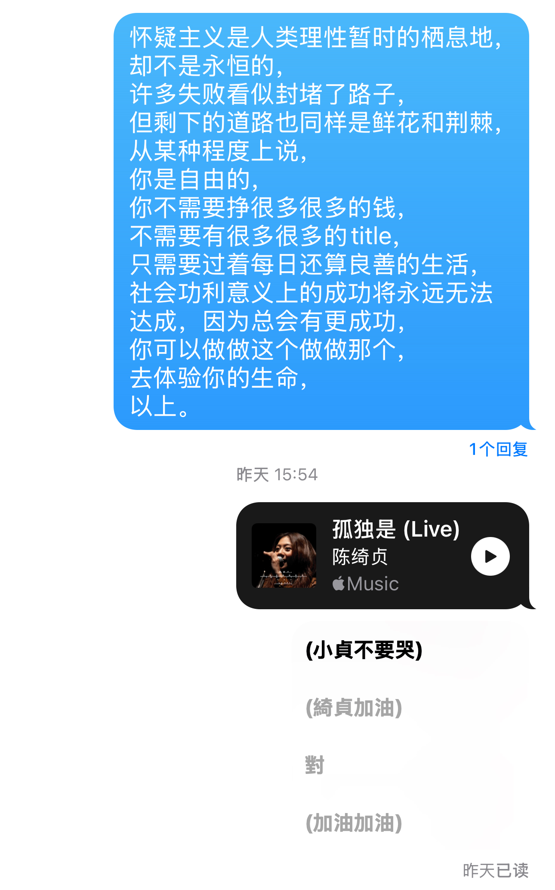
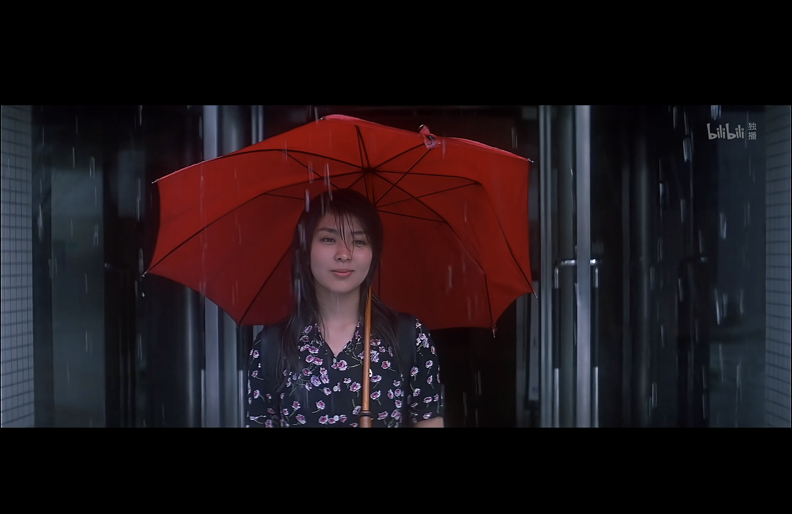

最近想必是生了点什么情绪病的
每天早上起来
第一个念头就是

生活没有希望
未来没有盼头

不知道今天要干嘛
似乎一切都没有意义

每天天气都好烂
世界有种抑郁的灰底色

当然这一切有理性语言的版本
AI 让 Coding 没有护城河
忍不住用 vibe coding 实现一切
但又似乎什么也学不到
科研似乎是AI无法替代的
但失败失败失败
鬼知道会不会有成功的一天
……

情绪好的时候，还是给情绪差时多留点糖
不然天黑时翻看自己的博客
岂不是一切都更灰暗了？

时间于2026年4月24日晚上7点12分漫步在教室上方的电子钟
雨滴淅淅下落
下落不明
每日使用的电脑键盘
竟已脏得不成样子
好久没给世界拍个满意的照片
因为相机不在手边
耳机也缺了一只
音乐总会掺入心情的味道

被圣母无原罪天主教堂的老婆婆赶出去
嘴里还振振有词：
“这还蛮符合天主教义的，
Justice 而不是 Mercy”

幸福是安然坐在书桌前
心里没有远方
幸福是迷信自己在做对的事情
哪怕没有“正确”
幸福是平和地接受失败
因为事情的失败不是人的失败
幸福是不需要追寻意义
因为一切都有意义

