%%由于上课时并没有做此份总结，所以下面的总结是对当时各种笔记内容的杂糅，可能会有些混乱%%

## 博弈论导学
初步了解和建立模型用《策略 博弈论导论》
数学方面证明用《博弈论基础》
## 博弈论框架
>四种类型的博弈及其对应的四个均衡概念：
	完全信息静态博弈——纳什均衡
	完全信息动态博弈——子博弈精炼纳什均衡
	不完全信息静态博弈——贝叶斯纳什均衡
	不完全信息动态博弈——精炼贝叶斯纳什均衡
四个均衡概念逐渐强化
## 完全信息静态博弈
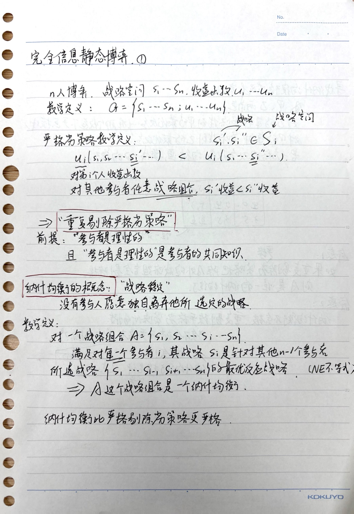
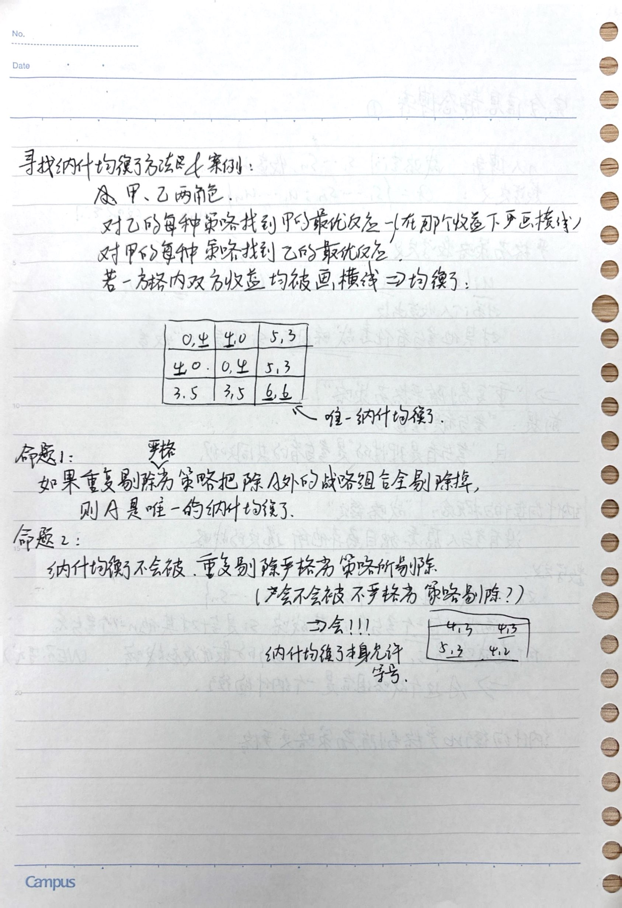
## 完全且完美的信息动态博弈——子博弈完美纳什均衡
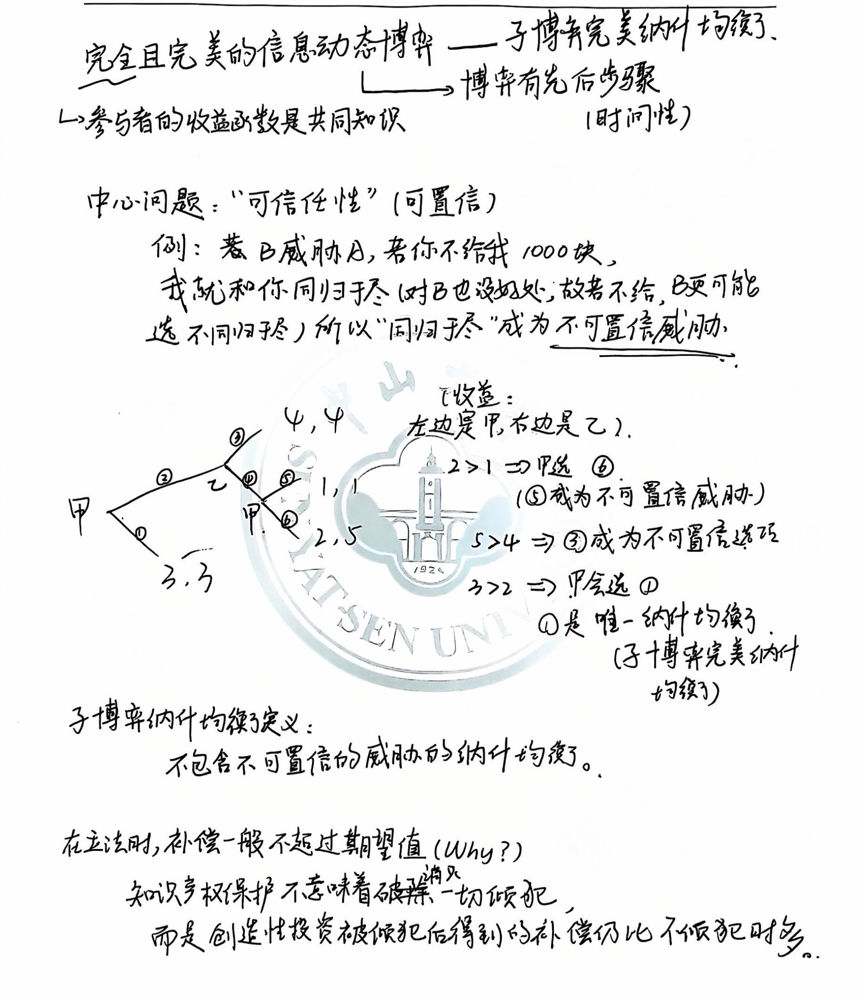

惩罚也不能过度
	比如如果抢劫就死刑，那抢劫犯就更可能会采取更严重的措施，把被抢劫者杀了，因为抢劫并杀人，“死人不说话”，被抓概率反而变小。
所以在这种情况下，如果杀人，抢劫犯的收益反而提升了。

当然，古代俄国的整体犯罪会降低（因为犯罪就死刑），但是一犯罪就是杀人。

（过度的惩罚导致犯罪升级）

激励可行和技术可行都很重要。

为什么会有“不理想的立法”？
因为理想的立法需要理想的执法者、司法者，此时理想的立法反而出现问题。

为什么自主招生取消？
	自主招生选拔人才更合理，但是选人的大学老师不一定按照这个标准来选。

## 严格劣策略的重复剔除法及其应用模型
定位模型
合伙人模型

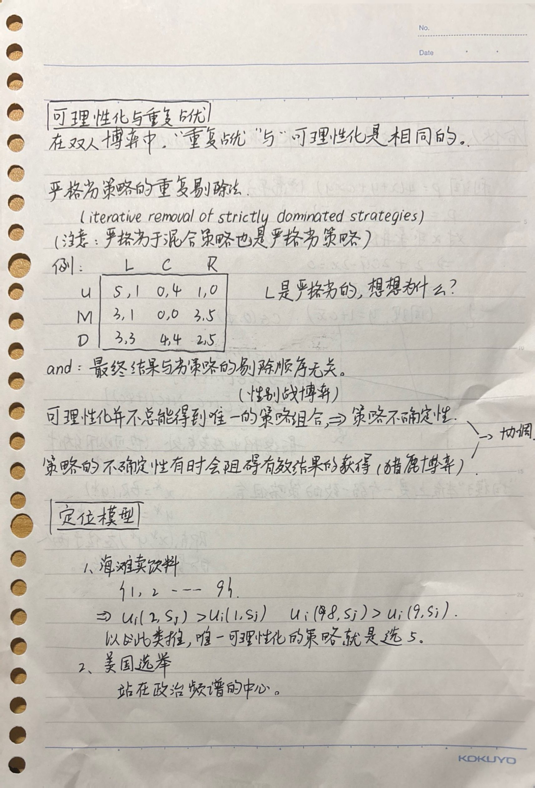
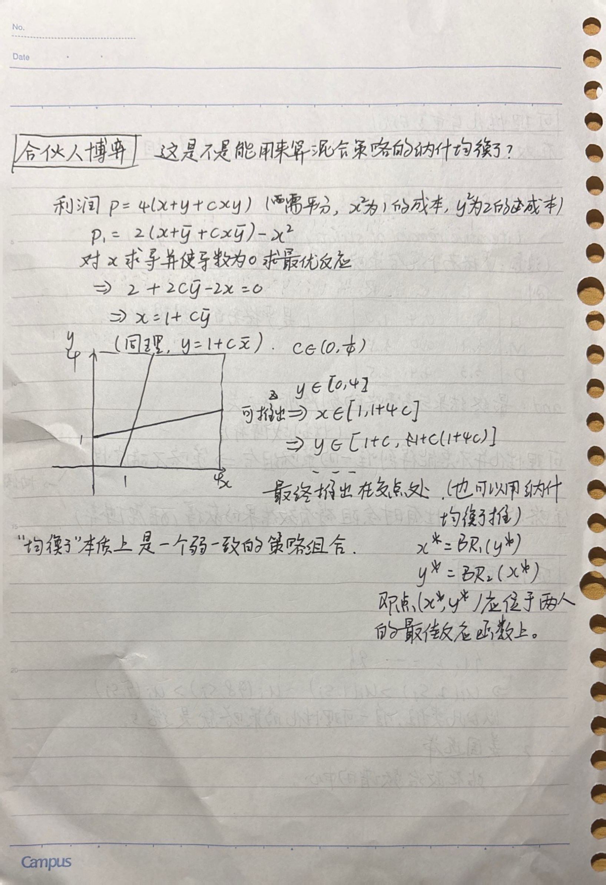

## 混合策略纳什均衡 子博弈完美均衡
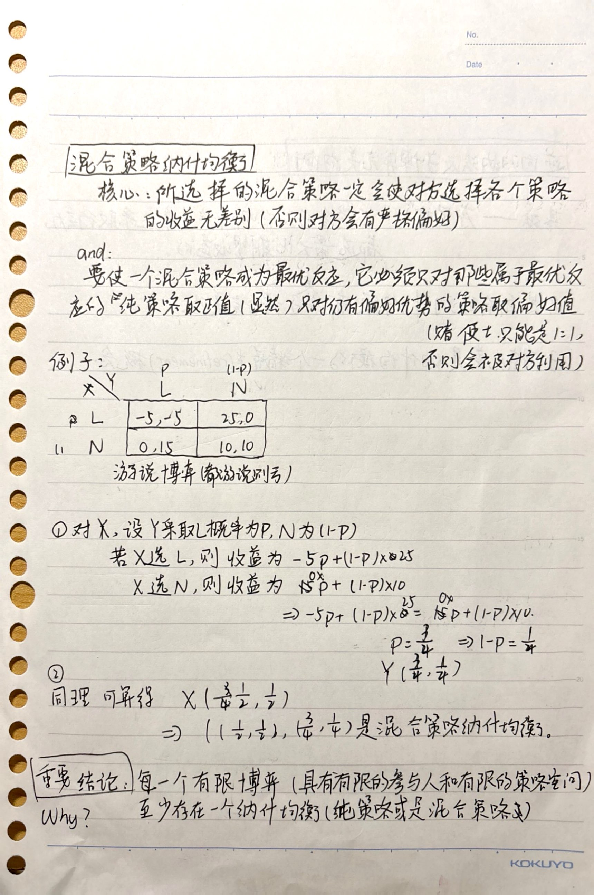

## 博弈论相关问题总结（非博弈论核心问题）
1、人们的效用函数很多时候**不只取决于自己的得到了多少，还取决于和别人差了多少。**

2、伯努利期望效应（边际效用递减）

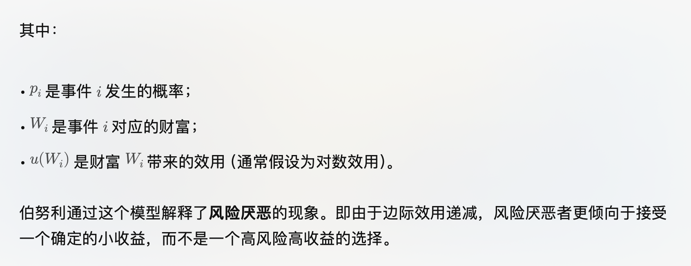
在博弈当中，弱侧越厉害，用到弱侧的概率就越小

### 胜者通吃的比赛中，胜者会照搬弱者的比赛策略
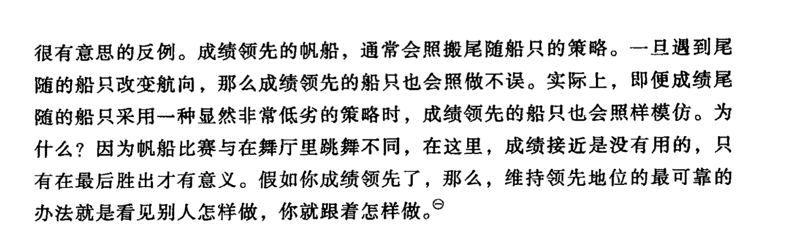
（这是从“关于公平正义”复制过来的。
## 关于人类社会组织和制度的一般框架（Lecture 1）
社会科学：
	社会学 政治学 法学 经济学

社会组织的三个问题：
	实然：社会是如何运行的
	应然：什么结果是合理的
	制度：选择相应的规则实现之

所有社会组织的核心问题是激励制度及其稳定性与适应性
（激励制度包括惩戒制度吗

社会科学很大程度上是分析人们的行为是如何做出的，以及对这些行为的结果作出合理的评价，然后制定合理的激励制度，从而尽量实现美好的愿望

通往地狱的道路是由善意铺就的（马克思、哈耶克

一个良好的制度要么是演化出来的，要么是人们对过去的经验总结出来的
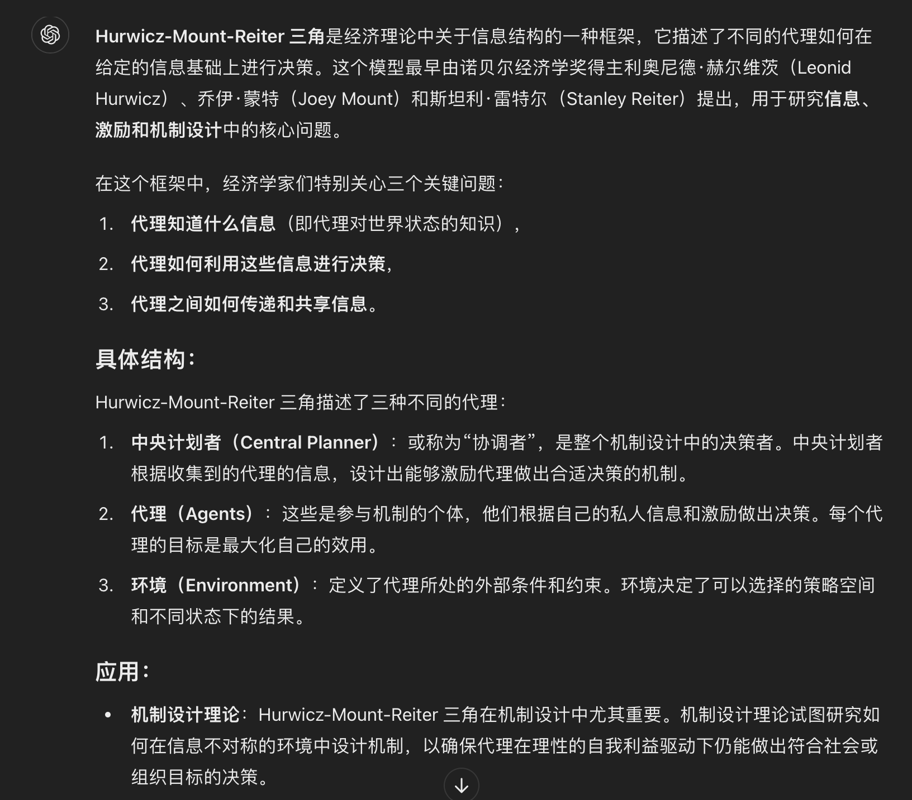
机制设计理论试图研究如何在信息不对称的环境中设计机制，以确保代理在理性的自我利益驱动下仍能做出符合社会或组织目标的决策。

**激励相容性**（Incentive Compatibility）是机制设计中的一个核心概念，指的是在一个给定的机制或规则框架下，每个参与者的最优策略就是如实透露其私人信息或遵守规则，从而使得其个人利益最大化。换句话说，参与者在机制中不会通过撒谎或违背规则来获得更大的好处。

<b>博弈的基本特征</b>
<b>群体性（group）：我们生活在二人以上的世界里</b>
<b>互动性（interdependence）：事情的最终结果取决于所有人的行动</b>
**策略性（strategic）：每个人都认识到并考虑到这种相互依赖性**
**理性（rationality）：每个人选择行动时要针对对手的可能行动而选择一个最优对策**

例子
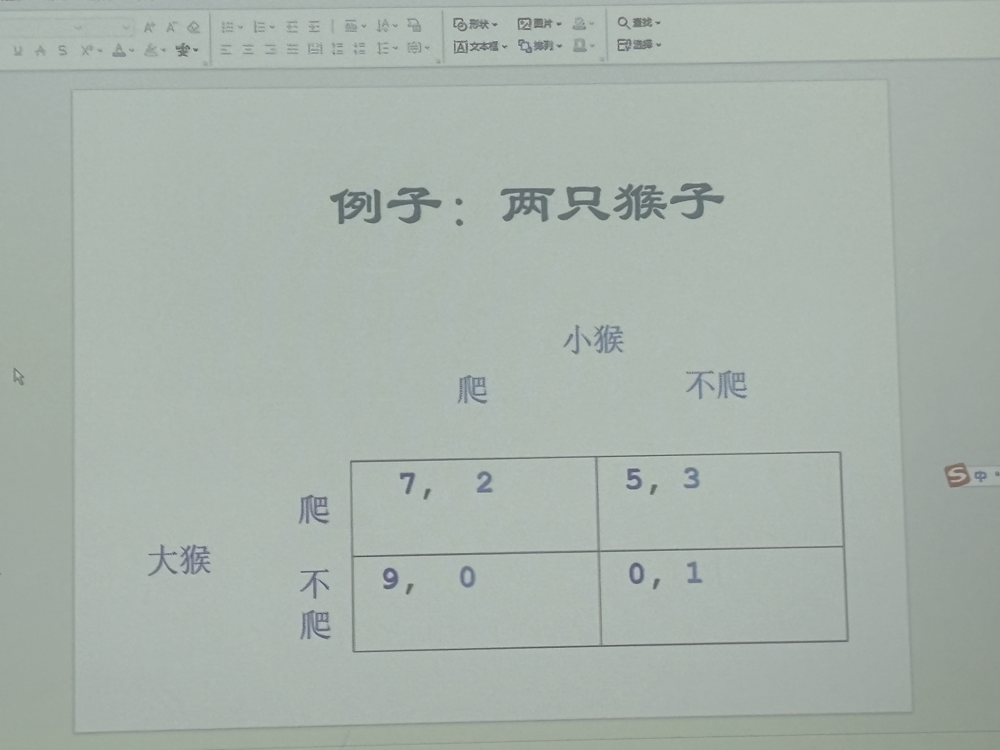
根据Dominant Strategy（优势理论）
	小猴子无论对手爬不爬，自己都是不爬好
**而对大猴子来说，爬的平均比不爬的平均好。**
**形成纳什均衡**

![[IMG-20251203152044746.png]]
急功近利的家伙在没有法律的情况下，自利，互损
两人都不偷是技术上可行的，但激励上不可行。

## 《选择理论》
选择是深思熟虑欲望

大纲
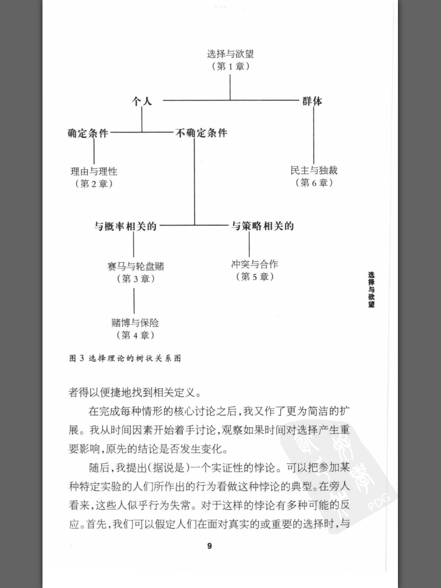

选择理论可以解释为对何为理性所做的讨论
也可以解释为对人们行为的描述
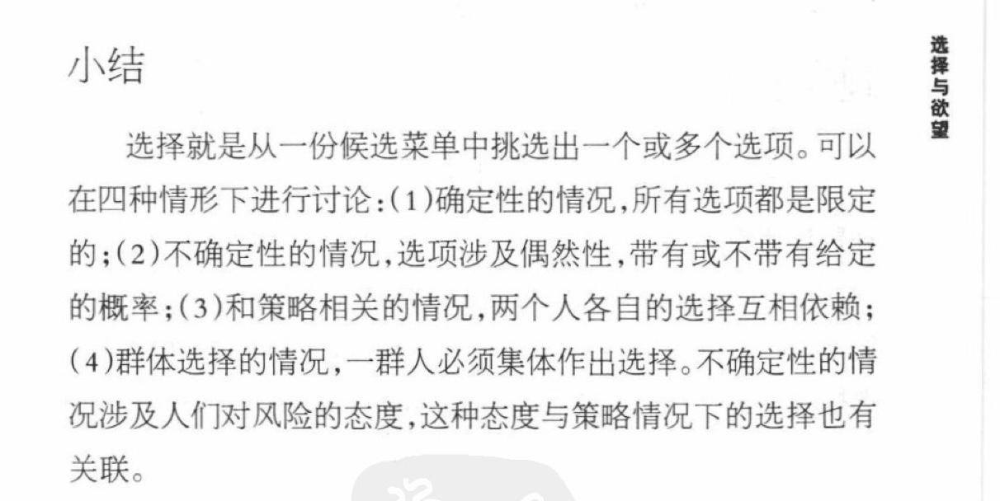

合理选择——理性选择
1）缩约条件（多选少更选）

2）扩展条件（都强就最强）

其实缩约条件是扩展条件的方向？不占优势的选项就是无关选项
3）显性条件（我强你不单赢）

理性选择的过程就是能满足显性选择选择的过程

几种策略选择
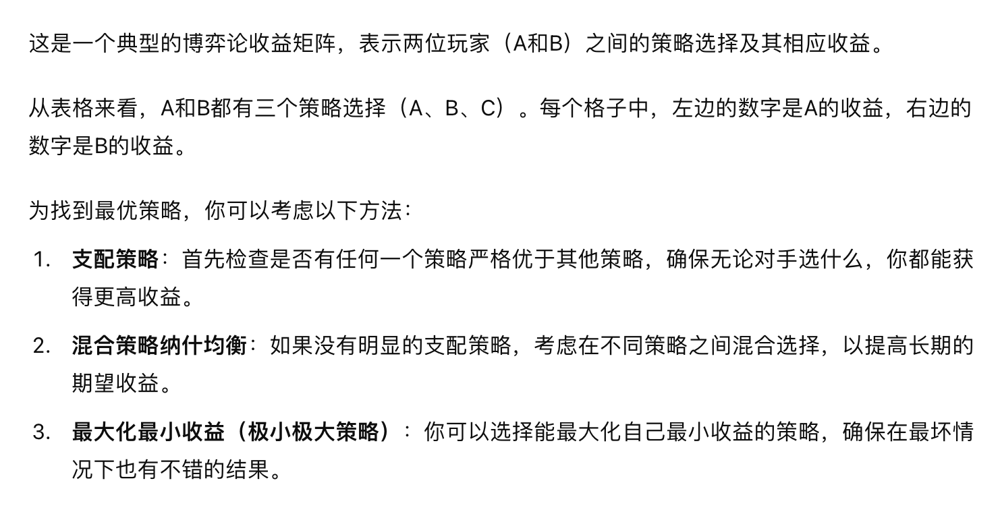
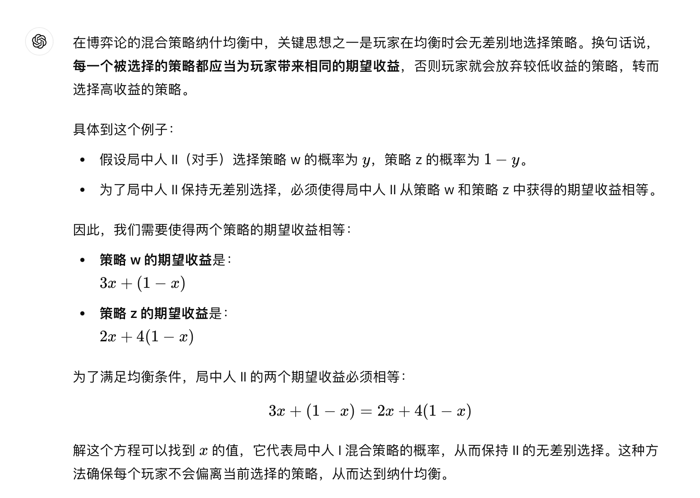
偏好序列是一种特殊的偏好关系，又被称为传递性

## 偏好关系与理性Ass悖论（Lecture 2）
偏好关系
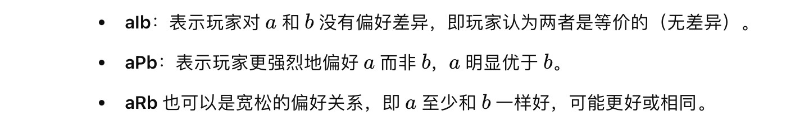

aPb就是aRb 且非bRa（剔除相等情况）

罗素悖论：“我什么都不选”，那“我什么都不选”是不是一种选择？

aRb a不差于b
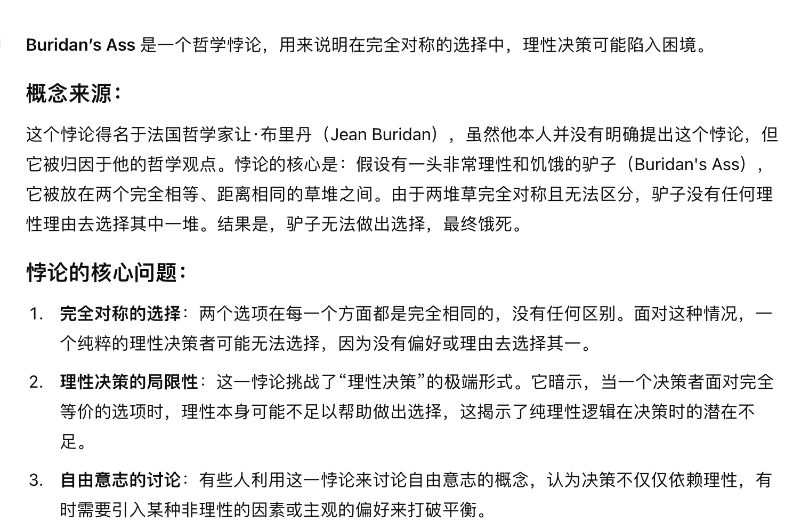

## 至尊集（Lecture 3）
使至尊集存在的三个关系条件：
传递性（最强）（R
准传递性（稍弱）（P
非循环性

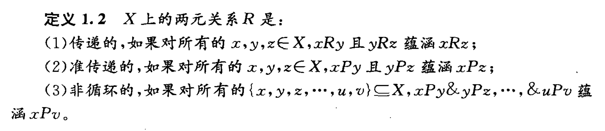

<b>至尊集</b>
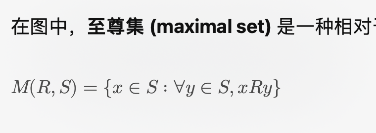
至尊集意味着至少是最好的那一群（如果偏好是选好的而不是选坏的）

同等地位！=至尊集
反例：（违背了非循环性

![[IMG-20251203152045223.png]]
违背了非循环性会导致什么呢？
成为别人的money pump（不具有稳定性）

传递性可以推出准传递性，但是准传递性不一定能推出传递性
（反例）
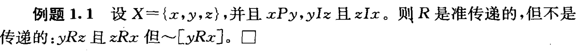

关于理性a
![[IMG-20251203152045300.png]]
揭示出来的偏好关系不一定能理性化

Gamma性质（扩展条件）和Alpha性质（缩约条件）还有Beta性质（不是显性条件（一致性条件））
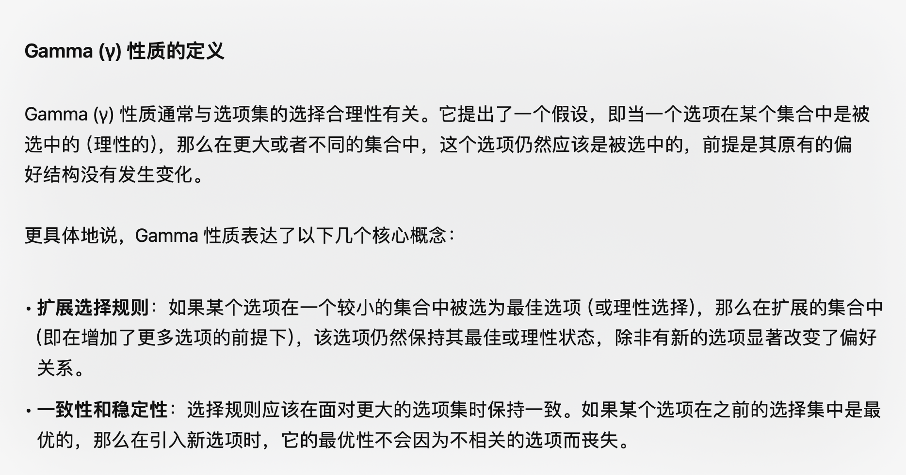
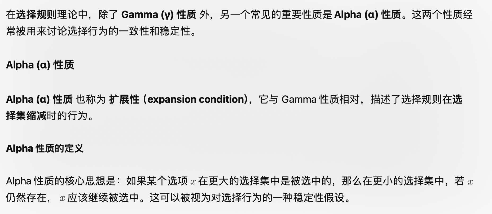
![[IMG-20251203152045430.png]]
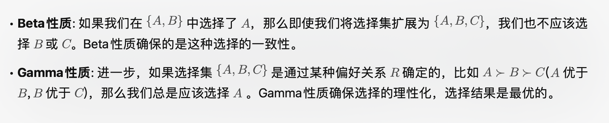
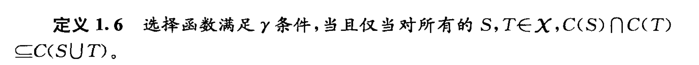

三者的关系
**Gamma性质 > Alpha性质 > Beta性质**。

可协调性（Reconsilability）
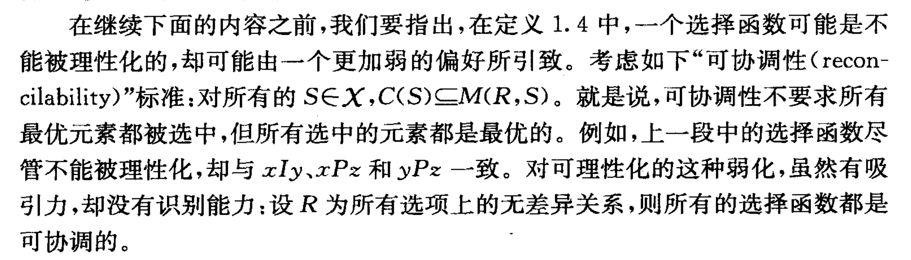

（即我选了一部份最好的，但是这部分最好的和其他一样最好的为什么分开没有理由）

Path Independence（路径独立性）
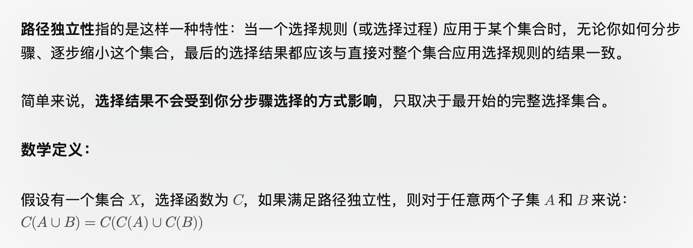
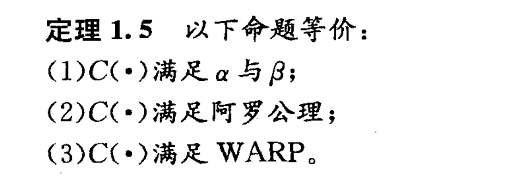

## 纳什均衡与帕雷托最优（Lecture 4）
•**纳什均衡**：每个玩家选择了最优策略，且在其他人不改变策略的情况下，任何人都无法通过单方面改变策略获得更高的收益。
•**帕雷托最优**：整体的资源分配达到了最有效的状态，无法进行改进而不损害他人。

帕雷托最优的经典例子：
	一共有100块，我拿了10块，你拿了80块，这并不是最优
	但如果你再拿10块，那我们整体的收益就是100块，就没有办法再改进了，这就是最优了

效用函数
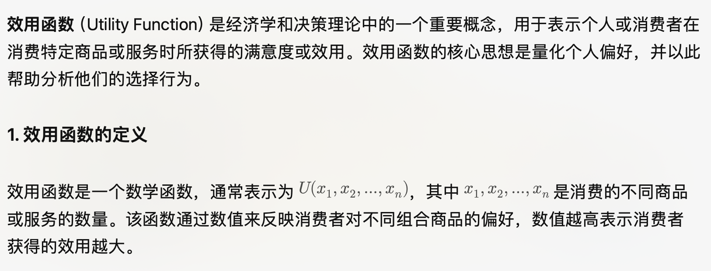

（博弈论中默认效用函数存在并已提供）

要看出异中只同，也要看出同中之异
好的理论本身是同的，理论的应用是异的

拔一毛而利天下不为也（杨朱）

无差异曲线和无差异曲线的特性

![[IMG-20251203152045707.png]]

特性：
	1、无差异曲线一般不相交
	2、无差异曲线一般单调下降（取一个商品一般意味着舍另一个商品）
	3、越上方的曲线越满足帕雷托标准

## 关于公平正义
### 帕雷托优超：
	就是有人变好，且没有人变差。
	如果可以进一步进行帕雷托优超，则当前状态并非帕累托最优（Pareto optimal）。

感觉哪怕是严格意义的帕雷托优超，在社会中也不一定能发生（我们真的愿意看到别人更富而自己没变化吗）

一些能够实现帕雷托优化的例子：
1、在经典的**囚徒困境**中，双方均选择“背叛”时会达到一个纳什均衡（Nash equilibrium），但这个均衡并非帕累托最优。
帕雷托优超的分析：将“双方背叛”调整为“双方合作”是帕雷托优超，因为两方都收益更高。

### 罗尔斯平均主义
	罗尔斯的平均主义并不追求**绝对的平等**，而是通过社会制度设计来实现**公平的分配原则**。
	**1. 正义的两个原则**
	**第一原则（平等自由原则）**：每个人拥有平等的基本权利和自由，例如言论自由、宗教信仰自由和政治参与的权利。这些权利必须得到最大程度的保障，并且**不得因社会或经济差异而被削弱。**（就是说再怎么提高社会效率，也不能损害基本权利）
	**第二原则（机会平等与差别原则）**：	
**机会平等**：每个人在追求社会职位和资源时，应有平等的机会，不能因为出身、性别、种族（这些因素是无法改变的）等因素而受到限制。	
**差别原则**：允许社会和经济的不平等，但这**种不平等必须以改善最弱势群体（最少受益者）的状况为前提。**

**实际应用：**
<b>1、税收制度</b>：累进税制是罗尔斯思想的典型应用，向富人征收更高税款，用于改善贫困群体的福利。
**2、公共医疗体系**：为低收入人群提供免费的基本医疗服务。

### 海瑞判疑案
窃谓凡讼之可疑者……与其屈**贫民**，宁屈**富民**；与其屈**愚直**，宁屈**刁顽**……”

## 谈判理论
双人交易，两种物品。
![[IMG-20251203152045798.png]]

其中的关键点：
1、无差异曲线
边际替代率（更愿意放弃已拥有多数量的商品）

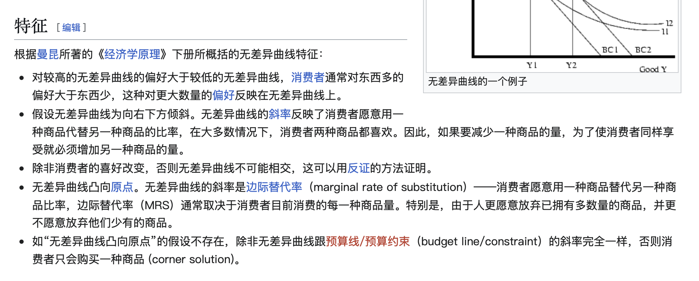

可以注意到一点，就是这两条曲线可能有很多种相切的方式，那么在哪个点相切呢？考虑有一个外部世界的价格系统，双方更趋向于在这个斜率的切线处相切。
2、

### 分歧点

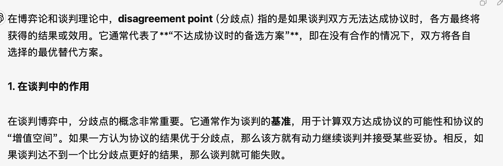

### 纳什谈判解

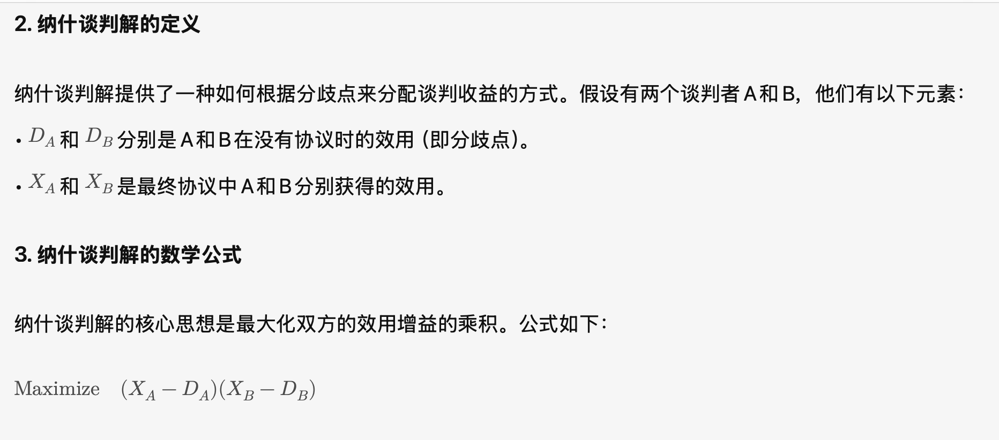

哈哈，要是我去协调谈判，我就提出这个观点。（要达成帕雷托最优）

纳什谈判解的重要性质

![[IMG-20251203152045949.png]]

对称性：若分歧点相同且其他条件也相同，则协议效用相同，则最终的收益比例相同

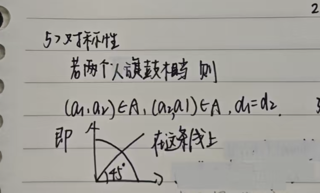

注意力集中：可以发现，**nash谈判解的结果和罗尔斯平均主义的不一样。**

因为在nash谈判解中，一方的**分歧点（即替代方案）越好，其能收获的谈判解就越好**。往往是更强的那一方有着更好的替代方案
（外卖平台和外卖小哥之间就是这个情况）

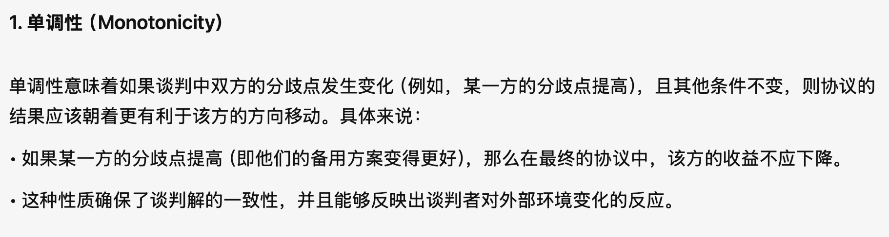

人们的效用函数很多时候**不只取决于自己的得到了多少，还取决于和别人差了多少。**
这对博弈论当中的逆向递推方法提出了挑战。

### 折扣因子
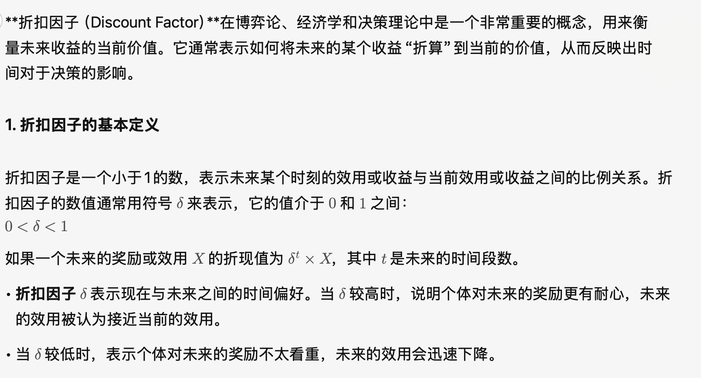
## 《妙趣横生博弈论》
### 博弈论简介

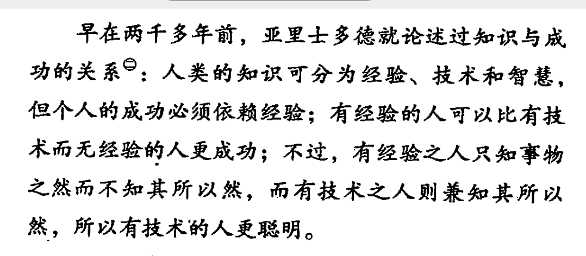

博弈论不应被理解成你死我活的权谋术，而是有效展开竞争和合作的大智慧

### 伯努利期望效应（边际效用递减）

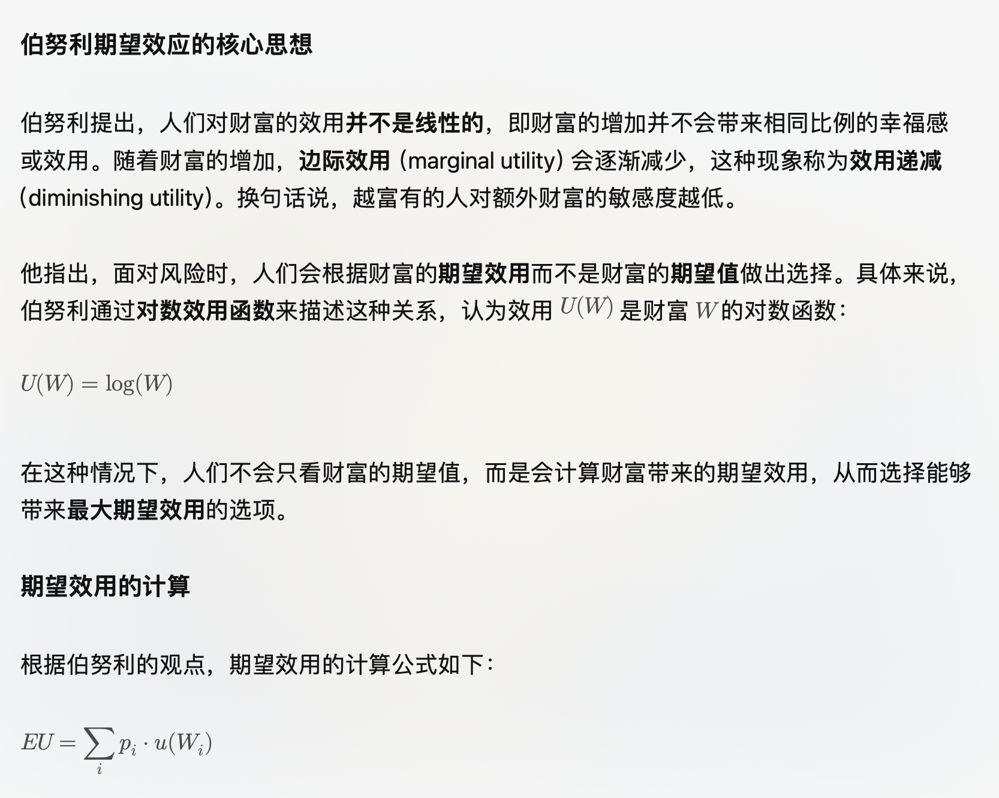

在博弈当中，弱侧越厉害，用到弱侧的概率就越小

### 胜者通吃的比赛中，胜者会照搬弱者的比赛策略

### 你可能以为有更多的选择总是一件好事情。但在策略思维里， 去掉一些选择往往能让你做得更好。

每个人都按照自己的利益来行动，结果对集体来说却是灾难性的。囚徒困境可能是博弈论中最广为人知且最令人棘手的博弈。我们没有理由指望博 的结果一定对参与者或社会有利。<u>正确地参与博弈可能远远不够 —你还必须确定你参与的博弈是正确的。</u>

### <u>在法律执行当中，采取随机地检查效果可能更好。</u>
假如国税局的审计准则在一定程度上是模糊而笼统的，那么，大家都会有 一点面临审计的风险，人们也就会更加倾向于保持诚实。

### <u>零和博弈中，他们愿意和你交易，意味着他们自认为比你聪明。</u>
下面这个例子好好：在扑克牌游戏中，当有人增加赌注时，玩家们就开始在这种矛盾中挣扎。 如果 一个玩家只在牌好时投注，其他的玩家很快就会发现。当他增加赌注时， 其他大多数玩家的反应都是弃牌，这样，他永远也赢不了大的。那些跟在后面 加注的人，通常牌会更好，所以，我们可怜的玩家最后却变成大输家。为了让 其他人投注，你必须让他们觉得你是在虚张声势。为了令他们相信这种可能 性，适当地频繁下注会很有帮助，这样他们会认为你有时只是在虚张声势。这 会导致一个有趣的困境。你希望你在虚张声势时他们弃牌，这样牌不好时也能 赢。但这不会让你赢得很多。要让他们相信你，跟着你加注，你还需要让他们 知道你确实是在虚张声势。

### 在策略性思考时，你必须竭尽全力去了解博弈中所有其他参与者 的想法及其相互影响，包括那些可能保持沉默的参与者在内。

下面这个案例是我所讲过的**蒙答案的策略**当中最科学的一个：
	核心原理是：
1、出题者希望错误的答案能误导到考生（所以正确的答案不会差的太远）
2、不会的考生不能用错误的思路得出答案

核心原理：
案例讨论
这些答案中较为奇怪的是c 选项。因为它与其他答案如此不同，所以它可能是 错误的答案。单位是平方英寸，这表明正确答案中有一个完全平方数，例如4T 和16万。 这是一个很好的开始，并且是一种很好的应试技巧。但我们还没有真正开始运 用博弈论。假设出题的这个人参与了这个博弈，这个人的目的是什么呢? 他希望，理解这个问题的那些人能够答对，而不理解这个问题的那些人答错。 因此，错误的答案必须要小心设计，以迷惑那些真正不知道正确答案的人。例如， 当遇到“ 一英里9等于多少英尺9?” 的问题时，“16T” 的答案不可能引起任何考 生的关注。
反过来，假设16 平方英寸确实是正确的答案。什么问题的正确答案是16 平方 英寸，但又会使有些人认为32m是正确答案?这样的问题并不多。通常，没有人 会为了好玩而把T加到答案中。就像没有人会说:“你看到我的新车了吗— 1加 仑油可以走10T 英里。”，我们也认沟不会。因此，我们确实可以把16 从正确答案 中排除。
现在，我们再回过来看看4T 和16T 这两个完全平方数。暂且假设16T 平方英 寸是正确答案。那问题就有可能是“半径为4的園的面积是多少?” 正确的圆的面 积公式是m 。但是，不太记得这个公式的人很可能会把它与圆的周长公式2Tr 混 淆。(是的 ，我们知道，周长的单位是英寸®，不是平方英寸，但犯错误的人未必 能意识到这个问题。)
注意，如果半径r =4，那么2Tr 就是8T，这样的话，考生就会得出错误的答 案即b 选项了。这个考生也有可能混淆后又重新配成公式2TP ，从而得出32T 或 者e 选项为正确答案。他也有可能漏掉T，结果得出C选项;或者他可能忘记将半 径平方，简单地把TT用做面积公式，结果得出a 选项。总之，如果16T 是正确答 案，我们就可以找到 一个使所有答案都有可能被选的合理的题目。对出题者而言， 它们都是很好的错误答案。
如 果 4 T 是 正 确 答 案 (那 么 r = 2 ) 又 会 怎 么 样 ? 现 在 ， 想 想 最 常 见 的 错 误 — 把周长和面积混淆。如果学生用了错误公式2TT，他仍然能得到4T ，虽然单位不 正确。在出题者看来，没有什么事情比允许考生用错误的推算得到正确的答案更糟糕了。因此，4T 是一个很糟糕的正确答案，因为它会令太多不知所为的人得 满分。
至此，我们分析完了。我们信心 十足地认为正确答案是16T。而且我们是正确 的。通过揣摩出題者的目的，我们可以推断出正确的答案，甚至常常不用看題目。 现在，我们并不是建议你在参加GMAT 或其他考试时为了省事甚至连題目都不 看。我们认为，如果你聪明到足以了解这一逻辑，那么，你很可能也知道圓面积 的公式。但是你却一直都不知道这个公式。有时候还会出现一些这样的情况 :你
不明白其中一个答案的意思，或者这个问题的知识点不在你的课程范围内。当你 遇到这些情况时，回想一下这个考试博弈可能有助于你得出正确答案。

### “贫穷的终结”居然在经济上是可行的

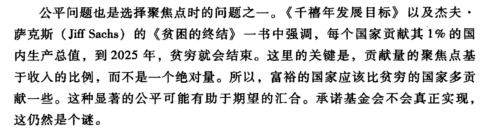