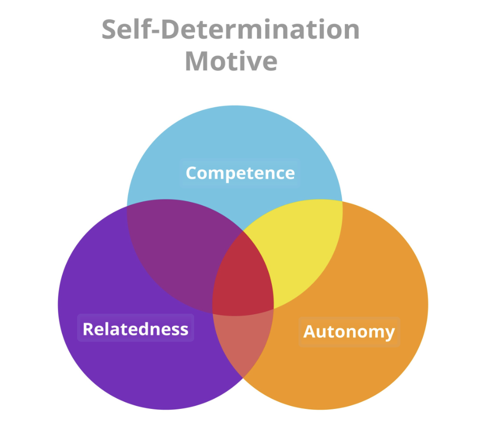

“好解释”这一概念，出自戴维·多伊奇(*David Deutsch*)的《无穷的开始》(The Beginning of Infinity: Explanations that Transform the World)。

他说，**什么是好解释呢？**
只要具有以下两个特征：
- **难以改变**（刚性）
- **具有超出问题本身的解释力**（延展性）

举一个短例：
关于“为什么会有春夏秋冬”这一问题，
如果我们将其解释为：冥界之神绑架了农业女神的女儿，女神悲伤时大地枯萎（冬），女儿归来时女神喜悦（春）。那么我们把神话改成：“女儿去度假了”，仍然也说得通，缺乏“刚性”，可以随意修改。
但如果我们解释为：地球自转轴相对于公转面倾斜了约 23.5 度。那我们就拥有了刚性，不能是0度（那样就没有季节）也不能是90度（永昼永夜）。并且我们还可以预测，北半球夏天时南半球是冬天（延展性）。

**理论往往来源于猜想，而知识是不断随批评而改进的猜想**。我们可以借用“好解释”的标准，来判断一个猜想/理论是好是坏。

现在，我们将这一标准，应用于几乎无法被实验验证的“伪科学”：心理学。（波普尔认为，科学理论需要有较高的“可证伪度”，所以某种意义上，心理学也是科学，因为我们可以通过分析大量的实例来证伪理论）

我们来探讨心理学中的一个核心命题：人有哪些需求？这些需求之间有什么关系？

最经典的理论当然是**马斯洛需求层次理论**，马斯洛认为人的需求从低到高分为五个核心层级，只有低层级需求受到保障性满足，人才会追逐高层级需求：
- 生理需求（呼吸、吃喝拉撒、保暖、性）
- 安全需求（人身安全、就业保障）
- 社会需求（爱、社群、友谊）
- 尊重需求（自我认可、他人尊重）
- 自我实现需求（实现自我潜能，实现社会价值）

乍一看很有道理，但问题也很明显：凭啥“人身安全”就不是一种“生理需求？社会需求和尊重需求是不是也可以揉为一体？不被别人认可，就无法追求自我实现吗？这个理论的刚性很弱，不是一个好解释。其本质上是一种静态分类学，也无法提供更多的外延性。

随后奥尔德弗进行了一点修改，提出“**受挫回归**”原则：当高层次需求（如成长）受阻时，人会退而求其次，在低层次需求（如疯狂消费、追求物质）上寻求补偿。但本质上还是在描述，并没有尝试抽象出一个刚性的内核。

现代心理学界比较推崇的理论是**德西与里安的自我决定论**(Self Determination Theory, SDT)，认为人有三个基本的心理需求：
- 胜任感 (**C**ompetence)：没有胜任，是能力的匮乏
- 自主感 (**A**utonomy)：没有自主，是意志的丧失
- 归属感 (**R**elatedness)：没有归属，是个体的孤立

这是比马斯洛理论好得多的解释。首先，这三个要素彼此互斥，也很难融合，不可约减，也很难添加。而马斯洛理论中的所有内容，都可以归纳/拆解进这三个范畴当中。（如爱和社群->归属感，自我实现->自主感+胜任感）

我们来分析一个案例：
你原本酷爱写算法题，打Codeforce，但是当你知道Codeforce高排名对求职有帮助，你本应有更强烈的驱动力去打Codeforce，但你却越来越逃避。原因其实是你的动机从内部（热爱）被转嫁到了外部（求职），虽然理性来看可能可以提高未来的胜任感（求职概率），但也使自主感大大下降。

自我决定论还有个很好玩的部分，其构建了一个“**动机内化连续体**”。以前人们一般认为，动机就两种：内在动机和外在动机，但是德西和里安提出，这两者之间有非常多中间态。

1. 无动机 (Amotivation)：
    - _心态：_ “我不想动，动了也没用，我不觉得我能瘦。”
    - _状态：_ 彻底躺平。
    
2. 外部调节 (External Regulation)： —— _纯粹的“他律”_
    - _心态：_ “医生说再不运动我就要挂了”或者“老婆说我不减肥就跟我离婚”。
    - _特征：_ 完全为了**奖惩**。一旦奖惩消失，行为立即停止。
    
3. 内摄调节 (Introjected Regulation)： —— _痛苦的“自我PUA”_
    - _心态：_ “我不健身会觉得自己是个懒猪，会有罪恶感”或者“我要练出肌肉让他们羡慕”。
    - _特征：_ 为了**维护自尊**或**避免内疚**。虽然没人逼你，但你脑子里有个严厉的法官在逼自己。（这是最消耗心理能量的状态）。
        
4. 认同调节 (Identified Regulation)： —— _理性的“价值选择”_
    - _心态：_ “健身虽然累，但对健康很重要，我想要一个健康的身体。”
    - _特征：_ 你**意识上认可**这件事的价值。你可能不享受过程，但你接受这个目标。
        
5. 整合调节 (Integrated Regulation)： —— _完美的“知行合一”_
    - _心态：_ “我就是一个自律、健康的人，健身是我生活方式的一部分。”
    - _特征：_ 这件事与你的**核心价值观**完全融合。它不再是任务，而是你身份的延伸。
        
6. 内在动机 (Intrinsic Motivation)： —— _纯粹的“玩”_
    - _心态：_ “撸铁的感觉太爽了！我就喜欢流汗！”
    - _特征：_ 纯粹为了乐趣和满足感。

从1到6的过程，心理学上称之为**动机内化**。如果你能对某件事达到5/6的动机地步，则你大概率能够完成它。如果你能够明确自己的核心价值观，那你就可以将核心价值观的各个部分从4提到5，并以这样一种**心理语法**对自己的行为进行调节。

 戴维·多伊奇说：“知识不仅是描述世界的工具，更是改造世界的手段。” 当我们将“不得不做”的事情，通过意义的赋予，一步步转化为“我选择做”的事情时，我们就在某种意义上，开启了属于自己的“无穷的开始”。