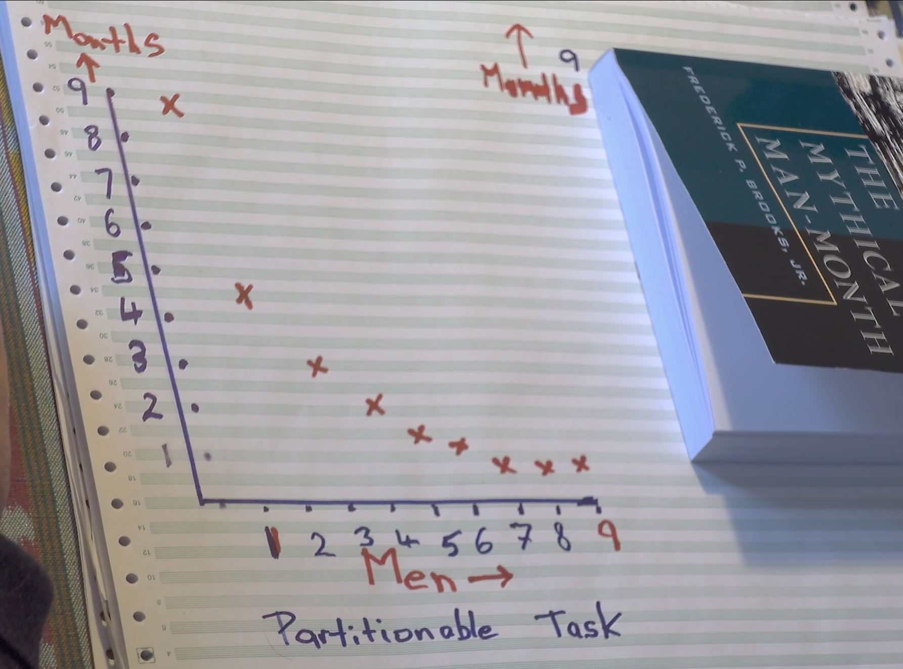
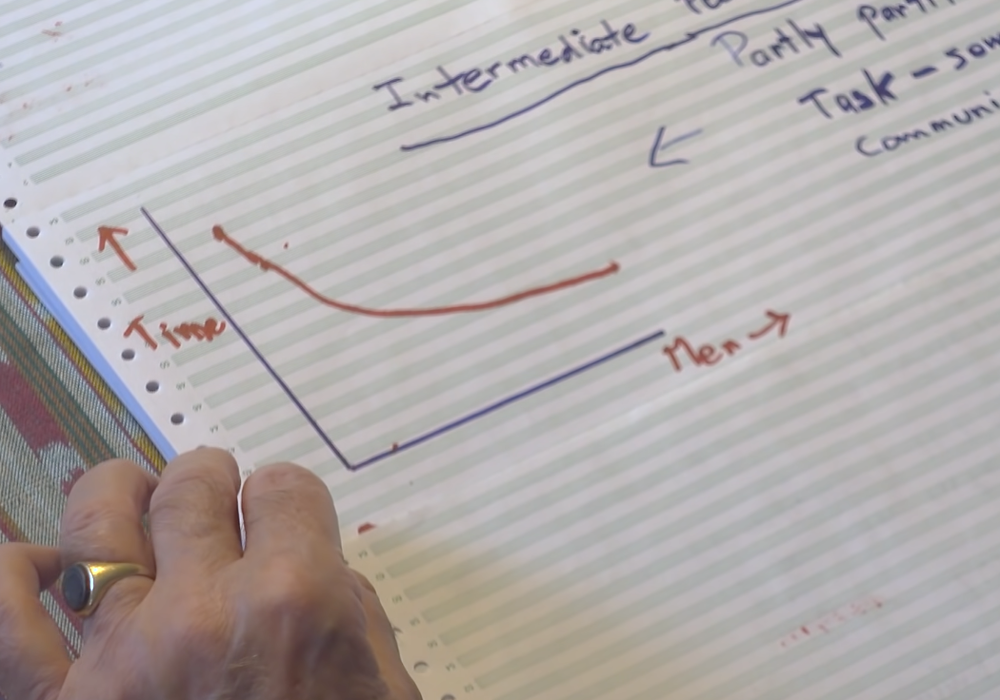

> 我第一次看到这本书的书名，还以为讲的是载人登月呢！😂

《人月神话》是一本讲架构师如何管理项目的书（其实还讲了很多有趣的计算机历史故事），本文将其核心思想划分成三个部分进行简要介绍：
- 导引：什么是人月神话？
- 原因分析：人月神话为什么没有生效？
- 方法论：如何避免人月矛盾？
## 人月 神话：用人数来换月数
“人月“，men-month，就是和“人次”一样的概念。一人月就是一个人工作一个月的工作量，乍一听感觉这个单位非常合理，非常符合直觉。但这里面却藏着让项目延期的魔鬼。

核心问题是：我们真的能用人来换月吗？一件1个人做9个月能完成的事，让9个人去做1个月就能完成？

在我们的直觉里这就不对，但我们往往想到的原因是“三个和尚没水喝”——参与者因为劳动力溢出和责任不明确导致的效率低下。

但其实原因不止于此。

_在我们的理想化构建里，人数和月数呈完美的反比_

_但事实却是，这个曲线可能会整体上翘，任务完成时间随着人数的增加可能不降反升。（看这张图，人数刚开始增加时，时间还是下降的，但很快时间就升回去了）_

## **Quesion. 人月神话为什么没有生效？**
人月矛盾（The Man-Month Myth）的本质是：
>**任务并不是完全可以分解（Partitionable）的。** 

Brooks 将其归结为三个层次：
### **第一层：串行约束（Sequential Constraints）**
有些任务在逻辑上就是串行的。

> **“孕育一个孩子需要 9 个月，无论你找多少个女人，都不可能让孩子在 1 个月内出生。”**

如果在“航班订票系统”中，数据库底层结构没定好，前端哪怕找 100 个人也没法写查询界面。这种依赖是**物理极限**。

### **第二层：培训开销（Training Overhead）**
软件开发不同于搬砖。当项目进度落后，你拉来新人大佬帮忙时：

- 新人并不直接产生代码，他们需要学习你的架构逻辑。
- **代价**：原本在干活的老成员必须停下来去培训新人。

### **第三层：沟通路径的指数增长（Communication Paths）—— 真正的杀手**
这是 Brooks 认为最被低估的成本。

- 如果团队有 $n$ 个人，沟通路径的数量是 $\frac{n(n-1)}{2}$。
- 当你从 2 个人增加到 5 个人，人手增加了 2.5 倍，但沟通路径从 1 条增加到了 10 条！
- 每个人都要同步接口、对齐进度、解决冲突。这些**非生产性工作**会迅速吃掉新加入的人手所带来的生产力。

## 方法论：如何避免人月矛盾？

### 1、作为架构师，要定死规范和接口，确保“概念完整性”（Conceptual Integrity)
> **“宁可要一个逻辑一致但功能稍缺的系统，也不要一个功能繁杂但逻辑混乱的系统。”**

什么是概念完整性？
概念完整性包含了**设计一致性**、**逻辑统一性**……

举一个UNIX的例子：
	“一切皆文件（Everything is a file）”。无论是硬盘、键盘、网络套接字，在 Unix 架构师眼中都是“文件”。这个简洁的概念贯穿了整个系统，这就是极其强大的概念完整性。

如果以航班管理为例：
- 定死代码“长在哪里”。写好核心的多端交互逻辑，并禁止修改（除非经过统一协商）。锁死main branch的修改权限，所有人都只能通过Pull Request进行修改。
- 写好清晰的**文档**，并确保所有人理解文档内容和项目架构。
	这样就可以避免各个端的过多的协调和交流。

### 2、权责到人，分工粒度合适，不断更新的时间表
时间表的DDL需要和相关人员进行沟通，当架构师和组员在此产生分歧时，架构师应当进一步帮组员细分任务，帮组员明晰工作量，要求组员遇到困难时**及时反馈**，并**承诺**自己会兜底。（而不是简单地独裁）

- 可以预设组员之间缺乏交流和自分工意识。否则就会出现抢活干/重复工作等现象。

### 3、DDL将近，项目进度来不及？砍功能。（而不是加人）
> “准备丢掉一个” (Plan to Throw One Away)

怎么砍，砍哪个？（还得说服已经做了一半的人砍（可以安慰ta会在后续的版本中加入，告诉ta已经做了的工作没有白费））

有以下两种评估方式：
#### **1、优先级公式**
$$Priority = \frac{Value\%}{(Cost\% \times W_c) + (Risk\% \times W_r)}$$
重点关注分母，要同时考虑Cost成本和Risk风险（风险本质上也是成本的一部分）

#### **2、经典的分类法：MoSCoW 模型**
虽然书中提倡量化，但为了快速沟通，Karl 也推荐了业界通用的 **MoSCoW** 分类法。
1. **M - Must have (必须有)**：
    - 没有它，系统就无法交付（例如：航班查询、数据库存储）。
        
2. **S - Should have (应该有)**：
    - 很重要，但如果确实没时间，可以勉强交付（例如：用户注册/登录、多条件筛选）。
        
3. **C - Could have (可以有)**：
    - 锦上添花的功能。如果大家代码写得快就做（例如：生成精美的 PDF 行程单、动态换肤、AI查询航班）。
        
4. **W - Won't have (这次不做)**：
    - 明确排除在本次大作业之外的功能（例如：多国语言支持、复杂的金融结算体系）。

### 4、谨防“第二系统效应”。从最小可行性版本出发，不断重构，快速迭代。
> 和“一次性完美”有异曲同工之妙。

第二系统效应的成因：
1. **第一系统（The First System）**：架构师在做第一个系统时，往往非常小心、克制。因为没经验，怕出事，所以只做最核心的功能。结果这个系统往往因为简洁、专注而获得了成功。
2. **第二系统（The Second System）**：在做第二个系统时，架构师已经“成名”且充满了自信。他会把在做第一个系统时忍痛砍掉的所有“奇妙想法”、所有华而不实的修饰、所有追求极致性能的复杂逻辑，通通塞进第二个系统里。

我们应该在尽量短的时间里做出最小可行性版本（哪怕实现很低效、很丑陋都好）。只有跑通了才知道还有什么问题。

### 5、外科手术式分工
Brooks 提出，与其让 5 个水平参差不齐的人平级协作（导致沟通爆炸），不如模仿外科手术团队：
- **主刀医生（首席程序员）：** 负责核心设计和最难的代码。
- **副手（支持者）：** 协助主刀，作为备用大脑。
- **管理员、编辑、工具开发员：** 分别负责文档、测试环境、小工具。

（当然在不同的项目里有不同的具体分工方式，但这里的核心主要是——对“公平合作”祛魅，不要总想着自己干得多/少）
### 6、归根结底还是 **人**
经常会有人说：“我对事不对人。”
于是就会出现只看事情不看人的“暴君式”管理。
有时候乍一看，似乎还挺成功？（比如乔布斯和马斯克）但殊不知，他们这种管理方式是因为有极致的目标（登火星）和高度对齐的共同价值观（做好产品而不是秀技术）。

> 只有你尊重一个人，尊重ta的劳动成果，尊重ta的想法，认真地对待ta，理解ta，你们才能在这个“人-人和谐”的基础上“对事不对人”。