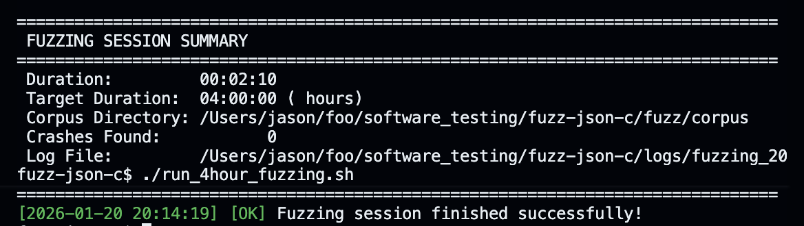

## 前言
朋友的软测期末大作业，要求针对json-c库跑4小时模糊测试，结果测了2分钟程序就退出了，还臭不要脸地输出"Fuzzing session finished successfully!"，遂深入探究。



我一开始让Agent(vscode+claude opus 4.5)自己修了半天，也没修出个所以然来，于是手动定位问题，再教Agent使用ASan(AddressSanitizer)检测内存错误的位置，没想到问题不出在fuzzer代码上，而是出现在json-c库中，而且现版本的json-c库仍然有该问题。

于是，第一次给开源库提PR（好像不是第一次提Issue）的机会就这样像馅饼一样从天上掉进了我嘴里。（其实也搞了2h左右才真正找到问题根源）
## Bug在哪？
### 问题简述
简单来说，就是在部分系统上(macOS / FreeBSD)，`newlocale(int category_mask, const char *locale, locale_t base)`并不会像在Linux中一样原地修改base，然后返回它，而是复制了一个新的副本。

这样，当json-c库在后续释放返回的对象时，它以为自己已经释放了原对象的内存，但它实际上只释放了副本的。

示意图：
```
Linux (glibc):
┌─────────────┐    ┌─────────────┐
│  duploc     │───▶│  newlocale()│───▶ 返回 duploc (复用)
│  (1472 B)   │    │  修改原对象  │     freelocale(newloc) 释放 ✅
└─────────────┘    └─────────────┘

macOS / FreeBSD < 12.4:
┌─────────────┐    ┌─────────────┐    ┌─────────────┐
│  duploc     │───▶│  newlocale()│───▶│   newloc    │
│  (1472 B)   │    │  创建新对象  │     │  (1472 B)   │
└─────────────┘    └─────────────┘    └─────────────┘
      │                                      │
      ▼                                      ▼
   泄漏！❌                          freelocale(newloc) ✅
   (永远无法释放)
```

在json-c库的历史上，曾有FreeBSD用户发现了这个问题并将其修补，但并无macOS用户修补，这就导致了在macOS上长时间运行json-c库会导致严重的内存泄漏，从而导致OOM(Out Of Memory)。
### 问题代码
**文件**: `json_tokener.c`  
**行号**: 349-374
```c
#ifdef HAVE_USELOCALE
    {
#ifdef HAVE_DUPLOCALE
        // 步骤1: 复制当前 locale，分配约 1472 字节的内存
        locale_t duploc = duplocale(oldlocale);    
        if (duploc == NULL && errno == ENOMEM)
        {
            tok->err = json_tokener_error_memory;
            return NULL;
        }
        
        // 步骤2: 基于 duploc 创建新的 locale，仅修改 LC_NUMERIC 为 "C"
        // 
        // 🔑 关键问题在这里！POSIX 标准规定：
        //    "The newlocale() function shall create a new locale object 
        //     or MODIFY AN EXISTING ONE."
        //
        // Linux (glibc) 的实现：newlocale() 会复用/修改 duploc，返回同一指针
        //    → duploc == newloc，释放 newloc 即可，无泄漏 ✅
        //
        // macOS / FreeBSD < 12.4 的实现：newlocale() 总是创建新对象，忽略 duploc
        //    → duploc != newloc，duploc 成为孤儿指针，永远无法释放 ❌
        //    → 每次调用泄漏 ~1472 bytes！
        //
        newloc = newlocale(LC_NUMERIC_MASK, "C", duploc);
#else
        newloc = newlocale(LC_NUMERIC_MASK, "C", oldlocale);
#endif
        if (newloc == NULL)
        {
            tok->err = json_tokener_error_memory;
#ifdef HAVE_DUPLOCALE
            freelocale(duploc);  // 仅在 newlocale 失败时释放
#endif
            return NULL;
        }
        
        // 步骤3: 这里是修复代码，但默认不启用！
        //
        // 历史背景：
        // - 2020年9月: FreeBSD 用户报告 issue #668，发现内存泄漏
        // - 2023年7月: json-c 添加了 NEWLOCALE_NEEDS_FREELOCALE 选项 (commit 71d845e)
        // - FreeBSD 12.4+ / 13.1+ 已在系统库中修复此问题
        // - 但 macOS 从未修复，且该选项默认为 OFF！
        //
        // 结果：macOS 用户如果不手动设置 -DNEWLOCALE_NEEDS_FREELOCALE=ON，
        //       每次 json_tokener_parse() 都会泄漏 ~1.5KB 内存
        //
#ifdef NEWLOCALE_NEEDS_FREELOCALE    // ⚠️ macOS 上此宏未定义！
#ifdef HAVE_DUPLOCALE
        // Older versions of FreeBSD (<12.4) don't free the locale
        // passed to newlocale(), so do it here
        freelocale(duploc);           // 手动释放被 newlocale "忽略" 的 duploc
#endif
#endif
        // 此时在 macOS 上：duploc 指向的 1472 字节内存已泄漏，无法回收
        
        uselocale(newloc);
    }
#endif
```

## 根本原因
这个 Bug 的本质是**跨平台开发中对 POSIX 标准行为假设的错位**。
我们可以将责任链条拆解为三个环节：
1. **源头（POSIX 标准的定义）**： POSIX 文档对 `newlocale` 的定义包含了一句关键但略显宽泛的描述："_...create a new locale object or modify an existing one._"（创建一个新对象或修改一个现有的对象）。这暗示了如果传入 `base` 参数，函数有权复用该内存。
2. **中间环节（macOS/BSD 的实现）**： macOS（基于 BSD libc）采取了“不可变/非破坏性”的实现策略。它读取 `base` 的内容，申请一块**全新**的内存来存放结果，并返回新指针。关键在于：它既不复用 `base` 的内存，也不负责释放 `base`。在 macOS 看来，`base` 仍然属于调用者。
3. **终端（json-c 的预期偏差）**： `json-c` 的开发者主要基于 Linux (glibc) 的行为编写代码。在 glibc 中，`newlocale` 会“接管” `base` 对象（原地修改并复用）。代码逻辑默认了“交给 newlocale 后我就不用管了”，导致在 macOS 上，`base` 对象（即代码中的 `duploc`）变成了一个既没被复用、也没被释放的“孤儿”，从而导致内存泄漏。    

> json-c 以为这是一场托付终身，把旧对象（duploc）介绍给 macOS 接盘后就潇洒离场了；
> 但在 macOS 眼里，这只是一场相亲面试，它拿着旧对象的简历复印了一份（newloc）带走了，压根没打算把人领回家。
> 结果：可怜的对象就这样被晾在了内存的冷风中，前任不管，现任不要，成了没名没分的孤魂野鬼。
> （以上为Gemini 3 pro的幽默水平，，，）

## 为什么没有人发现该漏洞？

- 原因1：json-c的主要目标平台是Linux（而不是macOS）
- 原因2：泄漏规模较小（每次1.47KB）。而大多数开发者不会在 macOS 上运行长时间的内存检测测试。
- 原因3：macOS并无动力修改与POSIX标准不一致的问题。
	1. `newlocale` 属于极低频使用的 API
	2. 对于操作系统厂商来说，“保持现有的错误行为”往往比“修复错误但导致现有程序崩溃”更安全。
		**双重释放**：
		许多跨平台库（如现在的 `json-c` 补丁）可能已经检测到是 macOS，并手动添加了 `freelocale(old_loc)`。 如果 Apple 修复了，`newloc` 和 `duploc` 指向同一块内存。库代码手动释放了 `duploc`，然后又通过 `freelocale(newloc)` 释放了一次。这将导致立即崩溃。

## 后言
于是，就这样给有 3.2k star 的开源库[json-c](https://github.com/json-c/json-c)水灵灵地提了[Issue](https://github.com/json-c/json-c/issues/914)和[PR](https://github.com/json-c/json-c/pull/915)，希望不是一场乌龙。