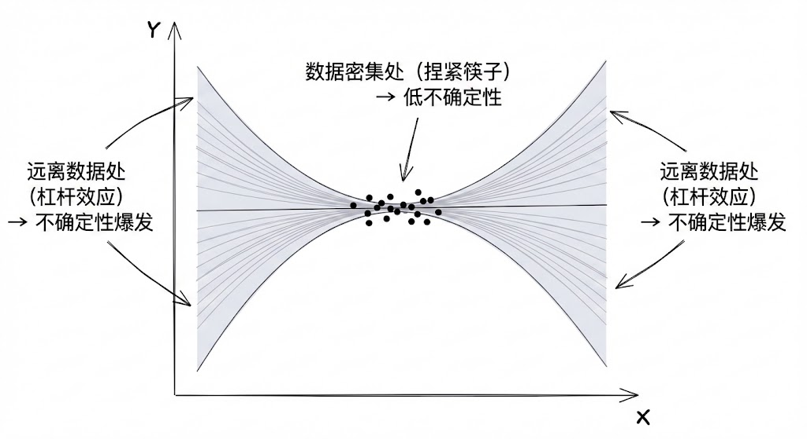
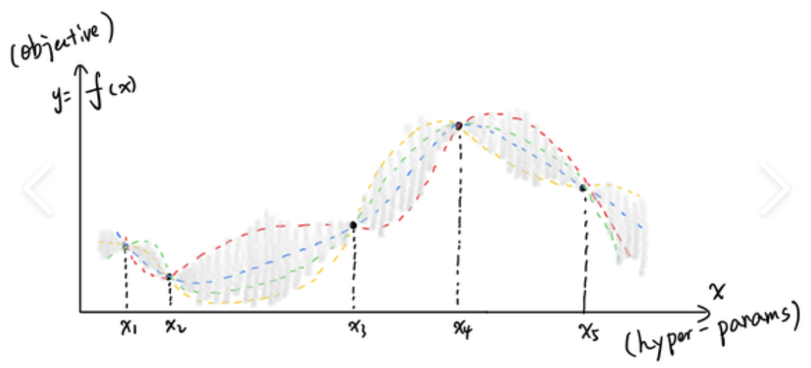
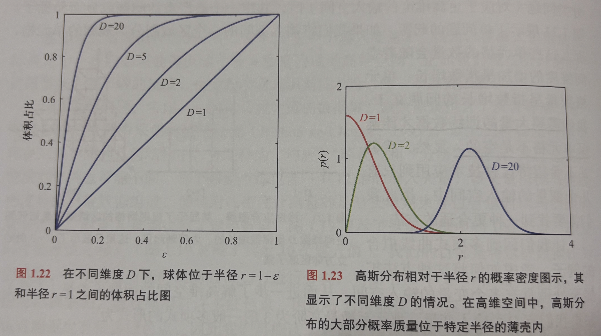

## 贝叶斯曲线拟合

**公式 1.68：预测分布的积分定义**
$$p(t|x, \mathbf{x}, \mathbf{t}) = \int \underbrace{p(t|x, \mathbf{w})}_{\text{模型预测}} \cdot \underbrace{p(\mathbf{w}|\mathbf{x}, \mathbf{t})}_{\text{参数后验}} d\mathbf{w}$$
- $p(t|x, \mathbf{x})$是最终我们想预测的联合概率
- $p(t|x, \mathbf{w})$是以w为参数时我们对t的预测
- $p(\mathbf{w}|\mathbf{x}, \mathbf{t})$则体现了我们对参数取w的信任程度
我们将所有可能的w算一遍$p(t|x, \mathbf{w})$，然后根据我们对该w的信任程度后验概率 $p(\mathbf{w}|\dots)$）进行加权求和（积分），得到最终的联合概率。
这体现了这样一种思想：
**我们不是要找一个“最优的参数”来预测，而是要综合所有可能的参数来预测。**

即
> 新的预测 $t$ 的概率分布 = $\sum$ ( 某个特定参数 $\mathbf{w}$ 下的预测 $\times$ 我们有多信任这个 $\mathbf{w}$ )

**公式 1.69：预测分布的形式**
（这里假定了先验和似然都是高斯分布）
$$p(t|x, \mathbf{x}, \mathbf{t}) = \mathcal{N}(t | m(x), s^2(x))$$
- **解释**：积分的结果是什么样子的？

- 因为我们的先验是高斯，似然是高斯，根据高斯的共轭性质，积出来**结果依然是一个高斯分布**。
- 既然是高斯分布，我们只需要找出它的**均值 $m(x)$** 和 **方差 $s^2(x)$** 就能描述它。

**公式 1.70：预测均值**

$$m(x) = \mathbf{m}_N^T \phi(x)$$

- **解释**：新的预测均值 = **后验均值参数 $\mathbf{m}_N$** $\times$ **基函数 $\phi(x)$**。
- 这和点估计（MAP）的结果是一样的。也就是说，虽然我们考虑了所有 $\mathbf{w}$，但**在预测的“中心位置”上，还是那个最可能的参数说了算**。

**公式 1.71：预测方差（核心公式！）**
$$s^2(x) = \underbrace{\frac{1}{\beta}}_{\text{数据噪声}} + \underbrace{\phi(x)^T \mathbf{S}_N \phi(x)}_{\text{参数不确定性}}$$
- **解释**：预测的不确定性（方差）由两部分组成：
    1. **数据固有的噪声** ($\frac{1}{\beta}$)：即使模型完美，数据本身也有随机误差，这部分无法消除。
    2. **模型参数的不确定性** ($\phi(x)^T \mathbf{S}_N \phi(x)$)：这是贝叶斯独有的。        
        - **$\mathbf{S}_N$** 是参数 $\mathbf{w}$ 的协方差矩阵/
        - 这就解释了为什么贝叶斯回归的置信区间呈现**“香肠状”**：在数据密集的地方，参数估计准（$\mathbf{S}_N$ 作用小），方差小；在远离数据的地方，方差会变大。

## 维度灾难(Curse of dimensionality)
> 低维度上的很多直觉不能直接拓展到高维度上。

考虑D维空间中半径为r的球体在r = 1 - $\epsilon$到r = 1之间的部分在球的总体积中的占比。

D维空间中体积正比于$r^D$
$$V_D(r) = K_Dr^D$$
$$\frac{V_D(1) - V_D(1 - \epsilon)}{V_D(1)} = 1 - (1 - \epsilon)^D$$
当D趋于无穷大，即使$\epsilon$很小，占比也趋近于1.
因此在高维空间中，球体大部分的体积集中于在球体表面附近的薄壳中。

考虑一个多维度的高斯分布，其类似于一个球。
虽然单看一个维度中间部份的“密度”最大，但高维情况下，大部分质量仍然在一个空心球壳附近，所以如果随机取数，也更有可能取在这个球壳上。
“高斯薄壳”的密度峰值：
$$\hat{r} \simeq \sqrt{D} \sigma \quad $$

这引出一个可怕的后果：
在很多机器学习算法（如 KNN、K-Means）中，我们依赖**“距离”**来判断相似度。 但是因为这个“薄壳效应”：
1. 所有随机样本都落在同一个半径的壳上。
2. 这就导致**所有点之间的距离看起来都差不多**！
3. “最近邻”和“最远邻”的区别变得微乎其微，导致基于距离的算法在高维空间失效。

> 不要用三维直觉去想象高维空间，高维空间里，中心是空的，大家都在壳上。