《禅与摩托车维修艺术：一场对价值的追寻》（让我来起名，我会用《斐德洛》）

我一直在追寻一个问题的答案：“什么是好的？”

这个问题在不同领域有不同形式：在人生中，它表现为“何为良善生活”；在道德中，它表现为“何为美德”；在产品与研究中，它则表现为“什么是好的产品，什么是好的研究”……

我曾在不同的地方寻找答案：黑塞的《悉达多》，柏拉图对真理与善的追寻，尼采的狄奥尼索斯与超人，功利主义、有效利他主义、以及罗尔斯和安德森的正义理论。但它们没有给我足够满意的答案。

黑塞诉诸东方神秘主义，强调真理只能亲自经历，不能由教义和语言传递。但我无法从对河流的顿悟、额头上的亲吻，以及退隐为船夫的卢梭式生活中，找到属于现代技术生活的答案。那种精神解脱固然优美，却离我所面对的产品、研究、技术、制度与日常实践太远；

柏拉图虽然口头上认为善高于真理，却通过辩证法将善置于真理的评价体系下，善仍然戴着王冠，实际掌握通往善之道路的却是真理与理性。我也无法将"Rather than love, than money, than faith, than fame, than fairness… give me truth."这种把真理置于爱情、信仰、公正乃至一切生活价值之上的姿态，作为我的人生目标。真理当然重要，但我仍然会追问：为什么真理值得追求？

尼采的理论中有一种狂热而审美化的英雄主义。他通过超人与末人的对照，将知足与幸福分配给末人，痛苦与超越分配给超人，这种精神贵族主义固然是对庸常生活和平均主义的有力批判，却也可能让人把平凡误认为卑微，把稳定误认为怯懦，把强度和痛苦本身误认为价值高度，很容易让人走向极端乃至疯癫；

现代的政治哲学思想往往从某种抽象条件出发，比如无知之幕、总效用最大化。但没有哪个抽象条件正面回答一个更本质的问题：人究竟需要什么，才会幸福、快乐，才能构成一种良善的生活？如果个体的效用量度无从定义，群体的效用加和也无法解决问题。对善物的分配乃至于安德森所叙述的公平结构，这些对“何为正义”的回答无法替代关于良善生活和存在意义的回答。富裕者和权贵可以从当今社会的不平等结构中获得巨大利益，却仍很可能陷入空虚和价值丧失。正义理论规定社会应当如何对待人，但却从未回答一个更根本的问题：人如何幸福。

《斐德洛》第一次给了我满意的答案。

在我心目中，作者波西格是现代的尼采。他同样重新提出价值问题，却没有把答案寄托于少数超人的意志，而是提出了“良质”（Quality，即“good thing”）。

他将良质置于理性与感性、主观与客观之前，良质是可追寻的，所以不是纯粹主观的，但又是不可定义的，所以也不是纯粹客观的。良质是人对“什么更好”的直接回应；

与尼采相似，他反对苏格拉底—柏拉图传统中对理性与真理的过度推崇。苏格拉底—柏拉图传统使“什么是真”逐渐压过了更原初的“什么是好”。而波西格重溯古希腊智者的传统：在“什么是真的”之前，必须先回答“什么是好的”。真理并非价值的最终来源；恰恰相反，我们之所以追求真理，是因为我们已经认为真理比谬误更好；

但波西格并不因此排斥理性。他试图在现代技术文明中重新调和古典模式与浪漫模式：古典模式重视结构、因果、分析与秩序，浪漫模式重视感受、判断、审美与直接经验；真正有良质的实践，既不是机械地服从规则、理性，也不是盲目地依赖直觉、感性，而是让分析能力、经验判断、审美意识与关怀（care）共同进入行动；

波西格还试图重新接续古希腊智者传统中的 Aretê——卓越。在他的理解中，卓越并不是附加于人生之上的某种成就，而是良质本身的展开。好的研究、好的产品、美德与良善生活看似属于不同领域，实则都指向同一个问题：如何在各自的实践中辨认并实现更高的良质；

正如波西格所写：“这个世界变得越来越好的方式，便是人们越来越珍惜良质。”世界不会仅仅因为拥有更多知识、技术和真理而自然变好；只有当人们重新学会辨认、珍惜并实现良质时，这些知识、技术与真理才能真正发挥价值。

这或许并不标志着我 coming of age 的结束，也不意味着我已经从精神上抵达了彼岸。良质本身也不允许我拥有不变的答案。但或许未来很长一段时间，我都会安于这个答案。

道【良质】可【可以】道【追寻】，非【不是】常【恒常】道。

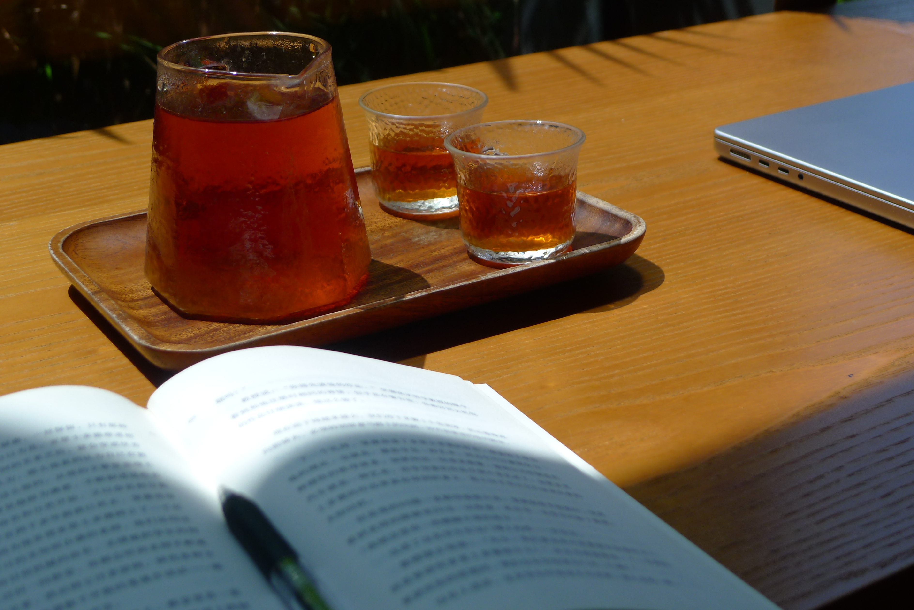
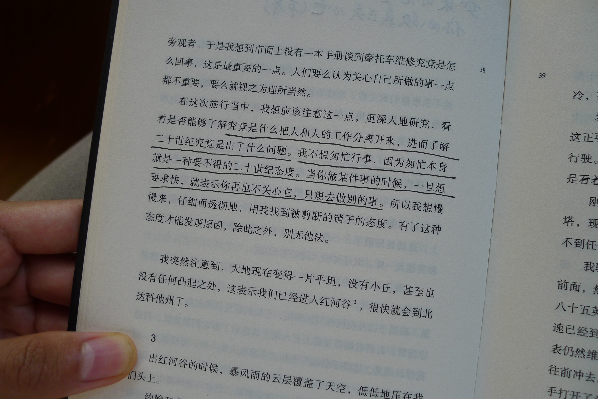
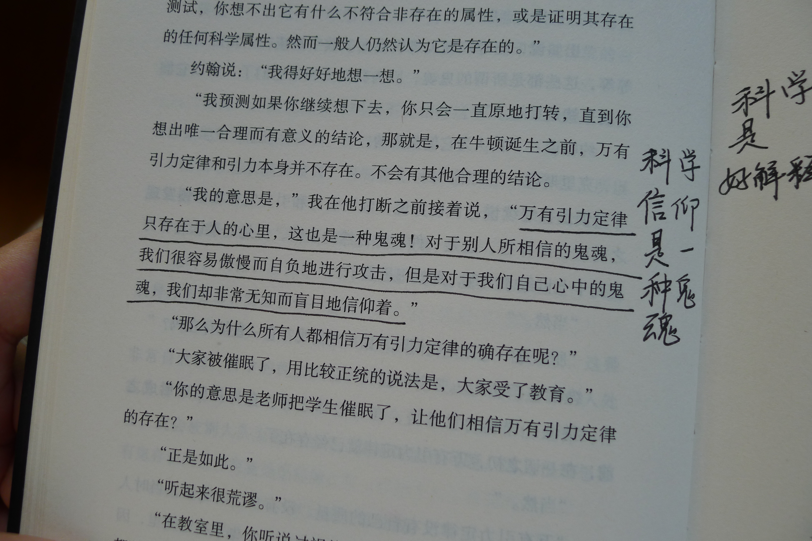
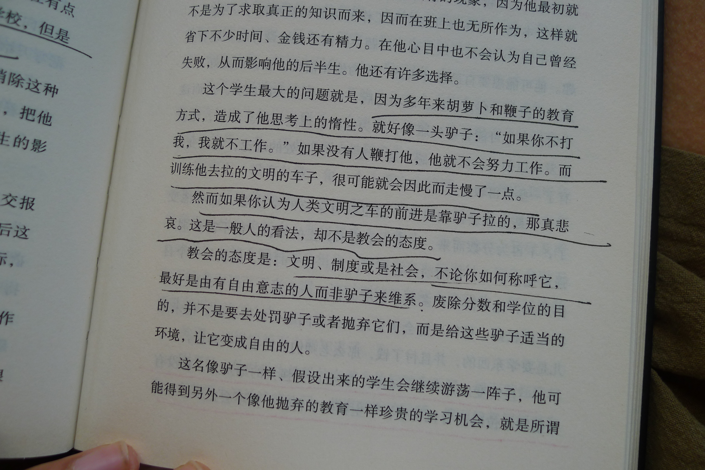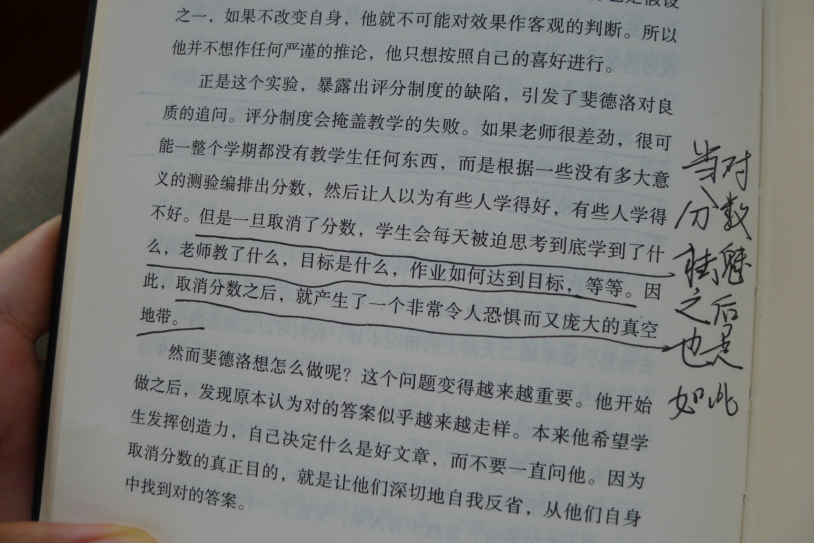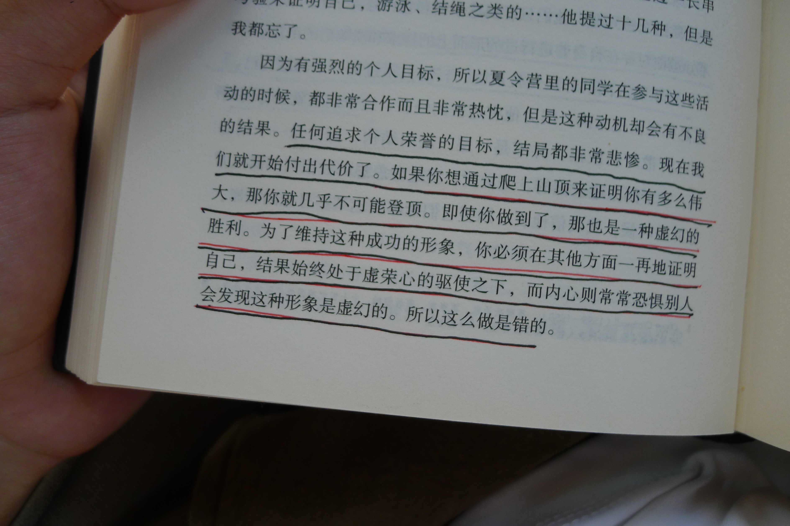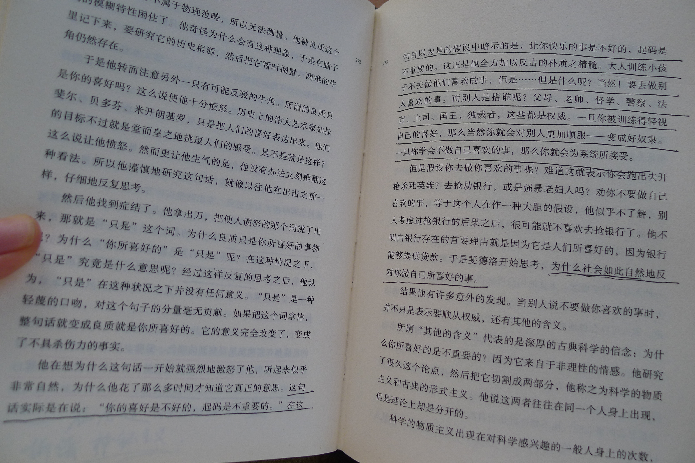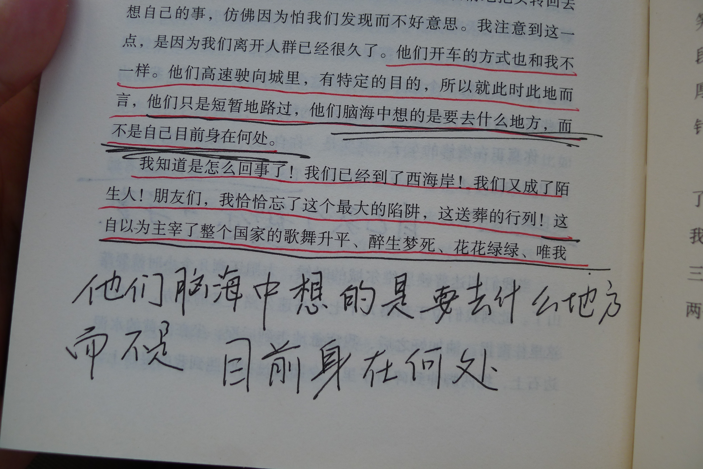
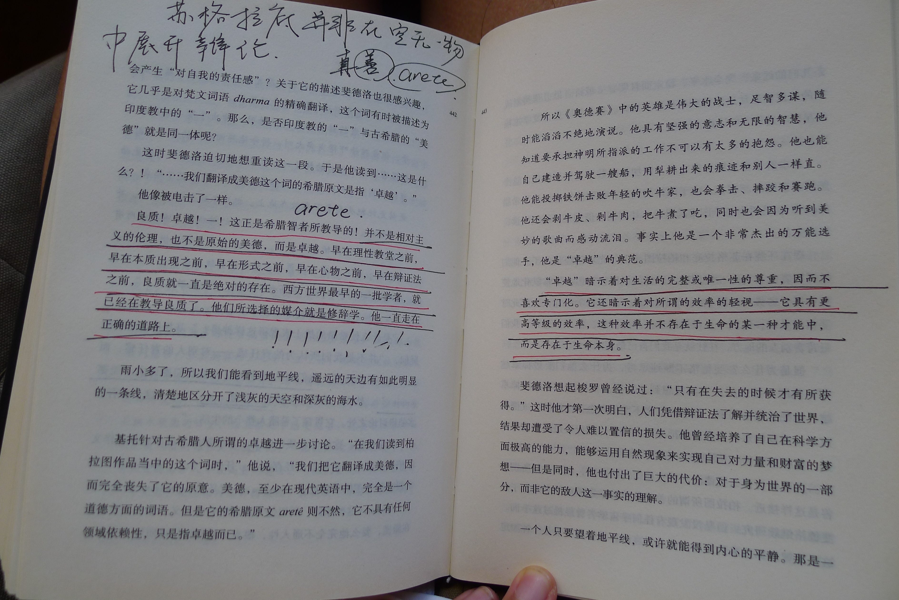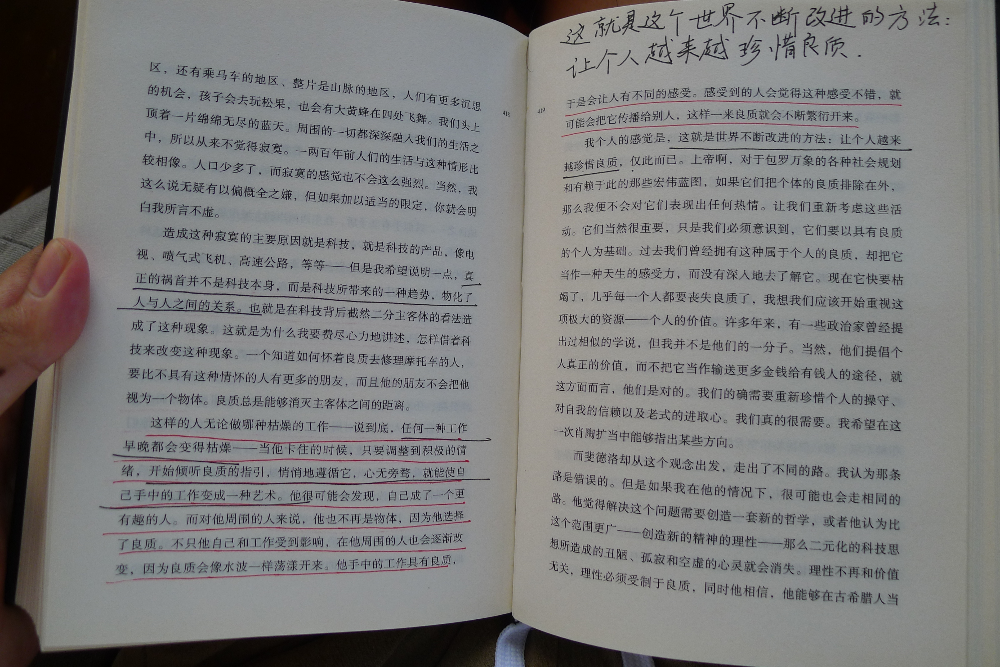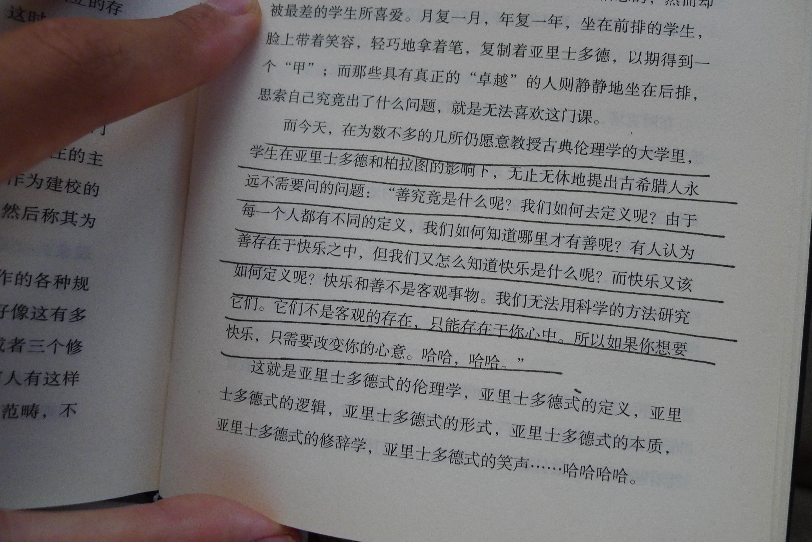

