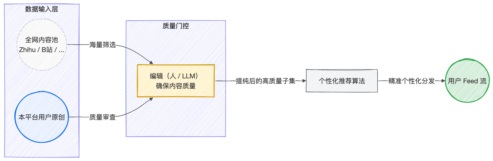

## Origin
最近文章写得少了，不再怎么发博客，时常觉得“脑袋空空“。

究其原因，主要是两点：
1、写的文章**没有合适的发表平台**。
	虽说我的写作大多数都是为自己而写，但是缺乏交流和反馈，始终会打击写作热情。
	博客当然是没人看的，软工集市浏览量虽有数百，但实际阅读者可能仅有数十，讨论寥寥，而知乎无法向我提出能吸引我回答的问题。
2、**缺乏高质量的输入**。
	以往我的输入往往来自于书籍，但在这个浮躁的时代我也很浮躁，静不下心来读书。而当代中文互联网内容平台都是屎。

说“当代中文互联网内容平台都是屎”似乎有点暴论了，但不妨来看看我给主流内容平台列的七宗罪：

一宗罪：以**用户停留时间**为最大化目标（而不是提供对用户最有价值的内容）
	抖音
二宗罪：内容质量参差不齐，劣币驱逐良币（缺乏筛选，提纯）
	今日头条，知乎
三宗罪：社区文化腐烂，交流低质，争端频发
	微博
四宗罪：产品缺乏**品味**
	ALL
五宗罪：构建封闭生态，形成内容孤岛
	微信公众号
六宗罪：审核标准不明确，动不动捂嘴巴，营造“虚伪的和平”
	小红书
七宗罪：优质旧内容沉没 / 重复推荐已读旧内容
	b站，知乎

而一些“小而美”的平台（如开眼、ONE、独立博客），虽然内容质量高，但用户寥寥无几，核心是因为其内容大多门槛较高，“叫好不叫座”，而且没有能吸引住用户的推荐机制。（唯一的反例是小宇宙，其内容体裁是播客，此处暂且摁下不表）

"You Are What You Eat." 人吃的食物健康，身体就会健康，大模型吃的数据高质，能力就会强大，人所摄入的信息有洞见，人就会有思考，有观点，言之有物。可惜，我现在天天在被知乎和b站轮流喂屎，所以思想变得浅薄、脑子都快变平了。

于是，我有了这样一个想法种子：
> 有没有可能做一个产品，**筛选全网高质量的内容，做成推荐流推荐给用户**？

这本质上是在传统的推荐流前面，添加了一个“编辑”（可以是LLM也可以是人），通过“编辑”来确保内容的质量。

## 产品设计
这个产品有几个要点：
1、一定要做**个性化推荐流**。
	只有推荐流才能让用户沉迷，才能不沦落到传统纸媒的无人问津，和主流平台抢注意力。
	（反正用户都是要沉迷的，不如让其沉迷点好的）
	另外，如果没有推荐流，就会沦落成和传统媒体一样的模式。
2、一定要有**移动端**
	因为大部分的 Endless Scrolling 在移动端（手机/ipad）上发生。
3、要做好版权管理
	对于其他平台的内容，虽说是引流到其他平台进行浏览，但是截取多少内容/摘要作为介绍，也是一个需要谨慎处理的点。
	当前的行为有点像是给搜索引擎加了个性化推荐算法，或许保留和搜索引擎一样的尺度即可？
4、要有**评论区**，做好社区文化营建
5、**内建浏览器**，内置网页翻译功能

不同端采用不同的分发策略
- 电脑网页端 -> 网页跳转
- 电脑app端 -> 使用内建浏览器（类似于Feedly），尽量使用户在软件框架内浏览内容
- 手机app端 -> 内建浏览器，且不推送需要跳转 app 的内容（比如b站）

## 工程路线
阶段一：优质内容平台（无推荐流，随机呈现内容）
- 先要有足够多的优质内容数据（1000-10000条）
	- 人为收集
	- 爬虫
- 搭建平台与软件
	- 产品名字与风格设计
	- UI UX设计
	- 社区文化设计

阶段二：+ 个性化推荐流

阶段三：考虑用户可自定义推荐流，以 Prompt 的形式向推荐系统要求自己想要什么样的内容，不想要什么样的内容。

## 工程难点
1、推荐算法怎么搞（怎么“最大化对用户的价值”？）
2、LLM是否能够判断出什么是好文章？
	观点型文章的好/坏，核心是要有有价值的观点，LLM真的能判断什么观点有价值吗？
	人之所以能判断文章好坏，核心在于人有自己的观点，如果文章观点与人本身观点相悖/相同，就会给人以启发/震撼/赞同，LLM是否有自己的观点？

## FAQ
我有了这个想法之后，也和我的一些朋友进行了讨论，以下是一些质疑点：

1、“抖音能火是因为大部分人喜欢吃💩”，即大部分人没有摄入高质量信息的需求？
	一方面，我们可以服务剩下的20%，这也是一个足够庞大的市场。
	另一方面，产品本身也会反过来塑造人。世界上是因为有了苹果，人们才知道电子产品也需要有审美。像字节这样，多个产品都无底线地掠夺人的注意力，是成功而不伟大的。
2、高质量内容和 Endless Scrolling 是天然反义，高质量内容需要精力和注意力去消化，而人们很多时候，只是想找一些让自己上瘾的东西？
	该产品并非对抗“成瘾性”，而是想要营造一种高质量的信息流成瘾。诚然，高质量内容会有更高的注意力摩擦，但是其带来的认知快感也是低质量内容所没有的。**