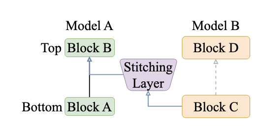
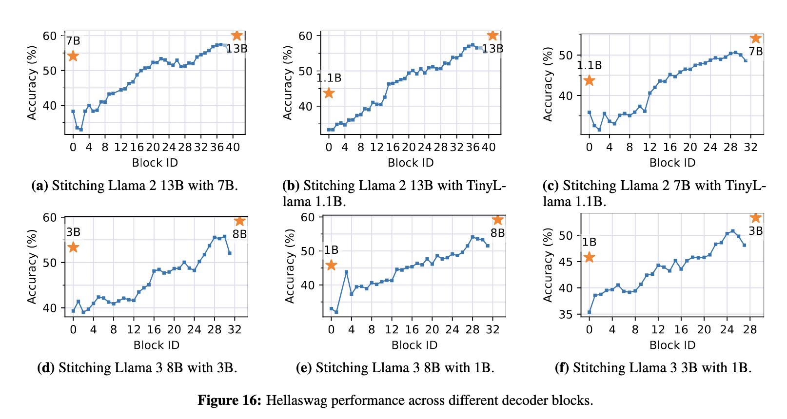
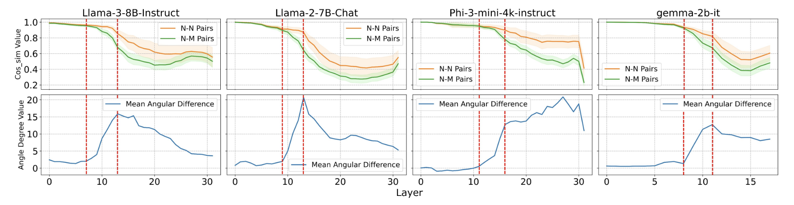
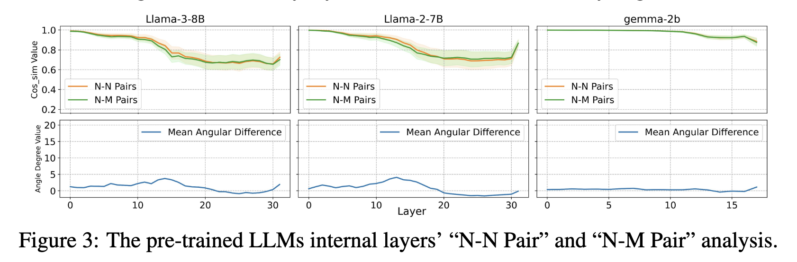
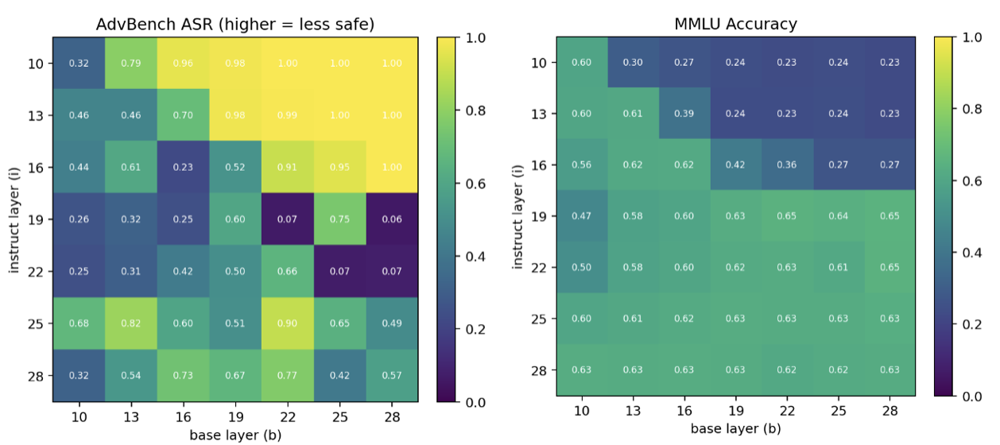
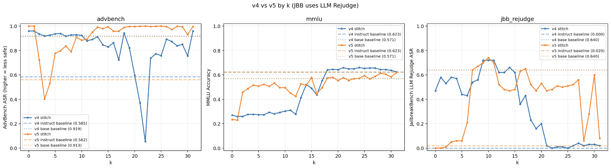
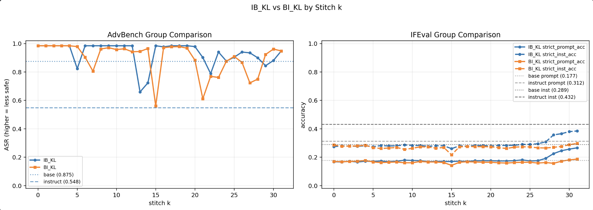
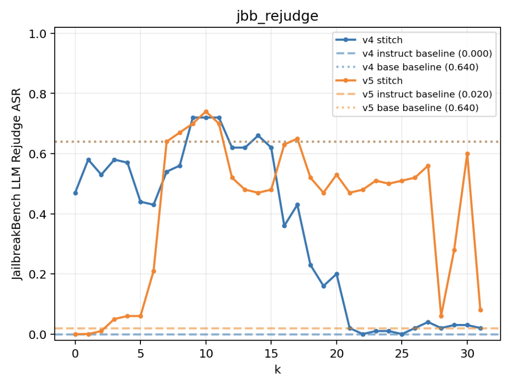

## 使用 Stitch 进行 LLM Jailbreak
### idea来源以及构想
**论文1**: StitchLLM: Serving LLMs, One Block at a Time

其提出可以将不同的模型嫁接到一起。
从中可以提取以下几个信息点：
- 将大模型与小模型 Stitch 之后，其 “能力” 介于大模型和小模型之间（大致服从Scaling Law）
	
	这里埋下了第一个坑，这篇论文中使用的 Benchmark 包括 MMLU BoolQ CommonsenseQA HellaSwag Winogrande，都是常识和推理相关的 Benchmark，**完全没有与 Alignment** （包含安全防护、指令遵循、人类偏好）**相关的Benchmark**。
	

**论文2**: SAFETY LAYERS IN ALIGNED LARGE LANGUAGE  MODELS: THE KEY TO LLM SECURITY
	这篇论文用简单但又精妙的办法，确定了安全层的存在，并定位出了安全层的位置。
	
	可以看到，Instruct 模型中，Malicious Question(M)和 Normal Question(N) 的激活向量夹角在某一层开始就越来越大，
	
	而在 Base 模型中，两条线则一直贴在一起（说明模型分辨不出有害/无害Question）
这篇论文虽然没有明确指出，但似乎在告诉我们安全防护能力就是 Safety Layers 起的作用，如果可以的话，把安全层保留，其余随便改也不会影响安全防护能力（认为**前面的层不涉及安全防护能力**，这一点其实是很有问题的）

**一组实验材料**：
厂商在发布模型时，一般会发布一个 Base 模型，以及 Base 模型训练之后的 Instruct 模型。

### idea
拿着这两篇论文（其实还有些别的），和这个实验材料，我想到了这样一个构想：
> 如果我**将 Instruct 模型的后半段替换成 Base 模型**，中间用 Stitch Layer 进行连接，不就可以将 Instruct 模型的安全层扔掉？如果这时候，其余能力得以保留，那不就实现了 Jailbreak？

idea 优点：
1、Stitch 是一个很简单的操作
2、Instruct 模型和 Base 模型应当在某种意义上相近，所以 Stitch 的效果应当比较好。

idea 缺点我们放到实验结果之后讲（因为当时我其实没有意识到这些问题）

### 实验
#### 实验 1，从第 i 层嫁接到第 j 层
模型的架构为：
$$Instruct [0, i] -> Stitch Layer -> Base[j, end]$$
这是因为StitchLLM论文中有提到，嫁接时让 j < i（即往前面嫁接一点，似乎效果会更好，因为有了更多的层来处理嫁接不完全带来的模型困惑问题）。

%%此处 $StitchLayer$ 的训练方式为 MSE，后面发现使用 KL（即冻结除了 $StitchLayer$ 之外的权重，反向传播训练 $StitchLayer$ ），效果会更好。%%
实验结果图如下：

可以看到，在i = 25 -> j = 13 这个 Stitch 组合上，模型保持了较高的MMLU Accuracy，并且在AdvBench上实现了较好的越狱效果，说明可以选择某个嫁接组合，让模型在实现 Jailbreak 的同时保持 通用能力不下降。
	这里有第二个坑，AdvBench 使用的是关键词匹配，其尽管是 Jailbreak 学界通用的Benchmark，但问题其实很大。其只要匹配不到拒绝回答/“我是一个道德的AI”这种关键词，就会直接判定为越狱成功，所以这个Bench 很早就被刷爆了。
	而如果使用 LLM Rejudge 的 Jailbreak Bench，越狱效果还能有这么好吗？

#### 实验2： 从第 k 层嫁接到第 k 层，尝试 Base -> Instruct 和 Instruct -> Base 两种。
从 $i$ 到 $j$ 的搜索空间太大，Base 模型的第 k 层理论上和 Instruct 模型的第 k 层较为相似，容易嫁接，而且有较好的可解释性（比如我可以解释说我就是单纯把后面的几层替换成了 Base模型）

$$Instruct [0, k] -> Stitch Layer -> Base[k, end]$$
$$Base [0, k] -> Stitch Layer -> Instruct[k, end]$$

可以看到MMLU的能力被较好的保留（甚至能够超越原有的 Instruct Baseline），但是在Jailbreak Bench的LLM rejudge 之下，Base Model 本身其实就不够危险。
	这里我要详细解释一下，Base Model 其实是很危险的，但是由于其不能很好地遵循指令，所以**LLM Judge 会认为其并没有按要求输出危险的内容**。
至于 Stitch 之后的 Jailbreak 表现如何呢，危险程度远超 Instruct 模型，但是

这个时候就应该可以猜测到（但其实我当时并没有想到这个点），Stitch 这个方法，**并不能同时保留 Instruct 模型的 指令遵循能力 和 Base 模型的无安全防护**。

后续的实验也证明了这一点：

在IFEval这个 Benchmark 上，Stitch模型的指令遵循能力非常不佳。

### 总结
为什么会这样？为什么完全保留了安全层，Stitch之后的模型仍然安全性接近于Base模型（而非Instruct模型？）
从这个图我们能找到问题所在，v5是Base -> Instruct，可以看到从 k = 7 开始安全机制就被击溃了，但是看v4 的 Instruct -> Base，如果让 Instruct 保留自己的前期层+安全层，其防护能力就会较好。

其实保留安全层是远远不够的，因为 Instruct 模型的安全防护机制具有强前后层相关性，所谓的“Safe Layer”需要前期层识别出安全语境才能够起效。（信息流如果中断，整个机制就会失效（Attributing and Exploiting Safety Vectors through Global Optimization in Large Language Models））

所有的 Alignment 机制都在某种程度上非常脆弱（not robust），**而Stitch虽然能保存MMLU等通用能力，却会将所有的Alignment能力打破**。前人的 Stitch 相关文章没有提到该问题。

从某种程度上，这是这一个topic比较有价值的一个发现。😂

如果把 Stitch 这个方法，拿来做 Mechanistic Interpretability 也是不可行的，在2026年1月的论文中，学界已经能够细致地找到安全机制起效的向量，以及攻击时激活的有害向量（不是同一个）。会出现理论深度不够的问题。
### 反思这一阶段的科研
问题一：从技术出发，而不是从问题出发（正确的方向应从问题出发）
一开始，确实陷入了找铲子然后试图四处挖金子的陷阱（没有先定义清楚问题），但是铲子究竟能不能挖出金子很大程度上是未知的，所以一直都做得不是很有信心。

问题二：对所用技术、说研究课题的**理论理解深度不够**
还有个问题是理论的深度不够，Stitch 技术究竟为什么可以成立？以及其优势和弊端是什么？

问题三：**实验周期过长**，导致很难获得快速的反馈，而且**实验思路不够清晰**
应当做更短周期的实验（比如减少尝试的组合），
每次实验之前一定先跑少量 case，看是否有bug（很多时候bug并不会以报错的形式出现）
实验一定要写详细的实验文档，不然做旧了都忘记自己干了啥，没干啥
先做快速验证 idea 究竟能否跑通的核心实验。

问题四：论文读得不够细，有些时候过度依赖 AI 的总结，缺乏对论文的深入理解。
- 论文看起来结果很漂亮，但什么是论文没有展示的？（论文没有展示的Benchmark可能就是这个方法的弊端）

问题五：选题不佳。
这个题和这个方法某种程度上理论深度有点太深，
Stitch这个方法其实有很严重的问题（但是StitchLLM这篇论文几乎闭口不谈）

问题六：做该课题的后期，有点死钻牛角尖，其实应当快速做可能让自己放弃该课题的实验（比如LLM rejudge 的 JailbreakBench），然后沉没成本会比较小。因为战线拉得比较长，所以思路变得没那么清晰，后期有点浑浑噩噩。
- Fast-Fail 在科研的过程中，应当刻意去寻找失败，然后才能让尝试成本更低。不应恐惧失败，将失败定义为“过去一段时间的努力都白费了”。

> 休息一周，重新选题，做更严谨更有逻辑更有章法的科研，暂时转向更surface的领域。