悲伤，痛苦，感觉自己没有价值，生活没有希望，未来没有盼头，不知道今天要干嘛，一切没有意义，珠海天气没有好过，世界有种阴郁的灰底色。这是我上周的状态。

忙碌，失败，怀疑，觉得“做小事者成小事，做大事者成大事”，遂开始做大事，但是大事往往难以成功，小事做了又没有成就感，终于，在接连的几次失败后，我开始畏手畏脚，不再敢开始，甚至不愿意做任何事，除了用睡觉来逃避一切，连饭都没胃口吃，这是我过去几个月的死亡螺旋。

人生而自由，但随着成长，我们有了各式各样的观念，也就给自己戴上了这样或那样的枷锁，变得狭隘，偏执，终于有一天，找到一些枷锁的钥匙，解开后，枷锁和钥匙的记忆还在，但当初是怎么给自己戴上这些枷锁的，却完全没了印迹。

曾经，我就不断拖着这些枷锁向前走。那时，我的心里有一个原初冲动，即“我想创造点价值”，这在某种意义上，是我的理想。于是，我要么就是在找寻什么是有价值的路上，要么就是在让自己拥有能够创造价值的能力的路上。

当走到了某一个时刻，我的原初冲动看起来不太可能实现，身上的枷锁便将我压垮了。

---

千头万绪一团麻，或许该从我对价值的判断讲起。

在我心里，有两件事，是我认为很有价值的。
第一件，是做出好的产品，在这件事情上做到极致的人，叫做乔布斯。
第二件，是推动人类知识前沿的发展，在AI领域中，每个关键路口你都能看到辛顿的身影。

那什么是没有价值的呢？
没有价值的东西也很多。比如说，像抖音这样的产品，你很难说它对于用户多么有益，甚至对于很多并不想被短视频/瀑布流夺走生活掌握权的人来说，微信小视频/小红书短视频甚至于是微信知乎小程序这样的东西，都是对软件使用体验的一种严重损害。如果一个产品的 Telos （目的）是错的，对社会的影响是不好的，无论它赚了多少钱，都很难被我划到“有价值”的范畴中。所以我会觉得，字节是一家很成功的公司，但难言伟大。

字节不在做正确的事，那难道在字节当中工作的员工就在做正确的事吗？当一个公司的核心产品（头条、抖音、红果视频（除了豆包/飞书）），都是以无底线地掠夺用户注意力为核心手段的，那不断“优化”这些产品，让用户有着“更好”的用户体验的员工，在某种程度上是否也是一种”平庸之恶“？要知道，连张一鸣自己都不用抖音。如果我要创造一个产品，它至少应该是我自己想用的。

再比如，我始终没看到量化投资有什么意义，“帮助市场重新定价”？当然，以量化投资作为手段，积累足够多的财富后投身于 DeepSeek 这样的事业，令人钦佩。但我不认为量化投资本身，可以作为一个良善的理想。在满足了温饱和基本的幸福生活需求后，金钱就只是银行账户上跳动的数字，永远无法满足无限膨胀的欲望。而一个良善的理想，应该让大家的生活变得更幸福，让世界变得更好。

有些看似伟大的东西，其实也未必有价值。曾经我很仰慕马斯克，觉得：“一步一步上火星吗？这也太屌了！”但后来平托说，人类上火星了，人们生活会变得更幸福吗？还是说被上帝抛弃被迫自由的人们，就因此能找到生活的意义呢？

技术从不能脱离其目的和影响而存在，“技术中立主义”不过是一种理工科式的逃避。有价值的事不一定要是大事（只是用大事来阐述方便一点），却至少应该是一件在道德意义上良善的事，而这并不容易。

---

年初的时候，发生了一件挑战我曾经的思维方式的事情。
我申请去港科交换，结果失败了。全校两个名额，失败了当然也很正常。但这让我深刻的反省自己对 Title 的轻视。我开始意识到，Title 很重要。绩点、国奖、顶会论文、大厂实习……这些东西在一定程度上，决定了一个人所能获得的资源。

（下面是我当时的记录）
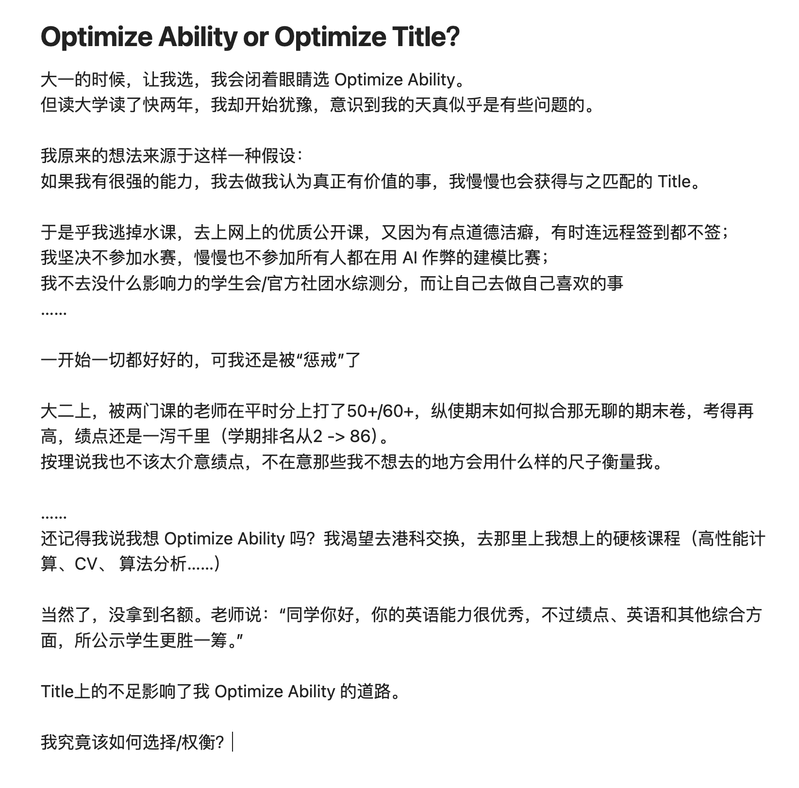
曾经的我太 Naive 。
我没有 Title。我能去哪呢？看着自己的简历，那些曾经可以拿的出手的项目，现在也就是 Vibe Coding 一两个小时的事情。而科研想要出成果（顶会论文），似乎需要机遇+运气+实力，就如爱情般不可强求。保研在中大再呆三年？要是那三年我还是兜兜转转，啥也做不出来咋办？考研去更好的学校？（其实这有啥区别，国内科研环境都差不大多，中大软工已经算很不错的了）去大厂做开发/普通算法？随着AI能力的不断发展，Coding这项技能要有价值的门槛已经越来越高，高到我认为自己这辈子，都不可能比AI coding得好了。或许以后开发+算法+产品经理（3个人）的组合，会变成产品经理+算法+架构师（1个人和一群Agents）。没有护城河。

在那次小小的失败之后，我开始用外部眼光审视自己，开始盯着结果（而非过程），开始失去自信。

---

其实当前最适合我的，还是做 Research。我很享受定义问题，解决问题的过程。
但科研很多时候不是这样一个过程。
科研很多时候，是读很多很多论文（这已经很痛苦了），然后找到一个自己感兴趣的问题，围绕它讲一个故事，这个故事常常讲不通（实验效果不够好，技术不够 Fancy，跟别人的论文撞车），而讲得通的故事，很多仔细想想其实也很荒诞。

一开始的几个月我纯粹在[乱搞](https://jaison.ink/blog/the-end-of-stitch/article)。科研确实需要一点对自己做的东西有价值的迷信，需要自己给自己信心，否则很难将一个问题做深。但当自己给自己太多的心理暗示，就很难听得进别人的建议，只想着不断修改实验和方法，看看能不能做出一个好的效果。但最后，看着惨淡的数据，和我开始做那个课题时发表的一篇新论文，我意识这一切都不应该这么搞，我并没有站在前沿，而像一个民科，对学界的前沿方法充满了无知，在大家都已经用手术刀时，还试图用锤子。

然后我休息。休息时其实并未真的休息，只是沉溺于自己连续的失败。我回来，试图以一种“正确的”方式做科研。读论文 -> 想一个新的idea -> 查论文 -> 撞车 -> 读论文。读论文很多时候并不享受，甚至堪称折磨。

有点扯远了。总之，我慢慢意识到，我只是一个普通人。会一点点数学，懂一点点技术，抱持着一种浅薄的人文主义，仅此而已。我肯定能找到工作，但改变世界么，希望寥寥。你要先进入曼哈顿计划，才有机会成为奥本海默，去用价值观影响决策，为人类的命运去做考量。如果你只是大厂的一颗螺丝钉，或是国企央企政府的一个员工，你往往要做自己并不真的想做的事情，你往往会变得麻木，他们就用那“稳定”，或用那“高薪”，买断你大部分的灵魂和时间。

---

听我扯了这么大一通，希望你没有被我的逻辑绕进去。
当一个人的嘴上，对价值侃侃而谈，定义出一种不同于庸俗主流的“成功”，其眼里却没有光，或是脸上没有笑容，最好别太把他的话当真。

爱因斯坦也需要幸福，这并不是因为幸福能让他更好的研究物理，而是因为幸福本身就是我们想要的。罗素在*The Conquest of Happiness*，尖锐地指出，现代人口口声声说自己想要幸福，但却不断地在追寻幸福的“伪前提”（更体面、优渥的工作，更高的 Title 以不用妒忌他人，更多的财富……）（此处是我的“罗素曾说过”，不可考）。

一个人的视野里，如果大部分都是学习、事业、理想，哪怕ta在做自己热爱的事情，ta也未必会幸福。

因为生活，已然变成学习/工作的罅隙了！于是乎，当我**为了**放松，而出去旅游，我的眼底却总是阴郁，当我看似在休息，脑子里却都是“有没有别的可以做的方向？”，“感觉好失败”，“我到底在做什么？”……

生活不像学习/工作，生活像篮球，当你全然投入进去，感受到球体的纹路、听到球鞋摩擦地板的声音时，你几乎必然能过好生活，就像篮球必然会反弹。因为好生活的核心要素，就是去 过生活，这近乎同义反复。

一个人，何谈伟大？我想曾经的我漏了点什么。成为一个伟大的企业家，一个伟大的科学家，都不能算生命意义上的成功。或许，还要先成为一个生活家吧。

---

我还是有很多东西，没有想明白。

钱到底该怎么花？什么才是“消费主义”？
至少我可以确定，为享乐而花钱，远非像我原来想的那样如此没有意义。如果花钱能买自己开心，这也很好。花钱去按摩，去追星，去看演唱会，去吃更好吃的东西，这些事情并非那样没有价值，但究竟该花多少钱，我心里没数。我只是摆脱了原来的那种“享乐无意义”的张雪峰式心态。

一个人不甘于平凡，究竟该怎样获得幸福？
有的人就是觉得当个普通的高中老师也很好，有的人则不甘于此。雷军在财富自由之后，一天夜里突然惊醒，觉得自己“没有创办一个伟大的企业”，没有实现自己的梦想，于是40岁创办了小米。可是一切大事，都是肥尾分布，收益很高但成功概率很低。或许还是要回到过程上。但结果也很重要。我没有想明白。

人一天究竟该工作/学习几个小时？
曾经的我，觉得自己啥都想要。而且也都能把握得住。去学硬核的数学（实变函数/概率论），硬核的计算机（CS50/CS229/CS230/CSAPP），还去上中文系/哲学系的课（尼采研究/莎士比亚/Justice），还能在剩余时间搞搞研究。可是我现在意识到，这不过是对生活和睡眠的牺牲。
从早上8点，搞到晚上10点，剩余的时间哪怕在休息，也很难来得及转换到什么都不想的状态。这可能比在字节工作还累。哪怕在做自己喜欢的事情。
上周我崩如溃，干脆啥课也不上，啥事也不干，在床上躺着感觉也很痛苦，感觉自己不仅弱爆了，还停滞不前。
这周我只上了3节课，一天工作四个小时，然后打球睡觉看书看电影看剧拼积木，反正不干正事。灵感是多了些，但输入少了不少。确实能感受到幸福了。但这样下去好像也不一定有可持续性（变强还是太难了）。

---

很感谢身边的人，陪着我走过一段难以度过的时光，让我活在爱里面。尽管我自己上的枷锁要自己解开，但路上有你们，让我身上的枷锁轻一点。

感谢我的朋友lzd，jjm，zyc，qjh，在我试图自救时陪我聊天、打球、散步，试图开导我，告诉我生活也很重要，需要单独切分开；告诉我身边始终有你们在；关键是陪在我身边，哪怕什么也不说，就让我并非孤独地活在这个世界上。

感谢我的女朋友hyj，尽管我心情不好的时候恰巧你心情也不太好，还要出差，但还是很感恩你中途回来陪着我，那似乎是一个转折点。

感谢我的父母zrg，gbf，尽管我最近才开始意识到我自己原生家庭对我的影响。我从来不会问自己开不开心，就像我爸也从来不问我开心不开心。我对自己的享乐消费有一种偏执的吝啬，就像我爸妈都觉得很多消费不可理解，我也这么觉得，我甚至试图去克制一切除了投资性质的消费，吃屎一样的饭堂（还要吃得很香一样），不买新衣服（因为着装“不重要”），会去打车（能节省时间）……我好像学了很多不太好的东西，并且用理性将它们推到了极致。但你们始终站在我身后，支持我的大多数举动和想法，这便足矣。许多人一辈子都不能超越自己环境带给他们的局限性，你们不仅超出了很多，还能意识到这种局限性，于是做我的潜水艇（而不是直升机），无可多求。

这是一种何等的幸运。一个人坚决地走向沼泽，但身边围绕着爱，陪着他跌倒，陪着他困顿，陪着他把自己敲醒。

我的阴云之上，始终有彩虹和阳光。

---

物质的极大丰富
与意义的极度稀薄
是现代社会的两大特质

现代的人
要么对一切非功利之事麻木
沉溺于职级，薪酬，生活的琐碎与狗且
娱乐至死
要么稍有思考
陷入无尽的虚无

现代人人生的一大使命
便在于摆脱麻木主义与虚无主义
这是全人类的战争
由哲学家做将军

这不是我的战争
这不是我的使命
我不愿意为我的人生寻觅意义
我是末人
我是缩头乌龟
我不想当疯了的尼采

非要我当士兵吗
那我得时不时问问自己

风是温柔的
你还记得吗

风是温柔的
你还记得吗

---

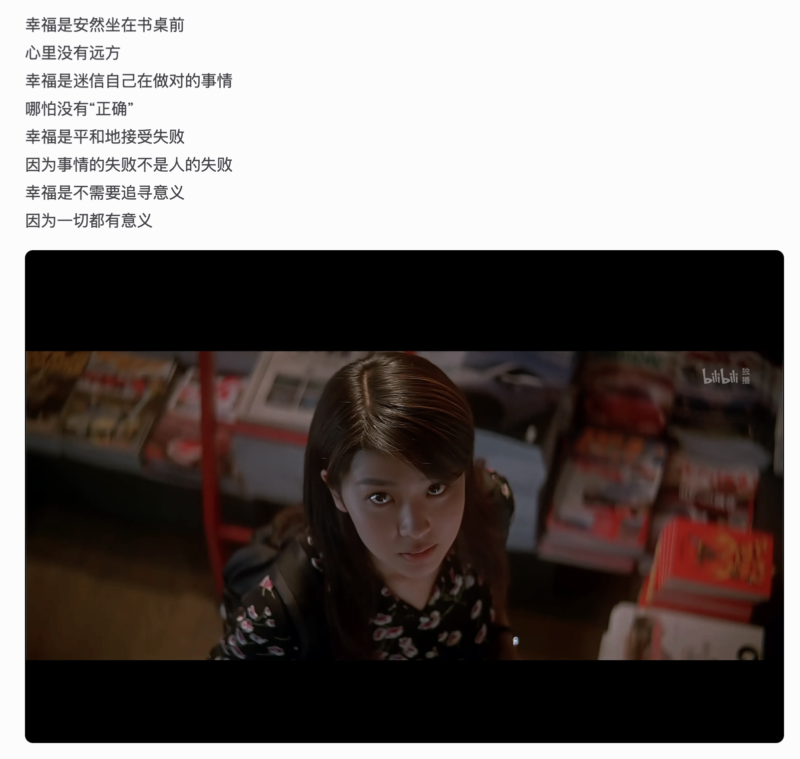
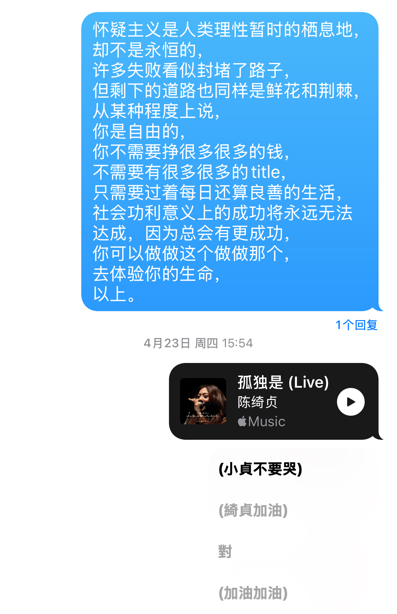
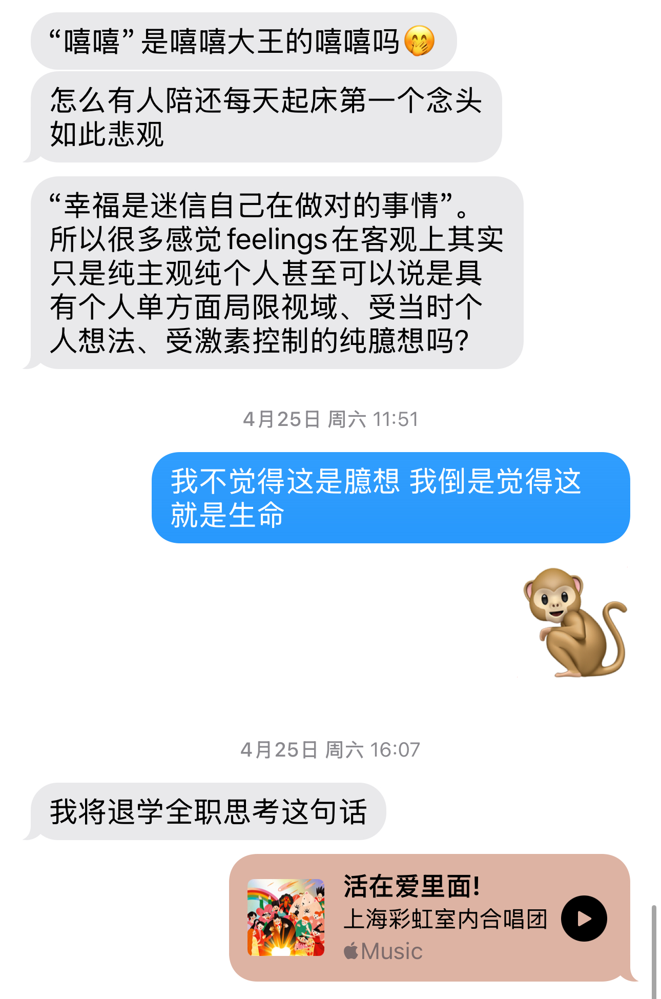
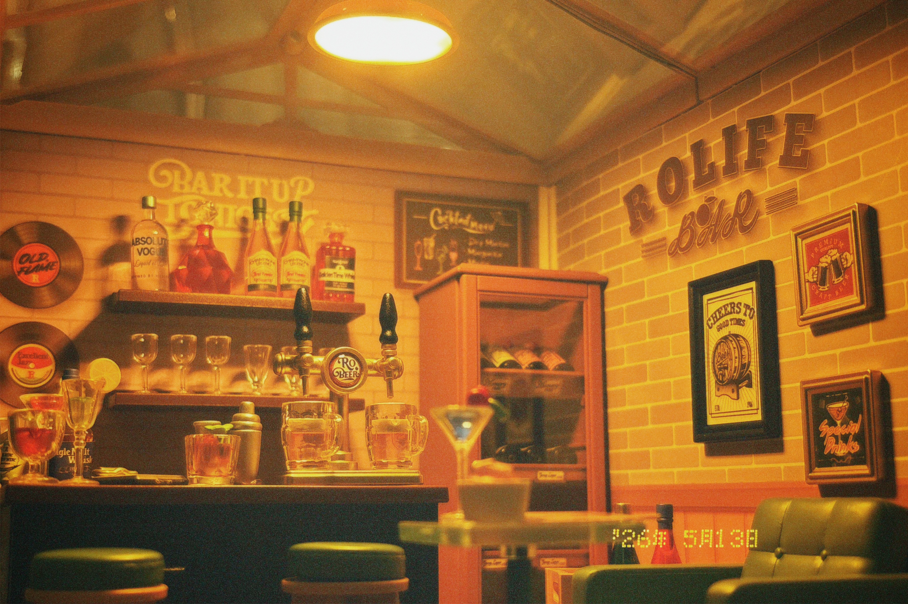
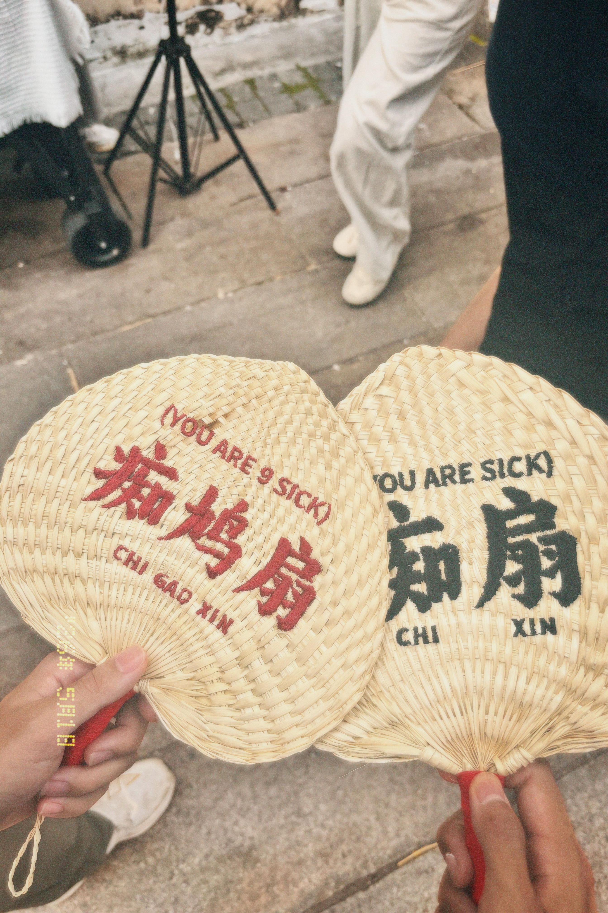
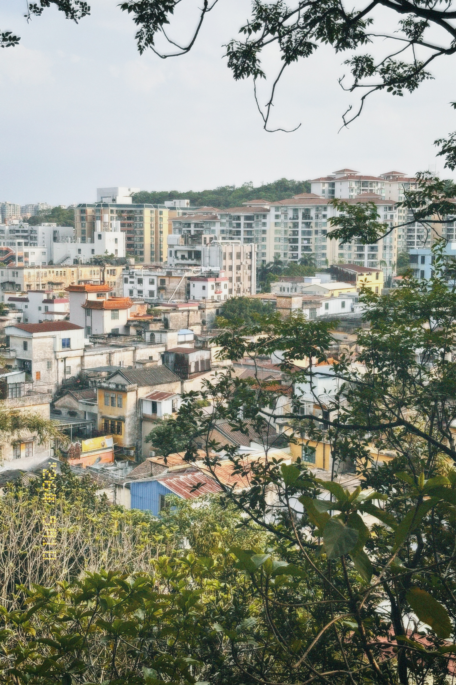
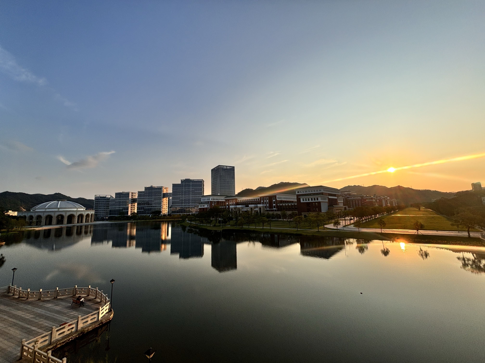
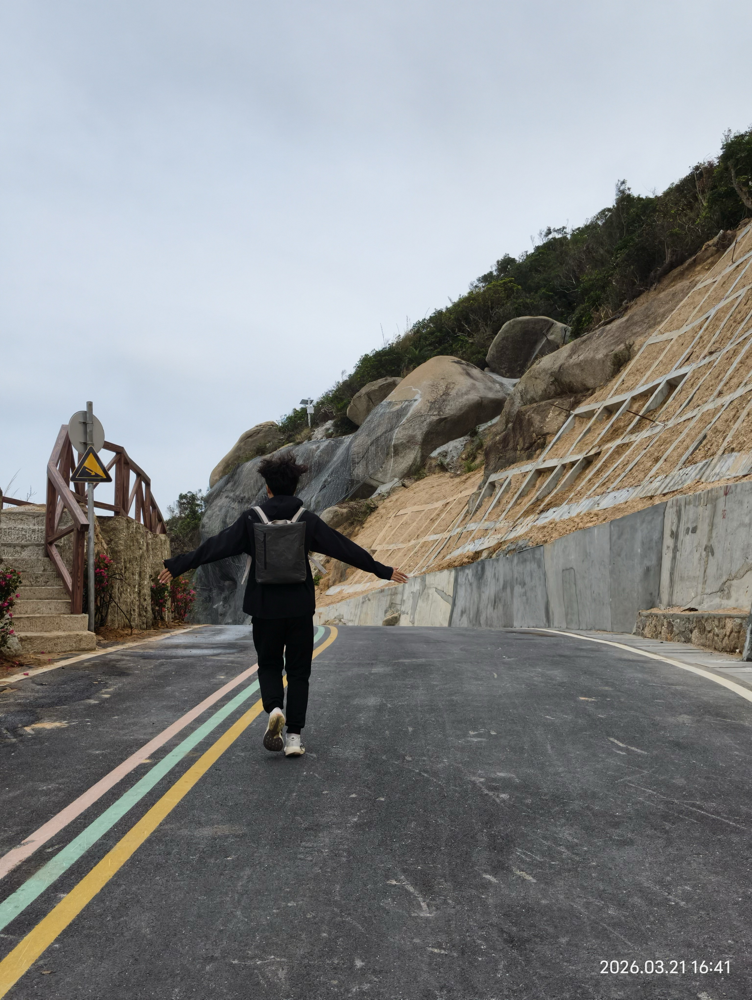
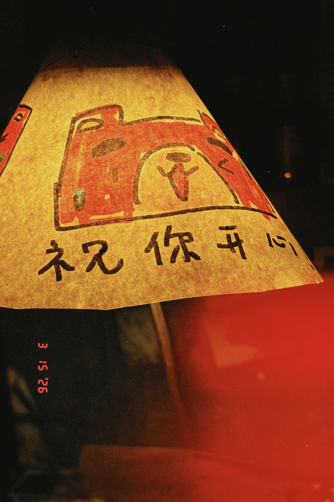
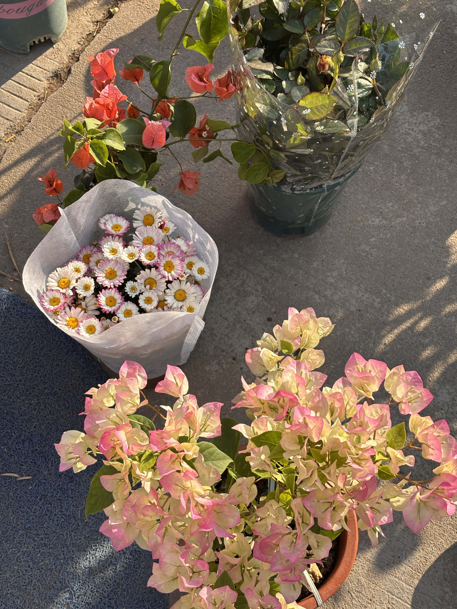

---

> “功绩主体投身于一种自由的强制，为了最大化成就而剥削自己。在这里，剥削者同时也就是被剥削者。”

> “人们感到痛苦的不是他们用笑声代替了思考，而是他们不知道自己为什么笑，以及为什么不再思考。”

> “‘什么是爱？什么是创造？什么是星星？’末人这么问道，并眨眨眼。……‘我们发明了幸福’，末人说，并且眨眨眼。”

---

风是温柔的
你还记得吗