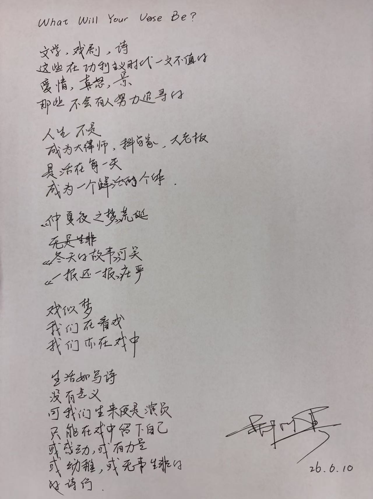

文学，戏剧，诗
这些在功利主义时代一文不值的
爱情，喜怒，景
那些不会有人努力追寻的

人生不是
成为大律师，科学家，大老板
是活在每一天
成为一个鲜活的个体

《仲夏夜之梦》荒诞
《冬天的故事》可笑
《一报还一报》庄严

戏似梦
我们在看戏
我们亦在戏中

生活如写诗
没有意义
可我们生来便是演员
只能在戏中留下自己
或感动，或有力量
或幼稚，或无事生非的
诗行

每个学期都会报一门文史哲类的课，有时去上，有时不去。有时因为心情不好而不去，有时因为心情不好而去。
这学期上的是“西方文化元典”（莎士比亚），恰逢焦虑抑郁，迷茫找不到人生意义的一段时间，其实每节课都不想上，但老师居然记住了班里每一个人，有次笑嘻嘻地问我：“怎么上节课没来呀？”（我：“你怎么知道？！”）所以我也就勉为其难地坐着听听。

但文学自有其力量。老师和我们说，人不是靠法律、商业、人工智能之类的事业目标活着的，人活着靠的是 Passion，是靠爱，靠Carpe Diem。

> You've Got to Find What You Love.
> If you haven’t found it yet, keep looking. 
> Don’t settle.

Life is a Verse.
So, What Will Your Verse Be?