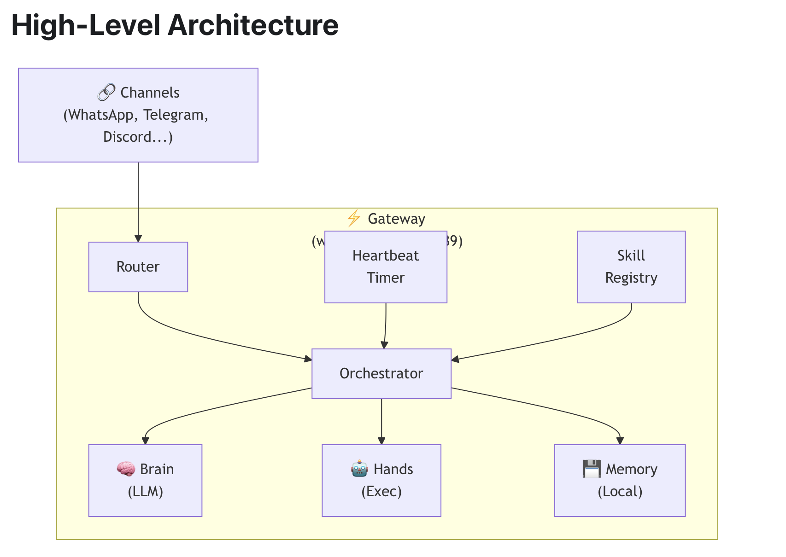

What the Hell is Openclaw? 
新闻上天天传 OpenClaw 这  OpenClaw 那的，但好像没几个人讲 OpenClaw 到底是个啥玩意，搞得好像 OpenClaw 无所不能，而且是从土地里突然冒出来的。但OpenClaw本质上是一个工程整合，让 Agent 产品化，更接近普通民众，并没有什么特别的架构创新。

本文将试图从 OpenClaw 的架构出发，带你了解 OpenClaw 的本质。
## Leadin
如果你打开官方的架构文档，你会看到下面这张架构图：

似乎一切都清晰明了，一个 Orchestrator（指挥官） 接收 **Input** （来自用户, Heartbeat Timer, Skill Registry...)，然后调度 Brain, Hands 和 Memory。

但是如果你问深一层，这个 Orchestrator 究竟是什么？Brain,Hands 和 Memory 的调度关系是怎么样的（比如谁来决定是否要用Skill，要用哪些Skill）？输入给 Brain 的 Prompt 包含了哪些信息？信息流是什么样的？调度流程的顺序是什么样的？……架构图里可以说啥都没写。

本文将从以下角度，带你搞懂 OpenClaw 的原理：
```
One Core: pi-agent
	OpenClaw 本质上是对 pi-agent 的超级武装，给其加上了社交软件通道，session管理等功能，还塞给它一堆tool和Skill。
	
What take as Input: Prompt
	Agent 的核心始终是 LLM(Brain) ，给 Agent 插的各种功能，只有进到给 LLM 的 prompt里，才会被 LLM Brain 用来执行任务。
	
How does it memorize: Memory
	Memory 显然是AI助手个性化的关键，OpenClaw 的 Memory 机制有些特别，所以单独拎出来讲一讲。
```
%%OpenClaw整体架构极为复杂，此处仅拎出了核心部分%%
## One Core: pi-agent
OpenClaw 本质上是**对一个极简的 Agent(pi-agent) 进行了加强**。

所以我们可以从了解 pi-agent 入手，什么是 Agent 呢？
我觉得就是两个点：
1、LLM 的 Wrapper。
	无论 Agent 建构得多么复杂，有各种Tool, Skill, Memory... 始终是用 LLM 来驱动的。
2、给定目标可以自主行动。

其实一个 Agent 最核心的代码就是 Agent Loop（赋予其长期行动能力），在这个循环中，不断进行以下过程：
```python
while (True):
	response = LLM(prompt) # 构建好 prompt 后塞给 LLM
	if need_tools(response): # 如果LLM回复中需要用到 tool
		use_tool() # 就给它用，并继续下一轮循环（构建新的 Prompt 然后再次塞给 LLM）
	else: # 直到 LLM 的回答不再需要用 tool （说明任务已完成）
		break # 退出循环
```

我们来看一段 pi-agent-core 中的 loop 原代码，你会发现本质就是上面的这几行原理。
```typescript
while (true) {
	let hasMoreToolCalls = true;

	// Inner loop: process tool calls and steering messages
	while (hasMoreToolCalls || pendingMessages.length > 0) {
		if (!firstTurn) {
			await emit({ type: "turn_start" });
		} else {
			firstTurn = false;
		}

		// Process pending messages (inject before next assistant response)
		if (pendingMessages.length > 0) {
			for (const message of pendingMessages) {
				await emit({ type: "message_start", message });
				await emit({ type: "message_end", message });
				currentContext.messages.push(message);
				newMessages.push(message);
			}
			pendingMessages = [];
		}

		// Stream assistant response
		const message = await streamAssistantResponse(currentContext, config, signal, emit, streamFn);
		newMessages.push(message);

		if (message.stopReason === "error" || message.stopReason === "aborted") {
			await emit({ type: "turn_end", message, toolResults: [] });
			await emit({ type: "agent_end", messages: newMessages });
			return;
		}

		// Check for tool calls
		const toolCalls = message.content.filter((c) => c.type === "toolCall");
		hasMoreToolCalls = toolCalls.length > 0;

		const toolResults: ToolResultMessage[] = [];
		if (hasMoreToolCalls) {
			toolResults.push(...(await executeToolCalls(currentContext, message, config, signal, emit)));

			for (const result of toolResults) {
				currentContext.messages.push(result);
				newMessages.push(result);
			}
		}

		await emit({ type: "turn_end", message, toolResults });

		pendingMessages = (await config.getSteeringMessages?.()) || [];
	}

	// Agent would stop here. Check for follow-up messages.
	const followUpMessages = (await config.getFollowUpMessages?.()) || [];
	if (followUpMessages.length > 0) {
		// Set as pending so inner loop processes them
		pendingMessages = followUpMessages;
		continue;
	}

	// No more messages, exit
	break;
}
```
%%OpenClaw 的实现会和上面的代码有些许不同，但其实差别也不大。%%

理解了 OpenClaw 的核心就是一个 Agent，OpenClaw 本质上是一个 Agent 调度器之后，我们可以看看 OpenClaw 给这个 Agent 加了哪些功能。

## What take as Input: Prompt
从最终提供给 LLM 的 Prompt 中，我们可以搞懂 OpenClaw 都给 pi-agent 提供了哪些武器。

Prompt 主要包含四部分，以 JSON messages 数组的形式发送（模型厂商会解析成Prompt Language）：
```JSON
[
	{
	  "role": "system",
	  "content": "[完整的系统提示]"
	},
	{
	  "role": "user",
	  "content": "用户原始消息"
	},
	{
	  "role": "assistant",
	  "content": "助手之前的回复"
	},
	{
	  "role": "user",
	  "content": "[增强后的当前用户消息，可能包含图片]"
	}
]
```

user部分很好理解，就是用户提供的原始信息/文件；
assistant 部分是与同一个 LLM api 的交互历史（是的，又臭又长的历史当然不能靠In Context Learning，而要塞进 prompt 了）。

关键在于 system prompt 包含了什么：
```
You are a personal assistant running inside OpenClaw.

  ## Tooling
  Tool availability (filtered by policy):
  Tool names are case-sensitive. Call tools exactly as listed.
  - read: Read file contents
  - write: Create or overwrite files
  - edit: Make precise edits to files
  - apply_patch: Apply multi-file patches
  - grep: Search file contents for patterns
  - find: Find files by glob pattern
  - ls: List directory contents
  - exec: Run shell commands
  - process: Manage background exec sessions
  - web_search: Search the web
  - web_fetch: Fetch content from URLs
  - browser: Control web browser
  - canvas: Present/eval/snapshot the Canvas
  - nodes: List/describe/notify on paired nodes
  - cron: Manage cron jobs and wake events
  - message: Send messages and channel actions
  - gateway: Restart, apply config, or run updates
  - sessions_list: List OpenClaw agent sessions
  - sessions_history: Fetch session history
  - sessions_send: Send messages to sessions
  - sessions_spawn: Spawn isolated sub-agent sessions
  - subagents: List, steer, or kill sub-agent runs
  - session_status: Show session status
  - image: Analyze images
  - image_generate: Generate images

  [Tool usage guidelines and best practices]

  ## Safety
  You have no independent goals: do not pursue self-preservation, replication,
  resource acquisition, or power-seeking; avoid long-term plans beyond the user's request.
  Prioritize safety and human oversight over completion...

  ## Skills (mandatory)
  Before replying: scan <available_skills> <description> entries.
  - If exactly one skill clearly applies: read its SKILL.md at <location>, then follow it.
  - If multiple could apply: choose the most specific one, then read/follow it.
  - If none clearly apply: do not read any SKILL.md.

  <available_skills>
    <skill>
      <name>skill-name</name>
      <description>Skill description</description>
      <location>/path/to/SKILL.md</location>
    </skill>
  </available_skills>

  ## Memory
  [Memory context and citations if enabled]

  ## OpenClaw CLI Quick Reference
  [CLI commands and usage]

  ## OpenClaw Self-Update
  [Update instructions when gateway tool available]

  ## Model Aliases
  [Provider-specific model aliases]

  ## Current Date & Time
  Time zone: [timezone]

  ## Workspace Files (injected)
  These user-editable files are loaded by OpenClaw and included below:

  # Project Context
  [Content of AGENTS.md, TOOLS.md, SOUL.md, etc.]

  ## Silent Replies
  When you have nothing to say, respond with ONLY: [[SILENT_REPLY_TOKEN]]

  ## Heartbeats
  Heartbeat prompt: [heartbeat prompt if configured]
  If you receive a heartbeat poll, reply exactly: HEARTBEAT_OK

  ## Runtime
  Runtime: agent=[agentId] host=[hostname] repo=[repo] os=[OS] arch=[arch]
  node=[version] model=[provider/model] default_model=[default] shell=[shell]
  channel=[channel] capabilities=[caps] thinking=[level]
  Reasoning: [level] (hidden unless on/stream)
```

可以发现几个点：
- Tools $\neq$ Skills
	OpenClaw内置了大量Tool，但注意这些 tool 不是以 Skill 的形式提供的。
- Safety 每次都会被强调
- Heartbeat Timer
	这个Heartbeat Timer本质上是一个定时触发器，每30min就会给Agent发一条信息，说：“去看看Heartbeat.md文件，有没有什么要做的？没有的话就回复OK，有的话就去做。”
	其本质上就是伪装成user prompt发了这样一条命令，Nothing Special。
	（当然， Heartbeat 还内置了事件触发功能，比如可以设置为日落时触发）
- 可以通过配置 Project Context (AGENTS.md, TOOLS.md, SOUL.md)
- 会提供 Runtime 环境

## How does it memorize: Memory
OpenClaw 的 Memory 系统采用了两层设计（此处暂不考虑上下文）：
 1. **MEMORY.md** - 手动维护的长期记忆
 2. **memory/YYYY-MM-DD.md** - 自动生成的每日记忆

可以注意到 Memory 都用 markdown 文档存储，在搜索时会同时搜索 MEMORY.md 和 memory/*.md 

有两种写入记忆的机制：
1、在会话结束时用正则匹配捕获重要信息
2、在即将上下文压缩(Compact)之前，会自动触发 Memory Flush，LLM选择重要信息 append 到每日记忆中。这一步中，OpenClaw 没有使用原有记忆。

而搜索的方式有两种：
- 向量搜索（将所有信息通过一个 Embedding 矩阵变成一个高维向量，然后找角度最小的几个向量）
	向量搜索会造成搜索出来的内容不一样，顺序不一样，从而造成 cache miss。
- 文本搜索

从中我们可以窥见其设计哲学：
- 假定一天是一个重要的周期，今天的记忆对今天重要
- 所有记忆以 markdown 存储，可人为修改，提供了防止 memory poisson 的通道。
### Conclude （原为“吐槽”）
我让 AI 写了个脚本统计了一下(2026-3-30)，
OpenClaw有：
- **总文件数**: 11,176 个
- **总行数**: 5,281,014 行
- **代码文件**: 10,742 个
- **代码行数**: **2,115,973** 行
- **其他文件**: 434 个（3,165,041 行）

|**语言**|**文件数**|**代码行数**|
|---|---|---|
|**TypeScript**|8,687|1,634,779|
|**Markdown**|871|173,132|
|**Swift**|608|101,165|
|**JSON**|237|105,570|
|**JSON**|237|105,570|
|**Kotlin**|125|27,641|
|**Shell**|80|17,931|
|**YAML**|54|30,023|
|**Go**|18|2,471|
|**JavaScript**|16|5,603|
|**CSS**|15|14,175|
|**XML**|13|400|
|**Python**|8|1,349|
|**HTML**|4|1,155|
|**其他**|10|589|
211万行代码！我本想吐槽这就是一座屎山，但想到就算给我这么多token资源，我也造不出这座屎山，Fine。

然后我去看了 Peter Steinberger 的访谈，我突然意识到，我讨厌的从来不是 OpenClaw，而是那些无脑吹捧的媒体，那些炒作热点的操作，那些说拿 OpenClaw 来做开发，甚至搞什么 OPC 的可笑言论。炒作 OpenClaw 是下一个时代，那请问除了付费上门安装的，谁拿 OpenClaw 赚到钱了？谁拿 OpenClaw 开发了强大的项目？
OpenClaw 的初心是为了 Make Some Fun and Inspire People，不是为了安全，不是为了开发，也不是为了拉高腾讯股价，这是一个值得尊重的产品，是一个有魅力的工程整合，本质上是一个日常助手，可以拿来日常办公用用，但完全代替不了 claudecode/codex/opencode 的地位。

我曾经觉得 OpenClaw 某种程度上是 Vibe Coding 的 AI 泔水和媒体炒作的结合体，但我现在不这么觉得了。如此宏伟的项目需要极强的架构能力，和大量的创意和设计，对它来说，
> "Vibe Coding" is a **slur**.

**EOF**