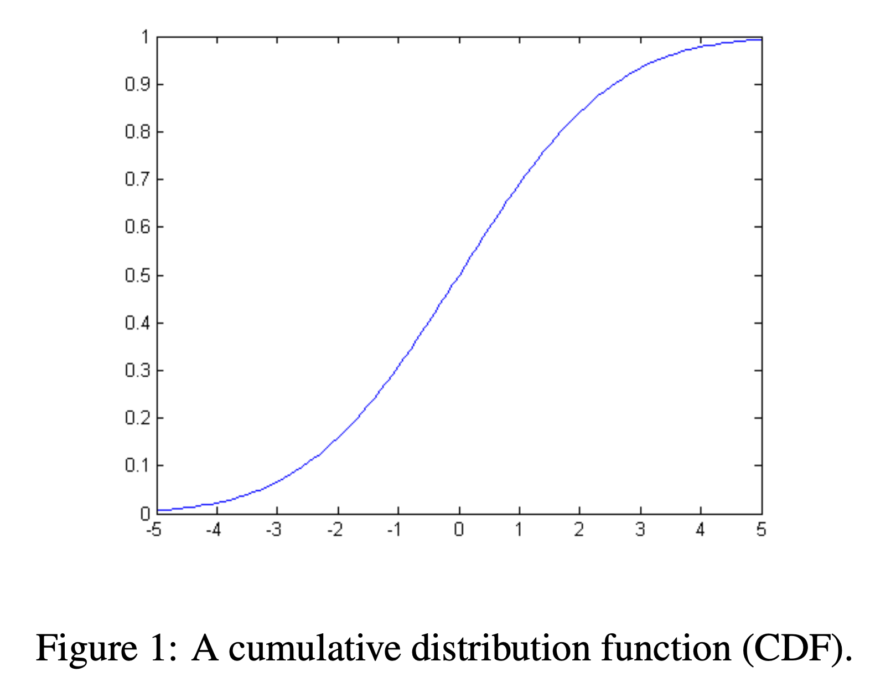
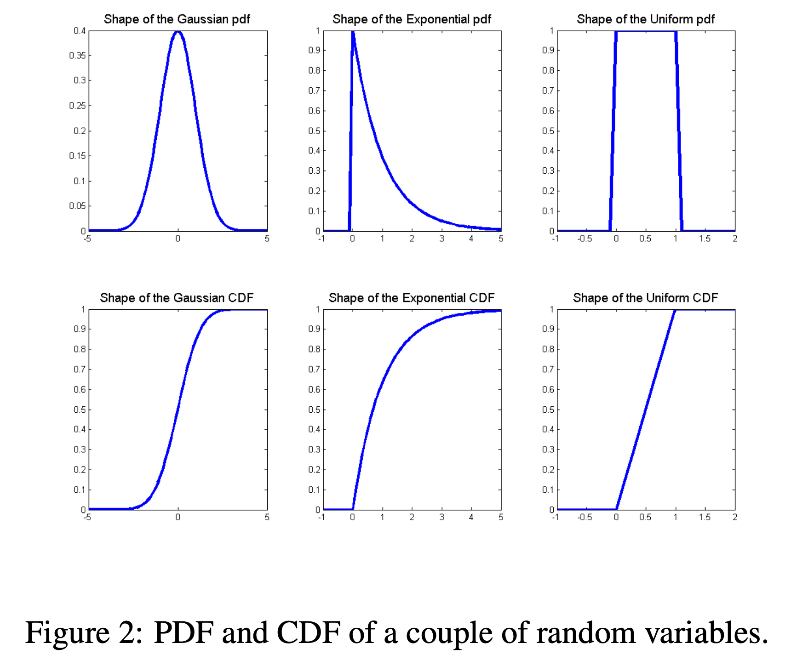

> 本文由Gemini生成翻译后逐字校对修正

**作者：Arian Maleki and Tom Do**
**斯坦福大学**
主翻译者：Google Gemini Pro
副翻译者：JaisonZheng 
（看到现有中文翻译notes中没有这一篇，我原本想自己逐字翻译的，后来发现自己怎么翻都不会有AI翻译得好，遂乖乖地当好AI的编辑。但其实校对也累得很，本篇花了3h+，如有错误或者遗漏欢迎在评论区指正）

概率论是对不确定性的研究。在本课程中，我们将运用概率论的基本概念来推导和理解机器学习算法。这份笔记旨在以适用于 CS229 课程的深度，介绍概率论的核心基础。概率的数学理论非常复杂，并深入到被称为测度论的分析分支。在本笔记中，我们将只对其基础进行阐述，不深入探讨其背后的复杂细节。

## 1. 概率的基本要素

为了严谨地在一个集合上定义概率，我们需要以下几个基本要素：

- **样本空间 (Sample Space) $\Omega$**：一个随机实验所有可能结果的集合。其中每一个结果 $\omega \in \Omega$ 都可以被看作是实验结束时，对真实世界状态的一个完整描述。

- **事件集 (Event Space) $\mathcal{F}$**：由样本空间 $\Omega$ 的若干子集所构成的集合。$\mathcal{F}$ 中的每一个元素 $A$ 被称为一个**事件** (Event)，它代表了实验的一种或多种可能的结果集合 ($A \subseteq \Omega$)。¹

- **概率测度 (Probability Measure)**：一个从事件集 $\mathcal{F}$ 映射到实数 $\mathbb{R}$ 的函数 $P$，且满足以下性质：
    1.  $P(A) \ge 0$，对于所有 $A \in \mathcal{F}$ (非负性)
    2.  $P(\Omega) = 1$ (归一性)
    3.  如果 $A_1, A_2, \ldots$ 是一系列互不相交的事件 (即，当 $i \ne j$ 时，$A_i \cap A_j = \emptyset$)，那么 $P(\cup_i A_i) = \sum_i P(A_i)$ (可数可加性)

以上三条性质被称为**概率公理 (Axioms of Probability)**。

**示例**：考虑投掷一枚六面骰子的实验。其样本空间为 $\Omega = \{1, 2, 3, 4, 5, 6\}$。我们可以基于此定义不同的事件空间。例如，最简单的事件空间是平凡事件空间 $\mathcal{F} = \{\emptyset, \Omega\}$。另一个更常见的事件空间是 $\Omega$ 的幂集（即所有子集构成的集合）。对于前者，唯一满足公理的概率测度是 $P(\emptyset) = 0, P(\Omega) = 1$。对于后者，一种有效的概率测度是：将任一事件的概率定义为其包含的元素数量除以 6，例如，$P(\{1,2,3,4\}) = \frac{4}{6}$，$P(\{1,2,3\}) = \frac{3}{6}$。

**基本性质**:
- 如果 $A \subseteq B$，则 $P(A) \le P(B)$。
- $P(A \cap B) \le \min(P(A), P(B))$。
- (联合界) $P(A \cup B) \le P(A) + P(B)$。
- $P(\Omega \setminus A) = 1 - P(A)$ (补集概率)。
- (全概率定律) 如果 $A_1, \ldots, A_k$ 是一组互不相交的事件，且它们的并集构成整个样本空间 $\Omega$ (即 $\cup_{i=1}^k A_i = \Omega$)，那么 $\sum_{i=1}^k P(A_i) = 1$。

---
¹ 严格来说，事件空间 $\mathcal{F}$ 必须满足三个条件
(1) $\emptyset \in \mathcal{F}$；
(2) 如果 $A \in \mathcal{F}$，那么其补集 $\Omega \setminus A \in \mathcal{F}$；（即如果A发生被认为是一个有效的事件，那么A的补集“A不发生”也应当被认为是一个有效的事件）
(3) 如果 $A_1, A_2, \ldots \in \mathcal{F}$，那么它们的可数并集 $\cup_i A_i \in \mathcal{F}$。

### 1.1 条件概率与独立性

设 B 为一个概率不为零的事件。事件 A 在事件 B 已发生的条件下的**条件概率 (Conditional Probability)** 定义为：
$$ P(A|B) = \frac{P(A \cap B)}{P(B)} $$
换言之，$P(A|B)$ 是在观测到事件 B 发生之后，对事件 A 发生可能性的重新度量。

两个事件 A 和 B 被称为**独立的 (Independent)**，当且仅当 $P(A \cap B) = P(A)P(B)$。这等价于 $P(A|B) = P(A)$。因此，独立性意味着观测到事件 B 的发生与否，并不会对事件 A 的概率产生任何影响（反之亦然）。

## 2. 随机变量

考虑一个投掷10次硬币的实验，并关心出现正面的总次数。在这个场景下，样本空间 $\Omega$ 的元素是所有长度为10的正反序列，例如 $\omega_0 = (H, H, T, \ldots, T)$。然而在实际应用中，我们通常不关心某个特定序列出现的概率，而是关心由实验结果决定的某个数值，比如“10次投掷中出现正面的次数”或“连续出现反面的最长次数”。这些将实验结果映射为实值的函数，在满足特定技术条件时，被称为**随机变量 (Random Variables)**。

更正式地，一个随机变量 $X$ 是一个从样本空间 $\Omega$ 映射到实数集 $\mathbb{R}$ 的函数，即 $X : \Omega \rightarrow \mathbb{R}$。² 我们通常用大写字母（如 $X$）表示随机变量，并用小写字母（如 $x$）表示其可能取的具体数值。

**离散随机变量**: 如果一个随机变量只能取有限个或可数无限个值，则称其为**离散随机变量 (Discrete Random Variable)**。例如，在投掷10次硬币的实验中，代表正面次数的随机变量 $X$ 就是离散的，其所有可能取值的集合为 $Val(X) = \{0, 1, \dots, 10\}$。我们关心的是随机变量取某一特定值的概率：
$$ P(X = k) := P(\{\omega \in \Omega : X(\omega) = k\}) $$

**连续随机变量**: 如果一个随机变量可以取某一区间内的任意实数值，则称其为**连续随机变量 (Continuous Random Variable)**。例如，一个表示放射性粒子衰变所需时间的随机变量 $X$ 就是连续的。对于连续变量，我们通常讨论其落入某个区间的概率（因为每一个点的概率都是0）：
$$ P(a \le X \le b) := P(\{\omega \in \Omega : a \le X(\omega) \le b\}) $$

---
² 从测度论的角度，一个函数要成为随机变量，必须是“博雷尔可测的”(Borel-measurable)。这一限制确保了诸如 $\{\omega : X(\omega) \le x\}$ 这样的集合总是属于事件空间 $\mathcal{F}$，从而可以被赋予概率。

### 2.1 累积分布函数 (CDF)

为了描述随机变量的概率特性，我们引入了几个关键函数（CDF、PDF 和 PMF）。在本节和接下来的两节中，我们将依次描述这些类型的函数。

**累积分布函数 (Cumulative Distribution Function, CDF)** 是其中最基本的一个，它定义为：
$$ F_X(x) \triangleq P(X \le x) $$
CDF 函数 $F_X(x)$ 给出了随机变量 $X$ 的值**不大于 $x$** 的概率。通过 CDF，我们可以计算出 $X$ 落在任何区间的概率。

**CDF 的性质**:
- $0 \le F_X(x) \le 1$。
- $\lim_{x \to -\infty} F_X(x) = 0$ 且 $\lim_{x \to \infty} F_X(x) = 1$。
- $F_X(x)$ 是单调不减的，即如果 $x \le y$，则 $F_X(x) \le F_X(y)$。

### 2.2 概率质量函数 (PMF)

对于离散随机变量，我们可以用一种更直观的方式来描述其分布，即**概率质量函数 (Probability Mass Function, PMF)**。PMF 直接给出了随机变量取每一个可能值的概率：
$$ p_X(x) \triangleq P(X = x) $$
**PMF 的性质**:
- $0 \le p_X(x) \le 1$。
- $\sum_{x \in Val(X)} p_X(x) = 1$ (所有可能值的概率之和为1)。
- $\sum_{x \in A} p_X(x) = P(X \in A)$。

另外，我们使用符号 $Val(X)$ 表示随机变量 X 可能假设的值的集合。例如，如果 $X(\omega)$ 是一个指示十次硬币抛掷中正面次数的随机变量，那么 $Val(X) = \{0, 1, 2, \ldots, 10\}$

### 2.3 概率密度函数 (PDF)

对于连续随机变量，由于其在任何单点取值的概率为零，PMF 的概念不再适用。取而代之，我们使用**概率密度函数 (Probability Density Function, PDF)**。如果一个连续随机变量的 CDF 函数 $F_X(x)$ **处处可微**，那么其 PDF 定义为其 CDF 的导数：
$$ f_X(x) \triangleq \frac{dF_X(x)}{dx} $$
根据导数的定义，对于一个极小的区间 $\Delta x$，我们有：
$$ P(x \le X \le x + \Delta x) \approx f_X(x) \Delta x $$
需要强调的是，$f_X(x)$ 的值本身并**不代表**概率，它描述的是概率在点 $x$ 附近的“密度”。$f_X(x)$ 的值可以大于1，但它在任意区间上的积分（代表概率）绝不会超过1。

**PDF 的性质**:
- $f_X(x) \ge 0$。
- $\int_{-\infty}^{\infty} f_X(x) dx = 1$ (总概率为1)。
- $\int_{A} f_X(x) dx = P(X \in A)$ (变量落在集合A中的概率等于PDF在A上的积分)。

### 2.4 期望

随机变量的**期望 (Expectation)** 是其所有可能取值的加权平均，权重为其对应的概率（或概率密度）。对于任意函数 $g(X)$，其期望 $E[g(X)]$ 定义为：
- **离散情况**:
  $$ E[g(X)] \triangleq \sum_{x \in Val(X)} g(x) p_X(x) $$
- **连续情况**:
  $$ E[g(X)] \triangleq \int_{-\infty}^{\infty} g(x) f_X(x) dx $$
当 $g(x) = x$ 时，我们得到随机变量 $X$ 本身的期望 $E[X]$，通常也称为**均值 (Mean)**。

**性质**:
- 对于常数 $a$， $E[a] = a$。
- 对于常数 $a$， $E[a f(X)] = a E[f(X)]$。
- $E[f(X) + g(X)] = E[f(X)] + E[g(X)]$（线性性）。
- 对于离散变量，$E[1\{X=k\}] = P(X=k)$，其中 $1\{\cdot\}$ 是指示函数，当中括号里面的条件为真时，取1，否则取0。

### 2.5 方差

**方差 (Variance)** 用于度量随机变量的取值在其均值附近的分散程度。其定义为：
$$ Var[X] \triangleq E[(X - E[X])^2] $$
通过期望的线性性质，可以推导出更便于计算的公式：
$$ Var[X] = E[X^2 - 2X E[X] + (E[X])^2] = E[X^2] - E[X]^2 $$

**性质**:
- 对于常数 $a$， $Var[a] = 0$。
- 对于常数 $a$， $Var[a f(X)] = a^2 Var[f(X)]$。

**示例**：计算在 $[0, 1]$ 上均匀分布的随机变量 $X$ 的均值和方差。其 PDF 为 $f_X(x) = 1, \forall x \in [0, 1]$。
- **均值**: $E[X] = \int_0^1 x \cdot 1 dx = \frac{1}{2}$
- **$X^2$ 的期望**: $E[X^2] = \int_0^1 x^2 \cdot 1 dx = \frac{1}{3}$
- **方差**: $Var[X] = E[X^2] - (E[X])^2 = \frac{1}{3} - (\frac{1}{2})^2 = \frac{1}{12}$

### 2.6 常见随机变量分布

**对于离散随机变量**
- **$X \sim \text{Bernoulli}(p)$** (其中 $0 \le p \le 1$)：如果一个正面概率为 p 的硬币出现正面，则为1，否则为0。
  $p(x) = \begin{cases} p & \text{if } x=1 \\ 1-p & \text{if } x=0 \end{cases}$
- **$X \sim \text{Binomial}(n, p)$** (其中 $0 \le p \le 1$)：n 次独立抛掷正面概率为 p 的硬币中出现正面的次数。
  $p(x) = \binom{n}{x} p^x (1-p)^{n-x}$
- **$X \sim \text{Geometric}(p)$** (其中 $p > 0$)：抛掷一个正面概率为 p 的硬币直到第一次出现正面所需的次数。
  $p(x) = p(1-p)^{x-1}$
- **$X \sim \text{Poisson}(\lambda)$** (其中 $\lambda > 0$)：一个用于模拟稀有事件频率的非负整数上的概率分布。
  $p(x) = e^{-\lambda} \frac{\lambda^x}{x!}$

**对于连续随机变量**
- **$X \sim \text{Uniform}(a, b)$** (其中 $a < b$)：在实线上 a 和 b 之间的每个值都有相等的概率密度。
  $f(x) = \begin{cases} \frac{1}{b-a} & \text{if } a \le x \le b \\ 0 & \text{otherwise} \end{cases}$
- **$X \sim \text{Exponential}(\lambda)$** (其中 $\lambda > 0$)：在非负实数上呈衰减的概率密度。
  $f(x) = \begin{cases} \lambda e^{-\lambda x} & \text{if } x \ge 0 \\ 0 & \text{otherwise} \end{cases}$
- **$X \sim \text{Normal}(\mu, \sigma^2)$**：也称为高斯分布。
  $f(x) = \frac{1}{\sqrt{2\pi}\sigma} \exp\left(-\frac{1}{2\sigma^2}(x-\mu)^2\right)$

下表总结了这些分布的关键性质：

| 分布 | PDF 或 PMF | 均值 (Mean) | 方差 (Variance) |
| :--- | :--- | :--- | :--- |
| Bernoulli(p) | $p^x(1-p)^{1-x}$ 对 $x \in \{0,1\}$ | $p$ | $p(1-p)$ |
| Binomial(n,p) | $\binom{n}{k}p^k(1-p)^{n-k}$ | $np$ | $np(1-p)$ |
| Geometric(p) | $p(1-p)^{k-1}$ 对 $k=1,2,\ldots$ | $1/p$ | $(1-p)/p^2$ |
| Poisson($\lambda$) | $e^{-\lambda}\lambda^x/x!$ | $\lambda$ | $\lambda$ |
| Uniform(a, b) | $1/(b-a)$ 对 $x \in [a,b]$ | $(a+b)/2$ | $(b-a)^2/12$ |
| Gaussian($\mu, \sigma^2$) | $\frac{1}{\sigma\sqrt{2\pi}}\exp(-\frac{(x-\mu)^2}{2\sigma^2})$ | $\mu$ | $\sigma^2$ |
| Exponential($\lambda$) | $\lambda e^{-\lambda x}$ 对 $x \ge 0$ | $1/\lambda$ | $1/\lambda^2$ |

## 3. 两个随机变量

到目前为止，我们只考虑了单个随机变量。然而，在许多情况下，我们可能对随机实验中的多个量感兴趣。例如，在抛掷十次硬币的实验中，我们可能同时关心正面出现的总次数 $X$ 和连续出现正面的最长次数 $Y$。

### 3.1 联合分布与边缘分布

假设我们有两个随机变量 X 和 Y。处理这两个随机变量的一种方法是分别考虑它们中的每一个。如果我们这样做，我们只需要 $F_X(x)$ 和 $F_Y(y)$。但是，如果我们想知道 X 和 Y 在随机实验结果中同时取的值，我们需要一个更复杂的结构：**联合分布 (Joint Distribution)**。
- **联合累积分布函数 (Joint CDF)** 定义为：
$$ F_{XY}(x, y) = P(X \le x, Y \le y) $$
可以证明，通过知道联合累积分布函数，可以计算涉及 X 和 Y 的任何事件的概率。

- 我们可以从联合分布中恢复出单个变量的分布，这被称为**边缘分布 (Marginal Distribution)**。
  $$ F_X(x) = \lim_{y \to \infty} F_{XY}(x, y) $$
  $$ F_Y(y) = \lim_{x \to \infty} F_{XY}(x, y) $$

对于离散变量，**联合 PMF** 为 $p_{XY}(x, y) = P(X=x, Y=y)$。**边缘 PMF** 则通过对另一个变量的所有可能值求和得到：
$$ p_X(x) = \sum_y p_{XY}(x, y) $$

对于连续变量，**联合 PDF** 为 $f_{XY}(x, y)$。**边缘 PDF** 通过对另一个变量在整个实数域上积分得到：
$$ f_X(x) = \int_{-\infty}^{\infty} f_{XY}(x, y) dy $$
这个从联合分布计算边缘分布的过程被称为**边缘化 (Marginalization)**。

### 3.2 条件分布

**条件分布 (Conditional Distribution)** 旨在回答：当已知一个随机变量 $X$ 的取值为 $x$ 时，另一个随机变量 $Y$ 的概率分布是怎样的。
- **离散情况**: 条件 PMF 定义为：
  $$ p_{Y|X}(y|x) = \frac{p_{XY}(x, y)}{p_X(x)}, \quad \text{前提 } p_X(x) > 0 $$
- **连续情况**: 条件 PDF 定义为：
  $$ f_{Y|X}(y|x) = \frac{f_{XY}(x, y)}{f_X(x)}, \quad \text{前提 } f_X(x) > 0 $$
### 3.3 联合和边缘概率密度函数

设 X 和 Y 是两个具有联合分布函数 $F_{XY}$ 的连续随机变量。在 $F_{XY}(x, y)$ 在 x 和 y 上处处可微的情况下，我们可以定义**联合概率密度函数**：
$$ f_{XY}(x, y) = \frac{\partial^2 F_{XY}(x, y)}{\partial x \partial y} $$
与一维情况类似，$f_{XY}(x, y) \ne P(X=x, Y=y)$，而是：
$$ \int_{A} \int f_{XY}(x, y) dx dy = P((X, Y) \in A) $$
与离散情况类似，我们定义：
$$ f_X(x) = \int_{-\infty}^{\infty} f_{XY}(x, y) dy $$
作为 X 的**边缘概率密度函数**（或边缘密度），$f_Y(y)$ 也类似。

### 3.4 条件分布

条件分布试图回答这样一个问题：当我们知道 X 必须取某个特定值 $x$ 时，Y 的概率分布是什么？

在离散情况下，给定 Y 的 X 的**条件概率质量函数**很简单：
$$ p_{Y|X}(y|x) = \frac{p_{XY}(x, y)}{p_X(x)} $$
假设 $p_X(x) \ne 0$。

在连续情况下，情况在技术上要复杂一些，因为连续随机变量 X 取特定值 $x$ 的概率等于零。忽略这个技术点，我们简单地通过与离散情况类比，定义给定 $X=x$ 时 Y 的**条件概率密度**为：
$$ f_{Y|X}(y|x) = \frac{f_{XY}(x, y)}{f_X(x)} $$
前提是 $f_X(x) \ne 0$。

### 3.5 贝叶斯法则

在试图推导一个变量给定另一个变量的条件概率表达式时，一个经常出现的有用公式是**贝叶斯法则**。
在离散随机变量 X 和 Y 的情况下：
$$ P_{Y|X}(y|x) = \frac{P_{XY}(x,y)}{P_X(x)} = \frac{P_{X|Y}(x|y)P_Y(y)}{\sum_{y' \in Val(Y)} P_{X|Y}(x|y')P_Y(y')} $$
如果随机变量 X 和 Y 是连续的：
$$ f_{Y|X}(y|x) = \frac{f_{XY}(x,y)}{f_X(x)} = \frac{f_{X|Y}(x|y)f_Y(y)}{\int_{-\infty}^{\infty} f_{X|Y}(x|y')f_Y(y')dy'} $$

### 3.6 独立性

两个随机变量 X 和 Y 是**独立**的，如果对于所有 x 和 y 的值，$F_{XY}(x, y) = F_X(x)F_Y(y)$。等价地：
- 对于离散随机变量，$p_{XY}(x, y) = p_X(x)p_Y(y)$ 对所有 $x \in Val(X), y \in Val(Y)$。
- 对于离散随机变量，只要 $p_X(x) \ne 0$，就有 $p_{Y|X}(y|x) = p_Y(y)$ 对所有 $y \in Val(Y)$。
- 对于连续随机变量，$f_{XY}(x, y) = f_X(x)f_Y(y)$ 对所有 $x, y \in \mathbb{R}$。
- 对于连续随机变量，只要 $f_X(x) \ne 0$，就有 $f_{Y|X}(y|x) = f_Y(y)$ 对所有 $y \in \mathbb{R}$。

非正式地说，两个随机变量 X 和 Y 是独立的，如果“知道”一个变量的值永远不会对另一个变量的条件概率分布产生任何影响。

### 3.7 期望和协方差

假设我们有两个随机变量 X, Y 和一个函数 $g : \mathbb{R}^2 \rightarrow \mathbb{R}$。那么 g 的期望值定义如下：
对于离散随机变量：
$$ E[g(X, Y)] \triangleq \sum_{x \in Val(X)} \sum_{y \in Val(Y)} g(x, y) p_{XY}(x, y) $$
对于连续随机变量：
$$ E[g(X, Y)] \triangleq \int_{-\infty}^{\infty} \int_{-\infty}^{\infty} g(x, y) f_{XY}(x, y) dx dy $$
我们可以用期望的概念来研究两个随机变量之间的关系。特别地，两个随机变量 X 和 Y 的**协方差**定义为：
$$ Cov[X, Y] \triangleq E[(X - E[X])(Y - E[Y])] $$
使用与方差类似的论证，我们可以将其重写为：
$$ Cov[X, Y] = E[XY - X E[Y] - Y E[X] + E[X] E[Y]] $$
$$ = E[XY] - E[X]E[Y] - E[Y]E[X] + E[X]E[Y] $$
$$ = E[XY] - E[X]E[Y] $$
- 当 $Cov[X, Y] = 0$ 时，我们说 X 和 Y 是**不相关**的。
- 如果 $Cov(X, Y) > 0$，表示 X 和 Y 倾向于同向变化（正相关）。
- 如果 $Cov(X, Y) < 0$，表示 X 和 Y 倾向于反向变化（负相关）。

**性质**：
- $E[f(X, Y) + g(X, Y)] = E[f(X, Y)] + E[g(X, Y)]$。（期望的线性性）
- $Var[X + Y] = Var[X] + Var[Y] + 2Cov[X, Y]$。
- 如果 X 和 Y 独立，则 $Cov[X, Y] = 0$。（即独立一定不相关）
- **反之不成立**！不相关不一定独立。例如，设  且 $Y=X^2$，可以证明 $Cov(X,Y)=0$，但 Y 的值完全由 X 决定，因此它们显然不是独立的。（不相关不一定独立）
- 如果 X 和 Y 独立，则 $E[f(X)g(Y)] = E[f(X)]E[g(Y)]$。

## 4. 多个随机变量

以上关于两个随机变量的概念可以自然地推广到 $n$ 个随机变量 $X_1, \ldots, X_n$ 的情况。

### 4.1 基本性质
### 4.1 基本性质
我们可以定义 **联合分布函数**（joint distribution function）$F_{X_1,X_2,\ldots,X_n}$，  
**联合概率密度函数**（joint probability density function）$f_{X_1,X_2,\ldots,X_n}$，  
**边缘概率密度函数**（marginal probability density function）$f_{X_1}$，  
以及 **条件概率密度函数**（conditional probability density function）$f_{X_1|X_2,\ldots,X_n}$，如下：

$$
F_{X_1,\ldots,X_n}(x_1,x_2,\ldots,x_n) = P(X_1 \le x_1, X_2 \le x_2, \ldots, X_n \le x_n)
$$

$$
f_{X_1,\ldots,X_n}(x_1,x_2,\ldots,x_n) = 
\frac{\partial^n F_{X_1,\ldots,X_n}(x_1,x_2,\ldots,x_n)}{\partial x_1 \cdots \partial x_n}
$$

$$
f_{X_1}(x_1) = \int_{-\infty}^{\infty} \cdots \int_{-\infty}^{\infty} 
f_{X_1,\ldots,X_n}(x_1,x_2,\ldots,x_n) dx_2 \cdots dx_n
$$

$$
f_{X_1|X_2,\ldots,X_n}(x_1|x_2,\ldots,x_n) = 
\frac{f_{X_1,\ldots,X_n}(x_1,x_2,\ldots,x_n)}{f_{X_2,\ldots,X_n}(x_2,\ldots,x_n)}
$$

为了计算一个事件 $A \subseteq \mathbb{R}^n$ 的概率，我们有：
$$
P\big((x_1,x_2,\ldots,x_n) \in A\big) = \int_{(x_1,\ldots,x_n)\in A} 
f_{X_1,\ldots,X_n}(x_1,x_2,\ldots,x_n)\, dx_1 dx_2 \cdots dx_n \tag{4}
$$

**链式法则（Chain rule）：**  
由条件概率的定义，对于多个随机变量，可以得到：
$$
f(x_1,x_2,\ldots,x_n) 
= f(x_n|x_1,x_2,\ldots,x_{n-1}) f(x_1,x_2,\ldots,x_{n-1})
$$
$$
= f(x_n|x_1,x_2,\ldots,x_{n-1}) f(x_{n-1}|x_1,x_2,\ldots,x_{n-2}) f(x_1,x_2,\ldots,x_{n-2})
$$
$$
= \cdots = f(x_1) \prod_{i=2}^n f(x_i|x_1,\ldots,x_{i-1})
$$

**独立性（Independence）：**  
对于多个事件 $A_1, \ldots, A_k$，我们称 $A_1, \ldots, A_k$ **相互独立**（mutually independent），
若对任意子集 $S \subseteq \{1,2,\ldots,k\}$，都有：
$$
P\Big(\bigcap_{i\in S} A_i\Big) = \prod_{i\in S} P(A_i)。
$$

类似地，若随机变量 $X_1,\ldots,X_n$ 相互独立，则：
$$
f(x_1,\ldots,x_n) = f(x_1) f(x_2) \cdots f(x_n)。
$$

在这里，互相独立的定义只是从两个随机变量推广到了多个随机变量。

在机器学习算法中，独立随机变量常常出现，因为我们假设训练集中的样本是从某个未知的概率分布中独立采样得到的。为了说明独立性的重要性，可以考虑一个“糟糕”的训练集构造方式：  
我们先从未知分布中抽取一个样本 $(x^{(1)}, y^{(1)})$，然后再复制 $m-1$ 份相同的样本加入训练集。此时：
$$
P\big((x^{(1)},y^{(1)}), \ldots, (x^{(m)},y^{(m)})\big) \ne \prod_{i=1}^m P(x^{(i)},y^{(i)})。
$$

虽然训练集大小是 $m$，但这些样本**并不独立**！显然，这种构造方式并不是一种合理的机器学习训练方法。但在实际中，样本间的非独立性确实经常发生，这会减少训练集的“有效规模”（effective size）。
### 4.2 随机向量

处理多个随机变量时，将它们组织成一个**随机向量 (Random Vector)** $X = [X_1, \ldots, X_n]^T$ 会非常方便。

- 随机向量的**期望**：向量函数 $g(X)$ 的期望是逐元素计算的。考虑一个任意函数 $g : \mathbb{R}^n \rightarrow \mathbb{R}^m$。g 的期望值是输出向量的逐元素期望值，即$E[X] = [\mu_1, \ldots, \mu_n]^T$

- 随机向量的**协方差矩阵**：对于一个给定的随机向量 $X : \Omega \rightarrow \mathbb{R}^n$，其**协方差矩阵** $\Sigma$ 是一个 $n \times n$ 的方阵，其中第 $(i,j)$ 个元素是 $Cov(X_i, X_j)$。
根据协方差的定义，我们有：
**协方差矩阵（Covariance matrix）：**  
对于一个给定的随机向量 $X : \Omega \to \mathbb{R}^n$，它的协方差矩阵 $\Sigma$ 是一个 $n \times n$ 的方阵，其元素由下式给出：  
$$
\Sigma_{ij} = \mathrm{Cov}[X_i, X_j]。
$$

由协方差的定义可得：
$$
\Sigma =
\begin{bmatrix}
\mathrm{Cov}[X_1, X_1] & \cdots & \mathrm{Cov}[X_1, X_n] \\
\vdots & \ddots & \vdots \\
\mathrm{Cov}[X_n, X_1] & \cdots & \mathrm{Cov}[X_n, X_n]
\end{bmatrix}
$$

$$
= 
\begin{bmatrix}
\mathbb{E}[X_1^2] - \mathbb{E}[X_1]\mathbb{E}[X_1] & \cdots & \mathbb{E}[X_1 X_n] - \mathbb{E}[X_1]\mathbb{E}[X_n] \\
\vdots & \ddots & \vdots \\
\mathbb{E}[X_n X_1] - \mathbb{E}[X_n]\mathbb{E}[X_1] & \cdots & \mathbb{E}[X_n^2] - \mathbb{E}[X_n]\mathbb{E}[X_n]
\end{bmatrix}
$$

$$
=
\begin{bmatrix}
\mathbb{E}[X_1^2] & \cdots & \mathbb{E}[X_1 X_n] \\
\vdots & \ddots & \vdots \\
\mathbb{E}[X_n X_1] & \cdots & \mathbb{E}[X_n^2]
\end{bmatrix}
-
\begin{bmatrix}
\mathbb{E}[X_1]\mathbb{E}[X_1] & \cdots & \mathbb{E}[X_1]\mathbb{E}[X_n] \\
\vdots & \ddots & \vdots \\
\mathbb{E}[X_n]\mathbb{E}[X_1] & \cdots & \mathbb{E}[X_n]\mathbb{E}[X_n]
\end{bmatrix}
$$

$$
= \mathbb{E}[X X^T] - \mathbb{E}[X]\mathbb{E}[X]^T
= \cdots
= \mathbb{E}\!\left[(X - \mathbb{E}[X])(X - \mathbb{E}[X])^T\right].
$$
总结：
$$ \Sigma = E[XX^T] - E[X]E[X]^T = E[(X - E[X])(X - E[X])^T] $$
协方差矩阵具有一些有用的性质：
- $\Sigma \succeq 0$；也就是说，$\Sigma$ 是半正定的。
- $\Sigma = \Sigma^T$；也就是说，$\Sigma$ 是对称的。
- 对角线上的元素是各个随机变量的方差。
### 4.3 多元高斯分布

在多维随机向量的分布中，**多元高斯分布 (Multivariate Gaussian Distribution)** 或多元正态分布至关重要。一个随机向量 $X \in \mathbb{R}^n$ 服从该分布，如果其 PDF 由均值向量 $\mu \in \mathbb{R}^n$ 和协方差矩阵 $\Sigma \in \mathbb{S}_{++}^n$ 完全确定：（其中 $\mathbb{S}_{++}^n$ 指的是对称正定 $n \times n$ 矩阵的空间，即$\Sigma$为对称正定矩阵）
$$ f_{X_1, \ldots, X_n}(x_1, \ldots, x_n; \mu, \Sigma) = \frac{1}{(2\pi)^{n/2} |\Sigma|^{1/2}} \exp\left(-\frac{1}{2}(x - \mu)^T \Sigma^{-1} (x - \mu)\right) $$
我们记作 $X \sim \mathcal{N}(\mu, \Sigma)$。

多元高斯分布在机器学习中极其有用，主要原因有二：
1.  **中心极限定理**: 许多独立的随机过程的累加效应往往趋近于高斯分布，因此它非常适合为现实世界中的“噪声”建模。
2.  **分析便利性**: 涉及高斯分布的许多积分（如边缘化、条件化）都有简洁的闭式解，这使得基于它的许多模型在数学上易于处理。

## 5 其他参考资料

适合 CS229 水平的概率教材推荐：Sheldon Ross 的 *A First Course on Probability*。