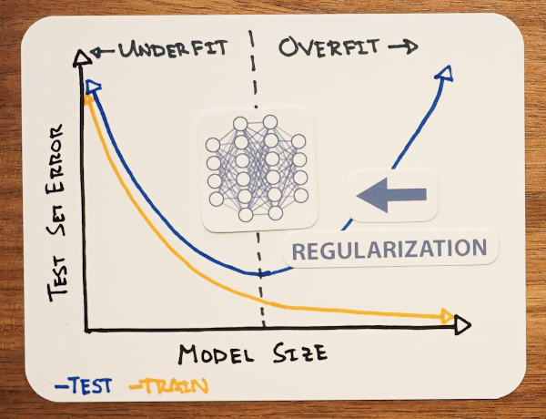
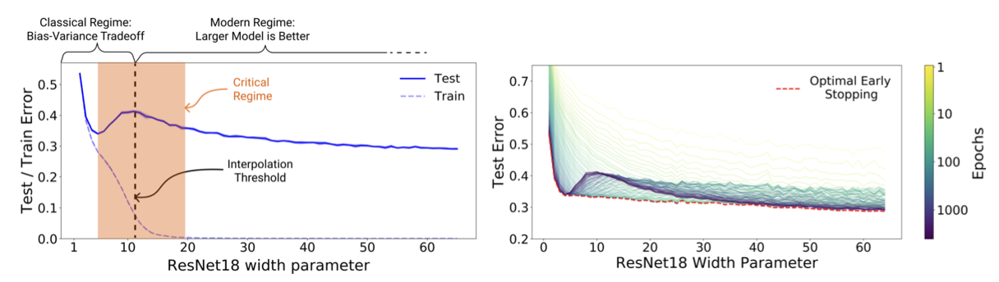
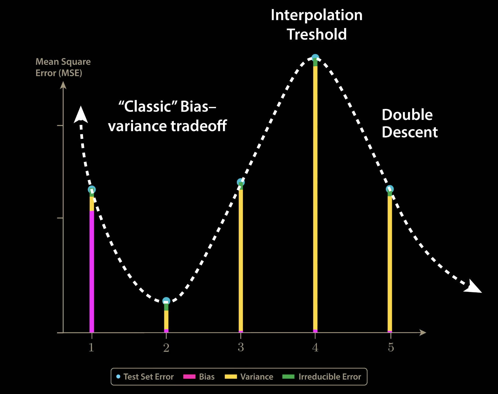
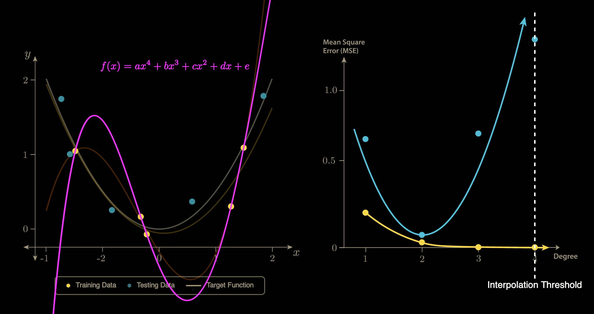
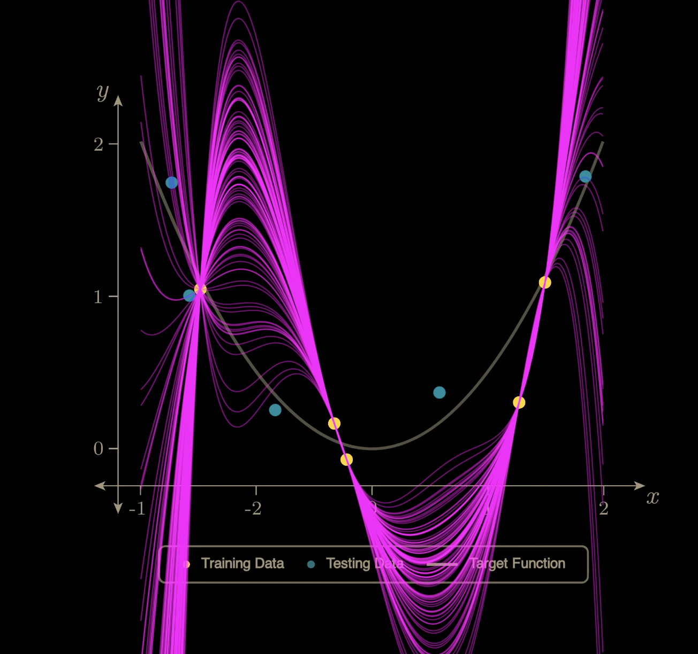

**误区**
如果你上过AndrewNG的CS229/CS230/Coursera Deep Learning课程，你一定会对Bias-Variance Trade-Off记忆犹新。
而由于参数量越大的模型拟合能力越强，也就更容易出现低Bias高Variance的情况（这个直觉至今仍然正确）。
以此推断，当模型参数量过了某个甜点之后，Training Error会继续下降，但Test Error则会因为过拟合不降反升（这个直觉就不一定正确了）

在2013年著名的*AlexNet*论文成功训练了高达61M参数的模型，当时人们认为：
是Data Augmentation和Drop-Out技术这两个正则化技术，将模型从过拟合的右侧推回了刚好拟合的U型谷底。

**颠覆**
这样的解释简单而优美，就像牛顿力学定律一样。
但事实真的如此吗？

Google Brain 2016年的论文*Understanding Deep Learning Requires Rethinking Generalization*发现：
即使用上所有的正则化手段，深度学习模型的Training Error仍然是0。也就是说，我们并没有用Bias去换Variance，而是在没有提升Bias的情况下降低了Variance。

那么，Variance 究竟是如何在不牺牲 Bias 的前提下降低的？
实际上，后续论文发现：
提升模型的**训练时间**和**训练规模**都可以降低Variance，并且如果将Test Error可视化，就会出现所谓的"**Double Descent**"（双重下降）。

_可以发现该图的右侧Bias几乎没有变化，但是Variance下降。_

**解释**
这样反常的现象是如何出现的？为什么参数量的升高一开始会导致Test Error的升高，但是过了波峰之后Test Error再次降低，乃至于比原来的波谷更低？

对于复杂模型的解释很复杂，学术界也没有定论，在此不多加赘述。

对于简单模型（多项式拟合），解释则是简单而优美的：
对于一个有10个数据点（5个放Training Set，5个放Test Set）的多项式拟合问题，

显然，1～3次多项式都不能保证经过Training Set中的全部5个数据点，到了4次多项式刚好有一条曲线可以全部经过，到了5次6次等大于4的更高次，则有无数种曲线可以经过5个数据点。（顺便一提，在这个简单的多项式拟合问题中，4次这个点就是这个数据集的**插值阈值Interpolation Threshold**）

（如上图）在插值阈值之前，模型展现出经典的Bias-Vaiance Trade-off U型曲线。当次数到达插值阈值4时，Variance抵达巅峰。

但是当多项式次数到达5之后，有无数种多项式曲线可以穿过这5个点。

这些曲线中，显然有一些Variance大，有一些Variance小。

这时，如果我们的学习算法(Gradient Descent...)有**归纳偏置**，倾向于选择**范数较小**的曲线（在多项式拟合中可以用参数平方和来评估），那么就会在这些曲线中选择较平滑的一条（Variance也较小），从而出现Double Descent现象。

>**Inductive bias**（归纳偏置）是指：
>在训练数据不足以唯一确定解时，学习算法“默认更偏好哪一类假设/函数”的内在倾向。

_此处的10次多项式是所有解当中的最小范数解，可以看到，虽然左图中的黄色曲线看起来很复杂，但是Variance相比于插值阈值降低了_

到这里，我们基本可以给简单模型情况下的Double Descent下个结论：
> 1.在插值阈值之前，模型没有足够的参数完美拟合所有点（没有完美解），我们只能用Variance来换Bias。
> 2.在插值阈值时，解空间中只有一个完美解（病态），在此时噪声会放大（因为到此时可以完美拟合了，模型就不能容忍一点bias），导致Variance极大，造成Test Error的波峰。
> 3.在插值阈值之后，解空间维度越来越大（模型的Flexibility也越来越大），配合上有Inductive bias的学习算法，就可以再次降低Variance，从而导致Double Descent。

**使用**
此时你应该发现了：
我们过去看到Test Error重新回升便采用早停策略的做法是错误的，在参数量稍微大一点看到Variance上升就停止增大参数量的做法也是错误的。

> 我们要给模型足够的表示能力与灵活性（flexibility），使其在跨越插值阈值（interpolation threshold）之后，进入泛化性能回升（double descent）的阶段。
> 简单来说，给其足够的“成长空间”，从而等其“否极泰来”。

应注意，Double Descent 现象通常发生在过参数化（Over-parameterized）区域。如果参数量相比于任务难度不大（Training Error没有接近0，即没有接近插值区），不应该盲目等待Double Descent。

注：
本文大部分内容来自以下视频，是我看完该视频之后的费曼学习成果。
[What the Books Get Wrong about AI (Double Descent)](https://www.youtube.com/watch?v=z64a7USuGX0)