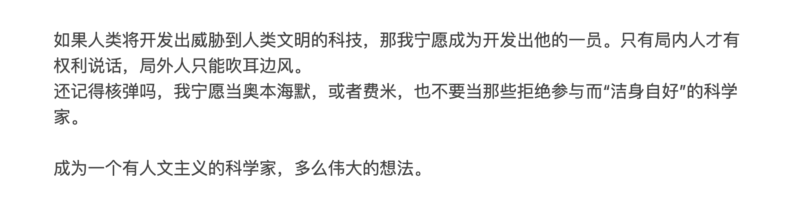
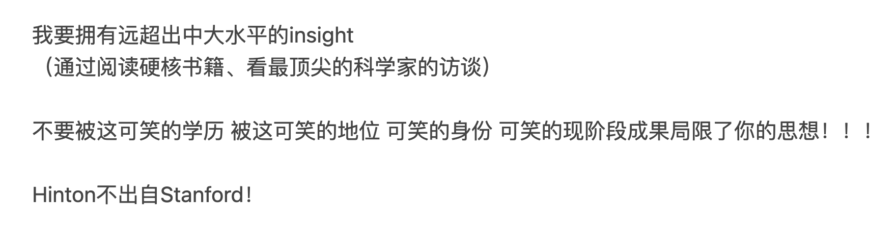

我突然意识到，那些伟人，Steve Jobs, Hinton, 尼采， 巴菲特，不是因为他们是伟人所以他们有那些异于常人的特质，也不是因为他们天生具有那些特质所以他们成为了伟人。是他们**选择**了这些特质。

独立思考，海量阅读，形成自己的价值体系（对什么是一个好的企业，什么是一个好的科研topic，什么是好的哲学，什么是好的投资体系的判断），然后坚决执行！

“疯子”有时候会看起来很“傻”，但是“疯子”不是“傻子”。

“疯子”可以为了创造出真正的超级智能，而放弃OpenAI的丰厚工资和顶端地位，而投身于SSI。(Ilya Sutskever)
“疯子”可以把一个千禧年问题的答案就这么“扔”到论坛上。(Grigori Yakovlevich Perelman)
“疯子”可以亲手解散掉自己的组织。（Jiddu Krishnamurti）

但是”疯子“会权衡利弊。
只是**他们眼中的利弊和常人眼中的不一样**罢了。

