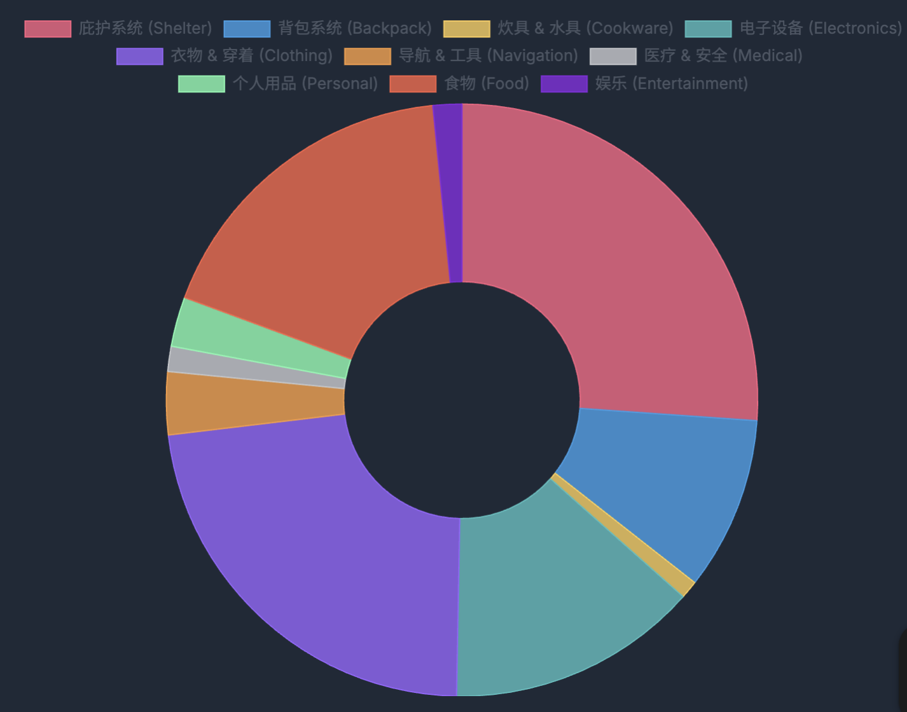
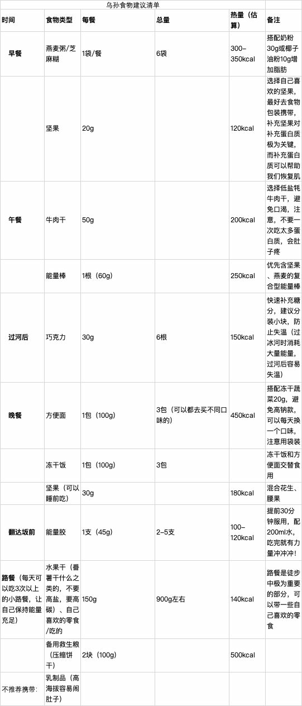

>这是一份“不极致轻量化“的装备清单，主要是在装备的价格、睡袋选择、衣服数量上做了妥协

| 分类          | 物品名称                      | 重量 (g) | 小计 (g)/备注                           |
| :---------- | :------------------------ | :----- | :---------------------------------- |
| **庇护系统**    |                           |        | **3667.5**                          |
|             | 帐篷远行2 (内帐)                | 698.3  |                                     |
|             | 帐篷远行2 (外帐)                | 630.7  |                                     |
|             | 地钉 (8根)                   | 131.8  |                                     |
|             | 睡袋 (翼马AEGIA D4)           | 1633.3 | -18度的舒适温标对大多数线路都过于超标了               |
|             | 气垫 (山之泉)                  | 514.8  |                                     |
|             | 急救保温毯                     | 58.6   |                                     |
| **背包系统**    |                           |        | **1329.8**                          |
|             | 背包                        | 约 1100 | （含防雨罩                               |
|             | 三峰出防水袋                    | 40.2   |                                     |
|             | 三峰出收纳袋 (衣服)               | 37.0   |                                     |
|             | 三峰出收纳袋 (食物)               | 27.5   |                                     |
|             | 外挂锁 * 2                   | 125.1  |                                     |
| **炊具 & 水具** |                           |        | **138.4**                           |
|             | 钛杯                        | 103.4  |                                     |
|             | 水袋 (500mL)                | 约 35   | （其实还有一个骑行水壶，每天的携带水在1-1.5L比较好        |
| **电子设备**    |                           |        | **1929.2**                          |
|             | OLYMPUS EP1 + 14-42mm套机镜头 | 429.6  |                                     |
|             | 鱼眼镜头9mm F8                | 42.4   |                                     |
|             | 相机充电器                     | 60.3   |                                     |
|             | 相机电池 * 4                  | 168.7  |                                     |
|             | 手机 iPhone 15 Plus         | 213.9  |                                     |
|             | 手表 华米 GTR 4               | 45.1   |                                     |
|             | 台电充电宝 (10000mAh)          | 180.4  | 不怎么玩手机的话带10000mAh就够                 |
|             | 吾胜充电宝 (20000mAh)          | 422.3  |                                     |
|             | 头灯                        | 97.3   |                                     |
|             | 气泵 (Flextail tiny pump)   | 105.7  |                                     |
|             | 电动剃须刀                     | 163.5  | （奢侈装备                               |
| **衣物 & 穿着** |                           |        | **3206.7**                          |
|             | 衣物                        | 约 2500 |                                     |
|             | 洞洞鞋                       | 450.1  | 更推荐涉水鞋（比如亚瑟士的                       |
|             | 骑行眼镜                      | 59.6   |                                     |
|             | 胶囊伞                       | 197    |                                     |
| **导航 & 工具** |                           |        | **481.2**                           |
|             | 登山杖 * 2                   | 441.9  |                                     |
|             | 温度计 & 指南针                 | 33.0   |                                     |
|             | 求生哨                       | 6.3    |                                     |
| **医疗 & 安全** |                           |        | **193.2**                           |
|             | 医疗包                       | 104.8  |                                     |
|             | 身份证件                      | 88.4   |                                     |
| **个人用品**    |                           |        | **381.1**                           |
|             | 防晒霜                       | 约 100  |                                     |
|             | 牙刷 & 牙膏                   | 81.1   |                                     |
|             | 湿纸巾                       | 约 200  |                                     |
| **食物**      |                           |        | **2500.0**                          |
|             | 食物                        | 约 2500 |                                     |
| **娱乐**      |                           |        | **221.2**                           |
|             | 麻将牌                       | 221.2  | （奢侈装备                               |
| **总计**      |                           |        | **约 14048.3 g (14.05 kg)**（还有1kg的水） |
其实这么看来完全算不上轻量化了 但是比动辄40斤+的路人来说还是轻了不少

衣物（理想状态）：
防晒衣 * 1
硬壳 * 1
美利奴羊毛运动短袖 * 3
羊毛袜 * 3
（如果过冰河怕冷的话可以买一双防水袜 但其实作用不大 就只是在过去的那段时间稍微暖和一点 过去后还是会冷（水会从上面往里灌 走土路时水一直在里面晃）
速干长裤 * 2
速干短裤 * 2

食物清单（原计划 实际上并未完全按照这个购买）：

方便面可以改成预制菜+脱水熟米
但其实乌孙古道里也有吃的卖（不便宜就是了）

还有什么细节问题都可以问呀，祝你玩得开心，平安下山！