	这里指的穷游并非是那种“100r畅游北京”的极限挑战，而是**在有限资源的情况下尽量获得更好的旅行体验**。所以，如果你每次旅行都有爸妈陪同（爸妈一般会付开支），或者每次旅行都有绝对充足的资金，这篇攻略就对你无用。但绝大多数大学生的资金应该都是有限的，需要在一定程度上减少开支，那么这篇攻略将非常详细地告诉你“穷”游的方方面面。

## 前言
### 为啥写
每次旅行，我都能遇到很多外国年轻人，他们选择“**先拓宽人生的宽度，再挖掘人生的深度**”，但中国人往往相反，大多在年轻时高度专注于学业事业，然后在获得足够的资金后出来探索这个世界。（有些人直到退休后才开始自己的旅行）但其实旅行**可以用不多的开支获得很好的体验感**。而大学是机会成本最小的时期，又有寒暑假，最适合我们走出去看看，既看自然之绝美风景，又看人文之多元繁盛，还看社会之众生百相。所以写此篇攻略，供还未尝试过的朋友参考，也为常常出去旅行的朋友提供一些ideas。
### “穷”游并非不花钱
其实“穷”游花的钱并不少，其核心诉求还是提升旅行体验，而不是省钱。
### 钱从哪里来？
我在旅行中，听到过“我不喜欢我的男朋友，但是男朋友给我钱出来玩，所以我和他在一起”这样的暴论。我认为如果想玩得悠然自在，钱花得心安理得，**最好能自己赚取所有的旅行资金**（我似乎也未能达成这一点）。如果没有资金，可以考虑和父母要一定数额的钱。（我第二次出逃计划是这么做的）
### 什么可以省，什么不能省？
	有得必有舍。有舍必有得。
#### 不能省：
- **个人旅行的核心需求不能省。**
	如果你出来玩是为了体验各地美食，那么饮食开销不能省；是为了看大美世界，途中的交通费不能省；如果你很注重居住感受，那么就要订好的酒店……
- **门票没必要省**。
	其实旅行中大部份的开销在交通，其次是饮食和住宿，门票花销往往比较少，没必要到了地方不进去（更何况还有学生半价）。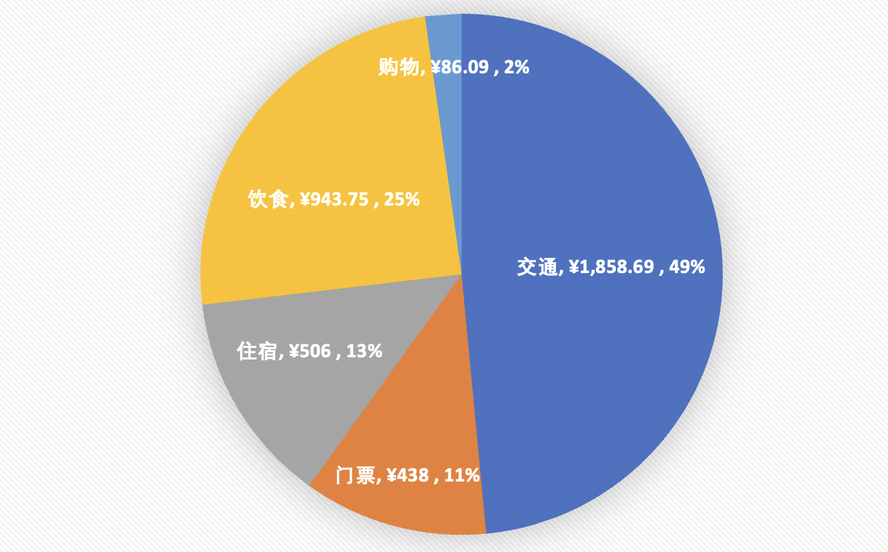
	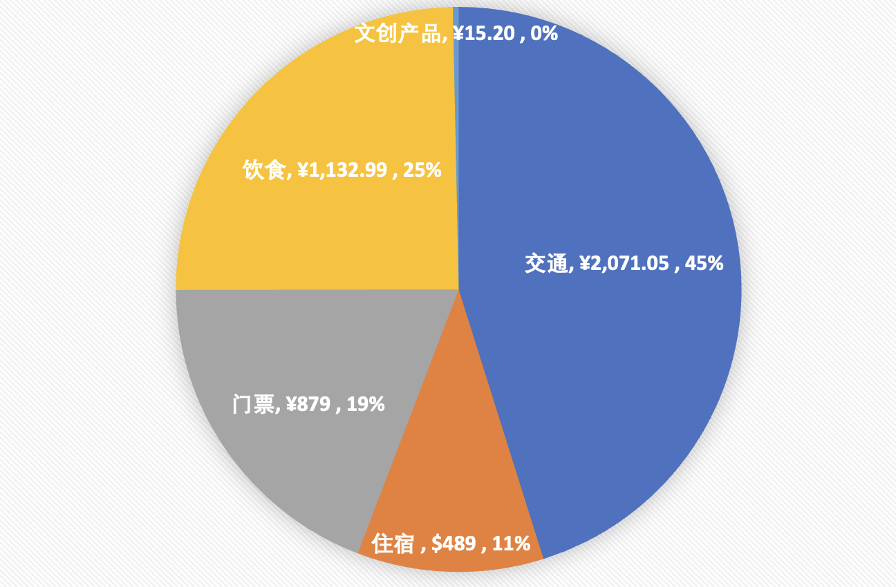
	（上面是我“中国南部环线旅行”和“北京-大同-西安旅行”的开支饼图）
- **该吃还是得吃**
	景区里的饮食往往贵到令人乍舌的地步，但当你在华山上饿了，面对35元一笼的蒸饺，该吃还是得吃，健康更重要。
	体验当地美食往往是旅行的重要组成部分，没必要为了省钱天天吃快餐。

#### 可以省
	除了不能省的都可以省
## 怎么省？
	旅行开支的各个part都有可以省的部分，下文将分交通、住宿、饮食等方面讨论。
### 交通篇
1、大交通必须省！（指到旅行起点和回家的交通费用）
	大交通往往占了交通费用中的绝对大头，如果来回机票就已经花了4000，那旅行开支是怎么也减不下来的。
	为了省大交通，我有以下几个策略：
	- 提前订 （南航学生旅行的） **红眼航班**。最好是延误率高的，这样就可以免费改签到黄金时段的航班。甚至可以考虑主动上航空公司的钩子，订那种一定会取消的航班。
	- 一次**去一条线**。如果每次旅行都只去一个城市，或者只去一个省，那么单点来回飞的费用是极高的。但如果去旅行时将目的地串联起来，用火车/高铁完成大部分交通，就会用更少的费用去到更多的地方。（这也得益于学生有连续的长假期）
	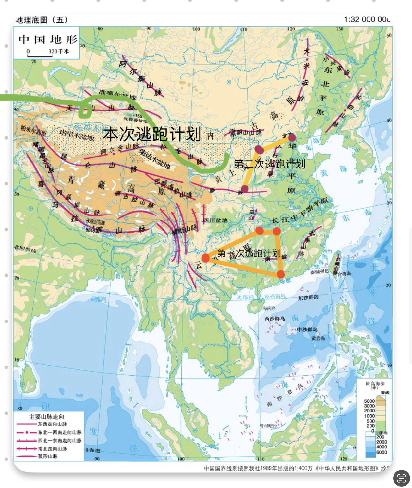
2、通过**找搭子**拼车/租车/蹭搭子的车。[#怎么找搭子](#怎么找搭子)
	在抵达某个城市之后，如果有公共交通固然好，但大多数情况是公共交通要么没有，要么慢得离谱（我极其讨厌坐公交，有可能等1h还没来，但很多地方没有地铁或地铁不发达）
	通过找搭子可以平摊交通费用，避免一个人打长途车的高花费。
	但是找搭子这件事情的复杂度简直可以称为一门学问，我会在后面“‘穷’游的灵魂”部分提及。[#怎么找搭子](#怎么找搭子)
3、勤锻炼，11路车永远免费（双腿）
	1.5km以内我从不打车。（有共享单车最好，但有时候共享单车也没有，就只能走路了）
### 住宿篇
1、住**优质青旅**。[#怎么选青旅](#怎么选青旅)
	青旅住一晚的费用一般在50r以内，极少青旅在旺季价格在50-100r，但青旅的居住体验往往高于250r以下的廉价酒店。
	在优质青旅，你可以认识来自世界各地五湖四海的朋友，与他们彻夜长谈，把酒共欢（而且还很安全）。
	在优质青旅，你可以找到一起出去旅行的搭子，甚至和他们逐渐发展成长期朋友。（对此我深有体会，**在青旅遇见的人不一定是人生中的路人，还有可能成为你的恋人❌，成为你未来每次旅行考虑的伙伴✅**）
	在优质青旅，床上三件套一天一换，还有洗衣机烘干机，避免换地方时衣服没干的尴尬。
	在优质青旅，你还可以获得各大景区的渠道票，在叠加上学生优惠之后一般能到原价的
	$\frac{1}{3}$
2、住**火车卧铺**。
	这是我第三次个人旅行才有的体验，以前甚至没坐过绿皮火车🙈。
	晚间卧铺的好处在于其将交通时间和睡眠时间重叠，避免白天花大量时间坐在车上发呆看手机。其次，节省了一晚上的住宿费。
	关于卧铺：
	1、“硬卧”不是床板。我以前一直以为硬卧就是硬的床板，但其实硬卧的床睡得可舒服。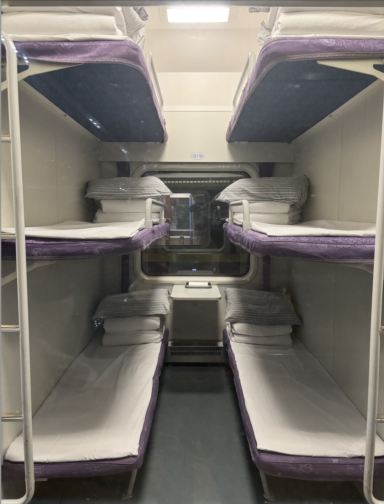
	2、火车上会有老人和小孩，小孩在晚上有概率吵闹，老人在清晨有概率早起。这都会影响睡眠，所以最好携带**耳塞/降噪耳机**，以备不时之需（但肯定比开麦打游戏的舍友好忍受多了）。
	3、火车会**晃**，不同车不同路段的晃动程度不一样。（但我是晃着晃着就睡着了，一方面是累了，另一方面是有点像BB摇篮）
	4、火车是用电驱动的，而且不像高铁每个车厢都有动力，火车只有火车头有动力。
	5、但却没有充电的地方。有的车干脆一整个车厢一个插头都没有，有的车一个车厢有三个插头。
	6、火车上可以洗漱，没有地方洗澡。可以先订个钟点房洗澡洗衣服。
	7、火车的厕所直达地面😂。总觉得这很喜感，轨道❌ 天然化粪池✅？但其实厕所一点都不臭，而且是蹲厕（飞机高铁上会出现坐厕）
	8、火车上也是**不允许抽烟**的。（没有烟味真是太好了）
	9、火车定时熄灯。
	10、居然会有阿姨过来帮你把鞋子摆整齐，这实在是，，，太像幼儿园宿舍了。
	11、火车上的乘务员出奇漂亮/出奇帅气。一般说空乘会很好看，但我坐过一次火车之后发现火车上的乘务员都长得非常标致，而且服务态度非常好，有问题会快速帮你解决，下车会跟你说拜拜。
	12、尽量**抢下铺**。下铺晃动幅度小，而且可以坐起身来。但其实上铺和中铺也有坐的椅子。
### 饮食篇
	大家会发现这里几乎省不了什么钱。
1、和**搭子**一起下馆子。如果一个人下馆子，几乎注定吃不到什么不同的菜式，当然如果足够社牛，也可以拿自己的菜去隔壁桌交换点吃的。
2、可以选择一些**当地小店**，不一定要吃很高档的餐厅。比如北京的四季民福烤鸭，好吃是好吃，但排队4h，一百多小小一碟，实在是没有性价比。高档餐厅往往高档在环境，而不是菜品本身。
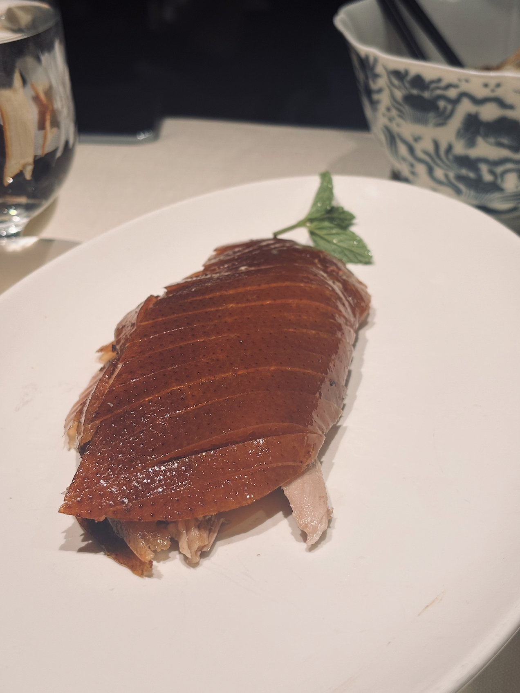
3、麦当劳肯德基星巴克等**连锁店可以上闲鱼/淘宝点单**，会便宜很多（5折到8折）。如果是在机场/火车高铁站/高速休息区，需要专门选择特定的。
4、进景区前买好路餐和水。贵是一方面，饿坏了更不好。
## “穷”游的灵魂
### 为什么我推荐 个人旅行
	自由，是空气一样的东西。当你没有失去它，它就像不存在一般；当你失去它，方懂它的宝贵。
	保卫“非必要”
除非你有关系非常非常好的朋友，而且非常玩得来，或者有恋人，否则当你和ta一起出去玩，玩到一半发现合不来那就跟坐牢差不多。

两个人旅行重点是关系，风景是次要；一个人旅行重点是经历、体验，产生的关系是幸运。

一个人旅行无比自由。你可以选择自己想去的地方而不用考虑别人，而且可以适当的做一回p人，为旅程提供不确定性。你还可以在自己喜欢的地方待久一点，不喜欢的地方跳过。
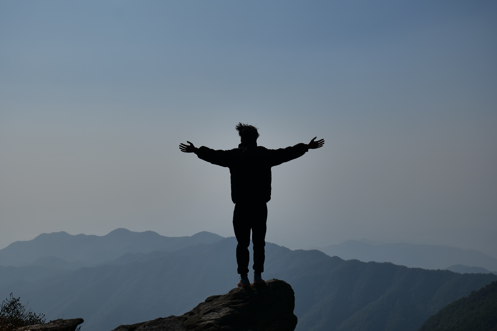

当然了，3 - 4个人的旅行也是不错的，这种关系比较稳定，而且交通住宿成本随之降低。超过5个人就会出现决策问题。

**不要跟团**。在我眼里，跟团 $\approx$ 找了辆车送自己去各个人挤人的地方打卡，时间到了就上车。**这种沉溺于routine的旅行方式和大多数人的日常生活有何分别**？旅行是特别的，是“非必要”的，是向往自由的，是“仰天大笑出门去，我辈岂是蓬蒿人”，不是“鱼戏莲叶东，鱼戏莲叶西，鱼戏莲叶南，鱼戏莲叶北”。
### 怎么找搭子
	安全，安全，还tmd是安全
找搭子最先要考虑的是**安全问题**。

一般就三种途径：青旅，小红书，偶遇。

**青旅**找搭子一般非常安全，因为你可以先和他们交谈，等知道了他们有什么样的社会背景，是什么样的人再考虑是否和他们一起出去玩。

至于**小红书**，就是一个极度鱼龙混杂的地方。有正经的搭子（我遇见过从腾讯网易裸辞把车从广州开到兰州的，开车带我出去，玩得很开心），也有商家装成的搭子（说自己是搭子一起拼车去徒步，结果发现就是司机，而且本来约了往返，返程直接跑路了，把我行李扔在景区大厅），还有一大堆🐦（鸽子）。

**偶遇**偶遇，自然是可遇不可求的。在景区里面真正“偶遇”到的人一般不会有太大问题。
### 怎么选青旅
	干净 -> 氛围 -> 安静
	多看携程评论，少看小红书软广。
首要的是**干净**。我第一次去青旅，进去之后发现里面灯光是暗暗的，墙上全是乱七八糟的字，床铺是陈旧的，住在里面的人是在床边抽烟的。吓得我赶紧拿包跑出来，在平台上跟老板说：“是我娇生惯养了，受不了这样的环境”。老板倒是连连安慰我说没事没事，然后把钱退给我了。（本来那个订单是不能退的）在那之后我换了另一家青旅，我所住过的最好的青旅之一（**发现不对劲就赶紧跑**）。

其次是**氛围**。这个可以看携程上的评论。先看好评，如果有很多人说“在那里获得了人生故事，老板人很不错，遇到了很好的人”，那说明这家青旅氛围很不错。再看差评（一般都会有），如果差评的内容是自己可以接受的，或者明显是来搞事的，就可以订这家青旅。

再次是**安静**。我住过一些规模很大的青旅，好似氛围很好，实际上很多常住客，人与人之间很少深度交流，然后晚上大厅有驻唱歌手什么的，吵得要死。（西安青旅基本都是这样）

大城市的青旅一般没有小城市的好。我住过最烂的青旅是西安的长沙的，中间是北京的银川的昆明的，最好的是张家界的大同的兰州的。

选比较新的，不选很新的和很旧的。开业1-4年的青旅设施一般会比较新、比较全。

### 珍惜在旅途中遇到的人
你会慢慢发现，旅行中**给你带来最深刻的回忆的**，不是极致的自然风光，也不是深刻的人文历史，而**是旅途中和你一起经历这些的伙伴**。加个微信吧，常常联系吧。
### 控制旅行的节奏，不要过于特种兵，专注于体验，而不是纪念。
有一个很出名的旅行方案叫做“五岳特种兵”，即在极短的时间内连攀五岳。这其实没有太大难度，体力够好就行。这听起来很浪漫，很疯狂，可以在puq大吹特吹，但其实只要体力稍微好点就可以。但在这过程中所造成的身心疲惫，恐怕很难被拿到五岳证书时刻的欢喜抵消。

```
细细品味旅行中经历的一切吧，旅行不是功利的学业事业，并不一定要达成某个目标的。
```

中大登山队以前的slogan叫做“沉默在心底，笃行在路上，骄傲在山巅”，后来删去了最后一个分句“骄傲在山巅”。旅行中没有什么“成功”（或许人生也没有？），**我们不是为了达成某个目标而来，也不是为了去到某个地方而来，我们是为了这个过程，结果真的不重要。**

### 防人之心不可无，害人之心不可有，爱人之心时刻留。
这里的爱人不是指爱情，而是说在自己能力所及范围内尽量帮助别人，这往往会给你带来意想不到的回报，或许能让你多一个朋友，或许能让你的心灵受到净化……

### 做轻量化的背包客
	背包✅行李箱❌轻量化✅啥都带❌
每减少一分重量，你的旅行都会更加轻松。
而如果你带行李箱，就会成为绝对的累赘。

**携带一个大背包**（可以是有背负系统的登山包），**然后里面装一个小包**，在抵达住宿地点时寄存大背包，取出小包去外面玩，你会发现自己玩一天腿也不会太累，身体仿佛有一个无限的能量。（当然行李箱也可以寄存了）

装备清单因目的地、因人而异，此处不再赘述。
## 后记
笔者写下这篇攻略时，正在第三次旅行的途中。在我的旅行当中，可能一天所经历的事情，会比在学校学一周经历的事还多，10天所认识、相处的人，比在学校一个学期认识相处的还多。
如果说**电影是让你体验他人浓缩的人生，那旅行就是浓缩你自己的人生。**

攻略只是供你参考，唯有亲身经历，方悟其道。

gǒgōgò，出发喽！

## 附录
张家界槟榔谷溶洞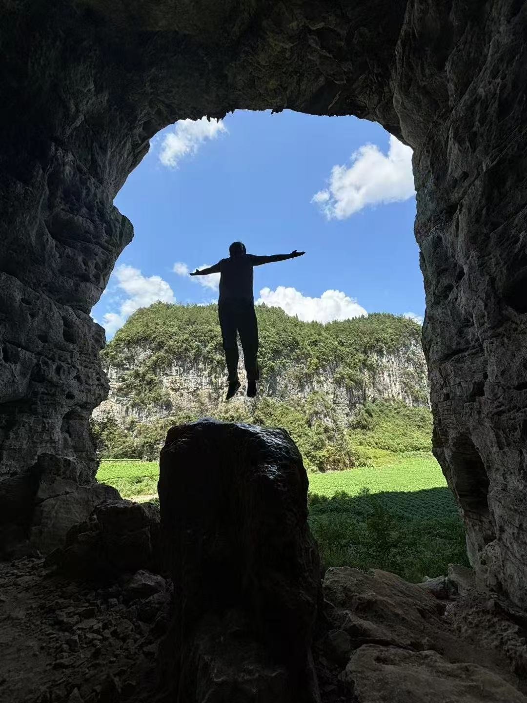
广东黄梅雪后日出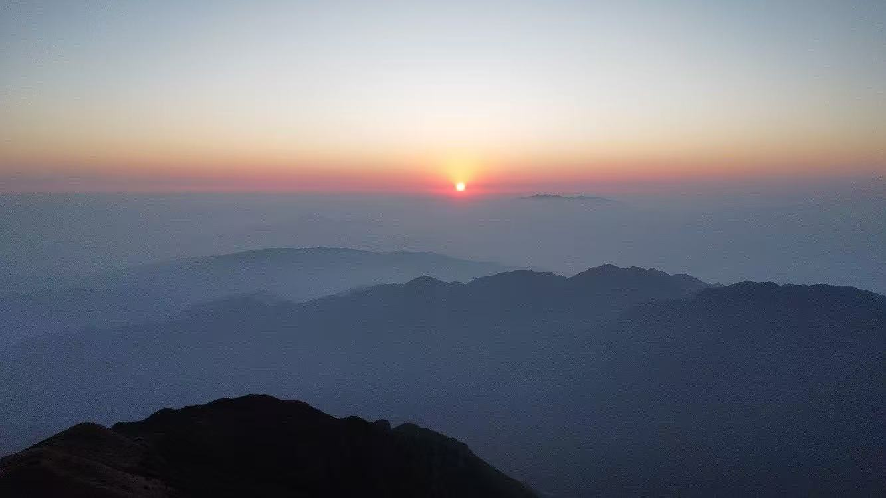
北京桃源仙谷气泡湖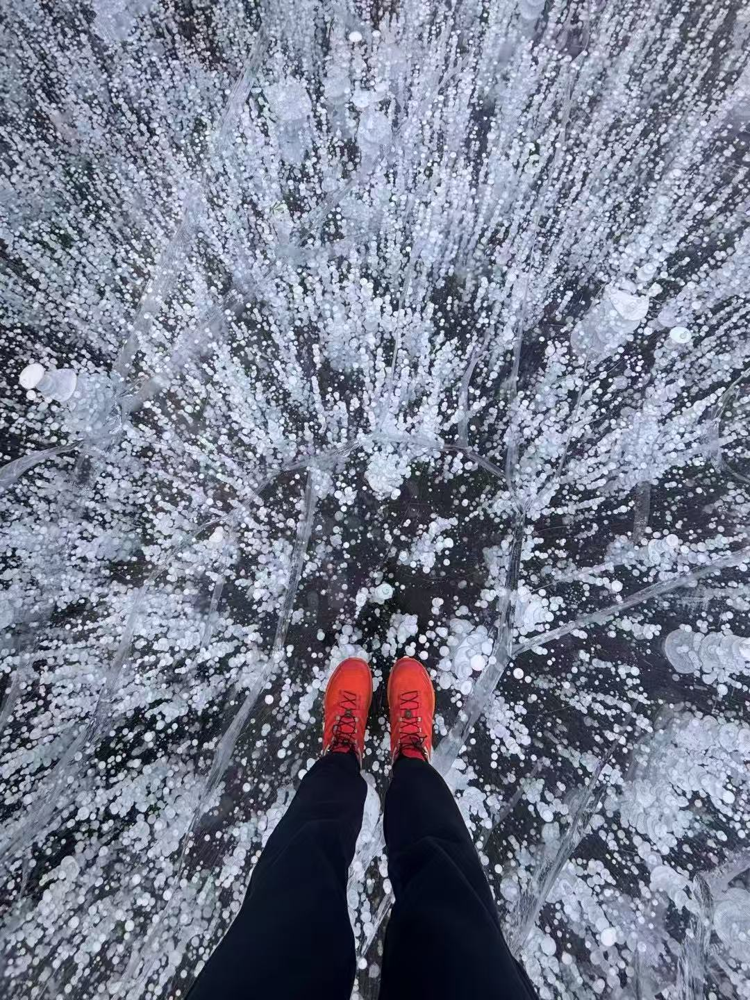
故宫角楼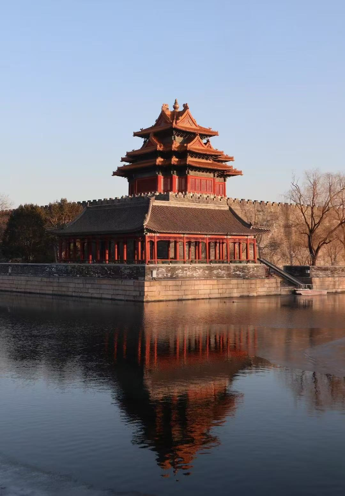
箭扣长城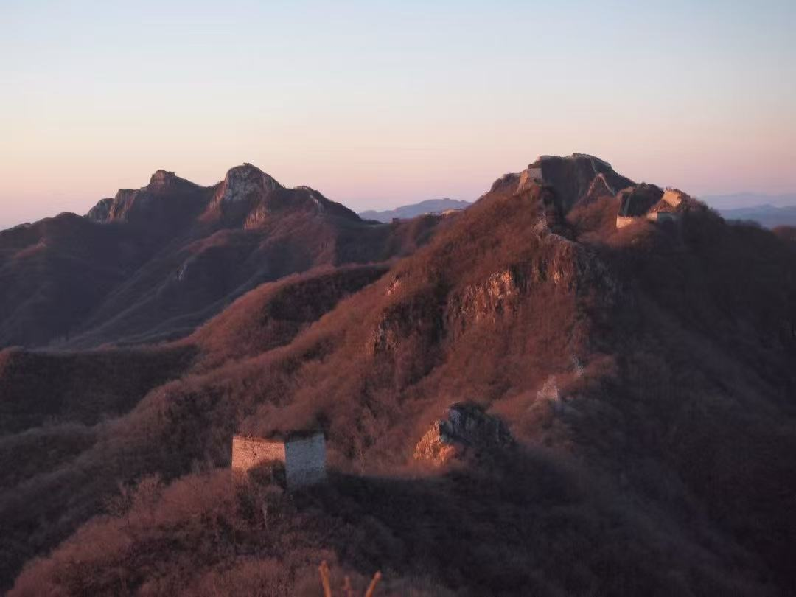
雪后华山
内蒙古阿拉善左旗乌兰湖
兰州苦水丹霞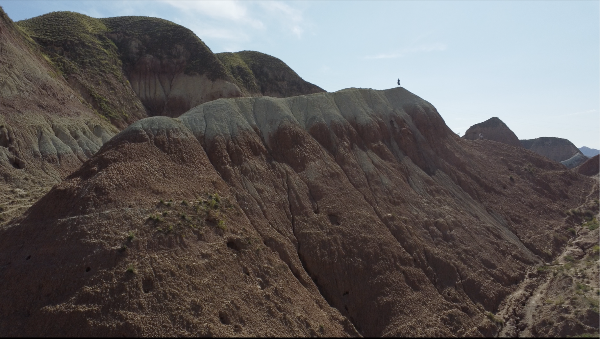
未完待续。