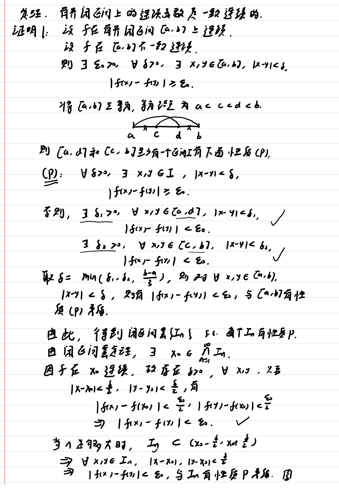
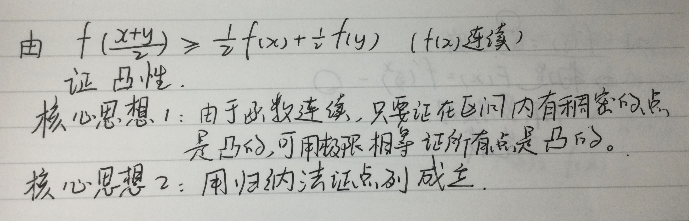
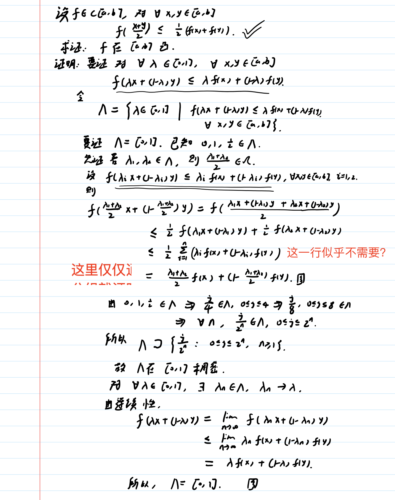
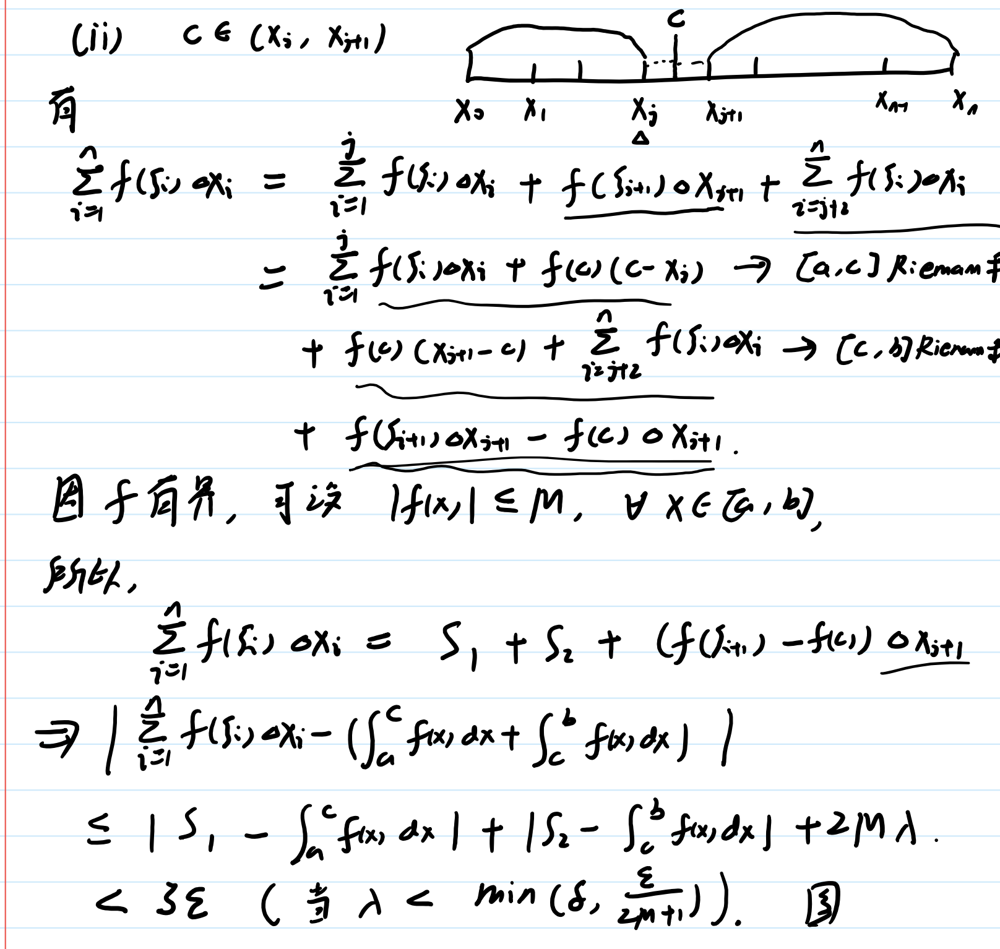
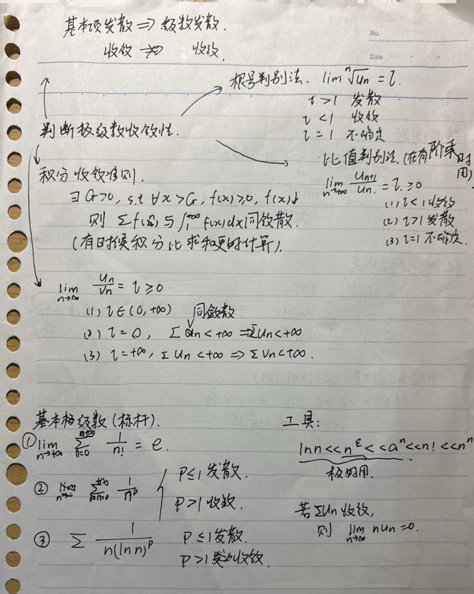

## 有界相关问题
有界相关的问题常常非常本质，需要用到分划原理，定义，二分法三分法之类的很难用的工具
### **闭区间上的连续函数必有界（有界性定理）**

证明方法：通过闭区间套将整个区间上的性质凝聚到一个很小很小的区间上，从而在这个很小很小的区间上了利用连续性的定义（这不是凝聚定理）
证明过程：
1、先获得闭区间套（闭区间套中的每一个套的性质均相同（均无界）
2、套得一个点之后说明这个点所在的极小区间上仍应当无界【x0-delta，x0+delta】，但由于连续所以其区间上的值和f（x0）的差距小于epsilon，故这个区间上的值一定小于f（x0）+1（有界）——》推出矛盾

### 凝聚定理（有界数列必有收敛子列
证明方法：仍然是用闭区间套，但此处的应用方式是Bolzano（波尔查诺）二分法，一个有无穷多项的数列在界内（类似于在值域内）被二分后，两个区间中至少有一个区间包含无穷多项。
然后就可以在这不断出现的无穷多项中取值并再次运用二分法，并且由于闭区间套的性质，最后会收敛到一个唯一的点ksei

### 有界闭区间上的连续函数必有最大值和最小值
有两种证明方法，一种是利用有界性（分划原理找确界）+凝聚定理，第二种是用2次上确界定理并使用辅助函数

方法一：利用有界性（分划原理找确界）+凝聚定理（其实就是证明分划（上确界）一定能够取到

这个类似于夹逼法，可以说是直接找出最大值了。（利用离散的数列求其数列积分）

方法二：用2次凝聚定理并使用辅助函数（待补充

若这个上确界不可以取到，我就可以把M-f（x)放到分母（反证法的精髓，就是在不可能的条件下写出一些更不可能的情况）
从而找到一个更小的上界，推出矛盾
### 凝聚定理相关（列紧性原理）
凝聚定理：有界数列必有收敛子列（数列是无限的）
用法：用来**构造收敛数列**（先构造一个有界数列，然后对它用凝聚定理得到收敛子列）
Q.什么时候需要构造收敛数列呢？（这也许是这个方法使用当中很关键的事）
一致连续性相关问题？
有界数列收敛和发散的问题（直接应用了属于是）
1、相关命题：凝聚定理在是实数系中成立，在有理数集Q中不成立。

2、证明Cantor定理（有界闭区间上的连续函数一定一致连续）（即证明2）

（这个证明是很明显写得很不严谨的）
怎么弄的呢？
连续函数——>构造任意两个距离任意接近的有界数列——>根据连续性有这两个极限值的差趋近于0——>即不存在任意接近的两个数列的极限值的差>epsilon。

## 导数相关
### 求导公式的证明
就是先写下导数的定义
然后用不等式夹逼即可

参数方程求导法
本质是复合函数求导+反函数求导
记下公式ba

### 几个极为常用的高阶导数公式

### 乘法求高阶导数——莱布尼茨公式

### 原函数和导函数混合的求根问题

要对这些求导后得到的形式足够敏感
### 二阶微分和高阶微分公式

### 二元和三元隐函数求偏导

### 证明二元函数可微

## 一致连续性相关问题
1、通过取连续函数的**闭子区间**说明其一致连续
（这其实就是**连续函数不能在区间中间不一致连续**）
题目：判断正误： f在区间（a,b）上连续，又有a＜c< d<b，则 在区间（c,d） 上一致连续.
做法：取闭区间[(a+c)/2,(b+d)/2]，又有连续函数在闭区间上有界（连续性定理），可得有界闭区间上的连续函数一定是一致连续的。

证明一致连续有两种办法：
	1、求导证导函数有界
	2、有界闭区间上的连续函数
	2-1、如何证开区间上的一致连续？（在导函数无界的情况下）
如果两侧端点处极限收敛，则可以将其补全成闭区间上的连续函数，知其一致连续。
例子：

（在0处可补全定义，注意要分而治之（先证0到2上一致连续，再证后面的））

证不一致连续：
	找两个点列。

### 一致连续性相关总结
一致连续性的关键是
	无论给定了多小的区间delta，都会存在需要更小的delta才能满足条件的情况。
（即**delta没有大于0的下界**）（注意这里delta的变化不是指跟随epsilon变化而变化，而是跟随x变化而变化）（即对于给定的epsilon，找不到delta满足条件）

一致连续性的本质带来的的一些东西：
1、不能在连续函数的区间中部不一致连续（不一致连续的一定是区间端点处）
2、导函数有界的函数是一致连续的（导函数无界的函数也可能是一致连续的，最关键的还是定义）

通过类似于Heine定理的方法（感觉heine定理那块已经有点忘了），可以转化为以下条件：

（存在两个在极限相等的数列（Xn，Yn），其值（f（Xn），f（Yn）不相等）

### 命题1:**可导且导数有界**，则一定一致连续
直观理解：不一致连续需要剧烈的波动，导数值不可能有界。
证明：（其实就是找到一个只和epsilon有关且和x无关的delta就可以了）

### 命题2:**有界 闭区间**上的**连续函数是一致连续的。（Cantor定理**
证明1:利用闭区间套聚焦性质

这里的关键在于利用**闭区间套定理**，把不一致连续性这一作用在整个区间上的性质，<b>聚焦于一个数处</b>（连续性起作用），从而整出矛盾

证明2：利用列紧性原理

一些其他的连续：

### 存在一致连续但导函数无界的函数
一致连续不只是变化剧烈，而且是变化高阶剧烈。
例子：根号x（在端点处有极限的都是一致连续的）

## 不定积分相关
### 1、优先使用凑微分法

### 2、循环法使用tip

可以找一道题试一试（4.29

### 3、一些基础型的解法

“万能变换”！！！！不要忘了啦！！！！

### 4、sin（nx）的特定解法

### 5、配对积分法（对称残缺

6、一些经典的反三角函数积分

7、待定系数+凑微分法

重要公式！

## 数分 凸性 相关内容的总结

这部分内容全都是由一个定义，结合前面连续性、极限、中值定理等内容推导而出，属于是前面分析学内容的应用。

### 直观理解
在面积方面，凹凸性首先就是说比其端点处的三角形近似要大还是小（很容易推出）
### 定义：

定义的本质：线性组合的函数小于等于函数的*线性*组合

### 凸的Jensen定义（二分）
（只有在f（x）连续时jensen定义和凸定义才是等价的。

这个用归纳法说明点列成立其实很不简单，需要用到集合有关的说法才能说得更严谨。
首先，（关键在于lambda，而不在x，y的值）
所以先从lambda = a ， lambda = b都属于集合时，证明lambda = （a+b）/2也属于集合
然后一步步证明稠密

### 命题1:割线斜率上升

将lambda换成对应坐标即可证明

其中有些巧妙的一点：（证明其隐含的三个不等式其实等价，只需要证明其中一个即可）
其实AC和另两条的关系不就是可以从AB和AC的关系中推出的

### 命题2:开区间上的凸函数必是连续函数

这张几何表示图极为重要，会使后续看起来莫名其妙的转化变得简单清晰。（注意这张图中的定点是x0（B），不是x。

### 命题3:切线斜率单调递增
本质：切线就是割线两端点趋向于同一点的结果，所以只需要构造中间割线作为过渡即可。

### 命题4:切线在函数下方

别看这个证明这么简单，要是不知道要用中值定理，不知道证到猴年马月！

### 工具：Jensen不等式（直接拿来用就好，要到泰勒公式才会证明）

本质上就是多个变量的线性组合

（其实此处不需要用到泰勒公式也可以证明，还可以减少“二阶可微”这个条件）：
考虑使用 **归纳法：**

n=2时显然成立

（考虑构造一个有k+1项的线性组合，然后再利用递推证其成立

（这个证明是重要简单且自然的，只有利用k项的线性组合构造k+1项的线性组合这一步比较难）

### 命题5:不变号的凸函数取倒数后变为凹函数（反之亦然
直接用定义证明即可
### 命题6：两凸函数取最大值函数仍为凸函数
可直接用割线斜率证明

也可以分类讨论并用转折点处的切线斜率证明。
### **命题7：f，g下凸且非负单调增加，则fg也下凸**
tip：没说可导就不能直接求导证明。
要用到差分的思想（见差分总结）

### 支撑线不等式（其实就是Bernouli不等式的本质）

这道题和这个证明很好地体现了凸函数的性质，可以视作经典题（可以看着题目自己想想做题思路）

为什么会想到使用支撑线不等式呢？就是因为支撑线是无限增大的，我要证明一个东西无界，只需要证明它会大于一个无限增大的东西即可。

### 利用Jensen不等式证明经典不等式（广义几何算数不等式、holder不等式、minkowski不等式
第一步：先证明函数是凸的（这个函数往往不是显性的，而是要自己根据不等式形式猜出来）
第二步：用Jensen不等式

## 可积性相关的问题
这部分问题常常回到本质定义，去控制黎曼和的分法，去证明黎曼和和积分的差是否仍小于epsilon
### 可积必有界的证明
（虽然很显然，但是证明方法不平凡，且非常经典）
并没有像直觉中那样用反证法证（似乎也确实证明不出来，无穷大*无穷小找谁说理去）
而是直接把上界给求出来了

其中利用到的技巧精髓：
1、黎曼积分的定义 核心是**求和值和积分值的差小于epsilon**

2、**每个区间都有界，则所有区间上都有界，只需要说明任意一个区间有界即可**
而**说明某一个区间有界，就是说明这个区间当中的任意值都< M**
3、可以对某个区间使用特殊的分法（比如取这个区间中的任意值），然后其他区间都取端点
4、在使用epsilon-delta语言时，**注意把n也变成一个取定值**（这样n就不是任意无穷大的了，而是**依赖于delta**，否则后面证明小于等于M时还是无法说明M是个有界量）

这里之所以能推出上界的本质是**既然可积，那说明积分出来是个有界量**，而任意函数值小于等于这个有界量的一个函数（还是一个有界量）。

tip：这里的“无界不可积”是在常义定义（黎曼和）下的，其实在广义定义下（面积），并不一定不可积

根号x分之一就是可积的。

### 有界不一定可积
dirichlet函数

由于每个区间内的取法是可以任取的，而每个区间内又一定有无理数和有理数，所以可以全部取1或全部取0，最终得到两个值，这就矛盾了

### 积分可加性的证明（区间可拆可合）
核心问题：
	切分区间的点不一定是原先分法中的切割点，所以切分完后不一定就自动出现黎曼求和的分法。
精髓：
	对切分后的区间使用新的分法
	并证明两个黎曼和的和与原先的整体黎曼和差距小于epsilon，进而证明积分差距也小于epsilon

### 可积性（再论可积性）
用振幅来判断可积性的关键是
取每个小区间的上确界和每个小区间的下确界的差，每个小区间的差的和趋向于0

所以，
**闭区间上只有可数个第一类间断点的是可积的**
**闭区间上单调递增的函数一定可积**

可积的函数一定可以用连续函数/阶梯函数 “差不多”逼近

怎么证明？ ——三分法（这块黑板证明的其实是，只要能用连续函数“差不多”逼近的，都是可积的

关键是这一步

### 达布和and可积性的充要条件（上积分=下积分则黎曼可积
达布上和的极限（区间长度趋近于0）是上积分
达布下和的极限是下积分
**上积分=下积分则黎曼可积**。

### 闭区间上单调函数必可积。

## **定积分相关**

本质：定积分相关题目的本质还是在探究原函数和导函数的关系。
有时候需要分别画出原函数和导函数的图，常使用构造，技巧性较强，此处提供大量例题。

几大工具：
	1、分部积分（不知道怎么搞就分部积分试试吧）
	2、绝对值转化（<b>积分的绝对值小于等于绝对值的积分）</b>
	3、定积分放缩

	4、合并区间。（尤其是三角函数相关）
	5、分治法
	6、如果和单调性/区间中点有关，可以考虑把区间分成两半，然后分别用中值定理（会出现导函数的不等关系）
例子：习题书351页例题11.2.5

### 莱布尼茨公式（的证明（分别以可积和连续为条件））
	这个公式有两种前提条件：连续 & 可积（稍弱）
	连续的情况和可积的情况区别在哪？
	主要的区别就是连续的情况可以直接写出f（x）的原函数F（x） = 变上限积分的f（x），
（根据定理“**当被积函数是连续的，变上限的定积分是被积函数的一个原函数”**
	而可积的情况则没有“变上限积分是被积函数的一个原函数”这个条件（因为这个定理是利用连续性推的）
	但显然，可积和连续这两种情况都可以用可积的方式去推导。

	只需用同一个函数的两个原函数只差一个常数即可证明

	若要以可积为条件，则需用到积分出的原函数连续&微积分基本定理

这个证明其实是有点意思的，着重用到了差分相消，把f（x）看作F（x）的导函数，对F（x）每个微小的区间用中值定理（其实黎曼和的形式就是无穷个中值定理相加）
关键是这种方法会将离散的条件转化成离散的，从而使F‘（x）能转化成f（x）（在一些点上）

（这几个证明其实都不复杂，但要求掌握定积分相关的各种性质）
		

### 一些关键命题以及技巧：

	<b>积分的绝对值小于等于绝对值的积分</b>（直接分类讨论即可）

	**可以将积分上下界和积分当中的变量同时取负（相当于变量替换）**

### 1、积分证明不等式
可以通过导函数的大小关系来证明不等式（积分单调性和求导其实是一样的）

（其实就是求导嘛）
注意到，在这道题当中，右侧两个式子导两次后会化归为左侧式子，这给我们一个启发：
	我们可以通过不断地积分来构造新的关于sin/cos的不等式。

### 2、导函数和原函数的反复变换
常写出f的对应原函数F，g的对应原函数G，并分别画出简图。

第一个导函数零点利用罗尔定理非常好证，第二个则需画图并利用反证法（而反证法这一步用数学语言描述非常困难）（如何利用右侧积分条件？——构造）

### 3、奇函数偶函数

这个问题的关键在于“任意”，怎么利用上任意这个条件？
就是要通过构造特殊的g（x），并且要知道最终目标是f（x）+f（-x）=0（直接证还不太行，还要先凑出这个形式）

### 4、f'(x) - f(x)这个形式是e^(-x)·f·(x)导出来的

有时候做到一半发现不知道该怎么得出结论（哪怕知道f‘（x）-f（x）如何导出，这时可以顺着前面的推点似乎没啥用的东西（推着推着就出来了）

### 5、拉格朗日中值定理/分部积分法（将f(x)转化为f'(x))

这道题在图像上是显然的，但在写的时候却尤为困难。
分部积分法（这其中的不等式转换是很不容易的）注意｜x-c｜要怎么积（分类讨论）

拉格朗日中值定理（将f(x)的值和f‘（x）关联起来的另一种办法）

### 6、合并区间
<b>核心：在三角函数题中，若上下限为</b>**2pai， 0，往往可以先拆分后合并到pai到0。**

（这道题卡了非常久，这显然是无法直接积出来的，第一步把根号2pai消掉似乎很显然，然后就不知道如何处理了）

第二遍做还是没看出来，先是上下界的有理化，然后是分割区间后换元使区间同质化。

### 7、用离散的证连续的

（此题难度较大，我也没太看懂。。。难道不是取其整数部分就可以了吗？）
### 8、积分中的求极限问题

例子：

### **一些自然而然的反应：**
1、出现**1/（b-a）**，考虑积分中值定理。
	f（x)dx积a到b =(a - b)f'(ksei)

2、给定f'(x)范围，可以考虑使用微分中值定理对f(x)进行放缩。

3、关于0对称的积分，考虑使用奇函数偶函数进行化简（把那些部分提出来）
### 一些不可积的函数（要记住，考试时勿死磕想将其积出来

### 有界不一定可积（离散），可积一定有界。连续一定可积，可积不一定连续。
### 积分几个不等式的证明（young不等式，schwarz不等式）
schwarz不等式可以用构造二次方程的方法“巧证”
也可以将其用黎曼和定义转化为cauchy不等式

young不等式则需使用变量替换和分部积分（不妨直接背下来吧。）
核心g（f（x）） = x

### schwarz不等式的特征（不光要会证明这个不等式，还要知道什么时候要用这个不等式）
两个积分相乘，且积分内的值相乘有特殊关系
/两个积分相乘，且和平方有关系。
例子：

变上限积分都是连续的，所以在问是否存在一个点之类的问题时，不妨考虑用连续函数的介值定理

## 微积分的进一步应用
### 泰勒公式
	泰勒公式在整个数学分析的领域有着广泛的应用
	余项是为了更好地逼近。
泰勒公式及其几种余项的记忆

佩亚诺余项的泰勒公式推导

（先待定系数，后用洛必达求出系数，然后归纳法求出在n时的公式）

积分余项，拉格朗日余项和柯西余项的泰勒公式推导
牛顿莱布尼茨公式+分部积分 = 》积分余项
积分余项+第二中值定理=〉柯西余项
积分余项+第一中值定理=》拉格朗日余项

例题1:用泰勒公式（拉格朗日余项）证明e为无理数
	如果这个问题被你碰到了，你能想到这个精妙的解法吗？为什么又是欧拉？
	多思考。多尝试。
（关键在于限制q的范围

只要是有理数，就可以写成分数形式，又可以无限项展开，故必有e为整数（到这核心就整完了）

例题2:限制f二阶导的范围a

tip：要注意taylor公式的o（）一定是趋近于0的无穷小量（即变量替换时不要搞错了）

### 和taylor公式以及各种放缩中值有关的玩耍
极具技巧性

## 基本定理归纳
### 泰勒公式
放在“微积分的进一步应用”当中。
### 零点存在定理与介值定理
介值定理其实就是零点存在定理再加上一个辅助函数F（x) = f(x) - c证明的，
所以关键是如何证明零点存在定理
（利用二分法和闭区间套）

### Darboux定理（导函数的介值定理）（可微函数的导函数具有介值性）
	但是导函数可以不连续，这说明了导函数间断只能是振荡间断，不能是跳跃间断。

证明：

## 实数系
	这其实是数学系最不同寻常的能力
	即一个问题要么从公理出发给你证出来，要么证不出来（不在当前公理体系内）
### 一些无限项求和的谬误

### 实数系几大公理及其互推
（待完成） 
#### 有限覆盖推紧致性定理

在这里，用到了没有小区间有无限多项这个性质。（用有限开覆盖有两步，第一步是创建一个开覆盖族，覆盖整个区间；第二步是说明只需要覆盖族当中的有限个就可以覆盖住整个区间。

下面这个，后面就可以用cauchy了
（即推出收敛子列+单调性 根据Cauchy收敛准则，原数列就是收敛的。
#### 紧致性定理推单调有界数列必有极限

#### 确界存在定理推单调有界必有极限（极限就等于确界）

这一行极为重要，是经常会被使用的技巧。（即**确界的附近，无论多近都会有数列的项存**在。）

#### 有限覆盖定理推闭区间套定理
	这个定理的证明是很妙的
	用**有限**覆盖定理把闭区间套在极限处的矛盾放到有限处

注意：
闭区间套定理的反面是：
闭区间套一个点也没有套住（交集为空集）
分划原理的反面是：
存在一个分划，没有一个点r满足任意a，b,有a < r < b

上面这里其实写得不是很清晰 关键的矛盾点在下面这里

就是说，$[a_k, b_k]$必须被有限个开区间覆盖住，但这有限个开区间每个都没有覆盖$[a_k, b_k]$（把无限处的矛盾拉到了有限处爆发。
### 上下确界类问题
关于上下确界的减法类关系
（supA - infA = sup｜x - x' |)

证明确界
1、利用上下确界的epsilon范围内一定有值

关于上下确界的乘法类关系（本质上是取不取得到的问题）
书本296页第8题拍照
### 有限开覆盖定理
使用范例：
（只要在每个delta大的开区间内都有某个性质，（在逐点有极限的条件下，就有这种性质。

### 凝聚定理（有界数列必有收敛子列）
亿些些结论（其实还有，在数分习题册中，待补充

子列的概念

例题1（反复利用有界数列必有收敛子列和 收敛数列的所有子列都收敛

例题2 用有界数列必有收敛子列 证明 闭区间上连续函数必有最大值

关键在于连续性的利用and“不是上界”构造收敛子列
关键在于上确界为什么能够取到（虽然这好像是显然的，毕竟是闭区间
这里说明的方法是，在上确界之下用1/n构造一个不断接近上确界的数列，而且这个数列的所有项都是函数的值，再利用函数的连续性。

例题3 用有界数列必有收敛子列 证明 闭区间上连续函数必一致连续

### 上下极限相关的定理和应用（这其实非常重要。
上极限本质上是无穷之后的上确界。

上下极限为什么好用？
关键是在**不知道其是否收敛**，或者其根本就**不收敛**时仍能够说明其在趋向于极限时的问题。

应用：利用放缩和上下极限说明“距离足够小”问题

怎么样说明delta足够小时，面积就会趋向于0？
<b>先拆分后放缩</b>（注意到接近于pai/2时高度趋近于1，故一定需要拆分）
（这个技巧非常非常重点。）

拆分后前面n->∞时就->0，
### 达布定理——将上下极限应用到积分当中
达布和就是在每个小区间取一个值，求和
达布上和就是每个小区间取最大值，求和
达布下和就是每个小区间取最小值，求和

达布上和S的极限是上积分
达布下和s的极限是下积分

达布和的性质：
1、达布上和不增加，达布下和不减小
2、达布上和是黎曼和的上确界，达布下和是黎曼和的下确界。

那么达布上和减去达布下和其实就体现了**每个小区间的振幅都极小**（振幅乘上小区间长度加起来仍小于epsilon），所以可以取小区间上任意值来积

### **达布可积条件：黎曼可积的充要条件是上积分 = 下积分。**

### cauchy列必有极限（待归纳）
利用连续函数和阶梯函数“差不多逼近”可积函数

例题（**高频震荡积分的题基本都是用阶梯函数逼近**

工具1 可积函数可用阶梯函数函数逼近
工具2 **高频震荡积分=0**

工具的证明

然后原题拆分成两部份的积分，阶梯函数的积分就可以看作求和……
### 黎曼可积的函数一定有界
用分划定义证明。
### 实数系相关题目tips
千万不要一拍脑袋 说我有一个定理 然后拿这个定理证结论 那既然你都有了这个定理了 还要题目条件干嘛呢？
倒是可以先拿题目条件证出定理 然后再证结论
### 闭区间套定理的使用
用闭区间套定理证明有限覆盖定理

### 证明闭区间套定理

### 有限开覆盖定理的使用
	如果说闭区间套定理是将整体上有的性质逐渐缩小到一个极小区间上
	有限开覆盖定理就是用一个个小区间上的性质说明整体具有此性质。

比如说可以取有限开覆盖中对delta要求最大的那个，来推一致连续性定理。
## 级数与广义积分
### 级数收敛的判别方法

p级数的证明用柯西判别法

这个引理也不知道用在哪里。
### 柯西积分判别法
	这么重要的内容，我当时居然没作归纳
	这里要注意，柯西判别法并不是利用积分的定义（即将1/n看成小区间）
	而是根据单调递减的正项级数性质，用光滑的曲线去限制阶梯函数的积分（级数本质上是阶梯函数的积分）

柯西判别法可以用来推一个收敛级数里面乘上一个有界值（可以变化）仍然收敛
比如bn级数收敛，an有界（阿贝尔判别法），
然后bn的N后任意p项小于epsilon 乘上有界量仍然小于epsilon

p级数的证明也是用到柯西判别法
图见p20 10-1
### 判断收敛性类题

第二类用柯西判别法（积分从1到x）
第三类尤其重要。
### 利用复数德摩根公式计算级数和

$$e^{in\theta} = cos(n\theta) + isin(n\theta) = (cos\theta + isin\theta)^n$$
### Un，Vn收敛性和max｛Un，Vn｝收敛性的关系：

可以利用这个关系，来进行放缩：（案例）

### 交错级数，条件级数和绝对级数 的判别方法

这里的两个特定技巧极为重要
### 阿贝尔变换、阿贝尔不等式（引理）
阿贝尔变换本身其实是不需要an一定单调的 （就是说狄利克雷判断法和阿贝尔判断法也可以有别的表达形式

什么时候用阿贝尔变换？（我怎么知道我要用阿贝尔变换？

阿贝尔引理其实是极为重要的（要背下来）
可以用来证明Dirichlet判别法和abel判别法（但是考试的时候真的会让我证明这两个判别法吗？但是确实可以利用阿贝尔变换的思想更好地理解两个判别法。
### 级数章节再归纳

### 级数经典题目

### 级数与代数运算（重排后是否仍然收敛？相乘后是否仍然收敛？

### 广义积分

### 柯西收敛准则
	这个定理常常用来证明级数发散
	其关键在于**给定N之后，可以取大于N的任意数量个项（就是可以取很多很多）**

应用案例：证明1/n的求和级数是发散的

简单来说 就是取N+1个大于N的项，只要求和出来一个大于epsilon的常数值即可。

### 柯西收敛准则的核心思想

本质上是在说，大于N之后Sn(x)就已经和S(x)非常接近了，所以大于N的项不应该造成距离。
### 级数类题搬到广义积分中

### 积分第二中值定理（这个证明未完全搞懂

### 无穷级数与代数运算（关于重排后是否仍然收敛，收敛于哪里

### 级数广义积分当中的证明经典题
1、立方之后级数是否仍然收敛？

2、一致连续 + 积分->可得到f(x)收敛于0（连续就不行，因为一致连续可以将周围的值都带大

连续时不行的反例（考虑宽度极小的脉冲）

### 无穷限积分中的狄利克雷判别法和阿贝尔判别法的证明
	在级数当中，这两个判别法的证明是用了阿贝尔变换（阿贝尔引理）和柯西积分收敛法则
	这里要用积分第二中值定理和柯西积分收敛法则
见课本57页
### 级数进阶例题（就是一些特定情况下的特定技巧，或许用“特题”更合适

这就是类似于柯西收敛准则的想法。

（当几个级数求和
### Abel和Dirichlet判别法中的小细节（要用部分和

用任意部分和

Tip2:
函数项级数的Abel判别法和Dirichlet判别法中，有界都要改成一致有界，收敛都要改成一致收敛。
### 特别的p级数 sinx/x^p在0到∞的广义积分
由sinx/x在0到∞的广义积分开始

0到2收敛，
1到2绝对收敛。（这个结论最好记一下，不然考试出了还得先猜往发散方向还是收敛方向证明。
### 函数序列的一致收敛问题
	函数序列的一致收敛性是为了防止原函数连续取极限之后却有间断点的情况。
	（上图！）
	

一致收敛性最常用的证明方法就是三段法

### 证明函数序列一致收敛与不一致收敛的方法
	证明一个函数一致收敛，往往就是把x都放缩掉，证明其小于一个只含n的值 且n ->$\infty$时这个值 -> 0（见课本73页例4

	证明一个函数不一致收敛，就是证明随着n的变化，总有x可以让函数离其极限函数距离大于$\epsilon$
	所以一般将x用n表示来进行构造。（见课本75页例6）

$(\frac{3}{4})^{\frac{1}{n}}$非常好用（在上面有n次方时。

有些函数可以找它的极值点
比如$f_n(x) = \frac{x}{n} ln \frac{x}{n}$
（在（0，1）分析）
xlnx的极值点在1/e处，故取x = n/e，发现得到的值为固定值- 1/e
### 函数序列一致收敛后的性质

1、**连续函数一致收敛后的函数一定连续**（n取极限和x取极限可以交换顺序）
三段法证明。

2、**取极限和求积分可以交换顺序**
依据积分不等式。

3、**微商和取极限可以交换次序**
但要注意，这里的条件不一样，要求**逐项求导后**的函数**连续且一致收敛**

### ”控制收敛判别法“其实就是比较判别法
	和证明一致收敛的方法详细，利用定义域或者自带的值域等方法把x放缩掉，只留下n

又称为M判别法（控制 -> majorant -> m）
### 函数项极限题（细心地转化为积分处理）

### 广义积分当中的Cauchy-Schwarz不等式证明

### 内闭一致收敛的定义和一致收敛的作用

### 阿贝尔和

### 次数为负的二项式系数展开
WOW！ 太美了

但是为什么可以展？ 我感觉是比展成什么样更值得思考的一个问题

### 瑕积分广义可积的几何本质（其在瑕点的极小邻域上的积分只能是0（而不能是个有限值
证明及其简单，就是从
定义中直接来的。
瑕积分收敛的定义：（即用总的积分减去黎曼可积部分积分=0）

### 级数的逐项求导定理
	这里要注意，条件要求逐项求导后的d级数一致收敛。

### 其实，只需要局部一致收敛就有逐项可微。
### “初等函数”的定义
	初等函数的要求其实就是能用一个表达式写出来
定义：
将自变量x进行有限次的初等运算表达

分段函数不是初等函数
取整函数不是初等函数

### 和函数的分析性质
	这一章一开始跟没学一样（完全没搞懂），但是临近期末竟三下五除二地弄明白了，实在是厉害。

首先 什么是 **和函数**？
和函数其实是函数项级数**收敛后**得到的**关于x**的函数

这一章主要是将函数项**级数**的逐项积分、逐项求导等移到了这里，表达的是函数项级数的性质可以推到和函数上（即n没了也成立）

还有一个重磅的dini定理（属实有点优美（一开始觉得是一坨屎

### 迪尼定理 Dini
	定义：
	有限闭区间上连续的正项函数项级数收敛到的和函数若也连续，则一定是一致收敛。
	
	其证明用到了紧致性定理（波尔查诺魏尔斯特拉斯定理），有亿点点妙。
	
	如果不是一致收敛，则对于每个n，都能找到一个距离大于epsilon的点，由于可以取无限个n，我们就找到了无限个点距离大于epsilon
	这样，一定有一个收敛子列的点距离大于epsilon
	由于连续，收敛子列的收敛点上fn(x)和f(x)的距离也大于epsilon（有点像聚点的想法）

### 幂级数求和
	级数往往是不可以求和的（或者很难求和），幂级数能求和是因为其往往满足基本函数的Taylor展开式，所以我们可以知道原来的基本函数是什么
	如果看到题目要求和一个级数（哪怕不含x），也要考虑是不是可以转化成幂级数。
## 傅立叶级数
	傅立叶级数的形式其实不甚优美（用三角函数的无穷级数表示，而且参数还要用分部积分计算，属于是幂级数不能用时的被迫之举了。
	傅立叶级数的逐点收敛性证明极为复杂（简直可以称之为恶心），但这些证明也给出了一些“副产品”，比如勒贝格引理什么的。比较好用的收敛判断法是利普希茨判别法（迪尼那个形式叫一个恶心），更好用的是利普希茨判别法的推论（可导必收敛）
	唉。我的淑芬之路就要到此为止了吗，总感觉学到些什么，又什么都没学到。
### 傅立叶级数公式

### 三角多项式一定可以写成傅立叶级数的形式

### 傅立叶级数的最优性
（这个最优性指的是在三角函数逼近中最优（即最接近于原函数 而不是在所有函数中最优）

### 狄利克雷核 $D_N(x)$ 的主要性质 📜

1.  **两种等价形式 (Two Equivalent Forms)**
    * 求和形式: $D_N(x) = \sum_{n=-N}^{N} e^{inx}$
    * 封闭形式: $D_N(x) = \frac{\sin\left(\left(N+\frac{1}{2}\right)x\right)}{\sin\left(\frac{x}{2}\right)}$
2.  **周期性 (Periodicity)**
    * $D_N(x)$ 是一个以 $2\pi$ 为周期的函数。
3.  **奇偶性 (Parity)**
    * $D_N(x)$ 是一个**偶函数**，其图像关于 y 轴对称。
    * $D_N(-x) = D_N(x)$
4.  **中心点的值 (Value at the Origin)**
    * 在原点 $x=0$ 处，函数值为 $2N+1$。
    * $D_N(0) = 2N+1$
5.  **积分为1 (Unit Integral)**
    * $D_N(x)$ 在一个周期上的积分为 $2\pi$ (或归一化积分为1)，这使得它在作为卷积核时能保持信号的“总量”。
    * $\int_{-\pi}^{\pi} D_N(x) dx = 2\pi$  或  $\frac{1}{2\pi} \int_{-\pi}^{\pi} D_N(x) dx = 1$
6.  **非正定性 (Not Positive)**
    * $D_N(x)$ **不是**一个正函数。它存在负值部分，并随着 $N$ 的增大而剧烈振荡。这是它成为一个“坏核”(bad kernel) 的主要原因之一。
7.  **绝对值积分发散 (Diverging L1 Norm)**
    * 它的绝对值在一个周期上的积分（$L^1$范数）会随着 $N$ 的增大而趋向于无穷大。
    * $\int_{-\pi}^{\pi} |D_N(x)| dx \sim \frac{4}{\pi^2} \log N \quad (N \to \infty)$
    * 这个性质与傅里叶级数对于某些连续函数不收敛的现象密切相关。
### 黎曼勒贝格引理

### 黎曼勒贝格引理的证明
	大致的思路：
	首先，注意命题本身要求是“绝对可积”，这样一个比一般可积更强的条件
	然后，这个命题的证明需要分成两部分：
	
	一部分是黎曼可积时，用黎曼可积常用的区间分段，将积分转变为求和
	
	另一部份是瑕积分时，将函数区间分成瑕点附近的部分和黎曼可积的部分。
	利用瑕积分可积的必要条件：瑕点的极小邻域的积分为有限值。
	
	为什么会有这么不符合直觉的结论？
	关键在于，sin pt在任意区间上的积分，在p->+∞时趋于0.
	
	那为什么不能直接证，还要拆成一个个小区间？
	因为要用epsilon-delta语言。
（给课本124页拍照） 
### 一个函数的傅立叶级数部分和，本质上是该函数与其狄利克雷核的卷积
#### 1. 什么是卷积 (Convolution)？ 🤔

首先，我们要理解什么是“卷积”。在信号处理和数学分析中，两个函数（比如 $f$ 和 $g$）的卷积，本质上是一种数学运算，表示一个函数“翻转并平移”后与另一个函数相乘所围成的面积。

对于周期为 $2\pi$ 的函数 $f(x)$ 和 $g(x)$，它们的卷积 $(f * g)(x)$ 定义为：

$$(f * g)(x) = \frac{1}{2\pi} \int_{-\pi}^{\pi} f(y) g(x-y) dy$$

**直观理解**：要计算在 $x$ 点的卷积值，我们做了三件事：

1.  **翻转 (Flip)**：将函数 $g(y)$ 沿 y 轴翻转得到 $g(-y)$。
2.  **平移 (Shift)**：将翻转后的函数 $g(-y)$ 平移 $x$ 个单位，得到 $g(x-y)$。
3.  **积分 (Integrate)**：将原始函数 $f(y)$ 与平移翻转后的 $g(x-y)$ 相乘，然后在整个周期上求积分。

这个过程实际上是在计算函数 $f$ 在点 $y$ 的值被函数 $g$ 在点 $x-y$ 的值加权后的平均。卷积的结果是一个新的函数。

---

#### 2. 傅里叶级数的部分和如何变成卷积？ 🔄

让我们从傅里叶级数的部分和 $S_N(x)$ 的定义出发。$S_N(x)$ 是级数的前 $2N+1$ 项之和：
$$S_N(x) = \sum_{n=-N}^{N} c_n e^{inx}$$其中 $c_n$ 是复数形式的傅里叶系数：$$c_n = \frac{1}{2\pi} \int_{-\pi}^{\pi} f(y) e^{-iny} dy$$现在，我们将 $c_n$ 的定义代入 $S_N(x)$ 的表达式中：$$S_N(x) = \sum_{n=-N}^{N} \left( \frac{1}{2\pi} \int_{-\pi}^{\pi} f(y) e^{-iny} dy \right) e^{inx}$$因为求和是有限的，我们可以交换求和与积分的顺序：$$S_N(x) = \frac{1}{2\pi} \int_{-\pi}^{\pi} f(y) \left( \sum_{n=-N}^{N} e^{in(x-y)} \right) dy$$神奇的地方就在于括号里的求和部分。这个等比数列的和可以被计算出来，结果就是我们之前提到的**狄利克雷核 (Dirichlet Kernel)**，记作 $D_N(t)$：$$D_N(t) = \sum_{n=-N}^{N} e^{int} = \frac{\sin\left(\left(N+\frac{1}{2}\right)t\right)}{\sin\left(\frac{t}{2}\right)}$$令 $t=x-y$，我们就可以把 $S_N(x)$ 写成：$$S_N(x) = \frac{1}{2\pi} \int_{-\pi}^{\pi} f(y) D_N(x-y) dy$$
看！这个形式和我们前面定义的卷积公式一模一样！
所以，我们得到了一个至关重要的关系：
$$S_N(x) = (f * D_N)(x)$$
**傅里叶级数的部分和，就是原函数 $f(x)$ 与狄利克雷核 $D_N(x)$ 的卷积。**

### 不连续的函数的黎曼和在不连续点处要取左右极限的平均！
分段光滑（左右极限均有限）情况

### Holder连续及其特例Lipschitz连续

### 然后就可以推出Lipschitz收敛法
这几乎是傅立叶级数唯一一个简洁的收敛法

### Lipschitz收敛法的证明概要（也是傅立叶级数收敛的证明）

### 傅里叶级数局部化原理证明思路

#### 🎯 **最终目标**
证明傅里叶级数在一点 $x_0$ 的收敛性，只取决于函数 $f$ 在 $x_0$ 点附近的局部性质。

---

#### **第一步：将“级数求和”转化为“积分”**

1.  **对象**: 傅里叶级数的部分和 $S_N(f; x_0)$。
2.  **工具**: 狄利克雷核 (Dirichlet Kernel) $D_N(t)$。
3.  **操作**: 将傅里叶系数的定义代入部分和的求和公式中，通过交换求和与积分，最终推导出 $S_N(f; x_0)$ 是原函数 $f(x)$ 与狄利克雷核 $D_N(t)$ 的**卷积**。
    * **公式**: $S_N(f; x_0) = \frac{1}{\pi} \int_{-\pi}^{\pi} f(x_0+t) D_N(t) dt$
4.  **目的**: 将复杂的级数分析问题，转变为更直观的积分分析问题。

---

#### **第二步：构造“收敛误差”的表达式**

1.  **对象**: $S_N(f; x_0) - S$ (部分和与目标值 $S$ 的差)。
2.  **目标**: 证明当 $N \to \infty$ 时，这个差值趋近于 0。
3.  **操作**:
    * 利用 $\frac{1}{\pi}\int_{-\pi}^{\pi}D_N(t)dt=1$，将 $S$ 也写成积分形式 $S = \frac{1}{\pi}\int_{-\pi}^{\pi} S \cdot D_N(t) dt$。
    * 两者相减，并利用 $D_N(t)$ 是偶函数的性质，将积分区间从 $[-\pi, \pi]$ 折叠到 $[0, \pi]$。
4.  **结果**: 将“收敛误差”完全用一个积分表示：
    * **公式**: $S_N(f; x_0) - S = \frac{1}{\pi} \int_0^{\pi} \underbrace{[f(x_0+t) + f(x_0-t) - 2S]}_{\phi_{x_0}(t)} D_N(t) dt$

---

#### **第三步：应用“黎曼-勒贝格引理”实现局部化**

1.  **核心工具**: **黎曼-勒贝格引理** (高频振荡下的积分趋于0)。
2.  **策略**: **分割积分**，隔离瑕点所在的邻域。
3.  **操作**:
    * 将第二步的积分拆分为两部分：$\int_0^{\pi} = \int_0^{\delta} + \int_{\delta}^{\pi}$ (其中 $\delta$ 是一个任意小的正数)。
    * **分析远端部分 $\int_{\delta}^{\pi}$**: 在这个区间，被积函数可以写成 `(一个良态函数) × sin((N+1/2)t)` 的形式。根据黎曼-勒贝格引理，当 $N \to \infty$ 时，这部分积分因高频振荡而**必然趋于 0**。
4.  **结论 (局部化原理)**:
    * 由于远端积分的贡献消失了，收敛与否完全取决于**近端部分** $\int_0^{\delta}$ 的行为。
    * 这就证明了收敛性只和函数在 $x_0$ 点附近 (即 $t \in [0, \delta]$) 的性质有关。

---

#### **最终判据**
证明收敛的全部压力都落在了 $\lim_{N\to\infty} \int_0^{\delta} \dots = 0$ 是否成立上。笔记最后一行给出的 **狄尼判别法 (Dini's Test)** 就是判断这个剩余积分是否为0的一个充分条件。

### 迪尼判别法
	有了傅立叶级数的局部化之后，自然就想要一个局部的收敛判别法
	我就想知道 这玩意鬼才能记得住啊！
	还是去记利普希茨判别法吧！
	
#### 1. 狄尼判别法的正式表述
设 $f(x)$ 是一个以 $2\pi$ 为周期的可积函数。对于某一点 $x_0$ 和某个值 $S$，如果存在一个很小的正数 $\delta > 0$，使得下面的积分收敛（即为一个有限值）： $$ \int_0^\delta \left| \frac{\phi_{x_0}(t)}{t} \right| dt < \infty $$ 那么，函数 $f(x)$ 的傅里叶级数在点 $x_0$ 收敛于 $S$。 其中，辅助函数 $\phi_{x_0}(t)$ 的定义是： $$ \phi_{x_0}(t) = f(x_0+t) + f(x_0-t) - 2S $$ **关于S的取值:** 
* 如果函数 $f$ 在 $x_0$ 点**连续**，我们检验其是否收敛到函数值本身，此时 $S = f(x_0)$。 
* 如果函数 $f$ 在 $x_0$ 点有**跳跃间断**，我们检验其是否收敛到左右极限的平均值，此时 $S = \frac{f(x_0+) + f(x_0-)}{2}$。 ---
#### 2. 定理的直观理解：一场“趋于零”的竞赛 
要理解这个判别法的本质，我们要回到那个决定收敛性的积分： $$ S_N(f;x_0) - S \approx \frac{1}{\pi} \int_0^\delta \phi_{x_0}(t) \frac{\sin((N+\frac{1}{2})t)}{2\sin(\frac{t}{2})} dt $$ 当 $t$ 非常小时，根据极限 $\lim_{t\to 0} \frac{\sin(t/2)}{t/2} = 1$，我们有 $2\sin(\frac{t}{2}) \approx t$。所以上面的积分近似于： $$ \frac{1}{\pi} \int_0^\delta \frac{\phi_{x_0}(t)}{t} \sin\left(\left(N+\frac{1}{2}\right)t\right) dt $$ 这里出现了两个关键部分： 
* **$\frac{1}{t}$**：当 $t \to 0$ 时，这一项会趋于无穷大，它是一个“坏”的部分，会导致积分发散。 
* **$\phi_{x_0}(t)$**：根据 $S$ 的取值，当 $t \to 0$ 时，$\phi_{x_0}(t)$ 会趋于0，它是一个“好”的部分。 狄尼判别法本质上是在问：**$\phi_{x_0}(t)$ 趋于0的速度，是否“足够快”来压制住 $\frac{1}{t}$ 趋于无穷的速度？
* 如果 $\phi_{x_0}(t)$ 获胜（它趋于0的速度非常快），那么它们的比值 $\frac{\phi_{x_0}(t)}{t}$ 在 $t=0$ 附近就不会造成太大的问题，其绝对值的积分 $\int_0^\delta |\dots| dt$ 就会是有限的。 
* 这个“有限”就表明，这个比值函数是“行为良好”的（可积的）。 所以，狄尼条件 $\int_0^\delta \left| \frac{\phi_{x_0}(t)}{t} \right| dt < \infty$ 就是对函数 $f$ 在 $x_0$ 点附近**平滑度 (smoothness)** 的一种精巧的度量。

### 利普希茨判别法
	此判别法提供了一个**充分条件**，用于判断一个函数 $f(x)$ 的傅里叶级数在某一点 $x_0$ 是否收敛于该点的函数值 $f(x_0)$。它将函数的**局部光滑度**与级数的收敛性联系起来。
---
#### 1. 核心定义：利普希茨条件

**定义**:
设 $f(x)$ 是一个以 $2\pi$ 为周期的可积函数。如果对于某一点 $x_0$，存在常数 $M > 0$ 和 $\alpha > 0$，使得对于充分小的 $|t|$，不等式：
$$
|f(x_0 + t) - f(x_0)| \le M|t|^\alpha
$$
恒成立，则称函数 $f(x)$ 在点 $x_0$ **满足指数为 $\alpha$ 的利普希茨条件 (Lipschitz condition of order $\alpha$)**，也记作 $f \in \text{Lip}_\alpha(x_0)$。

-   这个条件衡量了函数在点 $x_0$ 附近的“平滑”程度。$\alpha$ 越大，函数越平滑。
-   当 $\alpha=1$ 时，它在几何上意味着函数图像在点 $(x_0, f(x_0))$ 处被一个“V”形（圆锥）所限制，这比可导的要求更弱。
---
#### 2. 利普希茨判别法 (The Criterion)

**定理**:
如果周期为 $2\pi$ 的函数 $f(x)$ 在点 $x_0$ **满足利普希茨条件**（即存在某个 $\alpha > 0$ 满足上述定义），那么函数 $f(x)$ 的傅里叶级数在点 $x_0$ **收敛**，并且**收敛于 $f(x_0)$**。
$$
S_n(f; x_0) \xrightarrow{n \to \infty} f(x_0)
$$
其中 $S_n(f; x_0)$ 是傅里叶级数的前n项部分和。

---
#### 3. 重要推论和应用

-   **可导必收敛**: 如果函数 $f(x)$ 在点 $x_0$ 可导，那么它一定在 $x_0$ 满足指数为 $\alpha=1$ 的利普希茨条件。因此，**一个在某点可导的函数的傅里叶级数，一定在该点收敛于其函数值**。

-   **分段光滑函数**: 对于一个分段光滑的函数，在它连续且可导的点，其傅里叶级数都收敛于函数值本身。

**总结**: 这个判别法非常强大，因为它将一个分析性质（函数的局部光滑度）与级数的代数性质（收敛性）直接关联起来，是傅里叶分析中的一个基本收敛性判据。
### 傅立叶级数的平均收敛
由于逐点收敛其实是很少见的 所以Feyer的平均收敛可以称为天才的想法
然后通过这个天才的想法 也就可以得到傅立叶级数一致收敛的条件

### 傅立叶级数只要分段光滑 就一定可以逐项积分`
这样我们就可以通过$x^2$的傅立叶级数 两边逐项积分得到$x^3$的逐项级数

### 计算任意区间上的傅立叶展开

### Paseval帕赛瓦尔等式
	展示了傅立叶级数的系数与函数平方积分大小之间的关系。
	这玩意看起来很废，但实际上还是有点作用（感觉就是很废哈哈哈哈）
	比如用来求一些很难求的无穷级数（巴塞尔问题）
	将被求和的级数与某个函数的傅里叶系数联系起来，从而利用积分计算出无穷级数的精确和

$$\frac{1}{L} \int_{-L}^{L} [f(x)]^2 \,dx = \frac{a_0^2}{2} + \sum_{n=1}^{\infty} (a_n^2 + b_n^2)$$

下面展示用Paseval等式解决巴塞尔问题

至于为什么要对x进行傅立叶展开，一方面是观察，另一方面是尝试。
## 多元函数

