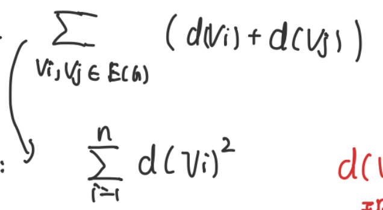
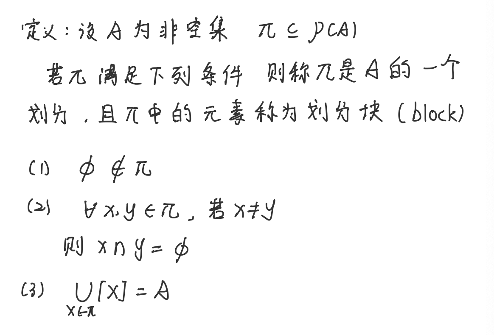
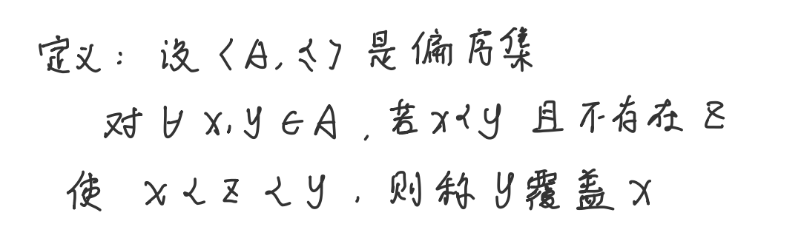
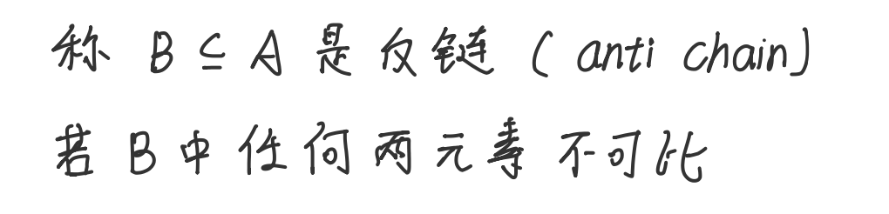
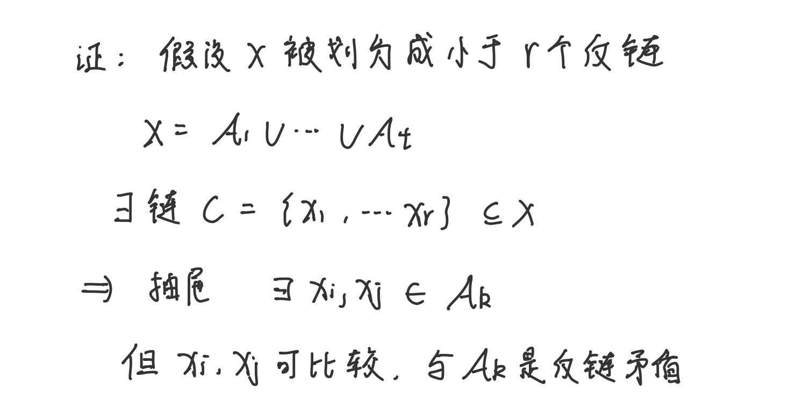
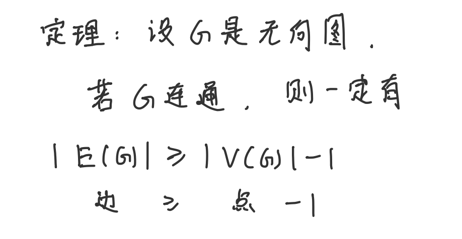
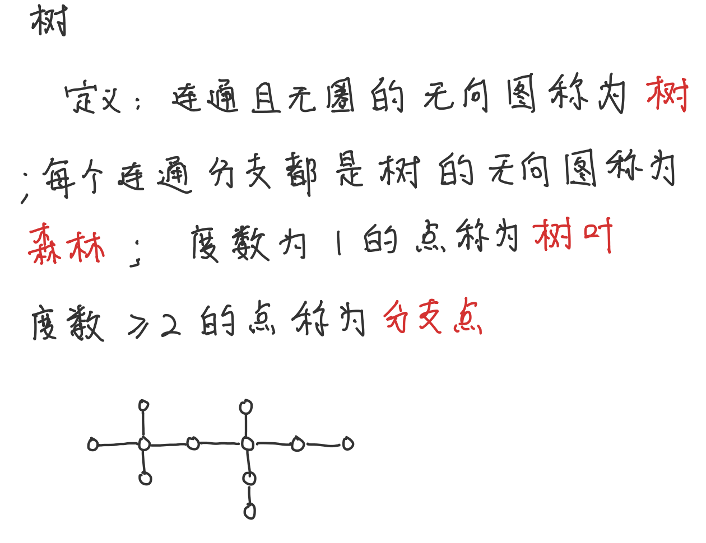

	笔记中的截图大多来自项博成同学。感谢他的友情帮助，让我离散数学这门课最后有一个不错的分数。🙏

这是我最应该深耕的数学板块。
## 未归类
### 集合相关的容斥原理

容斥原理高度依赖同一性质作用于不同对象时的对称性

容斥原理在实际应用中的建模：
Q.什么时候会用到容斥原理？
多个条件的同时满足较为复杂啊，但是同时满足的条件比较少时比较容易计算。
Q.怎么建模并使用容斥原理？
<b>将条件的反面设置为性质。</b>

使用时的注意事项：
1、公式右侧是和公式左侧相反的性质
比如，要算发错作业这个性质，右侧就是发对作业这个性质
2、如果概率好算，可以直接算概率。
（左右两边同时除去总的种数就是概率）

### “组合推理”这个概念（双计数）
就是用实际情况中的例子来说明代数式

图论当中双计数的案例

度数和等于边数和*2

用双计数证明容斥原理

关键是示性函数的理解
当x在任意一个区间内时，贡献值就为0，如果都不在，贡献值就为1（然后求和）

组合的概念

组合的第一思路是挡板法

球不同，盒子也不同

对所有球进行全排序，然后对各个盒子当中的球进行去序（毕竟都放进同一个盒子里了，就相当于没有顺序了。

### 排序分组类问题归纳

### 数论基础知识

<b>算数基本定理</b>

注意到素数当中只有2一个偶数，所以又可以写成

两个数能不能整除，关键就看其奇数组成部分是否一致（其实也不太对？
奇数部分也可以是高次的。

<b>整除理论之带余除法</b>

## 抽屉原理（鸽巢原理
### 抽屉原理（鸽巢原理）——底层原理
1、最简单的版本：
a + 1 个苹果放进a个抽屉，至少有一个抽屉有大于等于2个苹果

1-2、如果每个筐都只能装限定数量的苹果，而总苹果数又大于总限定数，那么至少有一个筐的苹果会超过限定数。

### 抽屉原理——例题1
**n个**互不相同的正整数一定可以取出（连续的）若干个，使其**和是n的倍数**

很容易注意到，两个正整数是否不同，关键是看它是否同余。
n个数如果都不是n的倍数，那么其至少有两个数同余。
如果直接做的话，似乎就算有两个数是同余的，我们也无可奈何。

故构造b（使得b的各项之间的差为a的和） 这个构造和式法实则非常妙，因为我们最终要求的是一个带条件的和式，所以这里

证明的简要说明：

（注意整除问题 往往可以考虑把数写成带余除法的形式）
往往是利用同余这个性质来进行解题，不过在这道题当中，由于问的是和的性质，所以构造了和数列bn
### 抽屉原理——例题2抽屉原理（鸽巢原理）

假设两个条件均成立
那么每个递增子列最长也就是n（递增子列本身也暗示了递增子列长度的可能种数
所以一共有1，2，3，……，n种从某个位置开始的最长递增子列长度的值
（也就是n个抽屉）
现在有nm+1个位置要分配n个值
（nm+1 个苹果放进n个抽屉）
至少有一个抽屉要放m+1个苹果（后面的就好说了）

### 抽屉原理——例题3

这里的关键是 a b的位置是可以交换的，所以不用管alpha谁大谁小。（即问一个集合中，两个元素是否能相互整除，其实只用管其奇数组成是否**一样**（而不是倍数）

- 整除问题常常考虑使用整数分解理论，要么就是带余除法
### 抽屉原理使用总结

关键是构造出n+1个具有n性质序列的东西，然后说明这n+1个中必有2个是同一性质的。

### Ramsey数

“假如外星人要求人类算出r（5,5)，否则就毁灭人类，人类或许应该集全地球之力来完成这件事，如果外星人要求算出r（5，6），人类或许应该考虑如何毁灭外星人”

定义

### Ramsey数的递推性质

证明
证明的核心思想：
<b>就是找任意一个点，分析它的相关点集的规律</b>

### 递推性质可以导出Ramsey数的上界
（k+l-2)
(  k-1  )

### 对角Ramsey数的上界和下界
找下界其实就是要找到一个数，这个数的全向图即没有红Kt，也没有蓝Kt
（有点像在找另一种情况的反向Ramsey数的上界）
这里借用了概率论的思想，计算至少有一个红Kt或蓝Kt的概率，如果这个概率小于1，则存在红蓝Kt都没有。

### n个顶点但是不含Kt的边数问题
d()是顶点的度数（即这个顶点所连接的边数）
e是边的数量，n是点的数量
其实是一个颇为美妙的证明（老师讲得太快了，导致云里雾里的）

核心思想1:邻居集合不相交

这里证出了任意两个相连的点的度数和小于等于n

简单求和

我已经有了右侧的上界，再放缩得到左侧（左右两侧都包含e，可以消出e的不等式

在看到有保持凸/凹的函数，就要想到Jensen不等式（或者要有发现凹/凸函数的眼睛，就像发现单调函数一样。

下面这个是图中无三角形非常重要的必要条件。  -

矛盾

这一步转化需要想一想 其实类似于**握手定理**。

### Ramsey数的核心本质：

**完全的无序（无规律）是不可能的，一个系统（集合）包含的元素足够多时，一定会呈现出某种规律或结构。**
这里就是 只要点足够多 一定会出现红色/蓝色的Kn
其实 自然界中的粒子为什么会产生规律 某种程度上也是由于这个原因。

## 生成排列和组合
### 生成排列
	是编程当中拆分问题的思想，不断地分解问题，最终子问题完美。
	

一个数一个数地插入 每次生成的都不一样 递归地不一样

### 逆序列和排列之间是双射（可以借助逆序列来研究排列）
首先，逆序列和排列集合大小一样（满射是自然的
只需要证明单射（每个逆序列的原序列唯一）

注意观察这里由逆序列生成原序列的方式 就是从大到小 逐个插入 每个数插入的位置都是固定的（逆序列构建排列的第一种算法）

逆序列构建排列的第二种算法（从小到大，留空位置

### 字典序创建组合
### 创建r元组合
## 关系
### 二元关系
	“反对称”要着重理解，其实反对称说的不是对称是不可能的，而是不是自反的对称是不可能的。
	

### 等价关系的延伸性质（还有等价量的概念）
（等价关系可以用Union-Find并查集来理解）
有三大基本性质：
自反性 对称性 传递性

下面这四个是延伸性质

1是自反性
2是传递性
3也是传递性
4是自反性

### 商集的概念
<u>以</u><u>R（R是等价关系）的所有等价类作为元素的集合</u>
### 等价类的定义
等价类是集合等价关系作用在代表元上得到的集合。6

等价类的两大核心：代表元和作用关系
代表元通过作用关系就“生成”了整个等价类。
### <b>划（</b>**partition）的概念**
类似于切蛋糕，而且蛋糕之间不能有重叠（显然），而且空气不算蛋糕（即蛋糕一定要含有非空元素）

例子：

### 定理：等价关系和划分之间是双射
	所以**问有多少种等价关系 本质上就是问有多少种划分**
	怎么理解？
	其实 等价关系的关键不是其之所以等价的条件（如同余），等价关系的本质就是集合（就是划分这种形式的集合）
	类似于把东西分类，一个等价类里的东西一定是等价的，不是一个类里的一定不等价（这听起来像废话）

所以问有多少种等价关系，就是问有多少种划分

### 偏序关系的定义
关键是反对称（相比于等价关系）

### 可比和线性序（全序）的概念

### 覆盖的概念
	这个名字起得不好
	不妨叫做“邻接”
就是说，关系中一定没有中介（邻接关系）
或者说，覆盖的覆盖不是我的覆盖（仆人的仆人不是我的仆人）

### Hasse图

### 最小元和极小元
最小元是和整个集合中的所有元素比较 极小元只需要在等价类可比的进行比较（所以可能会有多个极小元；

### “良序”及其相关的定理

良序本质上在讨论两个点：
1、最小值的可取性（往往和有限集还是无限集有关，开区间和闭区间有关（如果实在实数系上））
2、全序可比性
### 每个有限的全序集都是良序集

### Zorn引理
	一句话：若A的每个全序子集都有在A内的上界，则A一定有极大元
	

ZORN引理还要求**这个集合的上界在这个集合之内。**


（ 0， 1）
### 链的概念
	链的概念，核心是可比性
注意， 链和反链都是集合S的子集的一个集合
比如 {1, 2, 3, 4}
{{1, 2}, {2, 3}}就是一个反链（任意两个不相互包含）
{{1}, {1, 3}, {1, 3, 4}}就是一个链（任意两个之间都有包含关系）

### 链和反链

反链就是反链的性质（可比 -> 不可比

### 最大链的概念

只要没有一个链能完整地包含它

注意：
最大链长度不一定是最长的
一个有限集也可以有很多个最大链（最大链常常不是唯一的）
### 包含A（|A| = k)的最大链数目
k! (n - k)!(k!是包含于A的子集的数目，(n - k)!是包含A的子集的数目
### 包含式反链的至多元素（Sperner定理

非常“组合数学”的证明：

首先 ，记住反链这个集合的集合中**任意两个集合都是不互相包含**的。（且每个集合都是S的子集）
那么我们来考虑最大链，我们知道**S的任意一个子集，都在某一条最大链中**，
而**一条最大链中的任意两个集合都有包含关系**。
我们尝试从所有最大链中构建最大反链。
显然，**每条最大链至多只能选一个**（选两个就有相互包含关系了）

所以，最大链的个数决定了反链这个集合的大小的上界。

<b>最大链的概念</b>

### 二项式定理的几个恒等式

用双计数的方法可以又快又好地证明这三个恒等式（只取奇数/只取偶数）

对于取0～n的情况，左侧就是最后取了0/1/……/n的情况 右侧就是对于x0，x1……xn每个对象，是否取（每次做选择都*2）

当只取奇数或者偶数时，左侧形式显然，右侧则变成n-1次方
因为当取到最后一个对象时，是否取已经由前面已取的是奇数还是偶数决定了。

### 反链的最大长度 常常被称为偏序集的宽度

其实挺直观的，把幂集的Hasse图画出来，刚好就是最宽的那一行的长度
### 与Dilworth定理“对偶”的定理
只是形式上对偶，证明上完全是两个东西（链和反链其实也只是形式上对偶，在实质上很不一样）

划分反链的个数 >= 链的最大长度（且等号可以取到）

小于不行是很显然的（只需要用抽屉原理）
如果连r个反链都没有，（最多r - 1个反链）， 那么单是长为r的最长链都只能分成 r - 1份（最少有两个分到同一个反链里）

“极小元剥洋葱法”构造r个反链

由于**极小元（极大元）组成的集合一定是反链**，将它们一层层剥开，就会得到很多层反链

由于这些反链的并集是整个集合，所以最长链必然就是这些反链中每条中取出一个。
所以反链的个数小于最长链的长度。（这就是下面这段证明所讲的事情）

### Dilworth定理

这玩意我没看懂 在93页 待进一步研究

大概就是说，以最大反链是不是所有极大元的集合/所有极小元的集合作为分类标准，分成两种情况讨论。
如果不是所有极大元的集合/所有极小元的集合，那就可以以这条链作为一个划分，上面的和下面的部分用归纳法证明。

### 集合论概念：等势
引入：

可以看出 等势在线性代数中就是秩的概念。

等势和可数的概念：

### 罗素悖论的集合论表示（同时也证明了可以通过幂集来找到更大的势

如果引入优势的概念 则更好证明了

### 集合论概念：优势
“优势”是一个偏序关系，类似于大于等于。
关键在于集合的大小（有限集合元素的数量 无限集合的测度）

### 一些常见集合之间的关系（怎么构造两个等势集合之间的双射？
1、

2、

2的幂次单独处理 其余不变

3、

其实就是通过更改对角线上的值 确保B和每一个f得到的值都不一样。
### 二项式（可以扩展到负数形式）

### 生成函数法及其作用

证明

这也太巧了！
这是在干嘛？（看不懂了哈哈哈哈
### 生成函数法的其他应用（带限制的组合问题
用1克砝码、2克砝码和4克砝码组成4克砝码 一共有多少种方案？

（x无关紧要 关键的是系数和指数
系数意味着方案数，指数意味着该砝码的个数

！！！！！！
## Catalan数
### 满足Catalan数的几个经典案例

### 首先证明正n + 2边形三角剖分方法数是Catalan数

### 然后证明Dyck路径的方法数是Catalan数

可以发现 满足Catalan数的情境其实都是相似的
都是可以找到（剖分成）以下递推关系

### Catalan通项公式的证明之一

8.2式指的是，这2n个数的序列满足部分和一定大于等于0

关键在于：
找到第一个不可接受的值时，前面的数一定是k个+1 k个-1，把这2k+1个数反转，反转后的值是可控的（n + 1)个+1和(n - 1)个-1。

### 证明Catalan数的通项公式的另一种方法（从递推关系出发）（其实这个是最本质的 +1-1可以理解为只是一个例子）

未完待续（主要是那个证明太长了

如果证明了下面这条 其实可以用很简洁的方式证出+1-1为Catalan数

### 整数分拆问题和欧拉定理

普通分拆：（无限制条件

欧拉定理

证明

关键是要理解 为什么生成函数是

 
和

（都是普通分拆的生成函数的变种

细节：
这里的转化也是有点妙的，上下成k个偶数项，其中有一半可相消掉。

## 图论
### 数学中环的定义（不是“圈”）
一个点有一条线连回到自己

### 平行边的定义

### “关联”定义
关联描述的是点和边之间的关系
如果有一条边和一个点有联系，则称这个点和这个边关联。
### 邻接矩阵和关联矩阵

如果有环，就要标为2

### 握手定理（度数为两倍边数

毕竟一条边会创造两度（在两个点上各创造一度

### 最大度和最小度
其实就是找到连最多边的/连最少边的那个点
连了多少就是多少度

严格定义：

### 度序列
即把各个点的度按大小顺序排列起来。

### 同构
由于图的本质是关联关系
所以同构就是要关联关系都符合

### 度序列和同构
同构则一定度序列相同 
但度序列相同不一定同构

### 推论：图中度数为奇数的点 一定是偶数个
（否则和握手定理矛盾）

### 生成子图和导出子图的概念
- <b>生成子图</b>强调的是**保持所有顶点**，可以自由地删除边。
- <b>导出子图</b>强调的是选择一个顶点子集，并保留这些顶点之间的所有边。 （导出就是有个操作过程，**然后自然而然的就得到了图***

### 途径和迹、路径的概念
边不重复的途径是迹
点不重复的途径是路径

### 最小度圈定理
注意 简单图没有平行边！
定理描述：

一句话：最小度大于等于2的图一定有圈

非常非常好证明 只需要使用极大路径法（本质上就是因为其最小度为2，所以可以一直延伸，一直延伸就一定会延伸回自己 

上面这里证明的是有圈，关键是取极大路径边界上的一点，说明这个点所连的两个点一定都在这个极大路径上（其中一个是V1）（否则可以延伸）

下面证明为什么圈的长度会大于等于k + 1
也是用最大路径法 当到达路径顶点时，这个点还有k - 1个点需要连接，而且这k-1个点一定连到这条最大路径上的其他点

取离得最远的那个，发现这条边最近也得跟顶点隔了k个边（最近那个点不能再连一次，否则有平行边），再加上连着的这条边 那就是k+1长度的圈。
（待拍图）
### 两个点之间存在途径就一定存在路径（也一定存在迹

做去重操作即可。

### 连通性的定义

### “连通分支”的定义

即被分成了几块

### 点割集和割点的定义

点割集的定义是割掉这些点之后原图不连通（点割集不唯一

割点就是大小为一的点割集
### 连通度定义
即最少要割去多少个点才不连通。

如果图里面包含了全向简单图Kn（即可以生成Kn），那连通度就是n - 1
### 类似的，还有“边割集“

### 定理：最小度>=边连通度>=点连通度

### 欧拉闭迹和欧拉图
	欧拉迹就是
欧拉闭迹可以重复经过顶点，但是不能重复经过边。

欧拉图存在的定理

左推右特别好推，可以把一个奇数度的点看作出发点和结束点（闭）
那么出去的次数和回来的次数得相同。

关键是右推左（这里用到了类似于证明n边形三角分割的Catalan数的方法。
删去一个边割集，然后归纳法（各个欧拉闭迹可以合成一个大的欧拉闭迹

### 用树证明一些东西
	树的反面刚好就是圈。
离散数学有意思的点在于
它的很多证明不是从定理出发的 而是寻找一种算法/方法去证明
比如说 在树里面 每删去一个树叶 都一定是删去了一条边（可以证若边数大于等于点数，则一定有圈

当然 还有很多证明是从定理出发的
比如用树的度公式（证明5阶及以上的图和它的补图必有一个有圈
### 二元域

### 在二元域中解决奇偶问题
问题：
一共n个人
一个社团的人数只能是奇数
两个社团的交的人数只能是偶数
求最多能建多少个社团？

在二元域中两个向量做内积可以表示交的奇偶（如果是0那就是偶
然后就可以完成这道题
线性无关 所以产生的最多n个向量

### 哈密顿圈和哈密顿图
	和欧拉闭迹和欧拉图不同，这里并没有一个很特定的等价条件/定理
	判断变得比较困难（尤其是既不违反必要条件，又不满足充分条件时。

定义：（经过所有**点**有且仅有一次，且为圈。

#### 必要条件：（删去n个点，不能有超过n个连通分支

证明：即最简单的圈（可以从任意哈密顿图当中提取生成子图）的情况都满足这个情况，则任意哈密顿图都应当满足

#### 哈密顿图和欧拉图没有必然联系

这是一个欧拉图，但不是一个哈密顿图（注意欧拉图和哈密顿图都要求闭
### 哈密顿路径（不要求是圈）

#### 哈密顿路径和哈密顿圈的充分条件
限制任意两个点的度数和。（即限制两个最小度）

似乎只能死记

### 二部图
定义

完全二部图（两部分中各取任意一点 都有且仅有一条线连接。

#### 二部图与圈的关系

证明：
过去总得回来。

### 无向图连通性的必要条件

证明：
归纳法，显然得不能更显然了。

### 树及相关概念

### 树的等价命题
关键是2、3、5、6

这几个等价命题的互推感觉很有可能考察。

### 平面图这一块忘记归纳了

如果是极大平面图 那么m = 3n - 6

