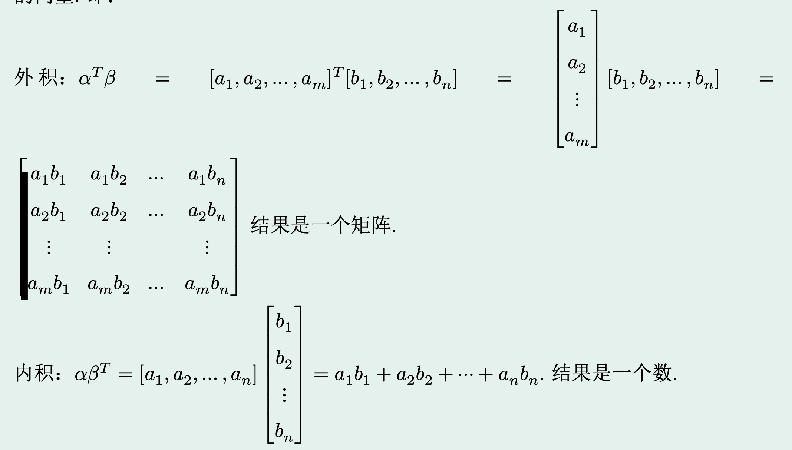
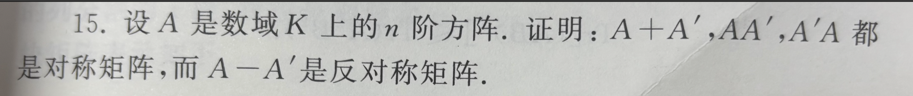
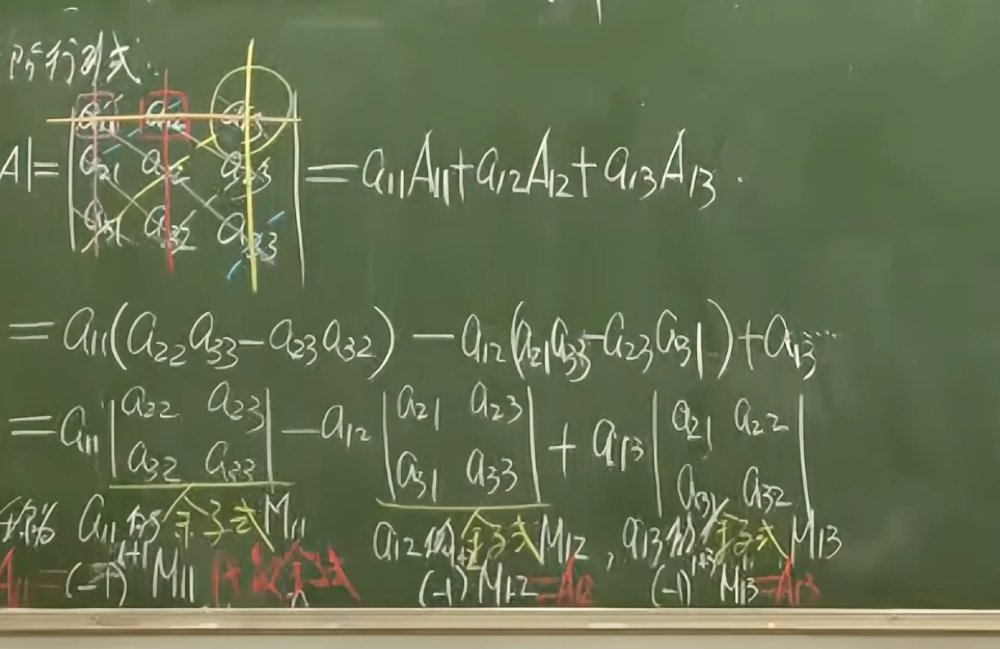
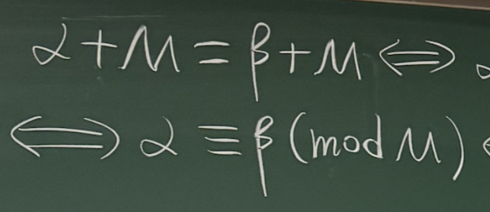
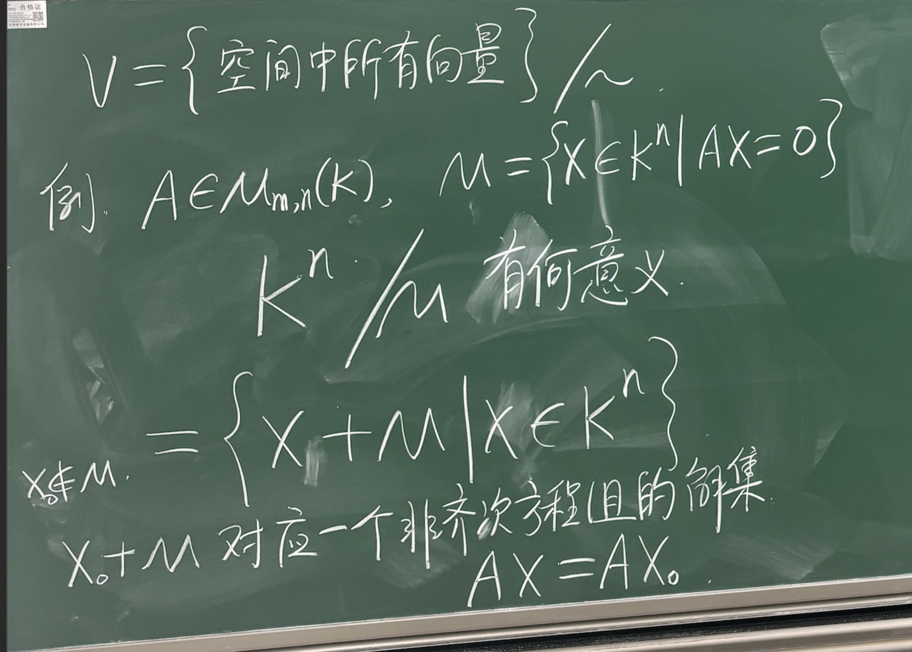
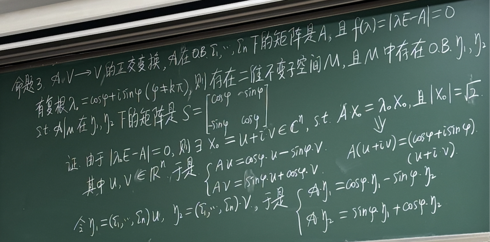
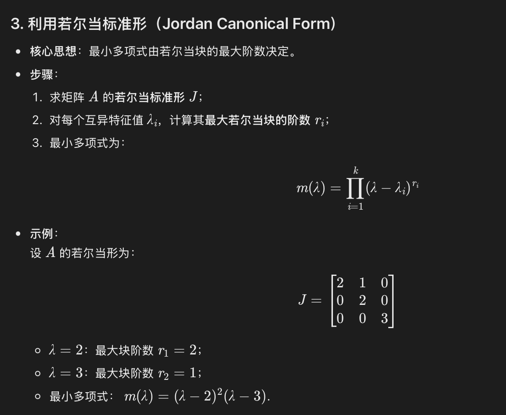
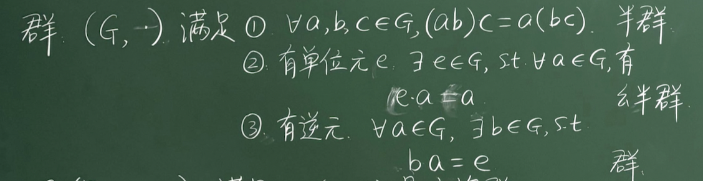
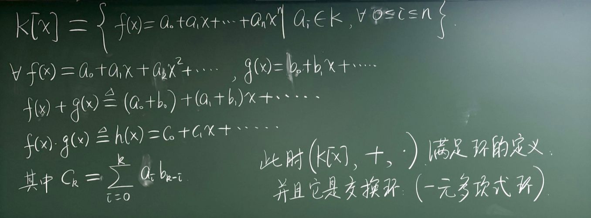

#线性代数
## 准备知识

### 复数的逆

逆其实就是能让它变为1的东西。

### **数域**的概念及其相关的命题

数域的定义：
	1、数域中的数对复数的加减乘除法则封闭
	2、数域中至少含有一个非零的数（这条要记得）

复数域是最大的数域（未证明）
有理数域是最小的数域（任意数域K都包含有理数域Q）（易证，想想怎么证，以什么为起点开始推）

### 集合论的相关概念和命题
	
	差集：A\B（A中元素除去B中元素）

	映射：即对应关系（且要求每个元素都只对应一个元素（对应的元素可以相同）

	单射：若a不等于b，则f(a)不等于f(b)（f是A到B的映射）
	满射：若B中有值b，则A中有值a，s.t. f(a)=b
	双射：既是单射，又是满射，造成“一一对应”
示意图：

注意，“映射”本身就意味着A的每一个元素都在B中有**唯一**的对应元素。

	变换：到自身的映射（集合一样即可）
	恒等变换：每个元素都映射到这个元素本身

	可逆映射：
	逆映射：
	注意此处每个元素都要映射回自己这个元素即可（不只是集合一样）

似乎显而易见的命题：双射必可逆，可逆必双射（都已经一一对应了）

## 一元高次代数方程的基础知识

### **高等代数基本定理**
	<b><u>n次方程在复数域中必有一根（没证）</u></b>
	可以用来因式分解？
	
### **综合除法**

由一个小公式推出整体的方法，妙哉妙哉。

### 极大线性无关部分组的定义
（1）这个向量组里的向量是线性无关的
（2）原向量组里的向量都可以由这个组里的向量线性表示。

极大线性无关部分组当中向量的个数就是秩的大小。

求极大线性无关部分组还可以用“筛选法”（常常用来证明相关的命题）
### 极大线性无关部分组与其原向量组线性等价
用筛选法即可证明。
### 推论1：C上的n次代数方程恰有n个复根（可能会有重根
综合除法递推一下就好了
（虽然非常容易证明，但是这个命题是要牢记于心中的！）

### 推论2：若两个多项式存在比两个多项式次数都多的点处值相等，则这两个多项式一定相等。
两个多项式相减一下再利用推论1即可

### 一个根的共轭复数一定也是根（这可以推秩为奇数的实矩阵至少有一个特征值

### 推论：奇数次一元代数方程必有一实根
虚根成对出现

### 若方程系数均为有理数，则有理根的分母一定为首项系数的因数，根的分子一定为常数项系数的因数。（前提是存在有理根（不一定有有理根））
有理数系数可化为整数，然后把根设为p/q代入，再利用ad=bc，则a整除b或a整除c即可证明（a, d, b, c均为整数）

## 线性方程组
### Q.什么时候会**无解**？
增广矩阵的右侧不等于0，左侧全部等于0（显然矛盾）
那什么时候会消元消出这种情况呢？
当方程组数量比未知量多的时候（可能吧所有的未知量系数都消为0了，右侧却不是0）

当非零行等于未知量数目，有唯一解
当非零行小于未知量数目，有无穷多个解

还有一个充要条件：
当系数矩阵的秩不等于增广矩阵的秩的时候（相当于右侧常数所组成的向量无法用系数矩阵中的向量线性表示）

### Q.怎么知道哪几个是**自由未知量**？
方法：将不在任意一级阶梯最左侧的那一个未知量移到等号右侧（剩余的数形成一个方形阶梯矩阵（有解），移到等号右侧的位置量都是自由未知量（主变量是每级阶梯最左边的那个量）
例子：

注意：底下<u>全是0的那行可以直接忽略</u>（无意义）

### 求解秩和极大线性无关部分组
秩的数量就是阶梯数（主元数）
阶梯所在（主元所在）的列（的原来对应的向量）就是极大线性无关组中的向量。
（要注意，求解极大线性无关组是，如果是按照列排列的，只能进行初等行变换，不能进行初等列变换（这样就分不清哪个是哪个了））
另外，要看清楚题目要的是导出方程组的基础解系还是原方程组的基础解系。

### 线性方程组只有三种可能：
1、无解
2、有唯一解
3、有无限多解
（考虑只有两条线的情况，若有两个解，就有无限个解，多条线可以化归）（不可能有2/3/4个解）
怎么用代数方法严谨证明呢？

tip:注意解是在实数集/有理数集中，不能在整数集中（更详细一点，应当在系数所形成的数域范围内）

tip：齐次线性方程组不会有常数项（=0，不然就不齐次了），一般线性方程组可能会有常数项。

行列式引入当中有求解解的个数的一种方法，这里提供另外一种（利用Gauss消元得秩，然后利用基础解系的个数=n-r求解的个数）
<b>齐次线性方程组中</b>
当n（未知量个数）=r，则有唯一解；
若n>r,则有无限组解；
n<r，则无解

### 基础解系相关知识
基础解系的定义（核心就两点：本身线性无关、可以线性表示所有列向量）

关于基础解系本质的思考：
Q1.对于一个线性方程组，难道不是每个方向的x轮流取1，其余方向的x全部取0就一定能得到基础解系或包含基础解系了吗？
错误的，基础解系还要求解系中的每个向量都是解向量（想当于都接触到平面）
事实上，自由未知量的不同组合会生成整个解空间（相当于是取了基础解系的所有线性组合）

Q2.基础解系在几何上到底是什么
<b>基础解系是解空间的基底</b>
基础解系的每个向量，都是从解空间的一点指向解空间的另一点的，而且基础解系中的向量乘任意实数后仍指向解空间中的点。
（想想解空间可以由特解和基础解系的任意线性组合表示就知道了）

<b>用线性无关向量表示方式是唯一的</b>

<b>基础解系中解向量的个数</b> **n-r**（其实就是一个自由未知量对应一个）（这个非常重要）（对应了MIT中四大空间“零空间”的秩的问题）

解个数

解个数的判别定理（牵扯到增广矩阵）

求解全部解的过程：

求特解时
### 基础解系中向量的个数为（n - r）个（即零空间向量的个数）
找到一个基础解系即可。（由于基础解系是相互线性等价的）（极大线性无关部分组都是线性等价的）
### 齐次线性方程组若系数矩阵满秩，则只有零解
证法1:通过极大线性无关部分组的数量说明
证法2：基础解系的向量个数为n- r = n - n  **(unknown attachment: com.apple.notes.inlinetextattachment.calculateresult)**  0
### 一般线性方程组中解个数的判定定理
（记得取课本95页定理3.3的照片）
这里其实一开始是没有理解透彻的。

Q1.为什么增广矩阵的秩要和系数矩阵相等，才会有解？
增广矩阵的秩不可能比系数矩阵的小。
如果增广矩阵的秩比系数矩阵的秩大，则意味着常数向量无法用系数矩阵的极大线性无关部分组线性表示。

### 命题：若一个线性无关向量组添加一个向量后变成线性相关的，则这个新向量一定可以被原向量组线性表示。
不失一般性地用系数全为0说明即可
（分类讨论）
（假如原向量组中alpha i可被线性表示，则新增向量beita的系数一定不能为0）

### 线性相关的一组向量，经过线性映射得到的一组向量（可能包含0向量），肯定还是线性相关
### 以下是我见过的最牛逼最流畅的行列式的引入（丘维声nb！）
这个引入其实就是通过线性方程组的解是否存在这个问题引入（并非行列式的严格定义）

非常自然的消元，消元后发现

如果这一项不等于0，则有唯一解
如果这一项等于0，则要看这一项

是否等于0，若其等于0，则有无穷多个解，若其不
等于0，则无解（即无穷多个解或无解）

注意到，整体上这就是由两个行列式决定的。
一个是这个

另一个是这个的分子

## 矩阵的运算
### 一些tip：
	1、矩阵乘法一般 不可交换，交换后不一定能乘，能乘时值不一定相等。
	2、**两个非零矩阵相乘可能变成一个零矩阵**
	3、矩阵乘法没有消去律（除非消去的矩阵可以为任意矩阵

### 纠正一个行列式计算的理解错误

如果一个矩阵的列数=行数，则这个矩阵的列向量线性相关与行向量线性相关等价。

### 向量相乘（在n维空间中统一几何的内积和外积）

列乘行是外积（结果是一个矩阵）
行乘列是内积（结果是一个数）

### 对角矩阵的可交换矩阵一定是对角矩阵
### 特殊的矩阵：上升阵和下降阵

### 矩阵运算和秩的关系（这一部分似乎弄得有些不明不白
核心：若A能被B中向量组线性表示，则A的秩一定小于等于B

小总结：
	1、积后秩小于积前秩
	2、积秩 + n 大于  >= 秩和 >= 和秩
	即 r（AB） + n >= r (A) + r(B) >= r(A + B)
（可能会用这一条来夹逼）（要注意，此处的n不一定要是方阵，只是左边矩阵的列数和右边矩阵的行数罢了（这俩一定相等））
	3、r(AB) + r(BC) <= r(ABC) + r(B)
	这个可以推出2
	要用分块矩阵来证明。

相乘后秩小于等于相乘前任意一个

<b>相乘后秩大于等于相乘前相加再减去</b>**n（下界）**

如果秩等于0，则值也一定全部等于0。（虽然矩阵没有消去律，但消去律在某些情况是存在的）

<b>矩阵乘法按照行</b>**/列分解**
	**若对应左边矩阵的某个向量，则是行**
	**若对应右边矩阵的某个向量，则是列**
AB=C
ABi = Ci（B的第i个列向量（本身也可以看作一个矩阵）
AiB = Ci（A的第i个行向量）

利用这个式子就可以尝试将Ci转化成Bi/Ai 
### 矩阵相乘=0的含义是：右侧矩阵中含有的向量为左侧矩阵所形成的齐次线性方程组的解。
### 逆矩阵

命题1:<b>左乘的逆矩阵和右乘的逆矩阵是相等的（逆矩阵是唯一的）</b>
证明方法：
	BA=AB‘=I（就是用单位矩阵来做代换，然后再用结合律
代换几次就可以代换处B=B’

命题2:**矩阵**<b>可逆的充要条件是</b>**矩阵**<b>是满秩的。</b>
初等矩阵的概念：单位矩阵经过一次初等行/列变换得到的矩阵。
证明方法：
满秩矩阵可以经过单位矩阵（一定是满秩）经过很多次初等行/列变换得到。

（这里可以推出满秩矩阵的行列式可直接结合（即若B满秩，则｜A｜｜B｜=｜AB｜（要先经过初等矩阵行列式乘任意矩阵的行列式都等于初等矩阵乘这个矩阵之后的行列式（即当P为初等矩阵，有｜P｜｜A｜=｜PA｜）

### 求逆矩阵（对A ｜ E使用高斯消元法）
把A消成E，E就会被消成A^(-1)

### 求已知矩阵的逆矩阵和另一个已知矩阵相乘
和求逆矩阵的方法相似，只需要对（A ｜B）使用高斯消元法，消成（E ｜ X），X就是A^(-1)B
### 几个有关特殊矩阵和转置的有意思的命题

命题1

A+A'是显然的（把各个位置的数用代号写出来就知道了），
AA‘和A’A则似乎不显然，但写出来后发现，对称位置的数其实还是同样的几个数进行点乘

命题2

这个命题蛮重要的，其表明
两个可交换的对称矩阵乘出来一定还是对称矩阵

（证的时候要弄清楚我有什么，要证明什么，始终记得有对称矩阵就有A‘= A，有“可交换”就有AB = BA

### 迹的性质
定义：迹是方阵对角线上元素的和。

命题1:乘法顺序改变，迹的值不变。
**Tr(AB) = Tr（BA）** 这个非常非常重要！

命题2:当A中值都是R中的值（没有虚数）
当Tr（AA‘） = 0， 当且仅当A = 0（都是使用微观表达式来证明，证明如下）

这个表达式宜背下来

### 二阶矩阵的特征多项式与其行列式和迹有着特殊的关系

### 分块矩阵的分解
这一核心技能可以用于证明很多很难的blabla变换的矩阵可以分解为/对角化/……

## 行列式

行列式的引入在“线性方程组”中有，但那只是一种引入，没有严格定义行列式（在二次及以上的情况行列式为什么那么计算？为什么仍然有效？）
（这里的严格定义很像是得到行列式之后，通过其必要的性质一步步回推基础条件，MIT课程中直接讲授了性质）

### 行列式严格定义（行列式函数）（可看可不看，感觉莫名其妙）
我们知道行列式应当有以下三条性质：
1、具有行/列线性（可拆，可线性组合（对某一行或某一列，而非整个矩阵））
2、如果矩阵不满秩，则矩阵的行列式值为0
3、单位矩阵的行列式值为1
现在尝试通过严格的定义，构造出有这三个性质的行列式定义。

可以注意到，行列式其实是一种映射（一个函数）每一个矩阵x都有唯一对应的一个行列式函数值

第一步：定义**行线性函数**and**列线性函数**
（行可加是行线性，列可加是列线性）

第二步：定义“**反对称**”（反对 对称）
如果没有两列/两行相同，则称这个列线性函数/行线性函数是“反对称的”
推论：
	1、反对称列线性函数**两列互换，值取反号**（思考一下怎么用反对称性说明这一点？其实就是互换后两个矩阵相加，显然有两列相同）
	2、反对称列线性函数做**将一列k倍加到另一列上的变换，值不变**（同样也思考一下？其实就是拆开后得到两列相同（加了0））（注意并不是所有的初等行列变换行列式值都不变）初等行列变换有三种类型：1、交换2、线性组合3、数乘
3、

4、
f为反对称列线性函数的充要条件是f对任何不满秩方阵A都有f（A）=0（从这一点就已经可以看出其有成为行列式函数的潜质）

第三步：定义**行列式函数**
定义1：f为反对称列线性函数（由4有其对任意不满秩矩阵值为0），且f（E)=1,则f是行列式函数
定义2（通过4和定义1等价）：

### **行列式定义相关的命题**

这几个命题几乎都是用同一个思想证明的。
1、**行列式函数唯一**
2、**矩阵转置，行列式值不变**

得出行列式定义及其唯一性，但仍没有把行列式函数写出来。

（可以注意到，每次都是n个不同列的数相乘（每列取一个））

这个式子也需要背下来（常在行列式的微观证明中使用。）

### Q什么时候系数为正，什么时候系数为负数？

注意到当列序数递增，则为正；列序数递减，则为负。

### 排列的奇偶性
先是几个比较自然的定义

逆序数-逆序的数对的数目
奇排列-逆序数是奇数
偶排列-逆序数是偶数
对换-两个数交换位置

### 命题：对换一次，奇偶性变换一次
先证相邻的情况：

tip:两侧的可以不用管，数对数量不会变，只有中间那两个变了。
然后

然后就是将一般情况化归到相邻的情况（类似于冒泡排序/拥挤的公交车下车“劳驾”）
注意到从左到右和从右到左次数一样（偶数）最后再加个1。（即2s+1次相邻的情况）

### 排列奇偶性（逆序）在行列式中的意义（用于n阶行列式的定义）

偶排列——正号
奇排列——负号
在这个定义当中（没有用向量空间），行列式就是右侧求和的一种书写形式

### 三阶行列式计算（此处不利用拆分）

普通算法：展开求和符号
1、共有n！项
2、令行/列中一个指标为自然顺序，然后另外一个排列组合
3、根据排列奇偶性确定正负号
巧算：对角线平行相乘
\正对角线相乘是正好，/反对角线相乘是负号。

### 上三角形行列式

证明其=对角线相乘：
方法1:将其用最后一行展开
方法2:利用“行列式计算的巧算”

### 一般情况的行列式求值（行、列指标都不是自然排序）
这里是给后面的转置作铺垫

某个值前面为正为负，只需要看其所在行和列的tau相加（逆序对数量）

### 行列式性质1:转置不变 
感觉非常显然，可从上面那个推

### 行列式性质2:一行$*k$，结果$*k$
（行列式*k和矩阵*k是不一样的，矩阵当中是每一行都乘（对应的行列式*k^n)

### 行列式性质3:相加可拆

### 行列式性质4:交换取负
核心：就是改变了行/列的奇偶性
tip:注意下标，k不一定对应jk（要看具体的行列式的行和列）

### 行列式性质5:行/列相等值为0

直接用交换取负（性质4）且交换后不变即可证明。

### 行列式性质6:两行成比例，值为0

通过性质2（数乘）和性质5

### 行列式性质7:一行加上另一行的k倍，值不变。

利用性质3（拆分）性质6（成比例值为0）

各种性质的综合运用案例（注意这里是怎么一步步化为上三角形的）

### 行列式性质8：| XY | = | X | * | Y |
### 行列式性质8 - 1: ｜X ^ -1 ｜= ｜X｜^ -1
### 行列式展开和代数余子式的引入

代数余子式的定义：（划掉所在的那一行那一列）

余子式展开证明

如果不是按照自己对应的代数余子式展开的，则值为0

（可以用构造一个新的行列式，展开式和所求相同，但是可见有两行相同，值为0。
### 范德蒙行列式
	从1开始，到n - 1次！！！

### 行列式与解个数的关系
可以先回忆一下答案是什么，然后再思考一下要怎么证明（提示：利用增广矩阵的行列式推导）
当行列式等于0时，意味着存在0行。

要非常彻底地理解这一页板书
系数矩阵有零行后还有两种可能，一是增广矩阵也有零行（无穷多个解），二是增广矩阵没有零行（无解）（0 = n）

推论：齐次线性方程组系数矩阵的行列式为0时，只有零解。
### 行列式k行（列）k阶展开（laplace定理）
求和：这k行当中所有子行列式乘上他们各自的代数余子式
应用案例：打洞

<b>上三角乘上三角仍是上三角，下三角乘下三角仍是下三角</b>
其实可以拆分每一列来说明（就用矩阵乘法的分配性质。

## 向量空间
### 映射的概念
用同学找座位很好理解，同学是定义域，椅子是陪域，坐了同学的椅子的值域，如果每个椅子都坐了同学，就是满射；如果没有两个同学挤一把椅子，那就是单射

值域包含在陪域当中，值域是陪域当中有原像的部分

### **笛卡尔积的概念**
从两个集合当中各取出一个元素，形成一个有序元素对，
这些**有序元素对所成的集合**是两个集合的笛卡尔积

（笛卡尔积的概念很大程度上是为了引出接下来映射的概念，映射就是对一个pair的某种运算）

### **用笛卡尔积定义运算**

和自己集合本身做笛卡尔积（有序元素对的两个元素都是在同一个集合中取，然后仍然得到这个集合中的元素）（类似于“封闭”）   

例子：除法不是整数集合的运算

丘唯声定义向量空间，是用代数的方法定义运算进而定义“向量”（此处的向量只是借用几何的语言）

待根据课本补充命题。

## 线性空间
### 向量空间与线性空间关系
向量空间其实是线性空间的一种（**具体表现形式**），而线性空间是对向量空间、矩阵、实数系等的<b>抽象</b>（后面会举许多线性空间的例子）

用通俗的话讲，其实就是计算机当中的数据实现形式和运算利用分离（数据结构及其运算方法独立）

### 线性空间的定义
下面这张图中给出了线性空间的定义以及其满足的条件（8条，但其实不需要那么多条）

注意到，线性空间的加法和数乘由于高度抽象，都是用笛卡尔积+映射的方式表示的

是不是线性空间很大程度上要看是否对加法封闭

线性空间四要素尤为重要，要注意V是被用来做运算的集合，K是运算V中元素的集合
（简单来说，K是运算）

### 线性空间的例子
老师一共写了8个

例7很好地说明了第一个要素和第二个要素之间的关系

注意到，如果K1，K2位置互换，则该式子不成立。

其他：
例8说明的是零空间（其实应该要自己试着证一证（到好像挺明显的

关于维度

其中重点关注“维数依赖于数域”这一点
注意到 “维数”的代数本质就是能不能通过数域中的非0运算线性组合成0（及对于数域线性相关）

关于基之间的转换

### 子空间相关概念

零子空间和自身子空间被称为平凡子空间，其余子空间被称为非平凡子空间。

命题1:
**V的子空间M的任意一组基都可以扩充成V的一组基（利用筛选法即可）**

命题2:
V的子空间W1，W2的交与V的子空间W1，W2的和还是V的子空间。（用元素证明）

### 维数公式及其不等式推论
dim(M1 + M2) = dimM1 + dimM2 - dim （M1 交 M2）

推论 
子空间和的维度 >= 子空间维度的和

### 子空间的直和
（其实就是两个交集为零向量的空间的和）
直和有四个等价条件。

尤其注意n个子空间的直和，要求的是任意空间与其他任意空间**和**的交集为零空间

直和的一个应用案例：（通过直和，我们能知道一个空间实质上由什么组成，或者说能被解构成什么）

直和相关的实际案例：

子空间直和的条件互推（n个

### 补空间
顾名思义（但并不是在空间中取补集，这里的“补”更多是基意义上的，就是说补上某些基可以组成全空间，这些基所构成的就是补空间

注意，补空间是不唯一的，其实就是在高维空间降维成低维空间时，可以降维成多种子空间。

### 商空间

这张图前面是商空间的几个例子，后面是**商空间的性质1**（自反性，对称性和传递性）

<b>商空间的性质</b>**2**

同一个商空间的两个向量，只要相交就一定相同。

商空间的性质3

尤其是这个

V把（商空间相关的重要记号）

商空间的维度公式

商空间中和矩阵相关的重要例子

### **用一个几何直观的例子来说明补空间和商空间的区别**
一个三维空间V中，~~一条直线L的补空间是一个平面（这个平面不唯一，但是只有一个平面）~~
一条直线L的补空间是所有不过这条直线但是过原点的平面。
一个平面M的补空间是所有不在这个平面上的过原点直线。
补空间又被称为直和补，其是由直和这个运算来定义的。

一个三维空间V中，V/M这个商空间是与M平行的所有平面（每个平面都是一个元素，即alpha + M）。~~（即平面除了L上的位置不同，其他都相同。又或者说，原点到这些平面上的点，除了L上的分量无对应，其他方向上的分量都一一对应）~~
商空间的概念是~~“去掉某一个特征”~~不按照某一个特征进行分类（从而取出这个特征都相同的元素作为等价类），从而获得按照其他特征进行分类的等价类。比如重力势能的例子

商空间的这个概念真的好漂亮，每一个元素（把）都是一个向量加一个平面（这些平面都平行），然后数乘和相加都还在商空间内（一个没有那么直观的线性空间）

### 补空间和商空间的关系

### 线性映射
线性映射的定义

定义的延伸
1、在验证一个映射是不是线性映射时，只需要验证这一条（同时包含了定义的两点）

2、线性映射中f（0） 一定等于 0（但0 的原像不一定为0）

3、

线性变换：

线性映射的例子

那么线性映射为单射的条件是什么呢？
0的原像为0（即没有其他值使得f（x != 0 ) = 0）

如何证明？
如果f(alpha) = f(beta)
则f（alpha - beta) = 0
如果为单设 ，则alpha =  beta.
f(0)  = 0

在线性映射当中，0的像（即f（0））一定等于0， 但0的原像不一定是0。

单射有什么用？（线性映射只要是单射，线性无关就可以互推（而不一定需要是双射
（因为0的像一定是0，只要加上0的原像是0，0就对上了。）
但这两组线性无关的不一定是基（不是满射，可能有些向量用这些向量无法表示）

（相当于是两组基之间的线性映射）

### 线性空间的同构
定义：
<u>两个线性空间之间存在</u><b><u>双射且为线性映射</u></b><u>，那么这两个线性空间</u><u>就是同构的</u>

Q.存在是双射但是不是线性映射的映射吗？
例子：f(x) = x ^ 3

等价只需要符合以下三个性质：
自反性
对称性
传递性
可以发现同构是一种等价关系（因为双射就是一种等价关系）

<u>维度相等就是同构</u>（维度相等就一定可以构造出双射）

利用**基**是双射即可证明

<b>同构（双射）之后的性质</b>
还记得单射具有线性相关/无关互推的性质（就是说，只要是单射，就可以确保一组线性无关的量在线性映射之后仍然线性无关，一组线性无关的量在线性映射之前也线性无关），双射则确保两组基可以互推。
（基推过去是基，推回来还是基）

### 核和像(Kernel, Image）

定义：

“核”就是：0的原像 所组成的集合（可见线性映射当中0有多重要）
“像”就是：有原像的值 （就是有根的部分，镜子上有人影的部分）

核和像都是子空间（Kernel和Image都是子空间）

U->V
Imf在V上的补空间是所有没有原像的向量的集合吗？
并不是，因为补空间中的向量+ Imf中的向量仍然没有原像。

U/Knelf 即模掉那些不会在V中造成区别的向量。

### 同态

两个线性空间的**所有线性映射**所构成的集合叫做同态

还有几个相关的概念

**Hom**是同态 Homomorphism
**End**是自同态（映射到自己这个集合，但不一定是双射（这可能吗 Endomorphism
Iso是同构 Isomor
Aut是自同构

余核

这个集合是一个线性空间。（可以在上面定义加法和数乘）

### 线性同态基本定理

dim核 + dim 像 = dim U

公式推导的核心是，怎么证明

？
就是定义一个运算，然后发现这是个双射，结束。

例子（这个例子的证明并没有用到这个定理，相当于在矩阵中的一个特例）

A是将Kn映射到Km的作用矩阵（为什么可以这么作用？我也不知道）
那么Kerf显然就是能让 A X = 0 的X的值
根据矩阵乘法的性质（左边的列向量的线性组合），可以得到像就是以A的列向量所形成的向量空间（不要管它到底是怎么个矩阵法了，已经抽象成广义的向量了）

线性同态基本定理的应用
在自同态的情况下，单射和满射是等价的（那么双射也是等价的）

（核的维度为0就是单射 像的维度等于空间维度就是满射）

### 线性映射的矩阵表示

注意到，X在U矩阵中对坐标所做的变换，等效于在映射之后对再对坐标坐变换。
为什么呢？因为映射本质上是基的对应关系，那么在映射之前对基做某些变换后再映射和在基经过某些线性组合后再做变换是一样的。（really？

极其重要的两个命题
如何证明两个映射是一样的？

第一个命题讲的是如果两个映射的基的对应一样，则这就是同样的映射。
命题二讲的是 一定能找到映射，s.t.V上的一组向量可以被U上的一组基线性映射过去。

### 线性代数本质上究竟在探究什么问题？

就是在探究，作为两个空间的映射是否能尽可能简单，这个映射所对应的过渡矩阵是否能尽可能简单？
（比如是个对角矩阵？准对角矩阵？

### 映射和过渡矩阵的关系

映射和过渡矩阵之间是个双射（不确定），而且可以直接用过渡矩阵的线性组合来表达映射间的线性组合

### “相似”的概念（非常重要，想想集合表示？）

两个矩阵相似其实就是说，同一个线性映射，但是映射到一个空间上的两组不同基，导致这个映射的过渡矩阵不同，那么这两个过渡矩阵就是“相似”的。

很显然，我们可以通过两组基的关系得到两个过渡矩阵的关系。

推导过程

Q.怎么知道逆矩阵在前还是在后呢？
	记住 T是从A所对应的基转到B所对应的基的过渡矩阵，而公式是 B = T^(-1)AT

theta这组基在epsilon这组基当中的坐标就是T中的对应列向量，
epsilon这组基在theat这组基当中的坐标就是T逆当中的对应列向量。

### 求线性变换的特征值与特征空间

特征值的作用很好理解，我们就是想要找到一个对角矩阵，然后能表示这个线性变换。

<b>但为什么要求特征向量及其基础解系？</b>
因为关键其实不只是这个对角矩阵，还有能使**对角矩阵满足的空间中的基。**
而求这个基础解系的过程，其实就是求基的过程。

### 重要定理：不同的特征值所得到的特征空间是不相交的（重要
如果相交的话，就可以得到他们是同一个特征值

### 特征空间的维度之和 = n（吗？？？？

这显然也不对 要是原来的矩阵就不满秩呢？
### ~~如果特征多项式的每一部份次数都为1，则可对角化，否则不可对角化~~
这显然不对嘛，我可以多次，也对应多个根。
### 对角化的应用：
1、解决斐波那契方程的特征根计算问题

2、动态流入流出问题

### 不变子空间
这个概念其实就是说 有一些方向只被映射前原本这些放向的分量决定

<b>通俗理解</b>：子空间 W 在变换 T 下“自我封闭”，变换后的向量不会“逃逸”出 W

如果是不变子空间，矩阵就会被优化
变成这样（其实是很好理解的，就是说这一部份完全不受别的方向的分量影响了

这个矩阵非常非常非常重要。

如果一个空间可以被拆成多个不变子空间的直和，那么还可以进一步优化（就是说全都是只影响自己的子空间内的）

### 商空间的诱导变换
命题4.7（在有不变子空间的时候的应用）
命题4.8
### 最小多项式与特征多项式

定理<b>：如果最小多项式的维度等于空间维度，</b> **则最小多项式=特征多项式。**

证明：
最小多项式为首一多项式（第一项系数为1），而且最小多项式拥有特征多项式所有的根（根全部相同）
根据多项式可分解成多个一次式的乘积，易得定理成立。

### 两矩阵相似，则若尔当标准型相同，最小多项式相同。
### A在K内的最小多项式也是A在C内的最小多项式（但根不一定在数域K内）
### 计算：最小多项式
	方法一：最小多项式也是一种特征多项式
	所以如果求出特征值及其对应的阶数（即用求若尔当块的办法）
	可以求出最小多项式
	
	方法二：求最小多项式还有另一种方法，那就是找到第一个能被A^(m-1),…,A,E 线性表示的A^m, 这个线性表示关系就是最小多项式。（针对一些看起来就比较特殊的矩阵）

注意以下两点：！！！！！
	1、**最小多项式的重数**=最大若尔当块的阶数
		比如$(x-\lambda_0)$的重数若为3，则$\lambda_0$肯定存在3阶若尔当块
	2、**几何重数（解空间维度）**​ = 对应特征值的若尔当块数量。
		(A - $\lambda_0$E)的解空间维度若为2，则意味着有两个若尔当块。（解空间维度是n - rank(A - $\lambda_0$E)

方法二示例：

### 哈密顿-凯莱定理（一句话：线性变换满足自己的特征多项式方程
这个定理一定要会证明，会用

让我们先来证明一个引理（证明过程体现了归纳法的极致运用）
引理即我们可以通过构建循环子空间的方式，找到A的最小多项式

然后我们就可以通过商空间的诱导变换来证明哈密顿-凯莱定理。

### 从多项式视角探究线性变换问题
首先，若一个多项式可以拆成两个互素的多项式
则原多项式作用与线性变化A（还是一个线性变化）的kernel等于后两个多项式的kernel的直和

### 两个子空间的并集无法覆盖整个全空间（除非其中有一个子空间本身就是全空间）

注意，并集和 **和**有显著不同
两条交线并起来还是两条线。
两条交线的和却是一个平面
（和是把基串用，并集单纯把向量并起来）

那什么时候是并，什么时候是和呢？
关键看从两个空间中各取独特基，其线性构成的向量是否在新的空间中。

比如在这题里面

假设N是能使f（）= 0 的子空间， M是能使g()= 0 的子空间
那么N+ M中的向量并不一定满足f(alpha)g(alpha) = 0（所以这里不是和 而是并）

### ​对角化时，基变换矩阵（过渡矩阵）是特征向量的纵向排列，无需额外计算。
原因：
对角化的过程本质上是将原基转换为特征向量基​

(epsilon1, epsilon2, ……, epsilon n) T   =  (eta1, eta2, ……, etan)
~~此时 (eta1, eta2, ……, etan)其实就是T~~

之所以能够将特征向量纵向排列直接得到T，并非因为T = 新基的纵向排列
而是因为特征向量本身，就是新基在原基下的坐标表示（也就是T）
所以，我们算出来的特征向量，其实并非新基，而是新基在原基下的坐标表示。

另外：
如果原基本身是 标准正交基（就是类似于单位矩阵），那么T   =  (eta1, eta2, ……, etan)肯定成立（哪怕现有的新基坐标不是在原基的基础上的。

这里体现了我前面学习时很大的一个误区：
（我以前一直以为求得特征向量，就求得了能让映射对应的矩阵为对角矩阵的新基，但其实**只求得了新基在原基下的坐标表示**。

一句话总结：
<b>特征向量是新基在原基下的坐标表示。</b>

### 每个在数域内的特征值都至少对应了一个特征向量（也就是一个一维的不变子空间
## 双线性函数与二次型
### 合同关系与相似关系的区别

我一开始以为合同关系是特殊的相似关系，因为合同关系也是一个映射在不同基下面的过渡矩阵。
但是，关键是，
合同是两个映到一个（双线性函数）
相似是一个映到一个（线性映射）

### 对称双线性函数和二次型函数之间是双射

### 双线性函数及其矩阵表达

### 对称的双线性函数的度量矩阵可以对角化

这个命题用双线性函数的语言，用矩阵的语言，和用二次型函数的语言，二次型的语言 表达是不一样的

### 度量矩阵的唯一性证明
这里是对称双线性函数，普通双线性函数的度量矩阵唯一性证明也是一样的，只不过此处要更为特殊（两侧的向量矩阵必须要一样）

取特殊的向量（基），然后说明A矩阵和B矩阵对应位置上的值相等。
这种唯一性的题，一般都先假设有两个（即不唯一），然后再说明这两个是相等的。

这里是一个比较简单的技巧，乘上去之后虽然两边各有三项，但是知道其中两项是相等的

### 寻找对称矩阵合同与对角矩阵的过渡矩阵（以及对角矩阵的计算方式）

为什么消完之后 En变成了T^T?（而不是T^T * T?)
因为可以把A 和 E看作同一个矩阵，行变换对AEn同时进行，受限于矩阵T的大小，列变换只对A进行。
### 复二次型和实二次型（以及“实二次型的规范型是唯一的”）
复二次型就是说 这个二次型定义在复数域内（可以随意开根号）
实二次型就是说 这个二次型定义在实数域内（可能得先取负号再开根号）

<b>命题：“实二次型的规范型是唯一的”</b>
就是要证 负的平方的数目相同 （这样正的也会相同）

核心原理 负的部分只会产生非正数，正的部分只会产生非负数
对两个部分（各从一个规范型中取）各自构子空间，则这两个子空间相交为0空间（但是并集是全集）
那么根据直和的维度公式就可以得到答案。

### 满秩双线性函数（非退化的）的性质

$f(\alpha，\beta)$满秩（非退化），若对任意$\beta$属于V，有$f(\alpha，\beta)$ = 0，则$\alpha$ = 0。
理解一：通过空间的正交来理解（只要在条件中看到$f(\alpha， \beta) = 0$，基本都可以通过正交 来理解）
**即全空间中与全空间正交的只有零空间**

理解二：可以通过度量矩阵来理解（取一组正交基，极易证明）
证明如下：
（待拍照）

### 对称双线性型函数、二次型函数、对称矩阵、二次型的区别
对称双线性型函数（f（alpha，belta））有两个变量，而二次型函数(Q(alpha))只有一个变量（虽然两个其实是双射，即一一对应互相决定的。

对称矩阵是一个矩阵（好像屁话没说），就是可以用来表示一些关系的代数对象 而二次型是一个二次齐次多项式（直接把关系都已经写出来了）

### 对称双线性函数一定可以对角化（但不一定满秩）
这个命题有亿点点重要，其证明过程有一点点特定的构造，需要记住。
记得把证明完全理解后拍照。

下面这个是双线性函数语言的证明（其实还可用矩阵语言来证明

### 可逆线性变数替换的概念
系数矩阵T，向量X，Y（两个变量）
X = TY 且T为可逆矩阵，则这是一个可逆线性变数替换。
### 标准形和规范形的概念
标准形即没有交叉项（如x1x2
规范型即在标准形基础上，所有项的系数均为1或-1
### 惯性定律（规范形是唯一的）
正惯性指数和负惯性指数也是唯一的。
### 正定二次型和正定矩阵的概念
正定二次型中，正惯性指数 = n， 负惯性和零惯性都不存在。
正定矩阵是正定二次型的矩阵（即对角化后的对角线上元素均为正数（甚至没有0
### 正定矩阵首先得是一个实对称矩阵
### 正定实二次型的性质（重要）
1、**正定实二次型的矩阵，一定合同于单位矩阵**
**A = T‘ET**
1-1、**正定实二次型的矩阵的行列式>0**
（可由1推导出来 毕竟|A| = |T'||T| = |T|^2又T满秩。
2、
### 实二次型正定的充要条件——其矩阵的各阶顺序主子式均大于0

## 欧式空间和酉空间
### 正交矩阵和标准正交基的关系（列向量组单位正交）

为什么行向量and列向量组一定是标准正交基？
其实A^TA就是取A的每一列做内积，内积得到的是1和0（单位矩阵），1的是自己乘自己

==也就是说，正交矩阵的行列向量组都是**单位正交的！**==
### 一个实上三角矩阵如果是正交矩阵，则其一定是对角矩阵，且对角线上元素为+-1
证明很简单：
正交矩阵的行向量组是单位正交的。
### Schimidt正交化的过程，是将原向量组乘了一个上三角矩阵（也就是说，任意一个*满秩实方阵，可以分解为一个正交矩阵和一个主对角元为正数的上三角矩阵*）

### 正交补是唯一的
在几何上是非常显然的，对一个平面取其垂直的补空间 只有过原点的垂直直线

### 欧式空间维数相同则一定同构（和向量空间的结论一样
同构的本质是**维持同样的几何结构** 只是可能方式不同，坐标轴表达不同。
### 正交变换的等价命题
最关键的是：
	`正交变换在标准正交基下的矩阵为正交矩阵`
其次是：
	`正交矩阵把标准正交基变换成标准正交基`

另： 正交矩阵的行/列向量是一组标准正交基
### 线性变换一定有一维/二维不变子空间，正交变换有特殊的一维/二维不变子空间

cossin项被抵消掉了
### 正交变换的特征值模长一定为1
如果是实数 要么+1要么-1
如果是虚数 模长也要是1
### 正交矩阵的“规范型”

即在一些子空间内恒同/反射 在一些子空间内是旋转。
### 对称变换的定义

### A是对称变换的充要条件是A在标准正交基下的矩阵是实对称矩阵
### 实对称矩阵A的特征多项式的根都是实数
    这个证明用到 共轭转置
    证明某个数是实数，往往在复空间当中，取其共轭，然后证明其共轭与之相等。

实践了一遍，没问题。
### 对称变换的几何本质——空间本身具有的“对称性”
如果空间可以通过翻转/旋转和自己重合 就具有某种对称性。
### 实对称矩阵一定可以正交对角化
### 而且一个矩阵可以正交对角化当且仅当它是一个实对称矩阵
### 特征多项式相同的矩阵正交相似于同一对角矩阵。
### 一个实矩阵乘上它的转置一定得到一个对称矩阵，而且该矩阵是一个正定矩阵
验证一个矩阵是对称矩阵也很简单，只需要取其转置即可。
$$(A^TA)^T = A^TA$$
（在矩阵乘法中都是取两行/两列作内积）
### 实对称矩阵不同特征值的特征空间相互正交（即其特征向量相互正交）
	似乎是只有实对称矩阵有这个性质？
这样的话，在求实对称矩阵正交多角化的正交过渡矩阵时，我们就不需要把不同特征空间的向量正交化，而只需将其单位化。
### 计算：用正交矩阵将实对称矩阵多角化
    注意，正交矩阵本身要求其列向量为单位向量
    
    几个步骤：
	    1、计算特征多项式（而不是直接取列向量正交化
	    2、计算各个特征值的特征向量（往往代数重数和特征向量数相同
	    3、分别正交化
	    4、全部单位化
	    5、按纵向排列，对角矩阵为对角线上元素为特征值，而且数量与其代数重数相当。

### 对称矩阵只能相似于对称矩阵

### 最小二乘法
（当初听懂了，但尚未仔细思考

 
### 酉空间定义

关键是Hermite性 这是保证内积为实数的关键
### 酉空间中内积的经典定义

（其满足酉空间的三个性质

其度量矩阵是Hermite矩阵
（满足G^T=G的转置 且 G正定

## 线性变换的若尔当标准型
什么是若尔当标准型 有什么几何上的性质？
Jordan型其实是在对角矩阵做不到时，退而求其次，要找到一种几乎所有矩阵都可以化成的简单形，但是又要尽可能简单，以方便计算

### Jordan矩阵为何能够方便计算？
####     其作为准对角形，可以利用分块矩阵的方式进行运算。
- 是对角形的部分直接相乘
- 不是对角形的部分（Jordan块）则可以将其拆分成幂零矩阵和对角矩阵。

例子（3×3 Jordan 块）：
$$
J(\lambda) = \begin{pmatrix}
\lambda & 0 & 0 \\
1 & \lambda & 0 \\
0 & 1 & \lambda
\end{pmatrix} = \lambda I + \begin{pmatrix}
0 & 0 & 0 \\
1 & 0 & 0 \\
0 & 1 & 0
\end{pmatrix}
$$
其中幂零矩阵 $N$ 的结构为：
$$
N = \begin{pmatrix}
0 & 0 & 0 \\
1 & 0 & 0 \\
0 & 1 & 0
\end{pmatrix}
$$
满足 $N^3 = 0$（三阶幂零矩阵）。

####     用幂零线性变换左乘一个方阵，其结果是把该方阵每行向上平移一行

$$
NA = \begin{pmatrix}
0 & 0 & 0 \\
a & b & c \\
d & e & f
\end{pmatrix}
$$
即：$A$ 的每一行向上平移一行，末行补零。

### 幂零线性变换和幂零矩阵的定义
就是说 用同一个变换反复作用在某一个空间的向量上有限次，会得到0

### 幂零线性变换有唯一的特征值$\lambda_0 = 0$ 
### 幂零线性变换所对应的空间是循环不变子空间
### 幂零线性变换A作用于V空间，使得A在某组基下的矩阵为Jordan形的充要条件是：V可分解成A生成的循环不变子空间的直和
### 向量的“高度”

非常好理解 就是说这个向量有多不容易被抹掉

### 幂零线性变换的性质
（重要）性质1:当作用次数不够k时，前面的那些作用k-1次及以下的向量的一定是线性无关的
证明：
	对左侧反复作用幂零变换 直到只剩下第一个系数不为0的向量（其右边的都幂零了，就只剩它了 而它又等于0，矛盾

性质2:k以下次的这些幂零变换所组成的向量组，就构成了一个循环不变子空间

### Jordan块（幂零变换在循环不变子空间基下的矩阵 

很显然 想要研究J1，就只需要研究A|M1（即A这个线性变换在M1这个不变子空间下的状况
Jordan矩阵就是Jordan块所构成的准对角形矩阵

==**一个满秩线性变换的矩阵 一定可以化为一个Jordan型矩阵**==

每个I（alpha） 比如I（alpha1） 就是由alpha1生成的A的循环不变子空间
整个空间就由一些向量的形成的循环不变子空间所构成

如何证明？
先回忆一下商空间相关的性质

### 一个变换是幂零的 则其在商空间上的诱导变换一定也是幂零的
	这似乎十分显然 毕竟在全空间上都成立 商空间上自然也成立（商空间不过是忽略了一些维度）

相关命题：
直观来理解 就是取商空间 会让向量的高度减少 但是其他性质保持（循环不变子空间）

### 定理：如果V上存在存在一个变换A ：V -> V 且A幂零 则V可分解成循环不变子空间的直和

证明：（这个证明较为复杂 但是是非常核心的证明 需要掌握

用归纳法，可得在小于n维时成立 然后只需要证剩下的直和不变子空间是线性无关的（可以进一步拆分成不变子空间即可 然后就可以重新组合成循环不变子空间）

注意 A作用k次的向量肯定在剩下的那个不变子空间里面 然后就可以扩展成M内一组基（关键是 怎么证这些玩意线性无关

> 怎么落下了这么多进度！！！ 明明是自己所擅长的科目 却因为一次期中考试没考好 就自甘堕落 唉！
### （若尔当标准形的存在性）只要特征多项式的根全部属于数域K，就能化成若尔当矩阵
	其实只需要找到各个幂零（A - $\lambda_0$E)的子空间
	就可以拆分成下面这个命题（但是这个命题的证明非常非常长）
	

在课本下册84页。

推论：实对称矩阵一定能化成若尔当型矩阵（因为实对称矩阵的特征值全是实数）
### 核心公式：以$\lambda_0$为特征值，且阶数为$l$的若尔当块个数
$$
r_l(\lambda_0) = \operatorname{rank}\left( (A - \lambda_0 I)^{l-1} \right) - 2 \cdot \operatorname{rank}\left( (A - \lambda_0 I)^l \right) + \operatorname{rank}\left( (A - \lambda_0 I)^{l+1} \right)
$$

一般都是用上面这个公式
$$r(J^{l-1}) + r(J^{l+1}) - r(J^{l})$$

**即.                                    2 dim $M_l$ - dim $M_{l+1}$ - dim $M_{l-1}$** 

（ dimM = n - r )

原理图如下：

l这一层的不应该包含l+1层的和l-1层的。

### 同一特征值不同阶数若尔当块个数的关系公式证明
下面这个证明我看懂了，用自己的语言复述一下：
首先我现在有一个特征值$\lambda_0$，我把若尔当矩阵减去$\lambda_0E$这样原先特征值为$\lambda_0$的若尔当块对角线上就会变0（变成了幂零若尔当块，而幂零若尔当块每自乘一次 秩都会减1，就可以利用这个性质找到$\lambda_0$对应的各阶若尔当块的数量。

### 若尔当标准型的计算方法
 *这里似乎有点难 先暂且放下  好了 我现在又回来解决这个难题了*
这里承接上面那个核心公式

实例：

注意
1、是要把$B^2$甚至更高次的幂矩阵求出来的再看它的秩的！
2、若尔当块有多高，其实就是看它对应高度的阶数
3、特征根的重数（几何重数） = 它所对应的若尔当块的阶数之和（可以用这条来验证是否已经找出所有若尔当块
### 根子空间的定义

关键是：每个特征值$\lambda$i做  $\mathcal{B} = \mathscr{A} - \lambda \epsilon$ （这其实就是广义jordan矩阵的零空间
然后每个B都有其幂零的子空间

这玩意就叫做**根子空间**（似乎就是一个特殊的特征空间（即可以用B作用任意有限次，只要能变成0就在根子空间里面。

随之而来的概念是 **幂零指数**

对于 $\mathcal{B} | M_{\lambda i}$ ，$k_i$就是幂零指数

取像空间

其显然具有以下性质

### Jordan标准型的唯一性证明

### 哈密顿-凯莱定理：每一个n阶方阵都满足其自身的特征多项式方程。
	推论：幂零线性变换的特征值有且仅有0。
### 循环幂零矩阵的定义
对一个n阶矩阵A，A^n = 0 A^(n-1) != 0，则矩阵A是循环幂零的（即到第n次才第一次变为0）
### 可以利用哈密顿凯莱定理判断一个矩阵是不是幂零的，然后再计算A ^(n - 1)判断其是否是循环幂零的。
即拿到一个矩阵，直接计算其特征多项式，看是否满足$\lambda^n$的形式。
若满足，一定幂零
### 对于幂零线性变换来说，有几个线性无关的特征向量，就会有几个若尔当块
即每个Jordan块，只提供了一个维度的特征空间

### 最小多项式的3种计算方法
	其实肯定不止3种
	其中第一种用到的是求解特征多项式并从低次到高次逐个代入验证
	第二种直接通过观察/待定系数法构造式子（连特征值都不用求）本质上是哈密顿凯莱定理（如果矩阵高次复杂，不一定好看得出来）但这是考试时最快的方法
	第三种利用最小多项式与若尔当矩阵之间的关系，通过求解若尔当矩阵来求解最小多项式

#### 第一种

#### 第二种

#### 第三种

## 一元多项式环
### 群的定义

- 应注意，这里的点代表的是”运算“，不一定是乘法，也可以是加法等等
- 由于此处没有交换律 所以要全都写成左乘或右乘
### 环的定义

可以看出 一元多项式是一个可交换环（有结合律，对加法封闭 有单位元
对加法有逆元（群
对乘法无逆元，且不一定有单位元（半群

### 一元多项式的消去律
概念：
首项系数——最高次项系数
度——最高次
消去律是通过“度”（degree）的概念来推出来的

### 一元多项式的整除理论

### 一元多项式的带余除法
没仔细看

### 理想的概念及一些相关问题
理想是带有吸收性的子环

理想的和以及理想的交都是理想

由带余除法的唯一性推辗转相除法的唯一性

### d = uf + vg
由于d在f环和g环的和空间里，所以可以推出这条。
 
### Bezout等式
	如果能一眼盯出Bezout等式，就可以极快地完成中国剩余定理的计算。（毕竟这个式子就满足除其中一个q(x)余数为1）

### Bezout等式h1(x),h2(x)的求解
	用欧几里得算法回代就可以得到（本质上是因为欧几里得算法计算最大公因式的过程就是在解出一个Bezout等式。

#### 另一个操作案例
给定多项式：
$$ p(x) = x^3 + 2x^2 + 2x + 1, \quad q(x) = x^2 + 1 $$

##### 步骤1：用欧几里得算法求 GCD

**第一次除法：**
$$
p(x) = q(x) \cdot (x + 2) + (x - 1) \\
\Rightarrow r_1(x) = x - 1
$$

**第二次除法：**
$$
q(x) = r_1(x) \cdot (x + 1) + 2 \\
\Rightarrow r_2(x) = 2
$$

**第三次除法：**
$$
r_1(x) = r_2(x) \cdot \left( \frac{x - 1}{2} \right) + 0
$$

最后一个非零余数是 $r_2(x) = 2$，因此：
$$ \gcd(p(x), q(x)) = 2 $$

##### 步骤2：回代求 Bézout 系数

从倒数第二个等式开始回代：

$$
\begin{aligned}
2 &= q(x) - (x + 1) \cdot r_1(x) \\
  &= q(x) - (x + 1) \cdot \big[ p(x) - (x + 2) q(x) \big] \\
  &= q(x) - (x + 1) p(x) + (x + 1)(x + 2) q(x) \\
  &= -(x + 1) p(x) + \big[ 1 + (x + 1)(x + 2) \big] q(x) \\
  &= -(x + 1) p(x) + (x^2 + 3x + 3) q(x)
\end{aligned}
$$

因此得到 Bézout 等式：
$$ 2 = (-x - 1) p(x) + (x^2 + 3x + 3) q(x) $$

若需要 $\gcd = 1$，两边同除以 2：
$$ 1 = \left( -\frac{x + 1}{2} \right) p(x) + \left( \frac{x^2 + 3x + 3}{2} \right) q(x) $$

##### 步骤3：验证

计算：
$$
\left( -\frac{x + 1}{2} \right)(x^3 + 2x^2 + 2x + 1) + \left( \frac{x^2 + 3x + 3}{2} \right)(x^2 + 1) = 1
$$
展开后确实等于 1，验证正确。

##### 最终结果

Bézout 系数为：
$$
a(x) = -\frac{x + 1}{2}, \quad b(x) = \frac{x^2 + 3x + 3}{2}
$$
### 综合除法
	综合除法是用来快速求解多项式P(x)除以一次式的。
	

示例：

注意 x + c的c写在左边，第一个1直接落下，落下的值乘上左边的值放到下一个位置

### 中国剩余定理及其使用
	《孙子算经》曰：“有物不知其数，三三数之剩二，五五数之剩三，七七数之剩二，问物几何？”
	“三人同行七十稀，五树梅花廿一枝，七子团圆正半月，除百零五便得知”
	
	其核心问题在于，给定一些除数和一些余数，能否构造处一个数被这些除数除完之后都得到对应的余数。
	（多项式版本：给定一些多项式和一些余式，能否构造处一个多项式被这些多项式除完之后都得到对应的余式。）
	
	其问题解决的核心思想是统一的：先找到一个数能被除了第i个数以外的所有数整除，且被第i个数除完之后得到其对应余数。这样，把最后得到的数都加起来，会发现只有对应的那个部分有余数。
	然后再把加起来的数除以所有除数的乘积（因为这部分并不为任何一个除数提供余数），得到的余数就是最终的答案。

例子：

但是当这种问题延伸到多项式中，计算就变得非常恶心（因为可能要乘上一个ax + b项才能得到需要的余数）

### 线性代数基本定理
定理内容：

### 多项式矩阵铺垫
	多项式矩阵就是每一项都是多项式的矩阵
	

### 线性代数基本定理的证明

