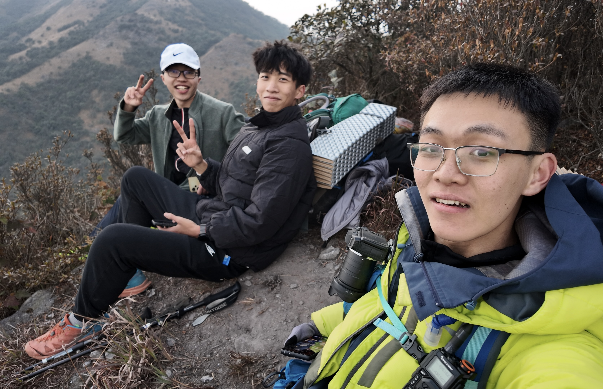
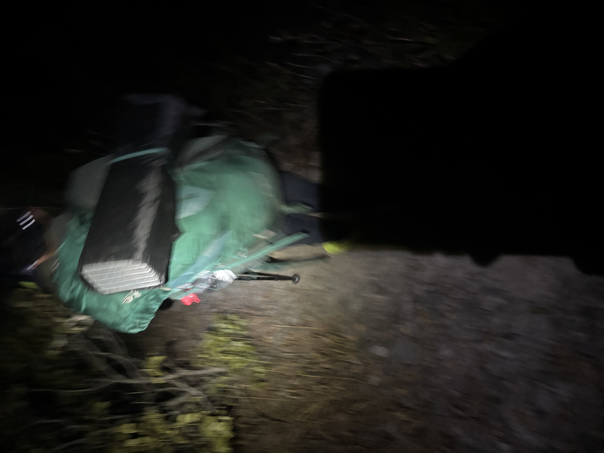
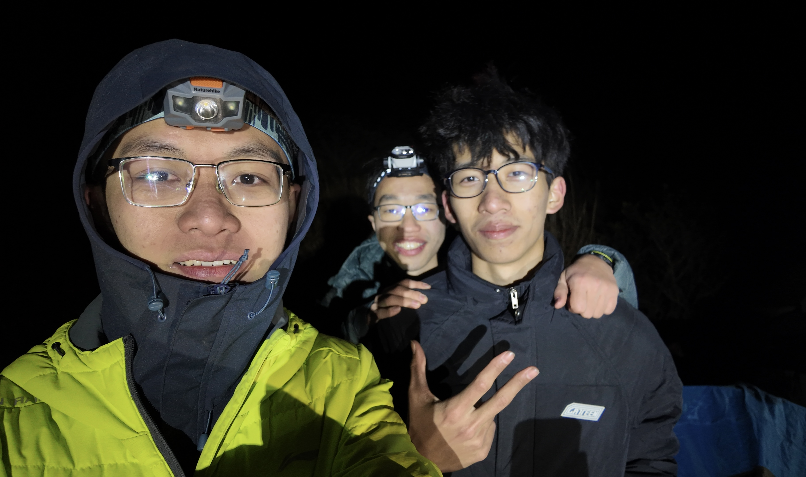
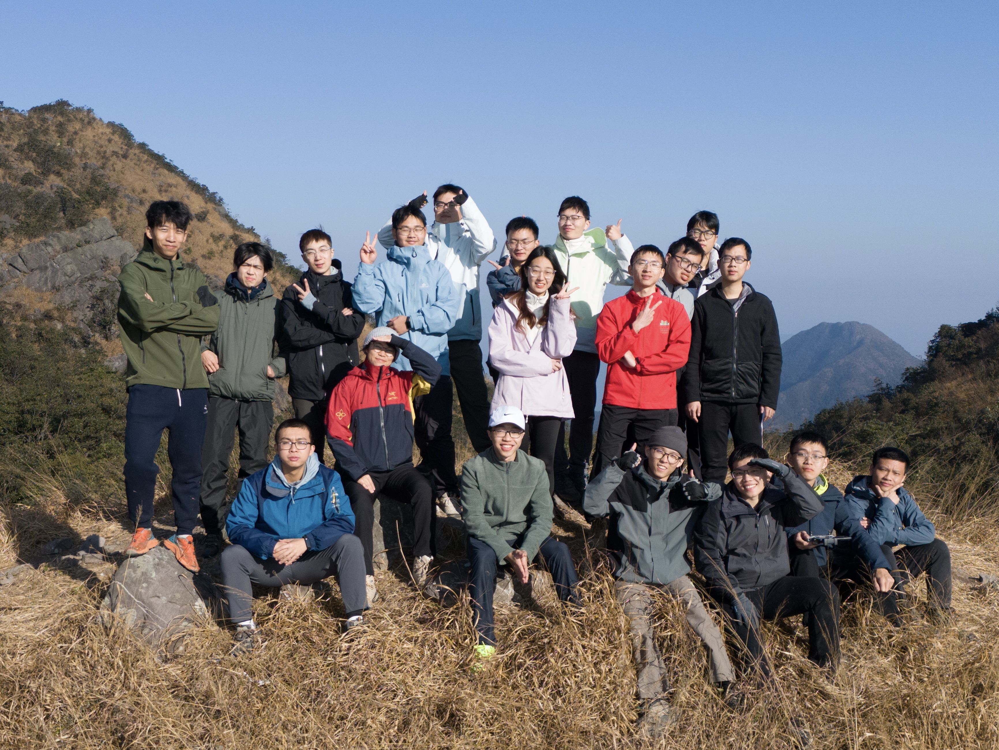

2024.12.21 21:21

在营地帐篷内，无信号，活着。

刚刚真以为自己可能要死在山上了。

很难形容现在的感受。

我一开始的感受，是会有点——愤怒，一条我一个上午就可以轻装速穿完的线，怎么会在重装状态下变得如此狼狈，以至于有性命之虞？

然后就是释然，毕竟，活下来了。

19:15 （决断时刻）
太阳早已下山，山峦归于黑暗与静谧，天穹布满星辰，冬银河肉眼可见，这会是我看过最美好的星空，如果——我看见这一切时，我在山谷营地。

但此时，落日已捎走我身上最后一丝光芒——快速降温，双手接近没有知觉；漫天星辰再怎么努力也照不亮我脚下的路，而我还得在万丈悬崖边行走——头灯不足，地形复杂……我是整个队伍的最后一个人，离营地还有1.8公里的距离，我站在陡峭的山脊线上，零下五度的狂冷风像冰雨一样打在我的身上手上脸上，近乎要将我推向深渊。冷，饿，看不清路，我意识到自己在走鬼门关。

16:10-17:20（时间线回拨）
带中队，离扎营点2.5km。从对讲机中得知尾队大佬抽筋且尾队两人体力不支，决定和队友卸包轻装折返，替尾队负重，包由前队大佬和中前队大佬交替折返运送（我的包有将近20kg）。和队友快跑至尾队所在处（离营地4km），替两名同学背包后，发现一同学严重体力不支，另一同学在改轻装后体力良好。
这时的我仍非常有信心，不过多做一件好事，连“救援”也称不上，包在大佬们的努力下运作良好（其实他们的折返过程也非常艰辛甚至惊险，此处有所简化）。只要两位体力不支的同学，能把他们自己在晚上七点前运到4km外的营地就可以了。他们看起来也还有余力，我和队友将两同学以及自己的包交接给前队大佬，并再次折返至尾队大佬处取剩余负重。

19:15（决断时刻）
🤔如果这时我背着我自己的包，身边只有能力相近且深切信任的队友和尾队大佬，那我有信心在三十分钟内赶到营地，并夹着锅里的牛肉丸，和大家打三国杀。但是，我身前的不只有两个队友，还有一位改轻装且体力不支无法向前挪动的同学。四个人三个睡袋两个头灯一顶帐篷，一公里内没有任何地方可以扎营，零下五度，若直接睡，必失温，若失温，必死。那里没有信号叫不了救援，哪怕能叫，等救援上来早就失温gameover了。

17:45-18:10
和队友及尾队大佬背着负重光速行军，我们一路谈笑风生，甚至对着夕阳的余晖来了一组自拍，我们都觉得今天还挺有意思的，并互相调侃对方走得真快，说不定等下能在到营地前赶上体力不支的同学和前队大佬。（这时的我们，觉得体力不支同学虽重装走不动，轻装区区4km怎么也该快到营地了，完全没有预料到接下来两个小时发生的事）

（这三个人对自己能力颇有信心，谈笑风生看夕阳，完全没预料到接下来发生的事）

18:20 
离营地2.3km处。遇见其中一位体力不支的同学，他落单了🤯，并表示腿软难以移动。在我们的鼓励和催促下，他跟着我们继续往前缓慢移动。（这时我就知道事情可能有点不简单了，我们作为收尾不可能抛下他不管，他走1.5km下坡用了1h有多，而接下来的那2.3km还得先下坡再上一座山再下坡。）

19:15
离营地1.8km处。山脊下降，他表示自己彻底走不动了，我鼓励他至少向前屁降到平台，但他实在体力不支，遂在山脊上原地休整。我开始清点物资（发现由于我们自己包在前队，尾队两人包本来就轻，紧急物资、食物都严重不足），计算到达时间，并请求物资支援（头灯），思考可能的备选方案。我开始有点心理崩溃😫，但我知道如果我崩了，那可能四个人就一起崩了。我开始吼唱壮胆：“再给我两分钟～让我能走到营地吧～”“冷冷的冰雨在脸上胡乱地拍～”（后来有大佬和我说看见我们的灯不动了，还听见有人大吼大叫，以为我们这有人掉下去，吓死她了）

19:30
温度很低，风极大。再次出发，手近乎无知觉，左右手交替拿杖/放裤袋。
队友问：“我们真的能到（营地）吗？”
大佬：“不知道。”

同学：“…”
我：“能到。一定能到。要选择相信。”

19:45
抵达雪花顶。拿到前队大佬留下的头灯。

20:00左右
右侧是万丈深渊。右脚多次打滑，在登山杖支撑下所幸未坠崖。

20:20
在营地附近，我们单薄的呼唤在黑暗中如烟飘散，大家的回应在山峦中如雷声滚滚。绕过一个小山坡，数顶帐篷在山谷处随风摇晃，却又散发出炽热的光辉，温暖、安全感代替了寒冷和恐惧，我心安处是你们。

20:25
抵达营地。未如说好的那样泪流满面，也没有想象中的兴奋和狂欢，虽手脚如坚冰般没有知觉，心里仍饱含庆幸与感恩。手捧热水，从帐篷中探出头，繁星点点，是希望，是幸福，是安全，是回家，是活着。这是我看过的最美好的星空。

（劫后余生的三人要被冻傻了）

后记：
        出发前一天，我踏上大巴车，发现目光所及均是见过的没见过的大佬，心想：这次稳了。下山后，我踏上大巴车，看着前后左右的大佬们，心想：有你们，这次才活下来的。
        第二天回到学校后，我仔细看了下这次重装的策划，多处安全冗余设计全面周到，而在此次事件中竟几乎全部用到了。如果四个对讲机少一个，前队、中前队、中队和尾队的配合运包就不可能完成；如果没有备选营地，我们就不可能带着体力不支的同学安全抵达，而只能在极不安全的山脊就地扎营；如果……
        特别感谢队友lzd在突发事件开始后一直与我并肩作战；感谢尾队大佬yzh做出多次正确且关键的决策；感谢策划组织指挥者wgr全程协调并负重75斤寻找备选营地；感谢前队大佬wh、gjn快速从队伍最前端折返到队尾，并背上我三十余斤的包负重夜行；感谢在此次事件中凭借自己的能力和意志走到营地的同学们，你们都是我心中当之无愧的重装徒步者，都是令我钦佩的大佬🥰。没有你们，这次的结局我难以设想。感恩体力不支同学，谢天谢地，你也是走着到营地了🥲。感谢老天爷让冷空气晚来了几个小时。
        我在策划中看到很有意思的两句话，第一句是：“户外运动关键在于‘自助、互相帮助’，领队及队员没有义务必须帮助他人，因此注意参与本次活动者需具备独自处理问题的能力。”**户外徒步不是爬白云山景区，不是“有腿就行”，不能“说走就走”**，走之前请做好充足的准备，了解清楚线路情况，并掂量清楚自己的能力。至少要做到以下两点才能上山：一、把自己安全带下山。二、把自己的垃圾带下山。在自身体能不够（啥都不背走几公里下坡都腿抖），徒步经验不足（甚至没走过5k以上轻装），心理素质低下（马上天黑降温竟罢工不走）的情况下就选择前往，不仅是对自己生命的轻视，更是对同行者生命的不负责任。（没忍住还是喷一喷😅。）无论水平如何，都要对大自然有足够的敬畏之心。**选择符合自己能力的线路，一步步进阶，才是户外运动应有之道。**走简单的线路一点都不丢人，打肿脸充胖子走难线，然后拖累全队才丢人。（出发前就已经说了这是本学期最难的线谨慎前往了）
        第二句是：“沉默在心底，笃行在路上，骄傲在山巅”。以前我不明白出来玩怎么会沉默，现在我懂了。但大家都把埋怨藏在心底，没有过多的责怪（至少当面没有），反而是不断鼓励，大家素质很高。“笃行在路上”，从折返救援到第二天的送佛送到西，我们都没有怎么犹豫，在自己有生命之虞时，也从来没有考虑过弃下那位同学自行前往营地。（要不是全队尽力帮他他冻死概率极大）“骄傲在山巅”，这句我觉得可以改一改，登上山巅不值得骄傲，安全回家见爸妈才是真正的成功。

